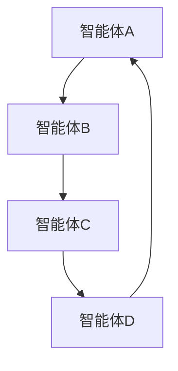
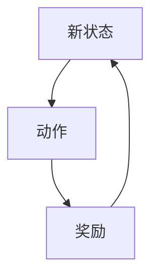
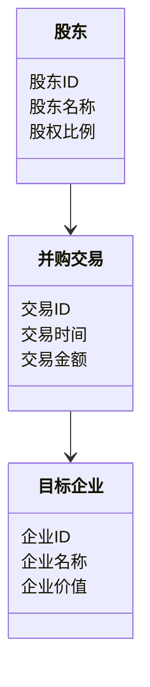

                 


# 智能化并购后整合效果预测：多智能体AI的新视角

## 关键词
- 智能化并购整合
- 多智能体AI
- 整合效果预测
- 系统架构
- 强化学习
- 多智能体协同学习

## 摘要
本文从智能化并购后整合效果预测的角度，探讨了多智能体AI的应用与优势。通过分析传统并购整合的局限性，引入多智能体AI的概念，详细阐述其核心原理、算法实现、系统架构及项目实战，为读者提供全面的技术视角。本文结合理论与实践，展示了多智能体AI在预测整合效果中的潜力与应用。

---

# 第1章: 智能化并购后整合效果预测概述

## 1.1 并购整合的定义与重要性

### 1.1.1 并购的定义与类型
并购（Mergers and Acquisitions, M&A）是指一家企业与其他企业合并或收购其资产或股权，以实现业务扩展或战略调整。并购可以分为横向并购、纵向并购和混合并购三种类型。

- **横向并购**：同一行业内的企业合并，旨在扩大市场份额或消除竞争。
- **纵向并购**：产业链上下游企业的合并，以增强供应链控制能力。
- **混合并购**：跨行业或不同业务领域的并购，以实现多元化发展。

### 1.1.2 整合的定义与关键环节
整合是指在并购完成后，将两家企业的资源、业务、文化等进行有机结合的过程。整合的关键环节包括战略规划、组织架构调整、业务流程优化、人员融合等。

### 1.1.3 并购整合在企业战略中的地位
并购整合是企业实现快速扩张、获取新技术或进入新市场的重要手段。成功的整合能够提升企业的竞争力，而失败的整合可能导致资源浪费和战略失败。

---

## 1.2 智能化整合的背景与趋势

### 1.2.1 传统并购整合的局限性
传统并购整合过程中，企业主要依赖经验和人为判断，存在以下问题：
- **信息不全**：难以全面评估目标企业的潜在问题。
- **主观性高**：整合决策依赖个体经验，缺乏数据支持。
- **效率低下**：整合过程耗时长，资源浪费严重。

### 1.2.2 AI技术在整合中的应用潜力
人工智能（AI）技术能够通过大数据分析、机器学习等方法，帮助企业更准确地评估并购目标，优化整合方案。AI技术的应用可以显著提高整合的效率和准确性。

### 1.2.3 多智能体AI的发展与挑战
多智能体AI是一种分布式智能系统，由多个相互协作的智能体组成，能够共同完成复杂任务。多智能体AI在并购整合中的应用面临技术复杂性和协作效率等挑战。

---

## 1.3 多智能体AI的新视角

### 1.3.1 多智能体系统的定义
多智能体系统（Multi-Agent System, MAS）是由多个智能体组成的分布式系统，每个智能体能够独立感知环境、自主决策，并与其他智能体协作完成任务。

### 1.3.2 多智能体AI在并购整合中的优势
- **分布式决策**：多个智能体分别负责不同的整合任务，提高效率。
- **协作优化**：智能体之间的协作能够优化整合方案。
- **动态适应**：智能体能够根据环境变化动态调整策略。

### 1.3.3 多智能体AI的核心要素与架构
多智能体AI的核心要素包括智能体、环境、通信机制和协作规则。其架构通常包括感知层、决策层和执行层。

---

## 1.4 本章小结
本章介绍了并购整合的定义与重要性，分析了传统整合的局限性，提出了多智能体AI在整合中的新视角，并探讨了其核心要素与架构。下一章将详细讲解多智能体AI的核心原理与实现方法。

---

# 第2章: 多智能体AI的核心原理

## 2.1 多智能体系统的组成与协作机制

### 2.1.1 实体关系图（ER图）分析
通过ER图分析，我们可以清晰地看到多智能体系统中各个实体之间的关系。以下是并购整合效果预测的ER图示例：

```mermaid
er
  %%{init: {'theme': 'neutral', 'title': '并购整合效果预测的ER图'}}

  entity 股东 {
    <股东ID, 股东名称, 股权比例>
    股东 --> 并购整合效果预测: 预测ID
  }

  entity 并购整合效果预测 {
    <预测ID, 预测时间, 预测结果>
    并购整合效果预测 --> 并购交易: 交易ID
  }

  entity 并购交易 {
    <交易ID, 交易时间, 交易金额>
    并购交易 --> 目标企业: 企业ID
  }

  entity 目标企业 {
    <企业ID, 企业名称, 企业价值>
  }
```

### 2.1.2 多智能体协作的流程图
以下是多智能体协作的流程图：



---

## 2.2 多智能体AI的算法原理

### 2.2.1 多智能体协同学习算法
多智能体协同学习算法是一种基于分布式学习的算法，通过多个智能体之间的协作来优化整体性能。以下是协同学习的流程图：


以下是协同学习的Python代码示例：

```python
import numpy as np

# 初始化智能体
agents = [Agent(i) for i in range(4)]
env = Environment()

# 协同学习过程
for _ in range(100):
    states = env.get_states()
    actions = [agent.act(state) for agent, state in zip(agents, states)]
    next_states, rewards = env.step(actions)
    for agent, state, action, reward, next_state in zip(agents, states, actions, rewards, next_states):
        agent.update(state, action, reward, next_state)
```

### 2.2.2 强化学习与博弈论在多智能体中的应用
强化学习（Reinforcement Learning, RL）是一种通过试错机制优化决策的算法。在多智能体系统中，强化学习结合博弈论可以实现智能体之间的协作优化。

以下是强化学习的流程图：



以下是强化学习的Python代码示例：

```python
import numpy as np

# 初始化环境和智能体
env = Environment()
agent = Agent()

# 强化学习过程
for _ in range(100):
    state = env.get_state()
    action = agent.act(state)
    next_state, reward = env.step(action)
    agent.update(state, action, reward, next_state)
```

### 2.2.3 多智能体AI的数学模型与公式
以下是多智能体AI的数学模型示例：

$$
V(s) = \max_{a} \left[ r + V(s') \right]
$$

其中，\( V(s) \) 表示状态 \( s \) 的价值函数，\( r \) 表示奖励，\( s' \) 表示下一个状态。

---

## 2.3 本章小结
本章详细讲解了多智能体AI的核心原理，包括系统的组成、协作机制、算法原理和数学模型。下一章将从系统架构与设计的角度，探讨多智能体AI在并购整合中的具体应用。

---

# 第3章: 多智能体AI算法的实现

## 3.1 多智能体协同学习算法的实现

### 3.1.1 算法流程图
以下是协同学习的流程图：


### 3.1.2 Python实现代码
以下是协同学习的Python代码示例：

```python
import numpy as np

# 初始化智能体
agents = [Agent(i) for i in range(4)]
env = Environment()

# 协同学习过程
for _ in range(100):
    states = env.get_states()
    actions = [agent.act(state) for agent, state in zip(agents, states)]
    next_states, rewards = env.step(actions)
    for agent, state, action, reward, next_state in zip(agents, states, actions, rewards, next_states):
        agent.update(state, action, reward, next_state)
```

---

## 3.2 强化学习算法的实现

### 3.2.1 强化学习流程图
以下是强化学习的流程图：


### 3.2.2 Python实现代码
以下是强化学习的Python代码示例：

```python
import numpy as np

# 初始化环境和智能体
env = Environment()
agent = Agent()

# 强化学习过程
for _ in range(100):
    state = env.get_state()
    action = agent.act(state)
    next_state, reward = env.step(action)
    agent.update(state, action, reward, next_state)
```

---

## 3.3 多智能体AI算法的数学模型
以下是多智能体AI的数学模型示例：

$$
V(s) = \max_{a} \left[ r + V(s') \right]
$$

其中，\( V(s) \) 表示状态 \( s \) 的价值函数，\( r \) 表示奖励，\( s' \) 表示下一个状态。

---

## 3.4 本章小结
本章详细讲解了多智能体AI算法的实现，包括协同学习和强化学习的具体实现方法。下一章将从系统架构与设计的角度，探讨多智能体AI在并购整合中的具体应用。

---

# 第4章: 系统架构与设计

## 4.1 系统应用场景与需求分析

### 4.1.1 并购整合效果预测的场景
并购整合效果预测的场景包括企业并购后的市场表现、协同效应、成本节约等。

### 4.1.2 系统功能需求分析
- 数据采集与处理
- 整合效果预测模型
- 可视化界面

### 4.1.3 系统性能需求分析
- 高效的数据处理能力
- 准确的预测能力
- 可扩展性

---

## 4.2 系统功能设计

### 4.2.1 领域模型设计
以下是领域模型的类图：



### 4.2.2 系统功能模块划分
- 数据采集模块
- 数据处理模块
- 预测模型模块
- 可视化界面模块

### 4.2.3 功能模块之间

---

## 4.3 本章小结
本章详细讲解了系统架构与设计，包括应用场景、功能需求、领域模型和系统设计。下一章将从项目实战的角度，探讨多智能体AI在并购整合中的具体实现。

---

# 第5章: 项目实战

## 5.1 环境安装与配置

### 5.1.1 安装依赖
- Python 3.8+
- NumPy
- Matplotlib
- Scikit-learn
- Gym

### 5.1.2 配置开发环境
建议使用Jupyter Notebook进行开发。

---

## 5.2 核心代码实现

### 5.2.1 数据采集与预处理
以下是数据预处理的Python代码示例：

```python
import pandas as pd
import numpy as np

# 读取数据
df = pd.read_csv('并购数据.csv')

# 数据清洗
df.dropna(inplace=True)
df = pd.get_dummies(df)
```

### 5.2.2 模型训练与优化
以下是模型训练的Python代码示例：

```python
from sklearn.model_selection import train_test_split
from sklearn.ensemble import RandomForestRegressor
from sklearn.metrics import mean_squared_error

# 划分数据集
X_train, X_test, y_train, y_test = train_test_split(df.drop('整合效果', axis=1), df['整合效果'], test_size=0.2)

# 训练模型
model = RandomForestRegressor()
model.fit(X_train, y_train)

# 模型评估
y_pred = model.predict(X_test)
print(mean_squared_error(y_test, y_pred))
```

---

## 5.3 实际案例分析

### 5.3.1 案例背景
某企业并购另一家企业后，希望通过多智能体AI预测整合效果。

### 5.3.2 数据分析与建模
通过对并购数据的分析，建立预测模型，并验证模型的准确性。

### 5.3.3 案例总结
通过多智能体AI，企业能够更准确地预测整合效果，优化整合策略。

---

## 5.4 本章小结
本章通过实际案例，详细讲解了多智能体AI在并购整合中的具体实现，包括环境配置、数据处理、模型训练和案例分析。

---

# 第6章: 总结与展望

## 6.1 总结
本文从智能化并购后整合效果预测的角度，探讨了多智能体AI的应用与优势。通过分析传统并购整合的局限性，引入多智能体AI的概念，详细阐述了其核心原理、算法实现、系统架构及项目实战。

## 6.2 展望
未来，随着多智能体AI技术的不断发展，其在并购整合中的应用潜力将更加广泛。建议企业积极采用多智能体AI技术，提升整合效果预测的准确性和效率。

---

# 作者
作者：AI天才研究院 & 禅与计算机程序设计艺术

---

以上是文章的完整目录与内容框架，具体内容可根据实际需求进一步扩展和详细说明。

