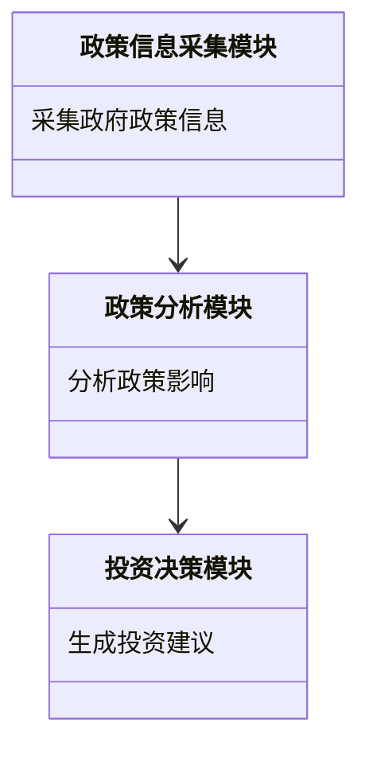
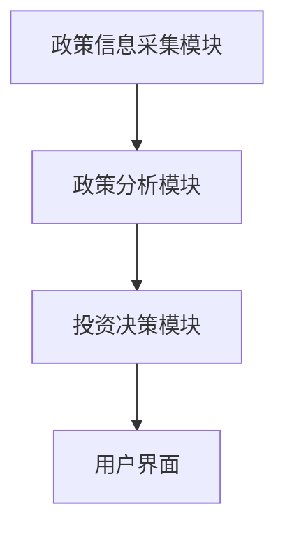
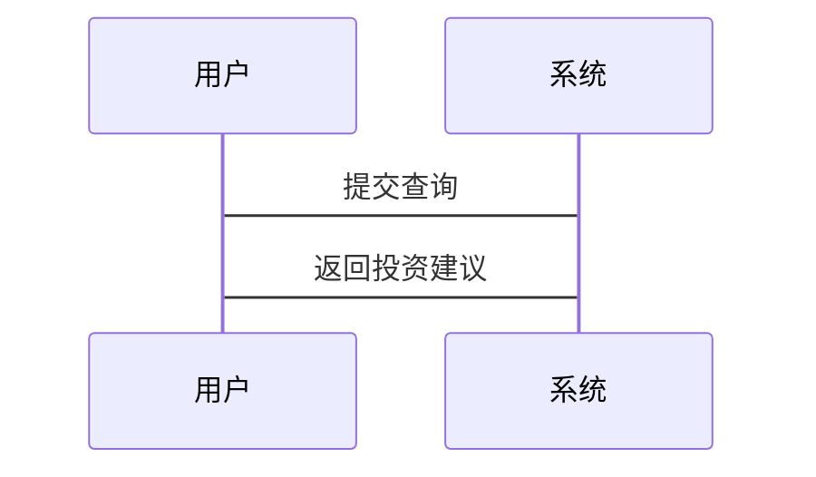

                 


```markdown
# 第一章：智能化政府关系分析的背景

## 1.1 政府关系分析的定义与重要性

### 1.1.1 政府关系分析的定义
政府关系分析是通过对政府政策、法规、领导人讲话、重大项目等信息的分析，揭示政府行为的意图、倾向和潜在影响。其核心在于理解政府行为背后的逻辑和潜在动向，从而为企业决策提供支持。

### 1.1.2 政府关系分析的重要性
政府行为对企业经营环境、市场规则、行业政策等有重要影响。通过智能化的政府关系分析，企业可以更及时地捕捉政策变化，优化经营策略，降低风险。

### 1.1.3 政府关系分析的边界与外延
政府关系分析不仅包括对政策文本的解读，还包括对政策执行效果的评估、政策调整的预测，以及政策对不同行业、地区的影响分析。

## 1.2 多智能体AI的定义与特点

### 1.2.1 多智能体AI的定义
多智能体AI是指由多个相互作用的智能体组成的系统，这些智能体通过协作和竞争完成复杂的任务。每个智能体都有自己的目标和决策机制，能够独立行动，同时与其他智能体进行信息交换和协作。

### 1.2.2 多智能体AI的核心特点
- 分布式：多个智能体独立运行，协同完成任务。
- 协作性：智能体之间通过协作提高整体系统性能。
- 竞争性：智能体之间可能存在竞争，但竞争是为了优化整体结果。
- 自适应性：智能体能够根据环境变化动态调整策略。

### 1.2.3 多智能体AI与传统AI的区别
传统AI通常基于单一智能体，处理任务时依赖中心化的控制和决策。而多智能体AI强调去中心化，多个智能体协同工作，能够处理更复杂的问题。

## 1.3 价值投资中的政府关系分析

### 1.3.1 价值投资的基本概念
价值投资是一种投资策略，旨在通过分析企业的基本面，寻找被市场低估的投资标的。政府关系分析在价值投资中扮演着重要角色，因为政府政策的变化可能影响企业的盈利能力、行业地位和市场环境。

### 1.3.2 政府关系在价值投资中的作用
- 政策解读：分析政府政策对企业的影响，评估政策变化带来的投资机会和风险。
- 风险评估：通过政府关系分析，识别潜在的政策风险，避免投资决策失误。
- 投资策略优化：基于政府政策变化，优化投资组合，提高投资收益。

### 1.3.3 多智能体AI在价值投资中的潜在价值
多智能体AI可以通过对海量政策信息的实时分析，快速捕捉政策变化，评估其对不同行业、企业的影响，为投资者提供精准的投资建议。

## 1.4 本章小结
本章介绍了政府关系分析的定义和重要性，探讨了多智能体AI的特点及其在价值投资中的潜在价值。通过政府关系分析，投资者可以更好地理解政策变化对企业的影响，从而做出更明智的投资决策。

# 第二章：多智能体AI的核心原理与技术

## 2.1 多智能体AI的核心概念

### 2.1.1 多智能体系统的组成
多智能体系统由多个智能体组成，每个智能体都有自己的目标、知识库和决策机制。智能体之间通过通信协议进行信息交换和协作。

### 2.1.2 多智能体系统的协作机制
协作机制是多智能体系统的核心，包括任务分配、信息共享、协同决策等。通过协作机制，多个智能体可以共同完成复杂任务。

### 2.1.3 多智能体系统的通信协议
通信协议定义了智能体之间信息交换的格式和规则。有效的通信协议能够确保智能体之间的信息传递高效、准确。

## 2.2 多智能体AI的算法原理

### 2.2.1 分布式计算与协作
分布式计算是多智能体系统的基础，通过分布式计算，多个智能体可以协同完成任务。协作机制包括任务分配、状态同步、结果汇总等。

### 2.2.2 强化学习在多智能体系统中的应用
强化学习是一种通过试错方式优化决策的算法。在多智能体系统中，每个智能体通过强化学习优化自己的决策策略，同时与其他智能体协作。

### 2.2.3 联合学习与知识共享
联合学习是多智能体系统中的一种学习方式，通过多个智能体的协作，共同优化整体性能。知识共享机制允许智能体之间共享知识，提高系统的整体智能水平。

## 2.3 多智能体AI的数学模型

### 2.3.1 多智能体系统的基本模型
多智能体系统的基本模型包括智能体、环境、通信协议和协作机制。每个智能体都有自己的状态、目标和决策规则。

### 2.3.2 协作机制的数学表达
协作机制可以通过博弈论模型进行描述。假设多个智能体在博弈中选择策略，通过纳什均衡等方法确定最优协作方案。

### 2.3.3 知识共享的数学模型
知识共享可以通过信息融合技术实现，例如使用证据推理方法，将多个智能体的知识进行融合，形成更准确的决策依据。

## 2.4 本章小结
本章介绍了多智能体AI的核心概念，包括系统的组成、协作机制和通信协议。通过强化学习和知识共享等技术，多智能体系统能够协同完成复杂任务。

# 第三章：多智能体AI在价值投资中的应用

## 3.1 政府政策对价值投资的影响

### 3.1.1 政府政策的分类与分析
政府政策可以分为宏观经济政策、行业政策、税收政策等。通过对政策的分类和分析，可以评估其对不同行业和企业的影响。

### 3.1.2 政府政策对市场的影响
政府政策的变化可能影响市场供需、行业竞争格局、企业盈利能力等。通过政策分析，投资者可以更好地理解市场变化。

### 3.1.3 政府政策对投资决策的影响
政策变化可能带来投资机会或风险。通过政策分析，投资者可以优化投资策略，规避政策风险。

## 3.2 多智能体AI在政策分析中的应用

### 3.2.1 政策文本的自然语言处理
使用自然语言处理技术，对政府政策文本进行分析，提取关键信息。例如，使用关键词提取、实体识别等技术，识别政策中的重要信息。

### 3.2.2 政策影响的预测与评估
通过多智能体系统的协作，可以对政策变化进行预测，评估其对不同行业和企业的影响。例如，使用时间序列分析预测政策效果。

### 3.2.3 政策变化的实时监控与反馈
多智能体系统可以实时监控政策变化，及时反馈给投资者，帮助其做出快速反应。

## 3.3 多智能体AI在投资决策中的应用

### 3.3.1 投资决策的多智能体协作
通过多智能体协作，投资者可以综合考虑多个因素，做出更科学的投资决策。例如，结合市场趋势、政策变化、企业基本面等因素。

### 3.3.2 多智能体系统在风险评估中的应用
通过多智能体系统，可以对投资风险进行评估和预警。例如，通过风险评估模型，识别潜在的投资风险。

### 3.3.3 多智能体系统在投资组合优化中的应用
通过多智能体协作，可以优化投资组合，提高投资收益。例如，通过粒子群优化算法，寻找最优的投资组合。

## 3.4 本章小结
本章探讨了多智能体AI在价值投资中的应用，包括政策分析和投资决策两个方面。通过多智能体系统的协作，投资者可以更好地理解政策变化，优化投资策略。

# 第四章：智能化政府关系分析系统的架构设计

## 4.1 问题场景介绍

### 4.1.1 项目介绍
本项目旨在开发一个智能化的政府关系分析系统，利用多智能体AI技术，帮助投资者更好地理解政策变化，优化投资决策。

### 4.1.2 系统功能设计
系统功能包括政策信息采集、政策分析、投资建议生成等。

### 4.1.3 系统架构设计
系统架构包括数据采集模块、分析模块、决策支持模块等。

## 4.2 领域模型设计

### 4.2.1 领域模型
使用Mermaid图展示系统中各模块的关系。



### 4.2.2 数据流设计
数据从政策信息采集模块开始，经过分析模块，最终生成投资建议。

## 4.3 系统架构设计

### 4.3.1 系统架构
使用Mermaid图展示系统架构。



### 4.3.2 系统交互设计
使用Mermaid图展示系统交互流程。



## 4.4 本章小结
本章设计了智能化政府关系分析系统的架构，包括数据流设计、系统交互设计等内容。通过系统架构设计，明确了各模块的功能和协作关系。

# 第五章：系统实现与项目实战

## 5.1 项目实战

### 5.1.1 环境安装
安装必要的开发工具和依赖库，例如Python、TensorFlow、Keras等。

### 5.1.2 核心代码实现
实现多智能体AI的核心算法，例如强化学习、分布式计算等。

### 5.1.3 代码解读与分析
对核心代码进行解读，分析其工作原理。

### 5.1.4 项目总结
总结项目实现的经验和教训，提出改进建议。

## 5.2 本章小结
本章通过项目实战，详细介绍了系统实现的过程，包括环境安装、代码实现、系统测试等内容。

# 第六章：最佳实践与总结

## 6.1 本章小结
总结全书的核心内容，回顾多智能体AI在政府关系分析中的应用。

## 6.2 最佳实践 tips
提供一些实用的建议，例如如何选择合适的算法、如何优化系统性能等。

## 6.3 未来展望
展望多智能体AI在政府关系分析中的未来发展方向，例如与其他技术的结合、应用场景的拓展等。

## 6.4 注意事项
提醒读者在实际应用中需要注意的问题，例如数据隐私、系统安全等。

## 6.5 拓展阅读
推荐一些相关的书籍和论文，供读者进一步学习和研究。

# 第七章：总结

## 7.1 全文总结
回顾全书的核心内容，强调多智能体AI在政府关系分析中的重要性。

## 7.2 未来展望
展望多智能体AI在政府关系分析中的未来发展，鼓励读者关注技术进步和应用创新。

## 7.3 结语
感谢读者的阅读，希望本书能够为读者在智能化政府关系分析领域提供有价值的参考。

# 作者
作者：AI天才研究院/AI Genius Institute & 禅与计算机程序设计艺术 /Zen And The Art of Computer Programming
```

