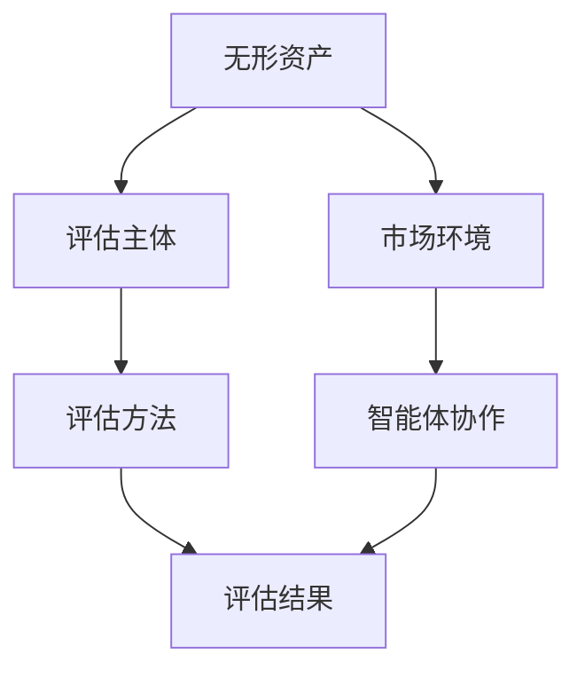

                 


```markdown
# 智能化无形资产评估：多智能体AI在价值投资中的新方法

> 关键词：多智能体AI，无形资产评估，价值投资，系统架构，算法原理，项目实战

> 摘要：  
> 本文探讨了多智能体AI在无形资产评估中的应用，提出了一种基于多智能体AI的新方法，以解决传统评估方法的局限性。通过分析多智能体AI的核心概念、算法原理、系统架构，并结合实际案例，展示了该方法在价值投资中的潜力和优势。文章还详细讨论了系统的实现过程，包括环境安装、核心代码实现、案例分析等，为读者提供了完整的解决方案和实践指南。

---

# 第一部分：背景介绍

## 第1章：智能化无形资产评估的背景与现状

### 1.1 无形资产评估的现状
#### 1.1.1 无形资产评估的传统方法
传统的无形资产评估方法主要包括市场法、成本法和收益法。市场法基于可比交易数据进行评估；成本法基于重置成本；收益法基于未来现金流的现值。然而，这些方法在实践中存在数据获取难、评估结果主观性强等问题。

#### 1.1.2 传统方法的局限性与挑战
无形资产的评估面临以下挑战：  
1. 数据稀疏性：许多无形资产缺乏足够的市场交易数据。  
2. 复杂性：无形资产的价值往往受到多种因素的影响，如市场环境、技术发展等。  
3. 主观性：传统方法依赖人工判断，容易受到评估人员主观因素的影响。  

#### 1.1.3 数字化与智能化对无形资产评估的影响
随着大数据和人工智能技术的发展，无形资产评估逐渐从传统方法向智能化方法转变。智能化方法通过整合多源数据，利用机器学习和AI技术，提高了评估的准确性和客观性。

---

### 1.2 多智能体AI的背景与发展
#### 1.2.1 多智能体AI的基本概念
多智能体AI是指由多个相互作用的智能体组成的系统。这些智能体能够通过协作或竞争完成复杂的任务。多智能体AI的优势在于能够模拟现实世界中的复杂交互，适用于需要多维度决策的场景。

#### 1.2.2 多智能体AI在金融领域的应用
在金融领域，多智能体AI已经被应用于股票交易、风险评估和投资组合管理。通过多智能体协作，可以更全面地分析市场信息，提高决策的准确性。

#### 1.2.3 多智能体AI的优势与潜力
1. **分布式计算**：多智能体AI能够并行处理大量数据，提高计算效率。  
2. **协作性**：通过智能体之间的协作，能够实现更复杂的任务。  
3. **适应性**：多智能体AI能够根据环境变化动态调整策略，具有较强的适应性。  

---

### 1.3 问题背景与描述
#### 1.3.1 无形资产评估中的信息不对称问题
信息不对称导致买卖双方在资产价值上的认知差异，影响交易的公平性。传统的评估方法难以有效解决这一问题。

#### 1.3.2 价值投资中的不确定性与复杂性
价值投资需要综合考虑多种因素，包括市场趋势、公司基本面等。传统的评估方法难以捕捉这些复杂因素之间的动态关系。

#### 1.3.3 多智能体AI在解决这些问题中的作用
通过多智能体AI，可以整合多源数据，模拟市场行为，提供更精准的评估结果。同时，多智能体AI能够实时分析市场动态，帮助投资者做出更明智的决策。

---

### 1.4 边界与外延
#### 1.4.1 无形资产评估的边界
无形资产评估的边界包括评估对象、评估范围和评估方法的适用性。  
- 评估对象：专利、商标、品牌等。  
- 评估范围：仅限于无形资产本身，不包括有形资产。  

#### 1.4.2 多智能体AI的应用边界
多智能体AI的应用边界包括数据来源、计算能力限制和法律法规的约束。  
- 数据来源：需要高质量的市场数据支持。  
- 计算能力：复杂的多智能体模型需要强大的计算能力。  
- 法律法规：需要遵守相关法律法规，确保数据隐私和合规性。  

#### 1.4.3 相关领域的外延与关联
多智能体AI在无形资产评估中的应用与金融学、计算机科学、法学等多个领域相关。通过跨学科的研究，可以进一步提升评估方法的科学性和实用性。

---

### 1.5 核心概念与结构
#### 1.5.1 核心概念的定义
1. **无形资产**：指没有物理形态但具有价值的资产。  
2. **多智能体AI**：由多个智能体组成的协作系统，用于复杂任务的解决。  

#### 1.5.2 核心概念的属性特征对比表
| 属性       | 无形资产                   | 多智能体AI                 |
|------------|----------------------------|----------------------------|
| 定义       | 无物理形态的资产           | 多个智能体协作的系统         |
| 价值评估   | 主观性强                   | 客观性高，基于数据驱动       |
| 应用场景   | 股权评估、知识产权评估     | 金融交易、投资决策等       |

#### 1.5.3 实体关系图（ER图）架构


---

## 第2章：多智能体AI与无形资产评估的核心概念

### 2.1 多智能体AI的原理与特点
#### 2.1.1 多智能体AI的定义与特点
多智能体AI由多个智能体组成，每个智能体都有自己的目标和决策机制。通过协作或竞争，实现整体目标的优化。

#### 2.1.2 多智能体AI与单智能体AI的区别
| 特性       | 单智能体AI                | 多智能体AI                |
|------------|---------------------------|---------------------------|
| 决策机制   | 单一决策中心              | 分布式决策，多个智能体协作 |
| 复杂性     | 较低                      | 较高                      |
| 应用场景   | 简单任务                  | 复杂任务                  |

---

通过逐步分析，我们可以看到，多智能体AI在无形资产评估中的应用具有巨大的潜力。下一章将深入探讨多智能体AI的算法原理，包括其在价值投资中的具体实现。
</think>

```markdown
# 第二章：多智能体AI与无形资产评估的核心概念

## 2.1 多智能体AI的原理与特点
### 2.1.1 多智能体AI的定义与特点
多智能体AI（Multi-Agent AI）是由多个智能体（Agent）组成的系统，这些智能体能够通过协作或竞争完成复杂的任务。与单智能体AI相比，多智能体AI具有以下特点：
- **分布式计算**：智能体之间可以并行处理信息，提高计算效率。
- **协作性**：通过智能体之间的协作，能够实现更复杂的任务。
- **适应性**：智能体能够根据环境变化动态调整策略，具有较强的适应性。

### 2.1.2 多智能体AI与单智能体AI的区别
| 特性       | 单智能体AI                | 多智能体AI                |
|------------|---------------------------|---------------------------|
| 决策机制   | 单一决策中心              | 分布式决策，多个智能体协作 |
| 复杂性     | 较低                      | 较高                      |
| 应用场景   | 简单任务                  | 复杂任务                  |

### 2.1.3 多智能体AI的优势
- **分布式计算**：多智能体AI能够并行处理大量数据，提高计算效率。
- **协作性**：通过智能体之间的协作，能够实现更复杂的任务。
- **适应性**：多智能体AI能够根据环境变化动态调整策略，具有较强的适应性。

---

## 2.2 无形资产评估的核心要素
### 2.2.1 无形资产的定义与分类
无形资产是指没有物理形态但具有价值的资产，主要包括以下几类：
- **专利权**：指对发明创造的专有权。
- **商标权**：指对商标的专有权。
- **品牌价值**：指品牌在市场上的价值。
- **商誉**：指企业声誉和客户忠诚度的价值。

### 2.2.2 无形资产评估的关键指标
- **市场地位**：企业在市场中的地位和竞争对手情况。
- **盈利能力**：企业过去和未来的盈利能力。
- **技术创新**：企业的技术储备和创新能力。
- **管理团队**：管理团队的经验和能力。

### 2.2.3 无形资产评估的流程与方法
无形资产评估的流程一般包括以下几个步骤：
1. **数据收集**：收集相关市场数据、财务数据等。
2. **数据清洗**：对收集的数据进行清洗和预处理。
3. **模型构建**：构建评估模型，如回归模型、神经网络模型等。
4. **模型训练**：对模型进行训练，优化模型参数。
5. **评估结果**：根据模型输出评估结果，并进行验证和调整。

---

## 2.3 多智能体AI在价值投资中的应用
### 2.3.1 价值投资的基本原理
价值投资是一种投资策略，通过分析企业的内在价值，寻找被市场低估的投资标的。其核心思想是“买入低于内在价值的股票并长期持有”。

### 2.3.2 多智能体AI在价值投资中的作用
- **数据处理**：多智能体AI能够快速处理大量数据，发现市场中的潜在机会。
- **决策支持**：通过智能体协作，提供更精准的投资决策支持。
- **风险控制**：多智能体AI能够实时监控市场动态，及时发现和应对风险。

### 2.3.3 多智能体AI与传统投资方法的对比
| 特性       | 传统方法                | 多智能体AI                |
|------------|---------------------------|---------------------------|
| 数据处理   | 依赖人工分析              | 自动化处理，速度快         |
| 决策支持   | 依赖经验丰富的投资经理    | 基于数据驱动，客观性强     |
| 风险控制   | 依赖历史数据和经验        | 实时监控，动态调整         |

---

## 2.4 核心概念的联系与对比
### 2.4.1 多智能体AI与无形资产评估的联系
多智能体AI能够通过协作和分布式计算，提高无形资产评估的准确性和效率。通过整合多源数据，多智能体AI能够更好地捕捉无形资产的价值。

### 2.4.2 多智能体AI与价值投资的联系
多智能体AI能够通过实时分析市场动态，提供更精准的投资决策支持。通过智能体协作，多智能体AI能够在复杂市场环境中做出更优决策。

### 2.4.3 核心概念的对比
| 概念       | 多智能体AI                | 无形资产评估              |
|------------|---------------------------|---------------------------|
| 定义       | 多个智能体协作的系统        | 无物理形态的资产          |
| 应用场景   | 金融交易、投资决策        | 专利、商标、品牌价值评估  |

---

通过以上分析，我们可以看到，多智能体AI在无形资产评估和价值投资中的应用具有重要意义。下一章将深入探讨多智能体AI的算法原理，包括其在价值投资中的具体实现。
```

