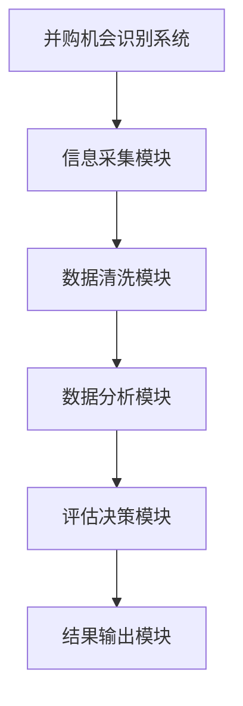

                 


# 智能化特殊情况投资：多智能体AI识别并购机会

## 关键词：多智能体AI，并购机会识别，特殊情况投资，协同学习，强化学习，系统架构设计

## 摘要：  
在当今快速变化的商业环境中，识别和评估并购机会是一项复杂而关键的任务。传统的并购评估方法依赖于人工分析和经验判断，存在效率低、主观性强、覆盖面窄等局限性。本文将介绍如何利用多智能体人工智能技术，通过协同学习、强化学习等算法，构建智能化的并购机会识别系统，解决传统并购评估中的痛点。文章将从背景、原理、算法、系统架构到项目实战，全面阐述多智能体AI在特殊情况投资中的应用，为读者提供深入的技术解析和实践指导。

---

## 第一部分: 智能化特殊情况投资概述

### 第1章: 智能化特殊情况投资的背景与概念

#### 1.1 问题背景与挑战
在当前全球经济环境下，并购活动日益频繁，但传统的并购评估方法存在以下问题：
1. **信息不全**：人工收集和分析信息的效率低下，难以覆盖所有潜在并购目标。
2. **主观性高**：依赖经验丰富的分析师判断，主观性强，容易出现偏差。
3. **复杂性高**：并购涉及财务、法律、市场等多方面因素，传统方法难以全面评估。
4. **效率低下**：传统评估流程耗时长，难以应对快速变化的市场环境。

#### 1.2 多智能体AI的定义与特点
多智能体AI是指由多个具有自主决策能力的智能体组成的系统，通过协同工作实现复杂任务。其特点包括：
1. **分布式智能**：每个智能体负责特定任务，通过协同完成整体目标。
2. **自主性**：智能体能够自主决策，无需中央控制。
3. **协作性**：智能体之间通过通信和协调，共同优化结果。
4. **适应性**：能够根据环境变化动态调整行为。

#### 1.3 多智能体AI在并购机会识别中的应用
多智能体AI通过以下方式解决并购评估中的问题：
1. **信息收集与分析**：多个智能体分别负责收集、整理和分析不同来源的信息。
2. **协同决策**：智能体通过协同学习，综合考虑财务、市场、法律等多方面因素，评估并购机会。
3. **动态调整**：根据市场变化和新信息，动态优化评估结果。

---

### 第2章: 多智能体AI的核心概念与联系

#### 2.1 多智能体AI的核心原理
多智能体AI通过协同学习和强化学习实现复杂任务的评估。协同学习是指多个智能体通过共享信息和经验，共同提高学习效果；强化学习是指智能体通过与环境互动，学习最优策略。

#### 2.2 多智能体AI与并购机会识别的关系
并购机会识别涉及多个维度，如财务指标、市场趋势、企业声誉等。多智能体AI通过分工协作，分别处理不同维度的信息，并协同生成最终的评估结果。

#### 2.3 多智能体AI的优势
1. **高效性**：通过分布式计算，提高信息处理效率。
2. **准确性**：多个智能体协同工作，降低单一智能体的判断误差。
3. **适应性**：能够快速响应市场变化，动态调整评估策略。

---

### 第3章: 多智能体AI的算法原理

#### 3.1 协同学习算法
协同学习算法通过多个智能体共享知识，提高学习效果。例如，分布式协同学习算法（Distributed Collaborative Learning）通过将数据分片，分别在不同智能体上进行训练，最后汇总结果。

#### 3.2 强化学习算法
强化学习通过智能体与环境的互动，学习最优策略。例如，多智能体强化学习（Multi-Agent Reinforcement Learning）通过智能体之间的协作，实现复杂任务的优化。

#### 3.3 数学模型与公式
协同学习的数学模型可以表示为：
$$ J = \sum_{i=1}^{n} J_i $$
其中，$J_i$ 表示第 $i$ 个智能体的学习目标。

强化学习的数学模型可以表示为：
$$ Q(s, a) = r + \gamma \max_{a'} Q(s', a') $$
其中，$s$ 是状态，$a$ 是动作，$r$ 是奖励，$\gamma$ 是折扣因子。

---

### 第4章: 多智能体AI在并购机会识别中的系统架构设计

#### 4.1 系统功能设计
系统功能包括：
1. **信息采集**：从多个数据源采集企业信息。
2. **数据分析**：利用多智能体AI分析财务、市场等数据。
3. **评估决策**：生成并购评估报告，识别潜在机会。

#### 4.2 系统架构图


---

### 第5章: 项目实战

#### 5.1 环境安装
安装Python和相关库：
```bash
pip install numpy
pip install scikit-learn
pip install matplotlib
```

#### 5.2 核心代码实现
协同学习算法的Python代码示例：
```python
import numpy as np
from sklearn.linear_model import LinearRegression

# 分布式协同学习
class CollaborativeLearner:
    def __init__(self, num_agents):
        self.agents = [LinearRegression() for _ in range(num_agents)]
    
    def fit(self, X, y):
        for i in range(len(X)):
            X_i = X[i:i+1]
            y_i = y[i:i+1]
            self.agents[i % len(self.agents)].fit(X_i, y_i)
    
    def predict(self, X):
        return np.mean([agent.predict(X) for agent in self.agents])
```

#### 5.3 代码应用解读
上述代码实现了一个简单的分布式协同学习系统，多个智能体分别训练，并最终汇总结果。该算法可以用于并购机会的初步筛选。

#### 5.4 实际案例分析
以某科技公司为例，通过多智能体AI分析财务数据、市场趋势等信息，评估其并购价值。

---

## 第六章: 总结与展望

### 6.1 最佳实践 tips
1. 在实际应用中，建议结合具体业务需求，调整算法参数。
2. 数据质量和多样性对评估结果有重要影响，需重视数据清洗和特征工程。

### 6.2 小结
多智能体AI通过协同学习和强化学习，显著提高了并购机会识别的效率和准确性。

### 6.3 注意事项
1. 数据隐私和安全问题需高度重视。
2. 算法的可解释性可能影响实际应用，需进一步优化。

### 6.4 拓展阅读
推荐阅读《Multi-Agent Reinforcement Learning: A Survey》和《Distributed Machine Learning》。

---

## 作者：AI天才研究院 & 禅与计算机程序设计艺术

--- 

本文通过背景介绍、算法原理、系统架构设计和项目实战，全面阐述了多智能体AI在并购机会识别中的应用。希望本文能为读者提供深入的技术解析和实践指导。

