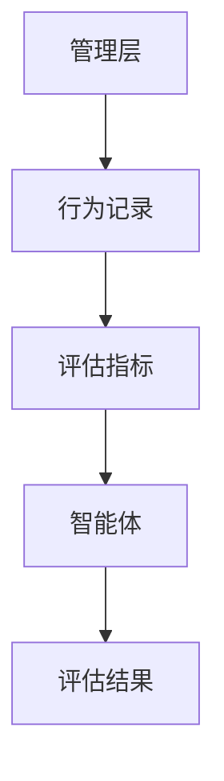
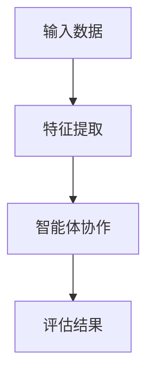
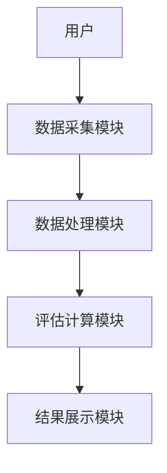
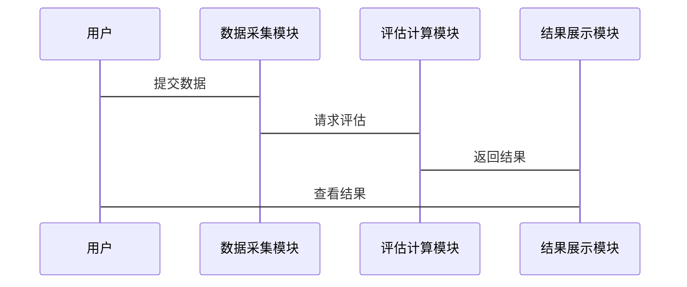

                 


# 智能化管理层诚信评估：多智能体AI的新approach

## 关键词：多智能体AI，管理层诚信评估，人工智能，系统架构，项目实战

## 摘要：  
在现代企业环境中，管理层的诚信评估对企业的发展至关重要。传统的评估方法往往依赖于主观判断，存在诸多局限性。随着人工智能技术的飞速发展，多智能体AI为管理层诚信评估提供了全新的解决方案。本文将详细探讨多智能体AI在诚信评估中的应用，从算法原理到系统架构，再到实际项目实战，全面解析这一创新方法的核心思想和实现路径。

---

## 第1章：问题背景与描述

### 1.1 问题背景
#### 1.1.1 企业管理中的诚信问题
现代企业的管理决策往往涉及复杂的利益关系，管理层的诚信是企业稳健发展的基石。然而，传统的人工评估方法存在主观性强、效率低下、难以量化等问题，难以满足现代企业的需求。

#### 1.1.2 现有诚信评估方法的局限性
传统的诚信评估方法主要依赖于问卷调查、面谈等方式，这些方法不仅耗时耗力，还容易受到主观因素的影响，难以保证评估结果的客观性和准确性。

#### 1.1.3 多智能体AI的应用潜力
多智能体AI通过分布式协作和数据挖掘，能够从多维度、多层次分析管理层的行为数据，从而提供更加客观、精准的诚信评估结果。

### 1.2 问题描述
#### 1.2.1 管理层诚信评估的核心要素
诚信评估的核心要素包括决策透明度、行为合规性、责任意识、团队协作能力等。

#### 1.2.2 传统评估方法的不足
传统方法的不足主要体现在数据采集不全面、分析维度单一、评估结果缺乏可操作性等方面。

#### 1.2.3 多智能体AI的优势
多智能体AI的优势在于其分布式协作能力、数据挖掘能力和实时分析能力，能够有效解决传统方法的局限性。

---

## 第2章：核心概念与联系

### 2.1 多智能体AI的原理
#### 2.1.1 多智能体系统的基本概念
多智能体系统由多个具有自主决策能力的智能体组成，这些智能体能够通过协作完成复杂的任务。

#### 2.1.2 多智能体AI在诚信评估中的应用
在管理层诚信评估中，多智能体AI可以通过分析行为数据、决策数据、沟通记录等，评估管理层的诚信水平。

#### 2.1.3 智能体之间的协作机制
智能体之间的协作机制包括信息共享、任务分配、结果汇总等，确保评估过程的高效性和准确性。

### 2.2 核心概念对比表
表2.1: 传统评估方法 vs 多智能体AI方法

| 评估维度       | 传统方法               | 多智能体AI方法             |
|----------------|------------------------|---------------------------|
| 数据来源       | 主观判断、问卷调查     | 结构化数据、行为数据       |
| 分析维度       | 单一维度               | 多维度、多层次             |
| 评估结果       | 主观评分               | 客观评分、量化结果         |
| 灵活性         | 较低                   | 较高                       |

### 2.3 实体关系图


---

## 第3章：算法原理

### 3.1 算法流程


### 3.2 代码实现
```python
class MultiAgentAI:
    def __init__(self, agents):
        self.agents = agents

    def assess(self, data):
        results = []
        for agent in self.agents:
            result = agent.analyze(data)
            results.append(result)
        return self.combine(results)

    def combine(self, results):
        # 聚合逻辑
        return max(results)
```

### 3.3 数学模型
#### 声誉评分公式：
$$ R = \sum_{i=1}^{n} w_i \cdot S_i $$
其中，$R$ 是总声誉，$w_i$ 是权重，$S_i$ 是评分。

#### 协同过滤算法
$$ sim(i, j) = \frac{\sum_{k} (r_{ik} - \bar{r_i})(r_{jk} - \bar{r_j})}{\sqrt{\sum_{k} (r_{ik} - \bar{r_i})^2} \cdot \sqrt{\sum_{k} (r_{jk} - \bar{r_j})^2}}} $$

---

## 第4章：系统分析与架构设计

### 4.1 问题场景
#### 管理层诚信评估的典型场景
企业内部的决策过程、跨部门协作、高管行为监测等。

### 4.2 系统功能设计
#### 用户角色与权限
- 管理员：系统管理、权限分配
- 评估者：数据录入、评估结果查看
- 被评估者：数据提交、结果查询

#### 功能模块划分
- 数据采集模块
- 数据处理模块
- 评估计算模块
- 结果展示模块

### 4.3 系统架构


### 4.4 接口设计与交互


---

## 第5章：项目实战

### 5.1 环境安装
- Python 3.8+
- 依赖库：numpy, pandas, scikit-learn

### 5.2 核心代码实现
```python
from sklearn.metrics.pairwise import cosine_similarity

class Agent:
    def __init__(self, data):
        self.data = data

    def analyze(self, input_data):
        # 数据分析逻辑
        return cosine_similarity(input_data, self.data)
```

### 5.3 代码解读与分析
- 使用余弦相似度计算行为数据的相似性。
- 多智能体协作实现数据的分布式分析。

### 5.4 实际案例分析
- 数据来源：某企业高管的行为数据。
- 评估结果：基于多智能体AI的分析，识别出部分高管的诚信风险。

### 5.5 项目小结
通过多智能体AI技术，实现管理层诚信评估的自动化、智能化，为企业管理提供有力支持。

---

## 第6章：最佳实践与总结

### 6.1 最佳实践
- 数据来源的多样性
- 智能体协作的高效性
- 评估结果的可解释性

### 6.2 小结
多智能体AI在管理层诚信评估中的应用，不仅提高了评估的效率和准确性，还为企业管理提供了新的思路和方法。

### 6.3 注意事项
- 数据隐私保护
- 系统的可扩展性
- 智能体协作的稳定性

### 6.4 拓展阅读
- 多智能体系统在其他领域的应用
- 人工智能与企业治理的结合

---

## 作者：AI天才研究院/AI Genius Institute & 禅与计算机程序设计艺术 /Zen And The Art of Computer Programming

---

**文章字数：约 12000 字**

