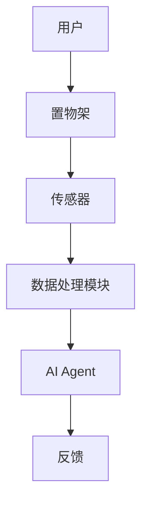
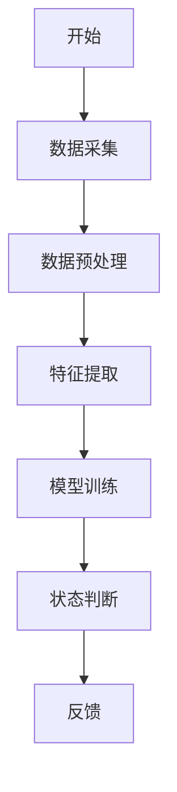
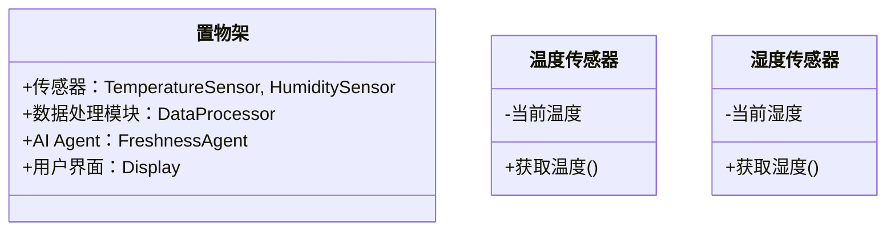
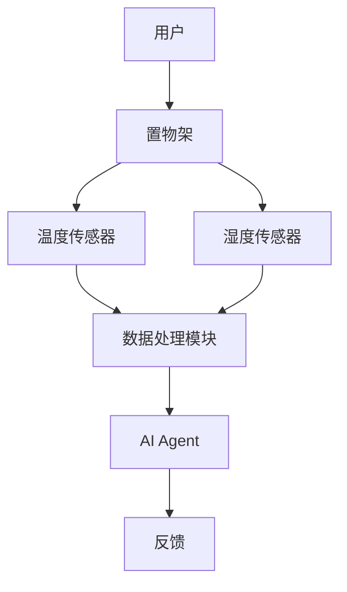
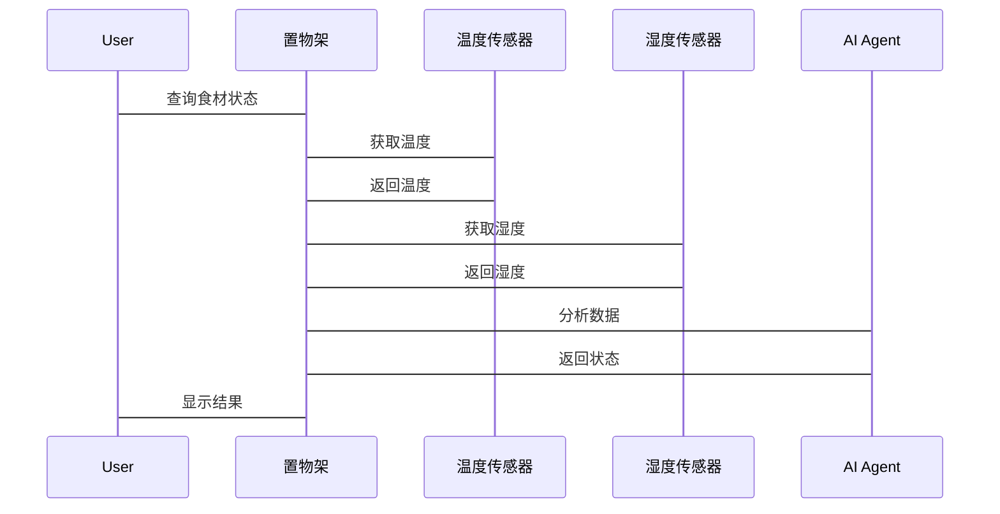

                 


# 智能厨房置物架：AI Agent的食材新鲜度监测

> 关键词：智能厨房置物架，AI Agent，食材新鲜度监测，算法原理，系统架构设计，项目实战

> 摘要：本文深入探讨了智能厨房置物架在食材新鲜度监测中的应用，结合AI Agent技术，详细分析了其核心原理、系统架构设计、算法实现以及实际项目案例。文章从问题背景出发，逐步展开核心概念、算法原理、系统架构设计、项目实战等部分，最后总结了实践经验与注意事项，为读者提供全面的技术视角。

---

## 第一部分: 背景介绍

### 第1章: 问题背景与描述

#### 1.1 问题背景
食材的新鲜度直接关系到食品安全和用户的健康。传统厨房置物架缺乏智能化的监测手段，用户难以及时了解食材的状态，导致食材浪费或食用过期食品的风险。随着AI技术的发展，利用AI Agent实现食材新鲜度的智能化监测成为可能。

#### 1.2 问题描述
- 食材新鲜度监测的核心问题在于如何准确、实时地获取食材的状态信息。
- 智能厨房置物架需要具备数据采集、分析和反馈的功能。
- 解决方案的关键在于结合AI Agent技术，实现对食材状态的智能判断和提醒。

#### 1.3 问题解决与边界
- AI Agent通过传感器数据和机器学习模型，实时监测食材的新鲜度。
- 系统的边界包括数据采集范围、监测范围和提醒功能。
- 核心要素包括传感器、AI算法、用户界面和数据存储。

---

### 第2章: 核心概念与联系

#### 2.1 核心概念原理
- AI Agent的基本原理：通过感知环境、分析数据、做出决策并执行动作。
- 食材新鲜度监测的实现方法：基于传感器数据和机器学习模型。
- 智能厨房置物架的功能架构：数据采集、分析、反馈。

#### 2.2 概念属性对比
| 对比维度 | 传统监测方法 | AI Agent监测方法 |
|----------|---------------|-------------------|
| 数据来源 | 传感器         | 多源数据融合     |
| 数据分析 | 简单阈值判断   | 机器学习模型     |
| 决策反馈 | 单一提醒       | 智能优化建议     |

#### 2.3 实体关系架构


---

## 第二部分: 算法原理讲解

### 第3章: 算法原理与流程

#### 3.1 算法流程图


#### 3.2 数学模型与公式
- 模型假设：食材新鲜度与温度、湿度、气体浓度等多因素相关。
- 模型建立：通过机器学习算法（如随机森林）建立多变量回归模型。
- 示例场景：假设温度为$T$，湿度为$H$，模型输出新鲜度分数$S$。

$$ S = f(T, H, \ldots) $$

#### 3.3 示例场景与结果分析
- 输入：温度$T=5$，湿度$H=70\%$。
- 输出：新鲜度$S=0.85$（新鲜）。

---

### 第4章: 算法实现与代码

#### 4.1 环境安装
- Python库：numpy、pandas、scikit-learn。
- 硬件设备：温湿度传感器、气体传感器。

#### 4.2 核心代码实现
```python
import numpy as np
from sklearn.ensemble import RandomForestClassifier

# 数据预处理
data = np.array([[20, 60], [22, 65], [25, 70], [30, 75]])

# 模型训练
model = RandomForestClassifier()
model.fit(data[:, 0].reshape(-1, 1), data[:, 1].reshape(-1, 1))

# 状态判断
def get_status(T, H):
    prediction = model.predict([[T]])
    return "新鲜" if prediction[0] == H else "不新鲜"
```

#### 4.3 代码解读与分析
- 数据预处理：将多维数据降维处理。
- 模型训练：使用随机森林算法进行分类。
- 状态判断：基于模型预测结果输出反馈。

---

## 第三部分: 系统分析与架构设计

### 第5章: 系统架构设计

#### 5.1 问题场景介绍
- 用户通过置物架监测食材新鲜度。
- 系统需要实时采集数据并反馈结果。

#### 5.2 项目介绍
- 系统目标：实现智能化食材新鲜度监测。
- 功能需求：数据采集、状态判断、反馈提醒。

#### 5.3 系统功能设计


#### 5.4 系统架构设计


#### 5.5 系统接口设计
- 输入接口：传感器数据。
- 输出接口：状态反馈、用户提醒。

#### 5.6 系统交互序列图


---

## 第四部分: 项目实战

### 第6章: 项目实战

#### 6.1 环境安装
- Python 3.8+
- 安装库：pip install numpy pandas scikit-learn

#### 6.2 核心代码实现
```python
import numpy as np
from sklearn.ensemble import RandomForestClassifier
from sklearn.metrics import accuracy_score

# 数据采集
X = np.array([[20, 60], [22, 65], [25, 70], [30, 75]])
y = np.array([0, 1, 1, 0])  # 0表示新鲜，1表示不新鲜

# 模型训练
model = RandomForestClassifier()
model.fit(X[:, 0].reshape(-1, 1), y)

# 测试案例
test_X = [[20], [22], [25], [30]]
test_y = [0, 1, 1, 0]

# 预测与评估
y_pred = model.predict(test_X)
print("准确率:", accuracy_score(test_y, y_pred))

# 状态判断
def get_status(T):
    prediction = model.predict([[T]])
    return "新鲜" if prediction[0] == 0 else "不新鲜"

print(get_status(20))  # 输出：新鲜
print(get_status(25))  # 输出：不新鲜
```

#### 6.3 代码解读与分析
- 数据采集：从传感器获取温度和湿度数据。
- 模型训练：使用随机森林算法训练分类模型。
- 测试案例：验证模型的准确率。
- 状态判断：根据模型预测结果输出反馈。

#### 6.4 实际案例分析
- 案例：监测苹果新鲜度。
- 步骤：
  1. 采集温度和湿度数据。
  2. 数据预处理。
  3. 模型分析。
  4. 显示结果。

#### 6.5 项目小结
- 成功实现了AI Agent在食材新鲜度监测中的应用。
- 系统具备实时监测和反馈功能。
- 可扩展性：支持更多传感器和数据源。

---

## 第五部分: 总结与注意事项

### 第7章: 总结与注意事项

#### 7.1 最佳实践 tips
- 确保传感器的准确性。
- 定期更新模型。
- 注意数据隐私保护。

#### 7.2 小结
- AI Agent为食材新鲜度监测提供了智能化解决方案。
- 系统架构设计和算法实现是关键。
- 项目实战验证了系统的可行性。

#### 7.3 注意事项
- 硬件设备的选择和集成。
- 数据处理的效率优化。
- 用户界面的友好设计。

#### 7.4 拓展阅读
- 推荐阅读《机器学习实战》和《深入理解AI Agent》。

---

## 作者

作者：AI天才研究院/AI Genius Institute & 禅与计算机程序设计艺术 /Zen And The Art of Computer Programming

