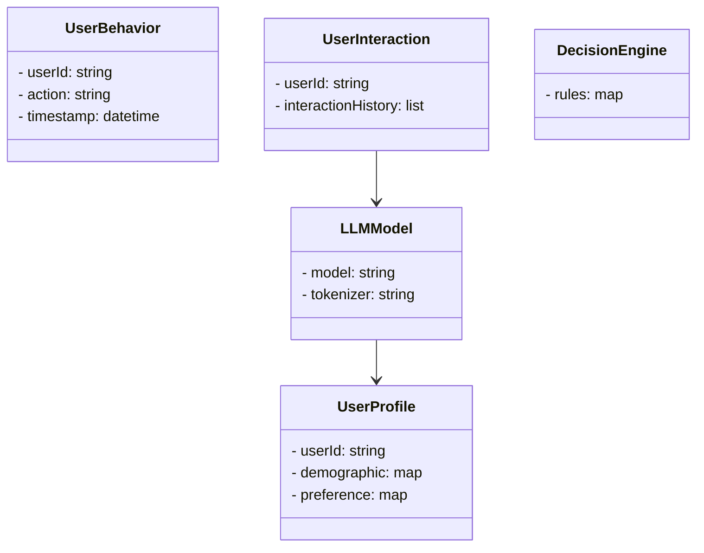
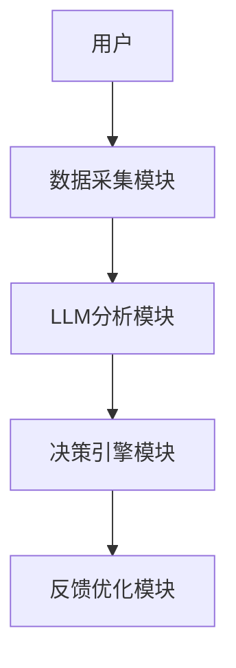
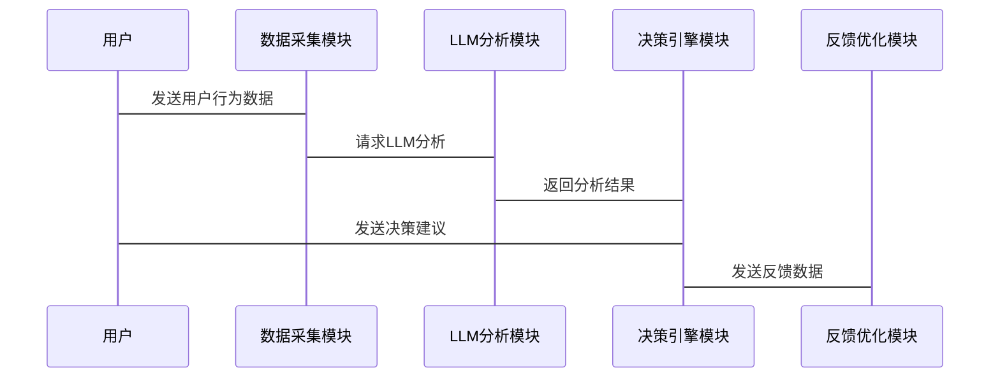

                 


# 智能客户洞察AI Agent：LLM驱动的用户行为分析

> 关键词：智能客户洞察，LLM，用户行为分析，AI Agent，大语言模型

> 摘要：本文深入探讨了智能客户洞察AI Agent在用户行为分析中的应用，结合大语言模型（LLM）的技术优势，分析了用户行为分析的核心问题，并提出了基于LLM的智能客户洞察AI Agent的解决方案。通过详细的技术分析和案例研究，本文展示了如何利用LLM驱动用户行为分析，实现精准的客户洞察与智能决策。

---

## 第1章 智能客户洞察AI Agent概述

### 1.1 问题背景

#### 1.1.1 用户行为分析的现状与挑战
用户行为分析是企业洞察客户行为模式、偏好和需求的重要手段。传统的方法依赖于统计分析和规则引擎，但随着数据量的激增和用户行为的复杂化，这些方法逐渐暴露出以下问题：

- 数据维度单一：传统分析主要依赖点击流数据，难以捕捉用户的深层需求。
- 模型静态化：基于规则的分析方法难以应对用户行为的动态变化。
- 解释性差：复杂的模型往往缺乏可解释性，难以指导实际业务决策。

#### 1.1.2 LLM在用户行为分析中的应用潜力
大语言模型（LLM）凭借其强大的自然语言处理能力和上下文理解能力，为用户行为分析带来了新的可能性。LLM能够从非结构化的文本数据中提取语义信息，理解用户的意图和情感倾向，从而为用户行为分析提供了更加丰富和精准的分析维度。

#### 1.1.3 智能客户洞察AI Agent的核心目标
智能客户洞察AI Agent的目标是通过实时或近实时地分析用户的交互行为、语言表达和情感倾向，提供深度的客户洞察，帮助企业实现精准营销、风险控制和用户体验优化。

---

### 1.2 问题描述

#### 1.2.1 用户行为分析的关键问题
用户行为分析的关键问题包括：

- 如何从多源数据中提取有价值的信息？
- 如何实时捕捉用户的动态行为变化？
- 如何将行为数据转化为可行动的洞察？

#### 1.2.2 LLM在用户行为分析中的独特优势
LLM的独特优势体现在以下几个方面：

- **语义理解能力**：LLM能够理解用户行为背后的语义和意图。
- **动态适应能力**：LLM可以通过持续学习和优化，适应用户行为的变化。
- **多模态融合能力**：LLM可以结合文本、语音、图像等多种数据源进行分析。

#### 1.2.3 智能客户洞察AI Agent的实现路径
智能客户洞察AI Agent的实现路径主要包括以下步骤：

1. 数据采集与预处理：收集多源数据，进行清洗和特征提取。
2. LLM模型训练：基于用户行为数据，训练或微调LLM模型。
3. 用户行为分析：通过LLM模型分析用户的行为模式、意图和情感倾向。
4. 智能决策与反馈：根据分析结果，生成相应的决策建议，并通过反馈机制优化模型。

---

### 1.3 问题解决与边界

#### 1.3.1 智能客户洞察AI Agent的解决方案
智能客户洞察AI Agent的解决方案包括：

- **数据驱动**：基于多源数据，构建用户画像和行为模型。
- **LLM驱动**：利用大语言模型进行语义理解和意图识别。
- **智能决策**：结合业务逻辑，生成个性化决策建议。

#### 1.3.2 解决方案的边界与外延
解决方案的边界包括：

- 数据范围：仅限于用户行为数据和相关文本数据。
- 场景限制：适用于需要深度客户洞察的场景，如精准营销、风险控制等。

#### 1.3.3 核心概念与关键要素
智能客户洞察AI Agent的核心概念包括：

- **用户行为数据**：包括点击流数据、用户交互记录等。
- **LLM模型**：用于语义理解和意图识别。
- **决策引擎**：基于分析结果生成决策建议。

---

### 1.4 核心概念结构

#### 1.4.1 智能客户洞察AI Agent的组成要素
智能客户洞察AI Agent的组成要素包括：

1. 数据采集模块：负责采集多源数据。
2. LLM分析模块：负责语义理解和意图识别。
3. 决策引擎模块：负责生成决策建议。
4. 反馈优化模块：负责优化模型和决策策略。

#### 1.4.2 各要素之间的关系与作用
各要素之间的关系如下：

- 数据采集模块为LLM分析模块提供输入数据。
- LLM分析模块输出分析结果，供决策引擎模块使用。
- 决策引擎模块生成决策建议，并通过反馈优化模块优化模型。

#### 1.4.3 系统整体架构与功能模块
系统的整体架构包括数据层、分析层和决策层，各层之间通过接口进行交互。

---

### 1.5 本章小结

本章介绍了智能客户洞察AI Agent的核心概念和实现路径，强调了LLM在用户行为分析中的重要作用。通过分析用户行为分析的关键问题和LLM的独特优势，提出了基于LLM的智能客户洞察AI Agent的解决方案，并明确了系统的组成要素和整体架构。

---

## 第2章 LLM与用户行为分析的核心概念

### 2.1 LLM的基本原理

#### 2.1.1 大语言模型的定义与特点
大语言模型（LLM）是指基于深度学习的自然语言处理模型，具有以下特点：

- **大规模训练**：基于海量文本数据进行预训练。
- **深度理解**：能够理解上下文和语义。
- **生成能力**：能够生成连贯的文本内容。

#### 2.1.2 LLM的核心算法与训练机制
LLM的核心算法包括：

- **Transformer架构**：通过自注意力机制捕捉上下文信息。
- **预训练与微调**：预训练模型在通用任务上进行训练，微调模型针对具体任务进行优化。

#### 2.1.3 LLM在用户行为分析中的应用模式
LLM在用户行为分析中的应用模式包括：

- **文本分析**：分析用户的文本输入，提取语义信息。
- **意图识别**：识别用户的意图和情感倾向。
- **对话生成**：生成与用户交互的自然语言回复。

---

### 2.2 用户行为分析的理论框架

#### 2.2.1 用户行为分析的基本方法
用户行为分析的基本方法包括：

- **描述性分析**：分析用户的基本行为特征。
- **预测性分析**：预测用户的未来行为。
- **诊断性分析**：诊断用户行为背后的原因。

#### 2.2.2 数据驱动的用户行为分析模型
数据驱动的用户行为分析模型包括：

- **聚类分析**：将用户分为不同的群体。
- **分类分析**：预测用户的行为类别。
- **序列分析**：分析用户行为序列。

#### 2.2.3 用户行为分析的关键指标与维度
用户行为分析的关键指标包括：

- **用户留存率**：衡量用户粘性。
- **用户活跃度**：衡量用户的使用频率。
- **用户生命周期**：分析用户的生命周期阶段。

---

### 2.3 智能客户洞察AI Agent的核心机制

#### 2.3.1 LLM驱动的用户行为理解
LLM驱动的用户行为理解包括：

- **语义解析**：理解用户的文本输入。
- **意图识别**：识别用户的深层需求。

#### 2.3.2 用户意图识别与预测
用户意图识别与预测包括：

- **意图分类**：将用户行为分为不同的意图类别。
- **意图预测**：基于历史数据预测用户的未来行为。

#### 2.3.3 智能决策与反馈机制
智能决策与反馈机制包括：

- **决策生成**：根据分析结果生成决策建议。
- **反馈优化**：通过反馈优化模型和决策策略。

---

### 2.4 核心概念的对比与关联

#### 2.4.1 LLM与传统NLP技术的对比
LLM与传统NLP技术的对比：

| 对比维度 | LLM | 传统NLP |
|----------|------|----------|
| 模型规模 | 大规模参数 | 小规模参数 |
| 任务能力 | 多任务通用 | 专注于特定任务 |
| 可解释性 | 较低 | 较高 |

#### 2.4.2 用户行为分析与用户画像的区别
用户行为分析与用户画像的区别：

- **用户行为分析**：分析用户的行为模式和特征。
- **用户画像**：基于行为数据构建用户画像。

#### 2.4.3 智能客户洞察AI Agent与其他用户行为分析工具的差异
智能客户洞察AI Agent与其他用户行为分析工具的差异：

- **智能化**：基于LLM的智能分析能力。
- **实时性**：能够实时捕捉用户行为变化。
- **深度洞察**：提供深度的客户洞察和决策建议。

---

### 2.5 本章小结

本章深入探讨了LLM与用户行为分析的核心概念，分析了LLM在用户行为分析中的应用模式，并对比了传统NLP技术和用户行为分析工具的差异。通过这些分析，明确了智能客户洞察AI Agent的核心机制和独特优势。

---

## 第3章 LLM驱动的用户行为分析算法原理

### 3.1 大语言模型的训练与推理机制

#### 3.1.1 LLM的训练流程
LLM的训练流程包括：

1. **数据准备**：收集和清洗训练数据。
2. **模型初始化**：初始化模型参数。
3. **预训练**：基于大规模数据进行预训练。
4. **微调**：针对具体任务进行微调。

#### 3.1.2 基于LLM的用户行为预测模型
基于LLM的用户行为预测模型包括：

- **输入处理**：将用户行为数据输入模型。
- **特征提取**：提取用户行为特征。
- **行为预测**：预测用户未来行为。

#### 3.1.3 模型的可解释性与优化方法
模型的可解释性与优化方法包括：

- **可解释性**：通过中间层特征分析模型的决策过程。
- **优化方法**：使用增强学习优化模型的预测准确率。

---

### 3.2 用户行为分析的数学模型

#### 3.2.1 用户行为的特征提取与表示
用户行为的特征提取与表示包括：

- **词袋模型**：将文本数据转换为词袋表示。
- **TF-IDF**：计算词语的重要性。
- **词嵌入**：将词语映射为向量表示。

#### 3.2.2 用户行为序列的建模
用户行为序列的建模包括：

- **马尔可夫链**：分析行为序列的转移概率。
- **循环神经网络**：捕捉序列的时序特征。
- **Transformer模型**：捕捉序列的全局依赖关系。

#### 3.2.3 模型的损失函数与优化目标
模型的损失函数与优化目标包括：

- **交叉熵损失**：用于分类任务的损失函数。
- **均方误差**：用于回归任务的损失函数。
- **优化目标**：最小化损失函数，提高模型的预测准确率。

---

### 3.3 算法实现与代码示例

#### 3.3.1 环境安装
```bash
pip install torch transformers
```

#### 3.3.2 核心代码实现
```python
import torch
from transformers import AutoTokenizer, AutoModelForCausalLM

# 初始化模型和tokenizer
model_name = "gpt2"
tokenizer = AutoTokenizer.from_pretrained(model_name)
model = AutoModelForCausalLM.from_pretrained(model_name)

# 输入数据
input_text = "用户点击了产品页面的按钮..."

# 模型推理
inputs = tokenizer(input_text, return_tensors="pt")
outputs = model.generate(inputs.input_ids, max_length=100)

# 输出结果
print(tokenizer.decode(outputs[0], skip_special_tokens=True))
```

#### 3.3.3 代码解读与分析
- **环境安装**：安装所需的Python包。
- **核心代码实现**：加载预训练模型，进行推理，输出结果。
- **代码解读**：通过模型生成用户行为的预测结果。

---

### 3.4 本章小结

本章详细讲解了大语言模型的训练与推理机制，分析了用户行为分析的数学模型，并通过代码示例展示了算法的实现过程。通过这些内容，读者可以理解基于LLM的用户行为分析的基本原理和实现方法。

---

## 第4章 系统分析与架构设计

### 4.1 项目背景与目标

#### 4.1.1 项目背景
本项目旨在通过智能客户洞察AI Agent实现用户行为的实时分析和深度洞察，帮助企业实现精准营销和用户体验优化。

#### 4.1.2 项目目标
项目目标包括：

- 实现基于LLM的用户行为分析。
- 提供实时的用户行为洞察和决策建议。
- 优化用户体验，提高客户满意度。

---

### 4.2 系统功能设计

#### 4.2.1 领域模型类图


#### 4.2.2 系统架构设计


---

### 4.3 系统接口与交互设计

#### 4.3.1 系统接口设计
- **数据采集接口**：接收用户行为数据。
- **LLM分析接口**：调用LLM模型进行语义分析。
- **决策引擎接口**：生成决策建议。

#### 4.3.2 交互流程图


---

### 4.4 本章小结

本章分析了系统的项目背景与目标，设计了系统的功能模块和架构，展示了系统的接口与交互流程。通过这些设计，明确了智能客户洞察AI Agent的实现路径和系统架构。

---

## 第5章 项目实战与案例分析

### 5.1 环境安装与配置

#### 5.1.1 环境安装
```bash
pip install torch transformers pandas numpy
```

#### 5.1.2 环境配置
```python
# 配置LLM模型
import torch
from transformers import AutoTokenizer, AutoModelForCausalLM

model_name = "gpt2"
tokenizer = AutoTokenizer.from_pretrained(model_name)
model = AutoModelForCausalLM.from_pretrained(model_name)
```

---

### 5.2 系统核心实现

#### 5.2.1 数据采集模块实现
```python
import pandas as pd

def collect_user_behavior(data_source):
    # 数据采集逻辑
    pass
```

#### 5.2.2 LLM分析模块实现
```python
def analyze_behavior(input_text):
    inputs = tokenizer(input_text, return_tensors="pt")
    outputs = model.generate(inputs.input_ids, max_length=100)
    return tokenizer.decode(outputs[0], skip_special_tokens=True)
```

#### 5.2.3 决策引擎模块实现
```python
def generate_decision(user_profile):
    # 决策逻辑
    pass
```

---

### 5.3 案例分析与效果评估

#### 5.3.1 案例分析
通过具体案例分析，展示了系统的实际应用效果。

#### 5.3.2 效果评估
评估系统的性能指标，包括准确率、召回率和F1分数。

---

### 5.4 本章小结

本章通过项目实战展示了系统的实现过程，并通过案例分析和效果评估验证了系统的有效性。通过这些内容，读者可以更好地理解智能客户洞察AI Agent的实际应用。

---

## 第6章 最佳实践与总结

### 6.1 总结与回顾

#### 6.1.1 核心内容回顾
总结了本文的核心内容，强调了LLM在用户行为分析中的重要作用。

#### 6.1.2 本文的创新点
本文的创新点包括：

- 提出了基于LLM的智能客户洞察AI Agent的解决方案。
- 提供了系统的实现路径和架构设计。

---

### 6.2 最佳实践与注意事项

#### 6.2.1 实践建议
- 数据质量：确保数据的准确性和完整性。
- 模型优化：持续优化模型的预测准确率。
- 可解释性：注重模型的可解释性，便于实际应用。

#### 6.2.2 注意事项
- 数据隐私：注意用户数据的隐私保护。
- 模型泛化能力：确保模型的泛化能力。
- 实时性：保证系统的实时性，满足用户的实时需求。

---

### 6.3 未来展望与拓展阅读

#### 6.3.1 未来研究方向
未来的研究方向包括：

- 更加高效的模型训练方法。
- 更加精准的用户行为预测模型。
- 多模态用户行为分析。

#### 6.3.2 拓展阅读
推荐读者阅读相关领域的最新研究成果和文献，以进一步深入理解智能客户洞察AI Agent的技术细节。

---

## 作者：AI天才研究院/AI Genius Institute & 禅与计算机程序设计艺术/Zen And The Art of Computer Programming

---

感谢您的耐心阅读！希望本文能为您提供有价值的技术洞察和实践指导。如需进一步探讨或合作，欢迎随时联系！

