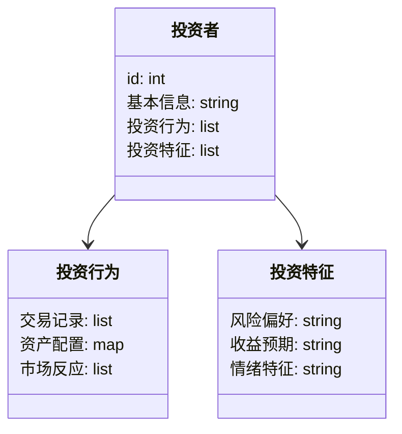

                 


```markdown
# 智能投资者画像分析平台

## 关键词：智能投资者画像，数据分析，机器学习，风险管理，金融科技

## 摘要：智能投资者画像分析平台利用大数据和机器学习技术，通过分析投资者的行为、偏好和风险承受能力，构建投资者画像，为金融机构提供精准的投资建议和风险评估。本文详细探讨了平台的背景、算法、系统架构、项目实战和最佳实践。

---

## 第一部分：智能投资者画像分析平台背景与概述

### 第1章：智能投资者画像分析平台概述

#### 1.1 问题背景与描述

##### 1.1.1 投资者画像分析的必要性
投资者画像分析是金融领域的重要工具，用于理解投资者的行为、偏好和风险承受能力。传统的投资者分析方法依赖于人工经验，存在效率低、主观性强、难以量化等问题。随着大数据和人工智能技术的发展，智能化投资者画像分析成为可能，能够提高分析的准确性和效率。

##### 1.1.2 智能化分析的需求驱动
金融市场的复杂性和投资者需求的多样化，使得传统的分析方法难以满足需求。智能化分析能够快速处理海量数据，发现潜在模式，为金融机构提供更精准的投资建议和风险管理策略。

##### 1.1.3 平台的目标与边界
智能投资者画像分析平台的目标是通过整合多源数据，利用机器学习算法构建投资者画像，提供个性化的投资建议和风险评估。其边界包括数据采集、特征提取、画像构建、分析与决策支持，不涉及具体的交易执行。

#### 1.2 核心概念与联系

##### 1.2.1 投资者画像的核心要素
投资者画像的核心要素包括：投资者的基本信息（年龄、性别、资产规模）、投资行为（交易频率、资产配置）、市场认知（风险偏好、收益预期）、情绪特征（市场波动下的行为变化）。

##### 1.2.2 智能分析的关键技术
智能分析的关键技术包括：大数据处理、机器学习算法（聚类、分类、回归）、自然语言处理（NLP）、图计算。

##### 1.2.3 实体关系图
```mermaid
erDiagram
    投资者 [*------* 投资行为]
    投资者 [*------* 投资特征]
    投资行为 [*------* 风险评估]
```

### 1.3 本章小结
本章介绍了智能投资者画像分析平台的背景、目标和核心概念，为后续的算法和系统设计奠定了基础。

---

## 第二部分：核心算法与数学模型

### 第2章：数据采集与特征提取

#### 2.1 数据采集方法

##### 2.1.1 多源数据整合
投资者数据来源多样，包括交易数据、市场数据、社交媒体数据、新闻数据等。需要将这些数据进行整合，形成统一的数据集。

##### 2.1.2 数据清洗与预处理
数据清洗包括去除重复数据、处理缺失值、异常值等。预处理包括数据标准化、特征选择等。

#### 2.2 特征提取算法

##### 2.2.1 基于聚类的特征提取
聚类分析用于发现投资者群体中的相似特征。例如，使用K-means算法将投资者分为不同的类别。

##### 2.2.2 基于决策树的特征提取
决策树算法（如ID3、C4.5）用于提取重要的特征变量，帮助构建投资者画像。

#### 2.3 本章小结
本章介绍了数据采集和特征提取的关键步骤，为后续的画像构建奠定了基础。

---

## 第三部分：系统分析与架构设计

### 第3章：系统分析与架构设计

#### 3.1 问题场景介绍

##### 3.1.1 投资者行为分析
分析投资者的交易行为、资产配置策略、市场反应等，帮助理解投资者的行为特征。

##### 3.1.2 风险评估
通过画像分析，评估投资者在不同市场环境下的风险承受能力，帮助制定风险管理策略。

#### 3.2 系统功能设计

##### 3.2.1 领域模型类图


#### 3.3 系统架构设计

##### 3.3.1 系统架构图


#### 3.4 系统接口设计

##### 3.4.1 API接口
- 数据接口：数据采集、特征提取、画像构建
- 分析接口：风险评估、投资建议、报告生成

#### 3.5 本章小结
本章详细描述了系统分析与架构设计，包括问题场景、系统功能、架构图和接口设计。

---

## 第四部分：项目实战

### 第4章：项目实战

#### 4.1 环境安装与配置

##### 4.1.1 安装Python
```bash
python --version
pip install numpy pandas scikit-learn
```

##### 4.1.2 安装数据库
```bash
mysql --version
```

#### 4.2 核心代码实现

##### 4.2.1 数据采集与清洗
```python
import pandas as pd
data = pd.read_csv('investor_data.csv')
data = data.dropna().astype('float')
```

##### 4.2.2 特征提取与建模
```python
from sklearn.cluster import KMeans
model = KMeans(n_clusters=5)
model.fit(data)
```

#### 4.3 本章小结
本章通过实际案例展示了平台的核心功能，包括环境安装、数据处理和模型构建。

---

## 第五部分：最佳实践与总结

### 第5章：最佳实践

#### 5.1 项目小结

##### 5.1.1 成功经验
- 数据清洗和特征选择是关键
- 使用合适的算法（如聚类和决策树）提高准确性
- 系统架构设计合理，确保高效性

##### 5.1.2 失败教训
- 数据质量影响模型效果
- 模型解释性不足，需要进一步优化
- 系统性能优化空间存在

#### 5.2 项目改进建议

##### 5.2.1 模型优化
- 引入深度学习算法（如神经网络）
- 增加实时数据处理能力

##### 5.2.2 系统优化
- 优化API接口性能
- 增加容错和异常处理机制

#### 5.3 拓展阅读

##### 5.3.1 推荐书籍
- 《机器学习实战》
- 《数据挖掘导论》

##### 5.3.2 在线资源
- Coursera上的机器学习课程
- Kaggle上的相关数据集

### 5.4 本章小结
本章总结了项目的成功经验与改进建议，为读者提供了进一步学习和实践的方向。

---

## 作者：AI天才研究院 & 禅与计算机程序设计艺术

---

**[结束]**

