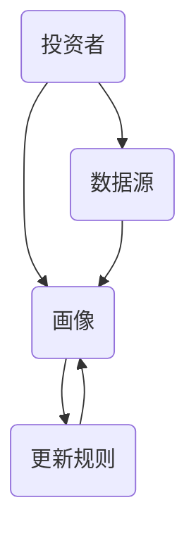
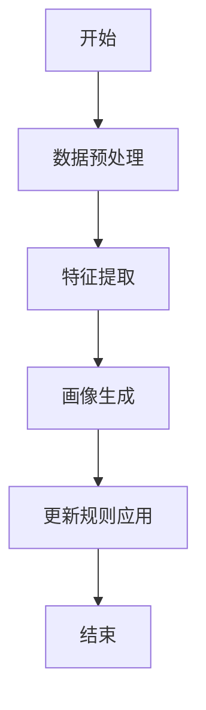
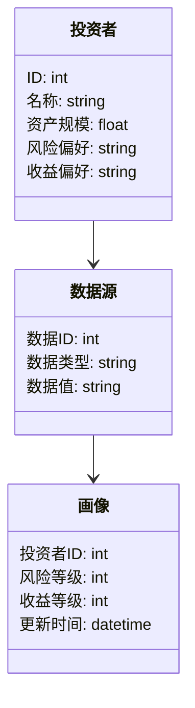
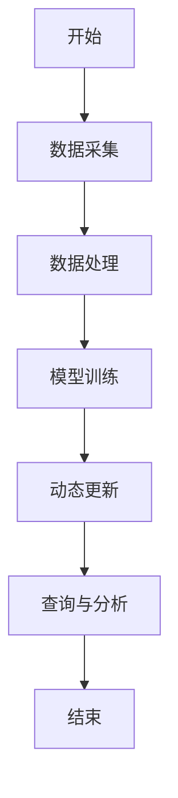
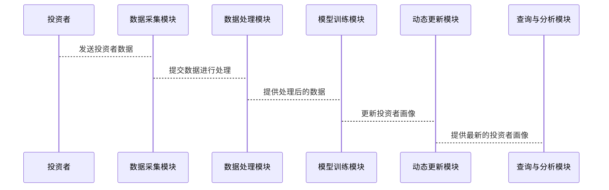

                 


# 智能投资者画像动态更新平台

> **关键词**: 智能投资者画像、动态更新、机器学习、金融数据、系统架构

> **摘要**: 本文详细探讨了智能投资者画像动态更新平台的设计与实现。通过分析投资者行为数据和市场动态，结合机器学习和大数据技术，提出了一种高效的画像更新方法。文章从背景介绍、核心概念、算法原理、系统架构设计到项目实战，全面解析了平台的构建过程，并通过实际案例展示了其应用价值。

---

# 第1章: 智能投资者画像动态更新平台的背景与意义

## 1.1 问题背景

### 1.1.1 投资者画像的定义与重要性

投资者画像是一种通过收集和分析投资者的行为数据、市场数据和交易数据，构建投资者特征和行为模式的过程。它能够帮助金融机构更好地理解投资者的需求、风险偏好和投资习惯，从而提供个性化的服务和投资建议。在金融领域，投资者画像的重要性日益凸显，尤其是在数字化转型和大数据技术广泛应用的背景下。

### 1.1.2 动态更新的必要性

传统的投资者画像通常是静态的，基于某一时间段的数据构建，无法及时反映市场变化和投资者行为的变化。然而，金融市场具有高度的动态性，投资者的偏好、风险承受能力和投资策略都会随市场环境的变化而调整。因此，动态更新投资者画像对于金融机构来说至关重要。它可以帮助机构及时捕捉投资者行为的变化，优化投资策略，并提升客户体验。

### 1.1.3 当前投资者画像更新的痛点

目前，投资者画像的动态更新面临以下主要问题：

1. **数据量大且复杂**: 投资者行为数据来源广泛，包括交易数据、市场数据、社交媒体数据等，数据量大且类型多样，难以高效处理。
2. **更新频率低**: 由于技术限制，许多机构的投资者画像更新频率较低，无法实时反映投资者行为的变化。
3. **缺乏个性化**: 现有的投资者画像构建方法往往过于通用，难以针对不同投资者的个性化需求进行动态调整。

## 1.2 问题描述

### 1.2.1 投资者画像构建的复杂性

投资者画像的构建需要整合多源数据，包括投资者的交易记录、市场行为、社交媒体互动等。这些数据通常分布在不同的系统中，数据格式和结构也各不相同，导致数据整合和处理的复杂性较高。

### 1.2.2 动态更新的挑战

动态更新投资者画像需要解决以下问题：

1. **实时性要求高**: 投资者行为的变化可能会影响投资决策，因此需要实时或准实时地更新画像。
2. **模型的可解释性**: 动态更新算法需要具有较高的可解释性，以便金融机构能够理解和调整模型。
3. **数据隐私与安全**: 投资者数据的隐私保护是动态更新过程中必须考虑的重要问题。

### 1.2.3 平台设计的目标与边界

智能投资者画像动态更新平台的目标是通过实时或准实时的数据处理，动态更新投资者画像，并提供高效的查询和分析功能。平台的设计需要考虑以下边界：

1. **数据范围**: 平台处理的投资者数据包括交易数据、市场数据和社交媒体数据等。
2. **更新频率**: 平台支持按分钟或小时级的更新频率。
3. **用户权限**: 平台需要提供严格的权限管理，确保数据的安全性和隐私性。

## 1.3 问题解决

### 1.3.1 技术手段的选择

为了实现智能投资者画像的动态更新，我们需要选择合适的技术手段：

1. **大数据技术**: 使用Hadoop、Spark等技术处理海量数据。
2. **机器学习算法**: 使用聚类分析、回归分析等算法构建投资者画像。
3. **实时流处理**: 使用Kafka、Flink等技术实现数据的实时处理。

### 1.3.2 平台设计的核心理念

智能投资者画像动态更新平台的核心理念包括：

1. **实时性**: 平台能够实时处理投资者数据，动态更新画像。
2. **个性化**: 平台支持针对不同投资者的个性化画像构建。
3. **可扩展性**: 平台架构设计具有良好的可扩展性，能够应对数据量的增长。

### 1.3.3 动态更新的具体实现

动态更新的具体实现包括：

1. **数据采集**: 通过API接口实时采集投资者数据。
2. **特征提取**: 对采集的数据进行特征提取，生成投资者画像。
3. **模型训练**: 使用机器学习算法对特征进行建模，生成动态更新的投资者画像。

## 1.4 概念结构与核心要素

### 1.4.1 投资者画像的核心要素

投资者画像的核心要素包括：

1. **投资者行为**: 包括交易频率、交易金额、交易时间等。
2. **投资者偏好**: 包括风险偏好、收益偏好等。
3. **投资者特征**: 包括年龄、性别、资产规模等。

### 1.4.2 动态更新的机制

动态更新的机制包括：

1. **数据驱动**: 通过实时数据驱动更新投资者画像。
2. **规则驱动**: 通过预设的规则触发更新投资者画像。
3. **混合驱动**: 结合数据驱动和规则驱动，实现更加智能的动态更新。

### 1.4.3 平台架构的核心要素

平台架构的核心要素包括：

1. **数据采集模块**: 负责采集投资者数据。
2. **数据处理模块**: 负责对数据进行清洗和转换。
3. **模型训练模块**: 负责构建和训练投资者画像模型。
4. **更新模块**: 负责动态更新投资者画像。
5. **查询与分析模块**: 提供投资者画像的查询和分析功能。

---

# 第2章: 智能投资者画像动态更新的核心概念

## 2.1 核心概念原理

### 2.1.1 投资者画像的构建过程

投资者画像的构建过程包括以下步骤：

1. **数据采集**: 从多个数据源采集投资者数据。
2. **数据清洗**: 对数据进行去重、补全等处理。
3. **特征提取**: 提取投资者行为和特征的关键词。
4. **模型训练**: 使用机器学习算法构建投资者画像。

### 2.1.2 动态更新的算法原理

动态更新的算法原理包括：

1. **特征更新**: 对投资者的最新行为数据进行特征提取。
2. **模型更新**: 使用最新的特征重新训练模型，更新投资者画像。

### 2.1.3 平台的核心功能模块

平台的核心功能模块包括：

1. **数据采集模块**: 实现实时数据采集。
2. **数据处理模块**: 提供数据清洗和转换功能。
3. **模型训练模块**: 提供投资者画像模型的训练和更新功能。
4. **更新模块**: 实现投资者画像的动态更新。
5. **查询与分析模块**: 提供投资者画像的查询和分析功能。

## 2.2 核心概念属性对比表

### 2.2.1 不同投资者画像的属性对比

| 属性 | 风险偏好 | 收益偏好 | 资产规模 |
|------|----------|----------|----------|
| 高风险 | 高       | 高       | 大       |
| 中风险 | 中       | 中       | 中       |
| 低风险 | 低       | 低       | 小       |

### 2.2.2 动态更新算法的性能对比

| 算法 | 实时性 | 可扩展性 | 准确性 |
|------|--------|----------|--------|
| 聚类算法 | 低     | 中       | 中     |
| 回归算法 | 中     | 高       | 高     |
| 深度学习 | 高     | 低       | 高     |

### 2.2.3 平台功能模块的优劣势分析

| 模块 | 优势 | 劣势 |
|------|------|------|
| 数据采集模块 | 实时性强 | 成本高 |
| 数据处理模块 | 稳定性高 | 灵活性低 |
| 模型训练模块 | 准确性高 | 需要大量计算资源 |
| 更新模块 | 及时性高 | 需要频繁更新 |
| 查询与分析模块 | 使用方便 | 功能相对简单 |

## 2.3 ER实体关系图



---

# 第3章: 智能投资者画像动态更新的算法原理

## 3.1 算法原理概述

### 3.1.1 基于规则的特征提取

基于规则的特征提取是一种通过预设规则从数据中提取特征的方法。例如，可以通过规则提取投资者的交易频率和交易时间。

### 3.1.2 基于深度学习的画像生成

基于深度学习的画像生成是一种通过神经网络模型生成投资者画像的方法。例如，可以使用循环神经网络（RNN）或卷积神经网络（CNN）进行特征提取和画像生成。

### 3.1.3 动态更新的算法选择

动态更新的算法选择需要考虑实时性、准确性和可扩展性。常用算法包括聚类算法、回归算法和深度学习算法。

## 3.2 算法流程图



## 3.3 算法实现代码

以下是一个基于聚类算法的投资者画像动态更新的示例代码：

```python
import pandas as pd
from sklearn.cluster import KMeans

# 数据预处理
data = pd.read_csv('investor_data.csv')
data = data.dropna()

# 特征提取
X = data[['交易金额', '交易频率', '资产规模']]

# 模型训练
kmeans = KMeans(n_clusters=3, random_state=0)
kmeans.fit(X)

# 动态更新
new_data = pd.read_csv('new_investor_data.csv')
new_X = new_data[['交易金额', '交易频率', '资产规模']]
new_clusters = kmeans.predict(new_X)

# 更新投资者画像
data['cluster'] = new_clusters
```

---

# 第4章: 智能投资者画像动态更新平台的系统分析与架构设计

## 4.1 问题场景介绍

智能投资者画像动态更新平台需要解决的主要问题包括：

1. 如何高效处理海量投资者数据。
2. 如何实现投资者画像的动态更新。
3. 如何确保数据的安全性和隐私性。

## 4.2 系统功能设计

### 4.2.1 领域模型



### 4.2.2 系统架构设计



### 4.2.3 系统接口设计

系统接口设计包括：

1. 数据采集接口: 用于实时采集投资者数据。
2. 数据处理接口: 用于对数据进行清洗和转换。
3. 模型训练接口: 用于训练投资者画像模型。
4. 动态更新接口: 用于实现投资者画像的动态更新。
5. 查询与分析接口: 用于提供投资者画像的查询和分析功能。

### 4.2.4 系统交互流程图



---

# 第5章: 智能投资者画像动态更新平台的项目实战

## 5.1 环境安装

为了运行智能投资者画像动态更新平台，需要安装以下环境：

1. **Python**: 安装Python 3.8及以上版本。
2. **数据处理库**: 安装Pandas、NumPy等库。
3. **机器学习库**: 安装Scikit-learn、TensorFlow等库。
4. **实时流处理工具**: 安装Kafka、Flink等工具。

## 5.2 核心代码实现

以下是一个投资者画像动态更新平台的核心代码实现：

```python
import pandas as pd
from sklearn.cluster import KMeans
from datetime import datetime

# 数据预处理
data = pd.read_csv('investor_data.csv')
data = data.dropna()

# 特征提取
X = data[['交易金额', '交易频率', '资产规模']]

# 模型训练
kmeans = KMeans(n_clusters=3, random_state=0)
kmeans.fit(X)

# 动态更新
new_data = pd.read_csv('new_investor_data.csv')
new_X = new_data[['交易金额', '交易频率', '资产规模']]
new_clusters = kmeans.predict(new_X)

# 更新投资者画像
data['cluster'] = new_clusters
data['更新时间'] = datetime.now()

# 保存更新后的数据
data.to_csv('updated_investor_data.csv', index=False)
```

## 5.3 代码应用解读与分析

上述代码实现了一个基于聚类算法的投资者画像动态更新平台。首先，代码从CSV文件中读取投资者数据，并进行数据清洗和特征提取。然后，使用KMeans算法对数据进行聚类分析，生成投资者画像。最后，将更新后的投资者画像保存到CSV文件中。

## 5.4 实际案例分析

假设我们有以下投资者数据：

| ID | 交易金额 | 交易频率 | 资产规模 |
|----|----------|----------|----------|
| 1  | 10000    | 5次/天    | 100万    |
| 2  | 5000     | 3次/天    | 50万     |
| 3  | 20000    | 10次/天   | 200万    |

通过上述代码，我们可以将这三位投资者分为三个不同的聚类，并生成更新后的投资者画像。

## 5.5 项目小结

通过实际案例分析，我们可以看到，智能投资者画像动态更新平台能够有效地处理投资者数据，并生成动态更新的投资者画像。这为金融机构提供了重要的决策支持工具。

---

# 第6章: 智能投资者画像动态更新平台的总结与展望

## 6.1 总结

智能投资者画像动态更新平台通过实时处理投资者数据，动态更新投资者画像，为金融机构提供了重要的决策支持工具。本文从背景介绍、核心概念、算法原理、系统架构设计到项目实战，全面解析了平台的构建过程。

## 6.2 未来展望

未来，智能投资者画像动态更新平台的发展方向包括：

1. **实时性进一步提升**: 提高数据处理和模型更新的实时性。
2. **模型优化**: 引入更加先进的机器学习算法，提高投资者画像的准确性。
3. **多维度分析**: 增加更多维度的投资者特征，如心理因素、行为模式等，进一步丰富投资者画像的内容。
4. **数据隐私保护**: 加强数据隐私保护，确保投资者数据的安全性。

---

# 作者

**作者：AI天才研究院/AI Genius Institute & 禅与计算机程序设计艺术/Zen And The Art of Computer Programming**

---

以上是《智能投资者画像动态更新平台》的技术博客文章的完整目录和内容框架。接下来，我会根据这个框架，逐步撰写每一章的具体内容。

