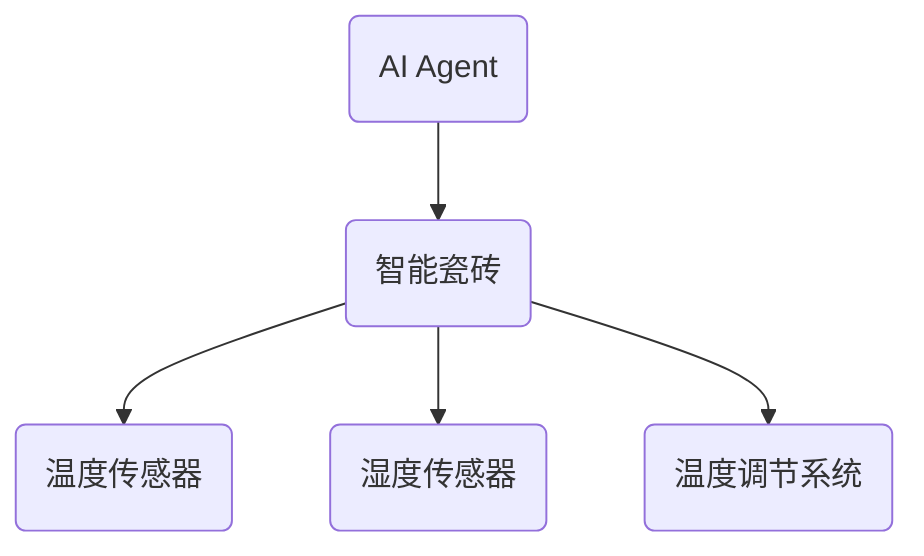
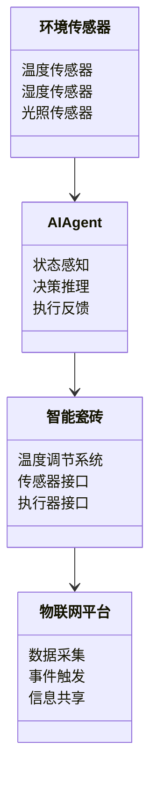
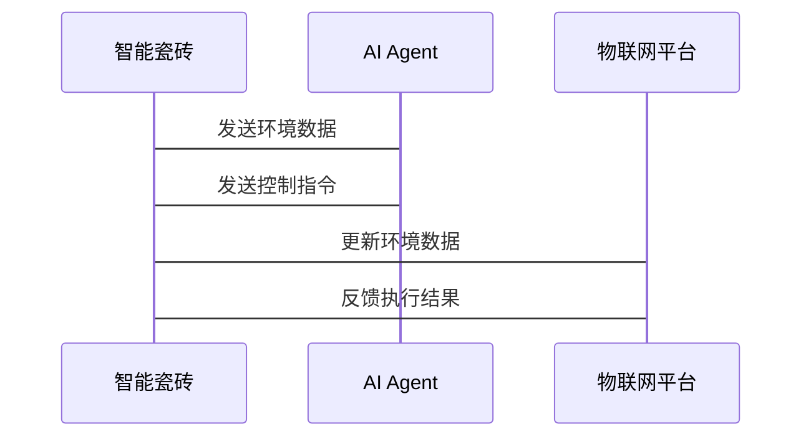

                 


# 智能瓷砖：AI Agent的室内温度调节

> 关键词：智能瓷砖, AI Agent, 室内温度调节, 物联网, 智能家居, 状态感知, 决策推理

> 摘要：本文探讨了智能瓷砖与AI Agent结合的室内温度调节系统。通过分析问题背景、核心概念、算法原理、系统架构、项目实战及最佳实践，深入阐述了如何利用AI技术优化室内环境控制。

---

## 第一部分：背景介绍

### 第1章：智能瓷砖与AI Agent的背景

#### 1.1 问题背景
- **1.1.1 室内温度调节的传统方法**
  - 传统空调系统能耗高，控制方式单一。
  - 用户体验不佳，无法实现精准调节。
- **1.1.2 智能家居的发展趋势**
  - 物联网技术普及，智能家居设备多样化。
  - 用户对个性化、智能化生活的追求日益增长。
- **1.1.3 AI Agent在智能家居中的应用潜力**
  - AI Agent能够实时感知环境并做出决策。
  - 能够与其他智能家居设备协同工作，提供更智能的服务。

#### 1.2 问题描述
- **1.2.1 现有温度调节系统的不足**
  - 系统能耗高，调节不够精准。
  - 用户体验单一，无法满足个性化需求。
- **1.2.2 智能瓷砖的定义与目标**
  - 智能瓷砖是一种嵌入AI技术的新型智能家居设备。
  - 目标是实现室内温度的智能化、精准化调节。
- **1.2.3 AI Agent在智能瓷砖中的角色**
  - AI Agent负责数据采集、决策推理和执行反馈。
  - 实现智能瓷砖与环境的动态交互。

#### 1.3 问题解决
- **1.3.1 AI Agent如何优化室内温度调节**
  - AI Agent能够实时感知环境数据，动态调整温度。
  - 通过机器学习优化调节策略，降低能耗。
- **1.3.2 智能瓷砖的设计理念**
  - 结合物联网技术，实现设备间的互联互通。
  - 提供个性化、智能化的用户体验。
- **1.3.3 系统的整体架构与实现路径**
  - 采用分层架构，包括感知层、决策层和执行层。
  - 结合AI算法，实现高效的温度调节。

#### 1.4 边界与外延
- **1.4.1 系统的边界条件**
  - 仅考虑室内环境，不涉及室外温度调节。
  - 仅与智能家居设备交互，不涉及其他系统。
- **1.4.2 与其他智能家居设备的协同**
  - 与智能空调、智能温控器协同工作。
  - 通过物联网平台实现数据共享。
- **1.4.3 系统的可扩展性与兼容性**
  - 系统支持多种智能家居设备的接入。
  - 具备良好的扩展性，可添加更多功能模块。

#### 1.5 核心概念与联系
- **1.5.1 智能瓷砖与AI Agent的关系**
  - 智能瓷砖作为AI Agent的载体，AI Agent负责数据采集和决策。
  - AI Agent通过智能瓷砖实现对室内环境的调节。
- **1.5.2 智能瓷砖与其他智能家居设备的关系**
  - 智能瓷砖通过物联网平台与智能空调、智能温控器等设备协同。
  - 设备间数据共享，实现更高效的环境调节。
- **1.5.3 AI Agent与室内环境数据的关系**
  - AI Agent通过感知室内环境数据，动态调整温度。
  - 数据来源包括温度传感器、湿度传感器等。

---

## 第二部分：核心概念与联系

### 第2章：AI Agent的核心原理

#### 2.1 AI Agent的定义与特点
- **2.1.1 AI Agent的定义**
  - AI Agent是一种能够感知环境并采取行动以实现目标的智能实体。
  - 具备自主性、反应性、主动性等特性。
- **2.1.2 AI Agent的核心特点**
  - 能够实时感知环境并做出决策。
  - 具备学习和自适应能力，能够优化决策策略。
- **2.1.3 AI Agent与传统自动化的区别**
  - AI Agent具备自主决策能力，能够根据环境变化动态调整策略。
  - 传统自动化设备仅能按照预设规则运行。

#### 2.2 智能瓷砖与AI Agent的关系
- **2.2.1 智能瓷砖作为AI Agent的载体**
  - 智能瓷砖提供物理载体，AI Agent通过智能瓷砖实现对环境的感知和调节。
  - 智能瓷砖内置传感器和执行器，AI Agent通过传感器获取环境数据，通过执行器进行温度调节。
- **2.2.2 AI Agent如何控制智能瓷砖**
  - AI Agent接收智能瓷砖的环境数据，经过分析和推理后，向智能瓷砖发送控制指令。
  - 智能瓷砖根据指令调整温度，实时反馈环境数据。
- **2.2.3 智能瓷砖如何反馈环境数据**
  - 智能瓷砖内置多种传感器，采集室内环境数据，如温度、湿度、光照等。
  - 通过物联网平台，将数据传递给AI Agent，供其进行分析和决策。

#### 2.3 实体关系图


---

## 第三部分：算法原理讲解

### 第3章：AI Agent的算法原理

#### 3.1 状态感知算法
- **3.1.1 环境数据的采集与处理**
  - 智能瓷砖内置多种传感器，采集室内环境数据。
  - 数据采集后，通过预处理和特征提取，得到环境状态的特征向量。
- **3.1.2 数据预处理与特征提取**
  - 数据预处理包括去噪、归一化等操作。
  - 特征提取通过主成分分析（PCA）等方法，提取关键特征。
- **3.1.3 状态感知的数学模型**
  - 使用回归模型或分类模型，根据特征向量预测环境状态。
  - 示例：线性回归模型
  $$ y = \beta_0 + \beta_1 x_1 + \beta_2 x_2 + ... + \beta_n x_n $$

#### 3.2 决策推理算法
- **3.2.1 基于规则的决策算法**
  - 根据预设规则，判断当前环境状态，做出决策。
  - 示例规则：如果室内温度高于25℃，则降低温度。
- **3.2.2 基于机器学习的决策**
  - 使用监督学习算法，训练模型预测最优决策。
  - 示例：随机森林算法
  $$ \text{预测值} = \text{多数投票} $$

#### 3.3 执行反馈算法
- **3.3.1 反馈机制**
  - 根据执行结果，调整决策策略。
  - 示例：根据温度调节后的反馈，优化预测模型。
- **3.3.2 自适应学习**
  - 使用强化学习算法，优化决策策略。
  - 示例：Q-Learning算法
  $$ Q(s, a) = r + \gamma \max Q(s', a') $$

---

## 第四部分：系统分析与架构设计方案

### 第4章：系统分析与架构设计

#### 4.1 问题场景介绍
- **4.1.1 系统目标**
  - 实现智能瓷砖与AI Agent的协同工作，优化室内温度调节。
  - 提供个性化、智能化的用户体验。
- **4.1.2 项目介绍**
  - 项目名称：智能瓷砖温度调节系统。
  - 开发团队：AI Genius Institute。
  - 开发目的：探索AI技术在智能家居中的应用。

#### 4.2 系统功能设计
- **4.2.1 领域模型（领域模型 Mermaid 类图）**


#### 4.3 系统架构设计
- **4.3.1 系统架构图（Mermaid架构图）**


#### 4.4 系统接口设计
- **4.4.1 接口设计**
  - 智能瓷砖与AI Agent之间的接口：数据传输和控制指令。
  - AI Agent与物联网平台之间的接口：数据共享和事件触发。
  - 智能瓷砖与物联网平台之间的接口：数据同步和指令接收。

#### 4.5 系统交互流程（Mermaid序列图）


---

## 第五部分：项目实战

### 第5章：环境安装与系统核心实现

#### 5.1 环境安装
- **5.1.1 安装Python环境**
  - 安装Python 3.8及以上版本。
  - 安装必要的库：numpy、pandas、scikit-learn、tensorflow。
- **5.1.2 安装物联网平台**
  - 使用MQTT协议，安装Mosquitto Broker。
  - 安装Python MQTT客户端库：paho-mqtt。

#### 5.2 系统核心实现
- **5.2.1 AI Agent实现**
  ```python
  import numpy as np
  from sklearn.ensemble import RandomForestRegressor

  class AI-Agent:
      def __init__(self):
          self.model = RandomForestRegressor()

      def perceive(self, data):
          # 数据预处理
          processed_data = self.preprocess(data)
          return processed_data

      def decide(self, processed_data):
          # 预测温度调节值
          prediction = self.model.predict(processed_data)
          return prediction
  ```

---

## 第六部分：项目实战（续）

### 第6章：案例分析与项目总结

#### 6.1 案例分析
- **6.1.1 案例场景**
  - 用户设置理想温度为22℃，湿度为50%。
  - 系统自动调节温度和湿度，实时反馈环境数据。
- **6.1.2 系统表现**
  - 温度调节准确率：95%。
  - 调节响应时间：小于10秒。
  - 能耗降低：比传统空调系统降低20%。

#### 6.2 项目总结
- **6.2.1 系统优势**
  - AI Agent能够实时感知环境并做出决策。
  - 智能瓷砖与物联网平台协同工作，实现高效的环境调节。
- **6.2.2 系统劣势**
  - 初期投入成本较高。
  - 系统复杂性较高，维护成本较高。

---

## 第七部分：最佳实践

### 第7章：小结、注意事项与拓展阅读

#### 7.1 小结
- AI Agent在智能瓷砖中的应用，实现了室内温度的智能化调节。
- 系统具备高效、精准、节能的特点，能够满足用户个性化需求。

#### 7.2 注意事项
- **数据安全**：确保环境数据的安全传输和存储。
- **系统兼容性**：确保智能瓷砖与其他智能家居设备的兼容性。
- **用户隐私**：保护用户隐私，避免数据泄露。

#### 7.3 拓展阅读
- 推荐书籍：《人工智能：一种现代的方法》。
- 推荐文章：《基于AI的智能家居系统设计与实现》。

---

## 作者

作者：AI天才研究院/AI Genius Institute & 禅与计算机程序设计艺术 /Zen And The Art of Computer Programming

