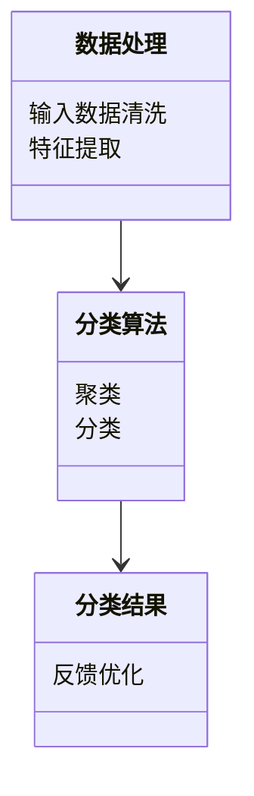
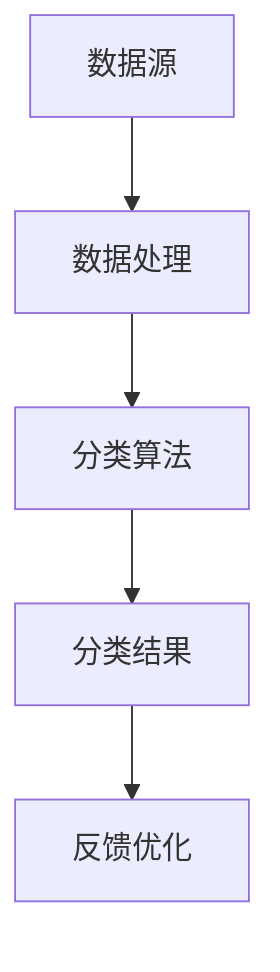

                 


# 智能算法构建动态行业分类体系

> 关键词：智能算法，行业分类，动态调整，机器学习，分类体系

> 摘要：本文探讨了如何利用智能算法构建动态行业分类体系，详细分析了传统分类方法的局限性，介绍了智能算法的核心概念、算法选择、数学模型、系统架构及项目实战。通过案例分析和代码实现，展示了如何在实际中应用这些方法，最后总结了最佳实践和未来发展方向。

---

## 第1章 动态行业分类体系的背景与问题描述

### 1.1 问题背景

#### 1.1.1 行业分类体系的传统方法与局限性
传统行业分类体系通常基于静态规则，难以适应市场变化。例如，零售业和制造业的分类标准差异大，动态调整成本高。

#### 1.1.2 动态行业的特点与挑战
行业动态变化快，企业需求多样，分类体系需实时调整。动态分类体系能捕捉市场变化，优化资源配置。

#### 1.1.3 智能算法在行业分类中的作用
智能算法通过数据驱动，实时分析和调整分类标准，提高分类准确性和灵活性。

### 1.2 行业动态与分类需求

#### 1.2.1 行业分类的动态变化原因
市场需求波动、技术创新、政策变化等因素导致行业结构变化。

#### 1.2.2 不同行业对分类体系的需求差异
零售业需实时库存分类，制造业需供应链优化，金融行业需风险评估。

#### 1.2.3 动态分类体系的必要性与优势
动态分类体系能快速响应变化，提高企业竞争力和运营效率。

### 1.3 动态行业分类体系构建的重要性

#### 1.3.1 提高企业运营效率
动态分类优化流程，提升决策速度和准确性。

#### 1.3.2 优化资源配置与决策
精准分类节省成本，提高资源配置效率。

#### 1.3.3 支持行业创新与竞争优势
动态分类推动业务模式创新，提升竞争优势。

### 1.4 本章小结
动态行业分类体系是智能算法的重要应用，帮助企业应对快速变化的市场环境。

---

## 第2章 智能算法与动态行业分类体系的核心概念

### 2.1 智能算法的基本概念

#### 2.1.1 机器学习与深度学习简介
机器学习从数据中学习模式，深度学习处理复杂数据结构。

#### 2.1.2 智能算法的核心特征
数据驱动、自适应、实时性。

#### 2.1.3 算法在动态分类中的应用
监督学习分类企业类型，无监督学习发现潜在类别。

### 2.2 动态行业分类体系的构建要素

#### 2.2.1 数据来源与处理
多源数据融合，清洗和特征提取。

#### 2.2.2 分类标准与规则
动态规则引擎，实时调整分类逻辑。

#### 2.2.3 算法选择与优化
选择适合业务需求的算法，优化模型参数。

### 2.3 智能算法与动态分类的关联

#### 2.3.1 算法驱动分类体系的动态调整
算法根据数据变化自动调整分类。

#### 2.3.2 分类结果对算法优化的反馈作用
反馈优化算法，提高分类准确性。

#### 2.3.3 动态分类体系的闭环优化机制
数据->算法->分类->反馈->优化。

### 2.4 核心概念对比分析

#### 2.4.1 行业分类与智能算法的对比表格

| 比较维度         | 行业分类              | 智能算法              |
|------------------|----------------------|----------------------|
| 基础            | 行业知识与规则       | 数据与模式识别       |
| 可扩展性         | 较低                 | 较高                 |
| 更新周期         | 定期或不定期         | 实时或周期性          |

#### 2.4.2 动态分类与静态分类的ER实体关系图

```mermaid
erd
    左右方向
    分类标准 <--- 关联表 ---> 分类结果
    分类结果 <--- 属性表 ---> 分类实例
    分类标准 <--- 属性表 ---> 分类实例
```

### 2.5 本章小结
智能算法为动态分类体系提供数据驱动的方法，实现高效分类和动态调整。

---

## 第3章 常用智能算法及其在动态行业分类中的应用

### 3.1 聚类算法

#### 3.1.1 层次聚类算法
基于相似度构建树状结构，适合行业细分。

#### 3.1.2 K-means算法
迭代优化中心点，适合大样本数据分类。

#### 3.1.3 DBSCAN算法
基于密度的聚类，处理噪声数据。

#### 3.1.4 应用场景
市场细分、客户群体分析。

#### 3.1.5 优缺点对比

| 算法   | 优点               | 缺点               |
|--------|--------------------|--------------------|
| 层次聚类 | 明确的类别结构     | 计算复杂度高       |
| K-means| 收敛快，适合大数据 | 易陷入局部最优     |
| DBSCAN | 处理噪声数据       | 参数敏感性高       |

#### 3.1.6 代码实现示例

```python
from sklearn.cluster import KMeans
import numpy as np

# 生成数据
data = np.random.rand(100, 2)
# 模型训练
model = KMeans(n_clusters=3)
model.fit(data)
# 预测结果
labels = model.predict(data)
print(labels)
```

### 3.2 分类算法

#### 3.2.1 支持向量机（SVM）

- **原理**：寻找最优超平面，最大化分类间隔。
- **公式**：$$\text{目标函数} = \sum y_i \cdot \text{sign}(w \cdot x_i + b)$$

#### 3.2.2 随机森林

- **原理**：集成多个决策树，减少过拟合。
- **代码示例**：

```python
from sklearn.ensemble import RandomForestClassifier

# 训练模型
model = RandomForestClassifier()
model.fit(X_train, y_train)
# 预测
y_pred = model.predict(X_test)
```

#### 3.2.3 神经网络

- **原理**：多层感知机，非线性特征学习。
- **公式**：$$a = \sigma(w x + b)$$ 其中，$$\sigma$$ 是激活函数。

#### 3.2.4 应用场景
客户行为预测、风险评估。

### 3.3 关联规则挖掘

#### 3.3.1 Apriori算法

- **原理**：基于频繁项集的关联规则。
- **公式**：$$\text{支持度} = \frac{\text{频繁项集数}}{\text{总事务数}}$$

#### 3.3.2 FP-Growth算法

- **原理**：高效挖掘频繁项集。
- **代码示例**：

```python
from mlxtend.frequent import fpgrowth

# 训练模型
model = fpgrowth(frequent_items, min_confidence=0.3)
# 提取关联规则
rules = model.get_assoc_rules()
```

#### 3.3.3 应用场景
购物篮分析、推荐系统。

### 3.4 算法选择与优化

#### 3.4.1 算法选择策略
数据类型、计算资源、业务需求。

#### 3.4.2 超参数优化
网格搜索、随机搜索、贝叶斯优化。

### 3.5 本章小结
聚类、分类和关联规则挖掘算法各有优劣，选择合适的算法和优化参数是关键。

---

## 第4章 数学模型与公式推导

### 4.1 层次聚类的数学模型

#### 4.1.1 距离度量
欧氏距离、曼哈顿距离、Jaccard相似度。

#### 4.1.2 聚类评估指标

| 指标     | 公式                          |
|----------|-------------------------------|
| 纯度     | $$\text{纯度} = \frac{\text{正确分类数}}{\text{总样本数}}$$ |
| 凝聚度   | $$\text{凝聚度} = 1 - \frac{\text{总距离}}{\text{最大距离}}$$ |

### 4.2 支持向量机的优化目标

#### 4.2.1 线性可分情况
$$\text{目标函数} = \min_{w, b} \frac{1}{2}||w||^2$$

#### 4.2.2 软间隔情况
$$\text{目标函数} = \min_{w, b, \xi} \frac{1}{2}||w||^2 + C \sum \xi_i$$

### 4.3 神经网络的损失函数

#### 4.3.1 交叉熵损失
$$\text{损失函数} = -\sum y_i \log(p_i) + (1 - y_i) \log(1 - p_i)$$

### 4.4 优化算法

#### 4.4.1 梯度下降
$$w := w - \eta \frac{\partial L}{\partial w}$$

#### 4.4.2 Adam优化
结合动量和自适应学习率。

### 4.5 本章小结
数学模型是算法的核心，理解这些公式有助于优化和实现。

---

## 第5章 系统分析与架构设计

### 5.1 项目背景与目标

#### 5.1.1 项目背景
构建动态分类体系，提高企业运营效率。

#### 5.1.2 项目目标
实时分类、动态调整、高扩展性。

### 5.2 系统功能设计

#### 5.2.1 领域模型



### 5.3 系统架构设计

#### 5.3.1 总体架构



#### 5.3.2 接口设计
RESTful API，如 POST /api/train，GET /api/predict。

### 5.4 本章小结
系统架构需模块化设计，确保灵活性和可扩展性。

---

## 第6章 项目实战：构建动态分类系统

### 6.1 环境搭建

#### 6.1.1 安装依赖
Python、Scikit-learn、TensorFlow、Mermaid。

#### 6.1.2 开发工具
Jupyter Notebook、VS Code。

### 6.2 核心代码实现

#### 6.2.1 数据预处理

```python
import pandas as pd
data = pd.read_csv('industry_data.csv')
data = data.dropna().reset_index(drop=True)
```

#### 6.2.2 模型训练

```python
from sklearn.model_selection import train_test_split
from sklearn.ensemble import RandomForestClassifier

X_train, X_test, y_train, y_test = train_test_split(data.drop('label', axis=1), data['label'])
model = RandomForestClassifier()
model.fit(X_train, y_train)
```

#### 6.2.3 模型评估

```python
from sklearn.metrics import accuracy_score

y_pred = model.predict(X_test)
print(accuracy_score(y_test, y_pred))
```

### 6.3 案例分析与结果解读

#### 6.3.1 案例分析
某零售企业的商品分类，动态调整库存。

#### 6.3.2 结果解读
分类准确率高，实时反馈优化。

### 6.4 项目小结

#### 6.4.1 成功经验
模块化设计、数据预处理、算法选择。

#### 6.4.2 经验教训
数据质量影响分类效果，模型调优需持续优化。

---

## 第7章 最佳实践、小结与注意事项

### 7.1 最佳实践

#### 7.1.1 数据处理
多源数据融合，特征工程。

#### 7.1.2 算法选择
结合业务需求和数据特点。

#### 7.1.3 系统架构
模块化设计，高扩展性。

### 7.2 小结

智能算法构建动态行业分类体系，提高企业竞争力和运营效率。

### 7.3 注意事项

- 数据隐私与安全
- 模型解释性
- 算法可解释性
- 系统维护与更新

### 7.4 拓展阅读

- 《机器学习实战》
- 《深入理解深度学习》
- 《系统架构设计》

---

## 作者信息

作者：AI天才研究院/AI Genius Institute  
联系邮箱：contact@ai-genius.com  
GitHub链接：https://github.com/ai-genius

