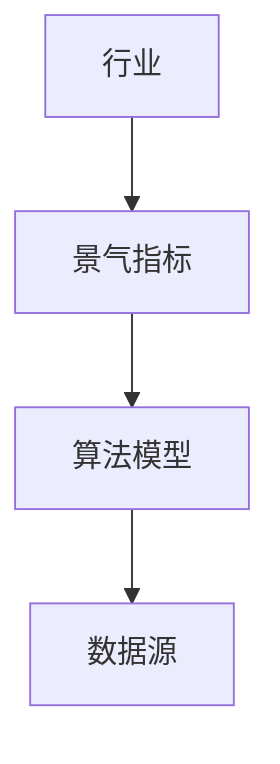
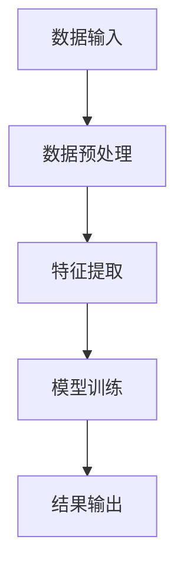
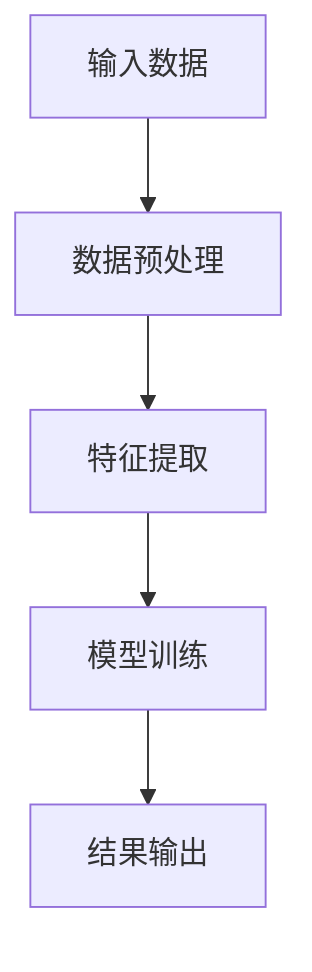
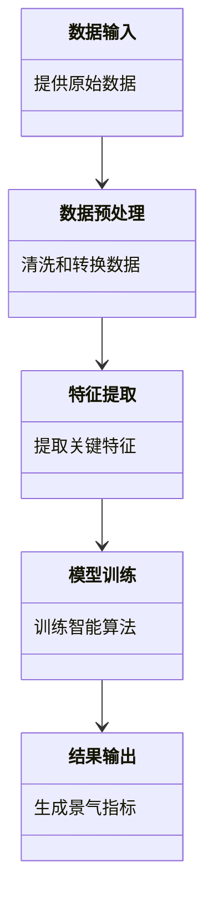
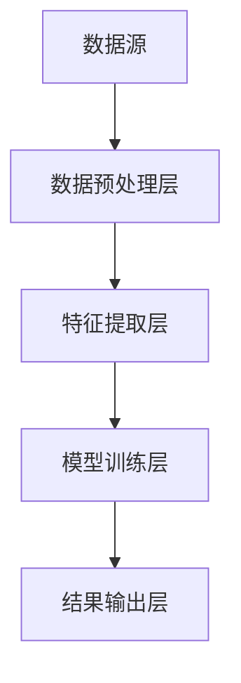

                 


# 智能算法构建动态行业景气指标

> 关键词：智能算法，行业景气指标，动态指标，机器学习，数据建模，系统架构，金融分析

> 摘要：本文详细探讨了如何利用智能算法构建动态行业景气指标，从数据收集到模型部署的全生命周期方法，结合实际案例分析，为您提供从理论到实践的全面指导。

---

## 第一部分: 背景介绍与核心概念

### 第1章: 问题背景

#### 1.1 行业景气指标的定义与作用
行业景气指标是衡量一个行业在特定时间段内发展状况的重要量化工具。它能够反映行业的市场表现、增长潜力以及风险水平，为企业决策提供数据支持。

#### 1.2 动态行业景气指标的重要性
传统的静态指标无法捕捉行业变化的动态特征，而动态指标能够实时更新，反映市场波动，为投资决策提供更精准的依据。

#### 1.3 智能算法的优势
智能算法能够处理海量数据，发现非线性关系，提升预测准确性，同时具备自适应能力，能够实时更新模型。

### 第2章: 核心概念与问题描述

#### 2.1 核心概念
动态行业景气指标的核心在于实时数据处理和智能算法的应用，结合多维度数据进行分析。

#### 2.2 问题描述
传统指标计算存在数据滞后、维度单一、模型固定等问题，难以应对快速变化的市场环境。

### 第3章: 问题解决与边界

#### 3.1 算法优势
智能算法能够处理多维度数据，实时更新模型，提升预测准确性。

#### 3.2 问题边界
数据质量和实时性是关键因素，同时需要考虑模型的可解释性和稳定性。

## 第二部分: 核心概念与联系

### 第4章: 核心算法原理

#### 4.1 监督学习与无监督学习对比
监督学习适用于有标签数据，无监督学习适用于无标签数据，各有优缺点。

#### 4.2 实体关系图


### 第5章: 系统架构设计

#### 5.1 数据流图


## 第三部分: 算法原理与数学模型

### 第6章: 线性回归模型

#### 6.1 数学公式
$$ y = \beta_0 + \beta_1x + \epsilon $$

#### 6.2 流程图


### 第7章: 决策树与随机森林

#### 7.1 决策树
使用CART算法，通过信息增益进行特征选择。

#### 7.2 随机森林
通过集成学习提升模型准确性和鲁棒性。

## 第四部分: 系统分析与架构设计

### 第8章: 系统功能设计

#### 8.1 功能模块


### 第9章: 系统架构图

#### 9.1 分层架构


## 第五部分: 项目实战

### 第10章: 环境安装与代码实现

#### 10.1 环境安装
安装Python、NumPy、Pandas、Scikit-learn等库。

#### 10.2 核心代码实现
```python
import pandas as pd
from sklearn.linear_model import LinearRegression

# 数据预处理
data = pd.read_csv('industry_data.csv')
X = data[['revenue', 'profit']]
y = data['score']

# 模型训练
model = LinearRegression()
model.fit(X, y)

# 预测结果
y_pred = model.predict(X)
```

### 第11章: 案例分析

#### 11.1 案例分析
使用实际数据，展示如何训练模型并生成动态景气指标。

## 第六部分: 最佳实践

### 第12章: 小结与注意事项

#### 12.1 小结
智能算法在动态行业景气指标中的应用能够提升准确性和实时性。

#### 12.2 注意事项
数据质量、模型调优和实时性是关键，需要持续监控和优化。

### 第13章: 拓展阅读

#### 13.1 推荐书籍
推荐《机器学习实战》和《深入浅出机器学习》。

---

作者：AI天才研究院/AI Genius Institute & 禅与计算机程序设计艺术 /Zen And The Art of Computer Programming

