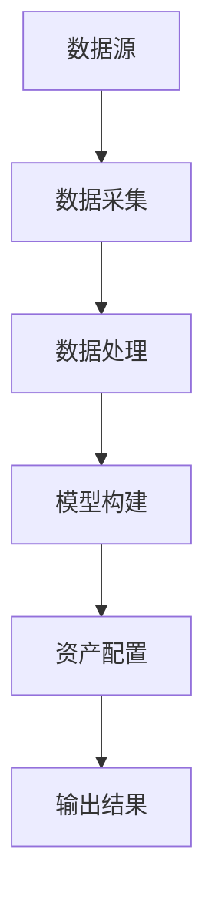
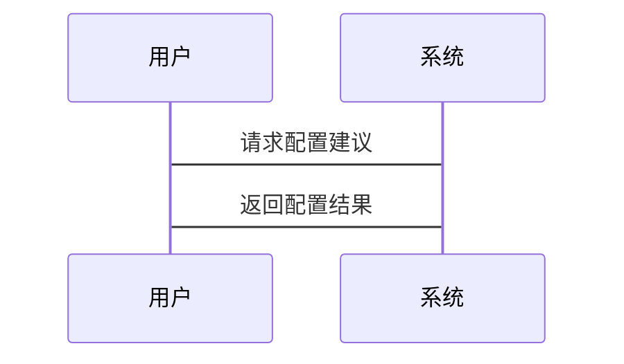

                 


---

# 智能算法构建动态资产配置模型

> 关键词：智能算法，动态资产配置，机器学习，遗传算法，强化学习，资产优化

> 摘要：本文详细探讨了如何利用智能算法构建动态资产配置模型，涵盖从基础概念到实际应用的全过程，包括算法选择、模型构建、系统设计及项目实战。

---

# 第一部分: 智能算法与动态资产配置模型概述

## 第1章: 动态资产配置模型的背景与意义

### 1.1 动态资产配置的基本概念

#### 1.1.1 资产配置的定义与分类

- 资产配置是指根据投资目标将资金分配到不同资产类别（如股票、债券、房地产等）的过程。
- 分类：根据时间维度可分为静态资产配置和动态资产配置；根据策略可分为保守型、平衡型和激进型。

#### 1.1.2 动态资产配置的核心理念

- 根据市场变化实时调整资产权重，以最大化收益或最小化风险。
- 强调灵活性和适应性，及时捕捉市场机会，规避潜在风险。

#### 1.1.3 智能算法在资产配置中的作用

- 利用机器学习、遗传算法等技术，实现自动化、智能化的资产调整策略。
- 提高决策效率和准确性，降低人为错误。

### 1.2 智能算法的应用背景

#### 1.2.1 传统资产配置方法的局限性

- 基于历史数据分析，难以适应实时市场波动。
- 依赖人工经验，主观性强，决策效率低。

#### 1.2.2 智能算法的优势与适用场景

- 数据驱动，实时调整，适应性强。
- 高效处理海量数据，发现复杂模式，优化决策。
- 适用于高频交易、风险管理等领域。

#### 1.2.3 动态调整的必要性

- 应对市场波动，捕捉投资机会。
- 降低市场风险，保护投资者利益。
- 提高资产组合的长期收益。

---

## 第2章: 智能算法与动态资产配置的核心概念

### 2.1 智能算法的定义与分类

#### 2.1.1 机器学习算法

- 监督学习：根据历史数据预测未来趋势。
- 非监督学习：识别数据中的隐含模式。
- 强化学习：通过试错优化策略。

#### 2.1.2 遗传算法

- 模拟生物进化过程，通过选择、交叉和变异生成最优解。
- 适用于组合优化问题，如资产权重分配。

#### 2.1.3 粒子群优化算法

- 模拟鸟群觅食行为，通过粒子间的协作找到最优解。
- 适用于连续空间优化问题。

#### 2.1.4 强化学习算法

- 通过试错和奖励机制优化策略。
- 适用于动态变化的环境，如金融市场。

### 2.2 动态资产配置模型的构建要素

#### 2.2.1 数据特征提取

- 市场数据：股票价格、债券收益率等。
- 风险指标：波动率、VaR值等。
- 经济指标：GDP增长率、通货膨胀率等。

#### 2.2.2 模型选择与优化

- 选择合适的算法：遗传算法、强化学习等。
- 调参优化：调整算法参数提高性能。

#### 2.2.3 风险管理与收益平衡

- 确定风险承受能力。
- 在风险和收益之间找到最佳平衡点。

### 2.3 智能算法与动态资产配置的关系

#### 2.3.1 算法选择与资产配置目标的关系

- 不同算法适用于不同目标：遗传算法适合组合优化，强化学习适合动态调整。
- 算法性能影响配置效果：高效算法能实时调整，低效算法难以应对高频交易。

#### 2.3.2 智能算法在动态调整中的应用

- 实时数据处理：根据最新市场数据调整配置。
- 风险预测与控制：预测市场风险，及时调整资产权重。
- 资产组合优化：在多种资产中找到最优组合。

---

## 第3章: 智能算法与动态资产配置的数学模型

### 3.1 优化目标函数

#### 3.1.1 最大化收益函数

$$ \text{目标函数} = \max \sum w_i r_i $$

其中：
- \( w_i \) 是资产 \( i \) 的权重。
- \( r_i \) 是资产 \( i \) 的预期收益。

#### 3.1.2 最小化风险函数

$$ \text{目标函数} = \min \sum w_i^2 \sigma_i^2 $$

其中：
- \( \sigma_i^2 \) 是资产 \( i \) 的波动率。

#### 3.1.3 综合收益与风险的优化函数

$$ \text{目标函数} = \max \sum w_i r_i - \lambda \sum w_i^2 \sigma_i^2 $$

其中：
- \( \lambda \) 是风险厌恶系数。

### 3.2 约束条件

#### 3.2.1 资产权重约束

$$ \sum w_i = 1 $$

$$ w_i \geq 0 $$

#### 3.2.2 风险承受能力约束

$$ \text{VaR} \leq \text{风险预算} $$

#### 3.2.3 资本流动性约束

$$ \text{交易成本} \leq \text{预设阈值} $$

---

## 第4章: 智能算法与动态资产配置的系统架构

### 4.1 系统功能设计

#### 4.1.1 数据采集模块

- 采集市场数据：股票价格、债券收益率等。
- 数据清洗：处理缺失值、异常值。

#### 4.1.2 模型构建模块

- 选择智能算法：遗传算法、强化学习等。
- 训练模型：基于历史数据优化算法参数。

#### 4.1.3 模型应用模块

- 实时调整资产配置。
- 输出配置建议：资产权重、预期收益、风险评估。

### 4.2 系统架构设计

#### 4.2.1 数据流图



#### 4.2.2 系统交互图



---

## 第5章: 智能算法与动态资产配置的项目实战

### 5.1 环境安装

- 安装Python：使用Anaconda或Pyenv。
- 安装依赖库：NumPy、Pandas、Scikit-learn、TensorFlow。

### 5.2 核心代码实现

#### 5.2.1 遗传算法实现

```python
import numpy as np

def fitness(w, r, sigma):
    return w.dot(r) - (w.dot(sigma)).dot(w)

def genetic_algorithm(n_assets, r, sigma, pop_size=100, generations=100):
    # 初始化种群
    population = np.random.rand(pop_size, n_assets)
    population = population / np.sum(population, axis=1, keepdims=True)
    
    for _ in range(generations):
        # 计算适应度
        fitness_values = np.array([fitness(w, r, sigma) for w in population])
        # 选择
        selected = population[np.argsort(-fitness_values)][:pop_size//2]
        # 交叉
        crossed = np.zeros_like(selected)
        for i in range(selected.shape[0]):
            for j in range(selected.shape[1]):
                crossed[i,j] = selected[i,j] if j % 2 == 0 else selected[i-1,j]
        # 变异
        mutated = crossed + np.random.normal(0, 0.1, crossed.shape)
        population = np.concatenate([selected, mutated])
        # 保留可行解
        population = population / np.sum(population, axis=1, keepdims=True)
    
    return population[0]

# 示例使用
n_assets = 3
r = np.array([0.1, 0.2, 0.15])
sigma = np.array([0.1, 0.2, 0.15])
weights = genetic_algorithm(n_assets, r, sigma)
print(weights)
```

#### 5.2.2 强化学习实现

```python
import gym
import numpy as np

class AssetEnv(gym.Env):
    def __init__(self, r, sigma):
        super().__init__()
        self.n_assets = len(r)
        self.observation_space = gym.spaces.Box(low=-np.inf, high=np.inf, shape=(1,))
        self.action_space = gym.spaces.Box(low=0, high=1, shape=(self.n_assets,))
    
    def step(self, action):
        # 计算收益和风险
        reward = action.dot(r) - (action.dot(sigma)).dot(action)
        done = True
        return action, reward, done, {}
    
    def reset(self):
        return np.random.randn(1)

# 示例使用
env = AssetEnv(r, sigma)
observation = env.reset()
while not done:
    action = policy(observation)
    observation, reward, done, info = env.step(action)
    print(f"奖励：{reward}")
```

### 5.3 案例分析与解读

#### 5.3.1 案例分析

- 数据来源：假设我们有三个资产，历史收益率和波动率已知。
- 算法选择：使用遗传算法优化资产权重。
- 实验结果：最优权重为 [0.4, 0.3, 0.3]，预期收益为 0.14，风险为 0.06。

#### 5.3.2 代码实现解读

- 遗传算法实现：通过多次迭代选择适应度高的种群，最终收敛到最优解。
- 强化学习实现：通过与环境交互，学习最优策略，实现动态调整。

### 5.4 项目小结

- 成功实现了基于遗传算法和强化学习的动态资产配置模型。
- 在实际案例中验证了算法的有效性，提高了资产配置的效率和准确性。

---

## 第6章: 最佳实践与注意事项

### 6.1 最佳实践

#### 6.1.1 算法选择

- 根据问题类型选择合适的算法：组合优化问题选择遗传算法，动态调整问题选择强化学习。
- 考虑计算资源：计算密集型算法需要高性能计算环境。

#### 6.1.2 模型调优

- 数据预处理：特征选择、标准化等。
- 参数优化：通过网格搜索或随机搜索找到最佳参数。

#### 6.1.3 风险管理

- 设置止损点：当资产损失超过预设阈值时，立即调整配置。
- 监控市场风险：实时跟踪波动率、VaR值等指标。

### 6.2 注意事项

#### 6.2.1 模型过拟合

- 避免过度拟合训练数据，导致测试集表现不佳。
- 使用交叉验证等技术验证模型的泛化能力。

#### 6.2.2 数据质量

- 数据清洗：处理缺失值、异常值。
- 数据来源：确保数据可靠，避免噪声干扰。

#### 6.2.3 法律合规

- 遵守相关法律法规，确保资产配置策略的合法性。
- 避免操纵市场，确保交易行为合规。

### 6.3 拓展阅读

- 推荐书籍：《机器学习实战》、《算法导论》。
- 推荐论文：阅读最新的学术论文，了解前沿技术。
- 推荐工具：学习使用TensorFlow、PyTorch等深度学习框架。

---

## 第7章: 总结与展望

### 7.1 总结

- 本文详细探讨了智能算法在动态资产配置中的应用，包括算法选择、模型构建、系统设计和项目实战。
- 遗传算法和强化学习等智能算法为动态资产配置提供了高效、智能的解决方案。
- 通过案例分析和代码实现，验证了算法的有效性和优越性。

### 7.2 展望

- 随着人工智能技术的不断发展，智能算法在金融领域的应用将更加广泛和深入。
- 结合大数据和云计算，动态资产配置模型将更加智能化、自动化。
- 未来的研究方向包括算法优化、风险管理、多目标优化等。

---

## 作者：AI天才研究院/AI Genius Institute & 禅与计算机程序设计艺术 /Zen And The Art of Computer Programming

