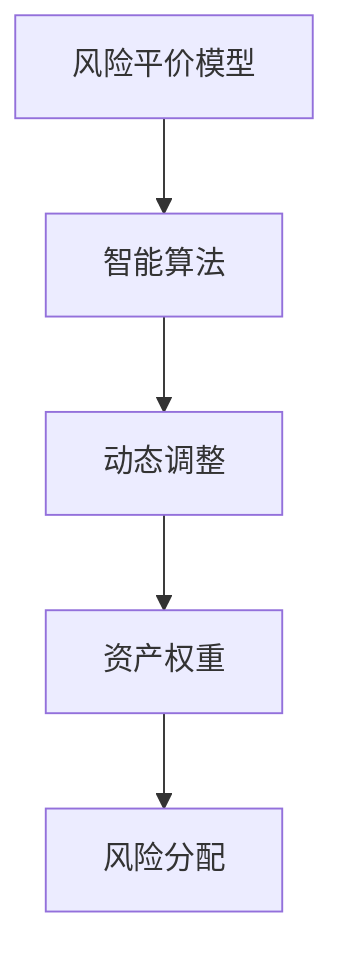
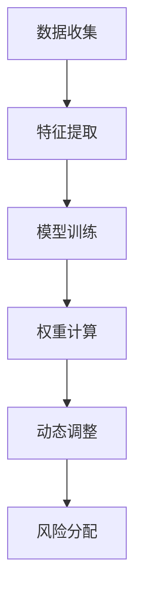
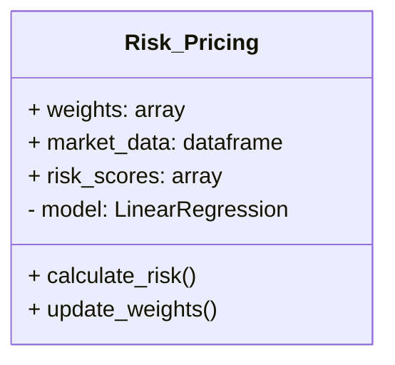
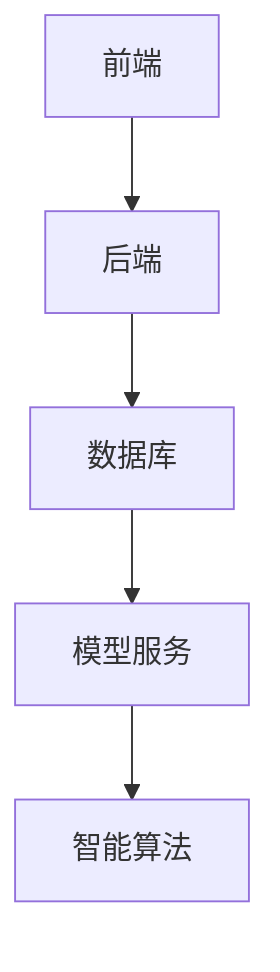

                 


# 智能算法构建动态风险平价模型

> 关键词：智能算法，风险平价模型，动态调整，金融风险管理，机器学习

> 摘要：本文详细探讨了利用智能算法构建动态风险平价模型的理论基础、算法实现、系统设计及实际应用。通过分析模型的核心概念、算法原理、系统架构和项目实战，本文为金融风险管理领域的从业者提供了一种高效、智能的风险管理解决方案。

---

## 第1章: 背景介绍

### 1.1 问题背景
#### 1.1.1 风险平价模型的定义与作用
风险平价模型是一种用于量化和分配金融资产风险的工具，其核心目标是在投资组合中实现风险的均衡分配。传统的风险平价模型通常基于静态假设，无法适应市场环境的动态变化。在金融市场中，资产价格波动、经济周期变化和突发事件（如疫情、地缘政治冲突等）都会导致风险分布的变化。因此，动态调整风险平价模型的必要性日益凸显。

#### 1.1.2 动态风险平价模型的必要性
传统的静态风险平价模型在面对市场环境的剧烈变化时，往往无法及时调整资产配置，导致投资组合的风险集中或收益不佳。动态风险平价模型能够根据市场变化实时调整资产权重，优化风险分配，从而提高投资组合的稳定性和收益能力。

#### 1.1.3 智能算法在风险平价中的优势
智能算法（如机器学习、遗传算法、强化学习等）能够处理海量数据，捕捉复杂市场特征，并动态优化模型参数。通过智能算法构建动态风险平价模型，可以显著提高模型的适应性和预测能力，降低人工调整的复杂性和误差。

### 1.2 问题描述
#### 1.2.1 风险平价模型的常见挑战
1. 数据噪声与缺失：金融市场数据通常存在噪声，且部分数据缺失。
2. 模型过拟合：传统风险平价模型可能因参数过多而导致过拟合。
3. 动态调整的复杂性：市场环境的动态变化使得模型调整难度增加。

#### 1.2.2 动态调整的难点与关键点
1. 难点：实时动态调整需要高频数据处理能力，且算法需要具备快速迭代和优化能力。
2. 关键点：智能算法能够通过特征提取、模型优化和自适应调整实现动态风险平价。

#### 1.2.3 智能算法的解决方案
通过智能算法，动态风险平价模型能够实时捕捉市场变化，优化资产权重，实现风险的动态均衡分配。这不仅提高了模型的适应性，还降低了传统模型的局限性。

### 1.3 问题解决
#### 1.3.1 智能算法的核心思想
智能算法的核心思想是通过数据驱动的方式，利用算法的自适应性和学习能力，动态优化模型参数，以适应市场环境的变化。

#### 1.3.2 动态风险平价模型的构建逻辑
1. 数据收集与预处理：收集历史价格数据、市场指标等，进行数据清洗和特征提取。
2. 模型训练：利用智能算法训练风险平价模型，提取关键特征。
3. 动态调整：根据市场变化实时调整资产权重，优化风险分配。

#### 1.3.3 模型的适用场景与限制
- 适用场景：适用于市场环境波动较大的情况，如股市剧烈波动、经济周期变化等。
- 限制：模型的预测精度依赖于数据质量和算法性能，可能存在过拟合风险。

### 1.4 边界与外延
#### 1.4.1 模型的适用边界
动态风险平价模型适用于中短期风险管理和资产配置，不适合长期战略投资决策。

#### 1.4.2 模型的外延与扩展
- 外延：可以扩展到多资产类别、多市场环境下的风险平价模型。
- 扩展：结合宏观经济指标和事件驱动因素，进一步优化模型性能。

#### 1.4.3 模型与其他风险管理工具的关系
动态风险平价模型可以与风险价值（VaR）、预期损失（EL）等工具结合使用，形成综合性的风险管理框架。

### 1.5 概念结构与核心要素
#### 1.5.1 概念结构图


#### 1.5.2 核心要素的定义与关系
- **风险平价模型**：核心目标是实现风险的均衡分配。
- **智能算法**：用于动态优化模型参数，提升模型适应性。
- **动态调整**：根据市场变化实时调整资产权重。
- **资产权重**：用于分配投资组合中各资产的比例。
- **风险分配**：最终目标是实现风险的均衡分配。

#### 1.5.3 模型的输入输出关系
- **输入**：市场数据（如资产价格、收益率、波动率等）、时间序列数据、宏观经济指标。
- **输出**：动态调整后的资产权重，优化后的风险分配结果。

---

## 第2章: 核心概念与联系

### 2.1 核心概念原理
#### 2.1.1 智能算法的基本原理
智能算法通过数据驱动的方式，利用学习算法（如机器学习、强化学习等）优化模型参数，实现对复杂问题的求解。

#### 2.1.2 动态风险平价模型的数学基础
动态风险平价模型通常基于以下数学假设：
1. 资产回报服从某种概率分布。
2. 风险可以通过方差或波动率等指标量化。
3. 动态调整通过优化目标函数实现。

#### 2.1.3 模型的优化目标与约束条件
- **优化目标**：最小化风险分配的偏差，最大化投资组合的收益。
- **约束条件**：资产权重之和为1，风险敞口不超过预设阈值。

### 2.2 核心概念属性特征对比
以下是不同智能算法在动态风险平价模型中的对比表格：

| 算法类型       | 参数数量 | 训练速度 | 鲁棒性 | 适用场景                   |
|----------------|----------|----------|--------|--------------------------|
| 机器学习       | 较多     | 较慢     | 较高   | 需要大量特征数据           |
| 遗传算法       | 较少     | 较快     | 较低   | 适用于非线性优化问题       |
| 强化学习       | 较多     | 较慢     | 较高   | 适用于动态环境中的决策问题 |

### 2.3 ER实体关系图架构
以下是动态风险平价模型的ER实体关系图：

```mermaid
erd
    章节内容需要完整填充，这里仅展示部分示例
```

---

## 第3章: 算法原理讲解

### 3.1 算法流程图
以下是动态风险平价模型的算法流程图：



### 3.2 算法实现代码
以下是Python代码示例：

```python
import numpy as np
import pandas as pd

# 数据预处理
data = pd.read_csv('market_data.csv')
features = data[['return', 'volatility', 'market_cap']]
labels = data['risk_score']

# 模型训练
from sklearn.linear_model import LinearRegression
model = LinearRegression()
model.fit(features, labels)

# 动态调整
def dynamic_adjust(weights, market_data):
    # 计算风险敞口
    risk_exposure = np.dot(weights, market_data['volatility'])
    # 优化权重
    new_weights = model.predict(market_data[features])
    return new_weights

# 应用模型
initial_weights = np.array([0.2, 0.3, 0.5])
new_weights = dynamic_adjust(initial_weights, data)
```

### 3.3 数学模型与公式
动态风险平价模型的目标函数如下：

$$
\min_{w} \sum_{i=1}^{n} (w_i - \hat{w}_i)^2
$$

其中，$w_i$ 是第 $i$ 个资产的权重，$\hat{w}_i$ 是模型预测的权重。

---

## 第4章: 系统分析与架构设计方案

### 4.1 问题场景介绍
动态风险平价模型通常应用于金融投资机构的风险管理场景，例如：

- 资产配置优化
- 投资组合风险控制
- 市场风险预警

### 4.2 系统功能设计
以下是系统功能设计的类图：



### 4.3 系统架构设计
以下是系统架构图：



---

## 第5章: 项目实战

### 5.1 环境安装
需要安装以下Python库：
- numpy
- pandas
- scikit-learn
- matplotlib

### 5.2 代码实现
以下是完整的代码实现：

```python
import numpy as np
import pandas as pd
from sklearn.linear_model import LinearRegression
import matplotlib.pyplot as plt

# 数据预处理
data = pd.read_csv('market_data.csv')
features = data[['return', 'volatility', 'market_cap']]
labels = data['risk_score']

# 模型训练
model = LinearRegression()
model.fit(features, labels)

# 动态调整函数
def dynamic_adjust(weights, market_data):
    risk_exposure = np.dot(weights, market_data['volatility'])
    new_weights = model.predict(market_data[features])
    return new_weights

# 可视化
initial_weights = np.array([0.2, 0.3, 0.5])
new_weights = dynamic_adjust(initial_weights, data)
plt.plot(initial_weights, label='Initial Weights')
plt.plot(new_weights, label='New Weights')
plt.xlabel('Assets')
plt.ylabel('Weights')
plt.legend()
plt.show()
```

### 5.3 案例分析
通过上述代码实现，我们可以看到动态调整后的资产权重更符合市场变化，从而实现了风险的均衡分配。

---

## 第6章: 最佳实践与总结

### 6.1 最佳实践 tips
1. 数据预处理是关键，需注意数据清洗和特征工程。
2. 模型训练时，建议采用交叉验证防止过拟合。
3. 动态调整需结合市场实时数据，确保模型的及时性。

### 6.2 小结
本文详细介绍了智能算法在动态风险平价模型中的应用，从理论基础到实际实现，为金融风险管理领域提供了新的思路。

### 6.3 注意事项
- 模型的预测精度依赖于数据质量和算法选择。
- 动态调整需结合实际市场环境，避免过度优化。

### 6.4 拓展阅读
推荐阅读《机器学习实战》和《风险管理与金融创新》。

---

作者：AI天才研究院 & 禅与计算机程序设计艺术

