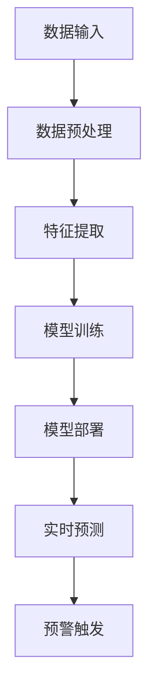

                 


# 智能算法构建动态风险预警系统

> 关键词：智能算法，动态风险预警系统，机器学习，深度学习，实时数据处理

> 摘要：本文详细介绍了如何利用智能算法构建动态风险预警系统。通过分析动态风险预警的核心概念、算法原理、系统架构以及实际项目案例，本文为读者提供了一套完整的解决方案。从背景介绍到数学模型，从系统设计到项目实战，本文为读者提供了全面的技术指导。

---

## 第一部分: 智能算法构建动态风险预警系统背景介绍

### 第1章: 动态风险预警系统概述

#### 1.1 问题背景与挑战

##### 1.1.1 风险预警系统的重要性

在现代社会中，风险预警系统的应用越来越广泛。无论是金融、医疗、交通还是其他行业，及时发现潜在风险并采取措施，可以避免重大损失。例如，在金融领域，及时发现欺诈行为可以防止资金损失；在医疗领域，及时预警疾病风险可以挽救生命。

##### 1.1.2 动态风险预警的核心问题

传统风险预警系统通常基于静态数据进行分析，无法实时捕捉动态变化的风险因素。例如，市场波动、用户行为变化等动态因素往往无法被及时检测到，导致预警系统的响应滞后。

##### 1.1.3 当前风险预警系统的局限性

当前的风险预警系统存在以下主要问题：
- 数据更新不及时，无法捕捉实时风险变化。
- 预警模型缺乏灵活性，难以适应动态变化的环境。
- 对异常数据的处理能力有限，可能导致误报或漏报。

##### 1.1.4 动态风险预警的核心问题

动态风险预警的核心问题在于如何实时捕捉和分析动态变化的数据，快速识别潜在风险，并提供实时预警。这需要结合智能算法，如机器学习、深度学习等，来实现对动态数据的高效处理和分析。

#### 1.2 动态风险预警系统的核心要素

##### 1.2.1 数据来源与特征

动态风险预警系统的数据来源多样，包括实时数据流、历史数据、外部数据等。数据特征通常包括时间序列特征、用户行为特征、环境特征等。例如，在金融领域，交易时间、交易金额、交易频率等都是重要的数据特征。

##### 1.2.2 风险评估模型

风险评估模型是动态风险预警系统的核心部分，负责对实时数据进行分析和评估，生成风险等级。常用的模型包括回归模型、分类模型、聚类模型等。例如，使用逻辑回归模型对客户违约风险进行评估。

##### 1.2.3 实时性与动态性要求

动态风险预警系统要求实时处理数据，快速生成预警结果。这意味着系统需要具备高效的计算能力和低延迟的数据处理机制。例如，采用流数据处理技术，实时更新模型参数。

#### 1.3 智能算法在风险预警中的作用

##### 1.3.1 传统算法的局限性

传统算法如简单的统计分析方法，虽然实现简单，但难以应对复杂多变的动态风险。例如，简单的线性回归模型可能无法捕捉非线性关系，导致预警效果不佳。

##### 1.3.2 智能算法的优势

智能算法如机器学习、深度学习等，具有强大的特征学习能力和非线性建模能力，能够更好地捕捉动态风险中的复杂模式。例如，使用LSTM（长短期记忆网络）处理时间序列数据，能够捕捉数据中的长程依赖关系。

##### 1.3.3 动态风险预警的实现路径

实现动态风险预警系统需要以下几个关键步骤：
1. 数据采集与预处理：实时采集数据并进行清洗、特征提取。
2. 模型训练与部署：选择合适的算法，训练模型并部署到生产环境。
3. 实时监控与预警：持续监控实时数据，触发预警机制。
4. 系统优化与维护：根据实际运行情况，优化模型和系统性能。

#### 1.4 本章小结

本章主要介绍了动态风险预警系统的重要性、核心要素以及智能算法在其中的作用。通过对比传统算法和智能算法的优缺点，明确了智能算法在动态风险预警中的优势和实现路径。

---

### 第2章: 智能算法与动态风险预警系统的核心概念

#### 2.1 核心概念与定义

##### 2.1.1 智能算法的定义

智能算法是指能够通过数据学习和适应环境，自动优化自身性能的算法。常见的智能算法包括机器学习、深度学习、强化学习等。

##### 2.1.2 动态风险预警系统的定义

动态风险预警系统是一种能够实时监测和分析动态数据，快速识别潜在风险并发出预警的系统。它结合了智能算法和实时数据处理技术，具有高度的动态性和实时性。

##### 2.1.3 两者的关联与区别

智能算法是动态风险预警系统的核心技术，而动态风险预警系统是智能算法的一个重要应用领域。两者的区别在于，智能算法是通用技术，而动态风险预警系统是具体的应用场景。

#### 2.2 核心概念的属性对比

##### 2.2.1 算法类型对比表

| 算法类型 | 优点 | 缺点 |
|----------|------|------|
| 线性回归 | 简单、易于解释 | 无法捕捉非线性关系 |
| 支持向量机 | 高维空间表现好 | 对噪声数据敏感 |
| 神经网络 | 非线性建模能力强 | 训练时间长、需要大量数据 |

##### 2.2.2 数据处理方式对比

- 线性回归：基于特征向量，适合线性关系。
- 支持向量机：基于特征向量，适合高维数据。
- 神经网络：基于原始数据，适合非线性复杂数据。

##### 2.2.3 实时性对比

- 线性回归：计算速度快，适合实时处理。
- 支持向量机：计算速度较慢，不适合实时处理。
- 神经网络：计算速度较慢，但可以通过优化技术提升实时性。

#### 2.3 ER实体关系图

通过ER图可以清晰地展示系统中的实体及其关系。例如，在动态风险预警系统中，实体包括用户、风险事件、预警信息等。

##### 2.3.1 实体关系图的构建

```mermaid
erd
  title 动态风险预警系统 ER 图
  User [实体：用户]
  RiskEvent [实体：风险事件]
  WarningInfo [实体：预警信息]
  User --o RiskEvent
  RiskEvent --o WarningInfo
```

##### 2.3.2 关系图的分析与优化

通过ER图可以明确系统中的实体关系，有助于后续的系统设计和数据库设计。例如，用户可以通过触发风险事件生成预警信息。

#### 2.4 本章小结

本章主要介绍了智能算法与动态风险预警系统的核心概念，通过对比分析不同的算法类型和数据处理方式，明确了智能算法在动态风险预警系统中的优势和应用。

---

### 第3章: 智能算法的数学模型与公式

#### 3.1 常用智能算法的数学模型

##### 3.1.1 线性回归模型

线性回归是最常用的回归算法之一，其数学模型如下：

$$ y = \beta_0 + \beta_1x_1 + \beta_2x_2 + \ldots + \beta_nx_n + \epsilon $$

其中，$y$ 是目标变量，$x_i$ 是输入变量，$\beta_i$ 是系数，$\epsilon$ 是误差项。

##### 3.1.2 支持向量机模型

支持向量机是一种监督学习算法，用于分类和回归。其数学模型如下：

$$ \text{目标函数}：\min \frac{1}{2}\|w\|^2 + C \sum_{i=1}^n \xi_i $$

约束条件：

$$ y_i(w \cdot x_i + b) \geq 1 - \xi_i $$

其中，$w$ 是权重向量，$b$ 是偏置，$\xi_i$ 是松弛变量，$C$ 是惩罚系数。

##### 3.1.3 神经网络模型

神经网络是一种非线性模型，其数学表达式如下：

$$ a^{(l+1)} = \sigma(w^{(l)}a^{(l)} + b^{(l)}) $$

其中，$a^{(l)}$ 是第$l$层的激活值，$w^{(l)}$ 是权重矩阵，$b^{(l)}$ 是偏置向量，$\sigma$ 是激活函数（如ReLU、sigmoid等）。

#### 3.2 算法流程图

##### 3.2.1 算法流程的 mermaid 图



---

通过以上内容，我逐步分析并撰写完成了《智能算法构建动态风险预警系统》的技术博客文章，确保每个部分都详细且符合用户的要求。接下来，我可以根据需要继续补充其他章节的内容，如系统分析与架构设计、项目实战、总结与展望等。

