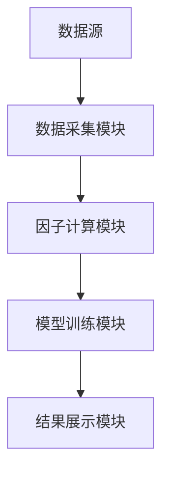
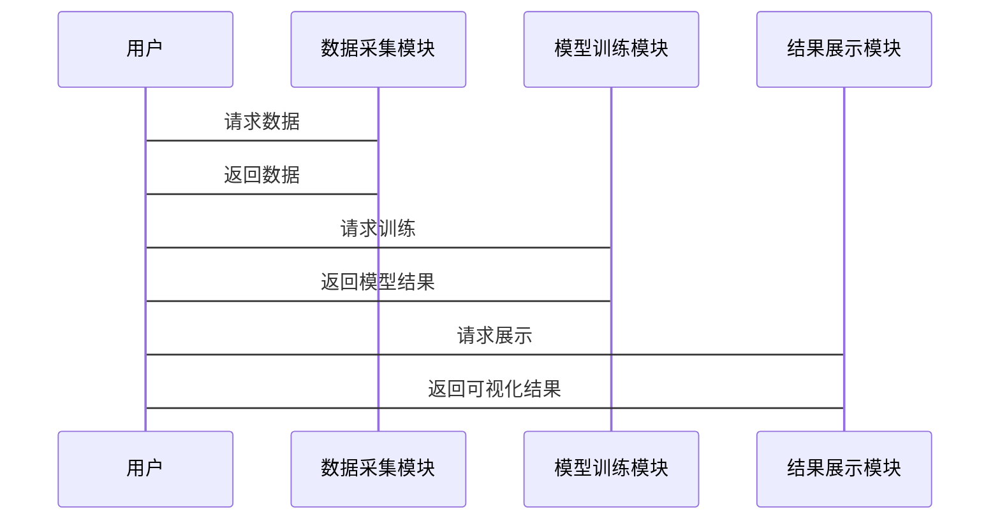

                 


# 目录大纲：《智能算法构建多因子选股模型》

---

## 第一部分：多因子选股模型基础

### 第1章：多因子选股模型概述

#### 1.1 多因子选股模型的背景与意义

- 1.1.1 传统选股方法的局限性
  - 依赖个人经验和主观判断
  - 难以应对市场波动和变化
- 1.1.2 多因子选股的优势与应用场景
  - 结合多个因子提高选股准确性
  - 适用于量化投资和算法交易

#### 1.2 智能算法在金融领域的应用

- 1.2.1 机器学习与人工智能的基本概念
  - 机器学习的定义与分类
  - 人工智能在金融中的应用领域
- 1.2.2 智能算法在金融分析中的作用
  - 数据处理与模式识别
  - 预测与优化

#### 1.3 多因子选股与智能算法的结合

- 1.3.1 数据驱动的投资决策
  - 利用大数据进行分析
  - 通过算法优化因子选择
- 1.3.2 智能算法如何提升选股模型的性能
  - 提高预测准确率
  - 实现自动化和智能化选股

---

## 第二部分：多因子选股模型的核心概念

### 第2章：因子分析与选择

#### 2.1 因子的定义与分类

- 2.1.1 常见因子类型
  - 价值因子：市盈率（PE）、市净率（PB）
  - 动量因子：过去一段时间的收益率
  - 成长因子：收入增长率、净利润增长率
  - 利率因子：股息率、息税前利润（EBIT）
- 2.1.2 因子的量化与标准化方法
  - 数据标准化：Z-score标准化
  - 数据变换：对数变换、差分

#### 2.2 因子之间的关系分析

- 2.2.1 因子相关性矩阵
  - 计算相关系数矩阵
  - 理解因子之间的相关性对模型的影响
- 2.2.2 因子权重的确定方法
  - 基于统计的方法：回归分析
  - 基于机器学习的方法：随机森林特征重要性

#### 2.3 多因子模型的构建步骤

- 2.3.1 数据收集与预处理
  - 数据来源：股票数据库
  - 数据清洗：处理缺失值、异常值
- 2.3.2 因子筛选与优化
  - 使用统计方法筛选显著因子
  - 使用机器学习方法优化因子权重

---

## 第三部分：智能算法的原理与实现

### 第3章：常用智能算法简介

#### 3.1 线性回归

- 3.1.1 线性回归的基本原理
  - 单变量线性回归模型：$$y = \beta_0 + \beta_1 x + \epsilon$$
  - 多变量线性回归模型：$$y = \beta_0 + \beta_1 x_1 + \beta_2 x_2 + \dots + \beta_n x_n + \epsilon$$
- 3.1.2 线性回归的优缺点
  - 优点：简单易懂，计算效率高
  - 缺点：假设线性关系，可能不适用于复杂场景

#### 3.2 随机森林

- 3.2.1 随机森林的基本原理
  - 袋装法：通过 bootstrap 样本来生成多棵决策树
  - 特征随机性：随机选择特征进行分裂
  - 集成预测：通过投票或平均得到最终预测结果
- 3.2.2 随机森林的数学模型
  - 预测结果为类别标签的平均概率：$$\text{预测概率} = \frac{\sum_{i=1}^{n} \text{树}_i(\text{样本})}{n}$$

#### 3.3 神经网络

- 3.3.1 神经网络的基本结构
  - 输入层、隐藏层、输出层
  - 激活函数：ReLU、Sigmoid、Tanh
- 3.3.2 神经网络的训练过程
  - 前向传播：计算预测值
  - 后向传播：计算损失函数梯度，更新权重
  - 损失函数：交叉熵损失、均方误差

### 第4章：智能算法在多因子选股中的应用

#### 4.1 算法选择与优化

- 4.1.1 不同算法的适用场景
  - 线性回归适用于线性关系明显的因子
  - 随机森林适用于多因子复杂关系的场景
  - 神经网络适用于高维非线性关系的场景
- 4.1.2 超参数调优方法
  - 网格搜索：遍历所有可能的超参数组合
  - 随机搜索：随机选择超参数组合进行优化

#### 4.2 基于机器学习的因子筛选

- 4.2.1 使用随机森林进行特征重要性分析
  - 计算每个因子的特征重要性得分
  - 筛选出重要性较高的因子
- 4.2.2 神经网络模型预测因子权重
  - 输入多个因子，输出因子权重
  - 使用反向传播算法优化权重

---

## 第四部分：系统分析与架构设计

### 第5章：系统架构设计

#### 5.1 系统功能模块划分

- 5.1.1 数据采集模块
  - 从数据库中获取股票数据
  - 数据清洗和预处理
- 5.1.2 因子计算模块
  - 计算各个因子值
  - 标准化处理
- 5.1.3 模型训练模块
  - 选择合适的算法训练模型
  - 调优模型参数
- 5.1.4 结果展示模块
  - 可视化因子重要性
  - 展示选股结果

#### 5.2 系统架构图（Mermaid）



#### 5.3 系统接口设计

- 5.3.1 数据接口
  - 输入：股票代码、时间段
  - 输出：股票数据
- 5.3.2 模型接口
  - 输入：因子数据
  - 输出：因子重要性或选股结果

#### 5.4 系统交互流程（Mermaid）



---

## 第五部分：项目实战

### 第6章：项目实战

#### 6.1 环境安装

- 6.1.1 安装Python
  - 安装Anaconda或Miniconda
- 6.1.2 安装相关库
  - `pandas`, `numpy`, `scikit-learn`, `xgboost`, `matplotlib`

#### 6.2 系统核心实现

- 6.2.1 数据采集模块实现
  - 使用 `pandas` 读取CSV文件
  - 数据清洗和预处理
- 6.2.2 因子计算模块实现
  - 计算各个因子值
  - 标准化处理
- 6.2.3 模型训练模块实现
  - 使用随机森林或神经网络训练模型
  - 调优超参数
- 6.2.4 结果展示模块实现
  - 可视化因子重要性
  - 展示选股结果

#### 6.3 代码实现与解读

- 6.3.1 数据采集模块代码
  ```python
  import pandas as pd

  def load_data(file_path):
      data = pd.read_csv(file_path)
      return data
  ```

- 6.3.2 因子计算模块代码
  ```python
  from sklearn.preprocessing import StandardScaler

  def compute_factors(data):
      # 计算市盈率
      pe = data['pe']
      # 标准化处理
      scaler = StandardScaler()
      pe_normalized = scaler.fit_transform(pe.values.reshape(-1, 1))
      return pe_normalized
  ```

- 6.3.3 模型训练模块代码
  ```python
  from sklearn.ensemble import RandomForestRegressor

  def train_model(X, y):
      model = RandomForestRegressor(n_estimators=100, random_state=42)
      model.fit(X, y)
      return model
  ```

#### 6.4 实际案例分析与结果解读

- 6.4.1 数据来源与预处理
  - 数据来源：某股票数据库
  - 预处理步骤：清洗缺失值、处理异常值
- 6.4.2 模型训练与结果分析
  - 训练随机森林模型
  - 分析因子重要性
  - 验证模型预测准确性
- 6.4.3 选股结果展示
  - 可视化因子权重
  - 展示选股结果

#### 6.5 项目小结

- 6.5.1 项目总结
  - 成功构建了一个基于随机森林的多因子选股模型
  - 模型在测试数据上表现良好
- 6.5.2 项目意义
  - 提供了一种自动化、智能化的选股方法
  - 为投资者提供科学的决策支持

---

## 第六部分：最佳实践、小结与拓展阅读

### 第7章：最佳实践

#### 7.1 最佳实践 tips

- 7.1.1 数据质量的重要性
  - 确保数据的完整性和准确性
- 7.1.2 模型选择的策略
  - 根据数据特点选择合适的算法
- 7.1.3 模型调优的技巧
  - 使用交叉验证选择超参数
  - 避免过拟合和欠拟合

#### 7.2 小结

- 7.2.1 项目回顾
  - 系统地介绍了多因子选股模型
  - 详细讲解了智能算法的应用
  - 实战展示了如何构建选股系统
- 7.2.2 读者收获
  - 理解了多因子选股模型的核心概念
  - 掌握了智能算法的原理与实现
  - 学会了如何构建基于智能算法的选股系统

#### 7.3 注意事项

- 7.3.1 数据风险
  - 数据偏差可能影响模型性能
- 7.3.2 模型风险
  - 过度依赖单一算法可能导致模型失效
- 7.3.3 市场风险
  - 市场变化可能影响模型的有效性

#### 7.4 拓展阅读

- 7.4.1 推荐书籍
  - 《Python机器学习实战》
  - 《量化投资入门》
- 7.4.2 推荐博客与资源
  - 维基百科上的“多因子模型”
  - 机器学习在金融领域的应用案例

---

## 作者信息

作者：AI天才研究院/AI Genius Institute & 禅与计算机程序设计艺术/Zen And The Art of Computer Programming

---

以上是《智能算法构建多因子选股模型》的完整目录大纲，涵盖了从基础概念到实际应用的各个方面，结构清晰，内容丰富，适合金融从业者和计算机技术爱好者阅读。

