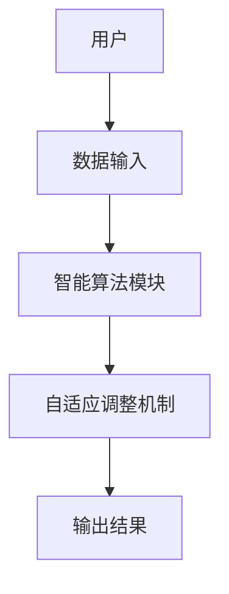
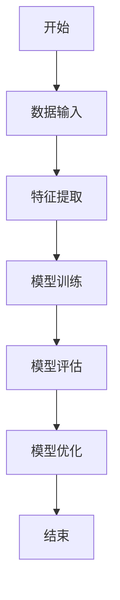
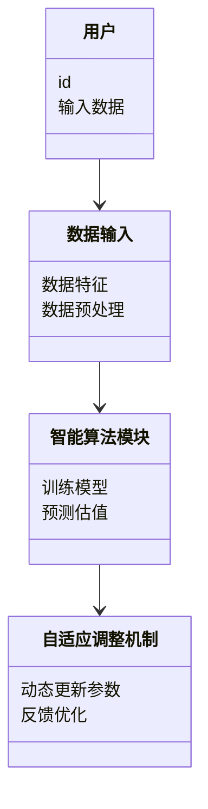
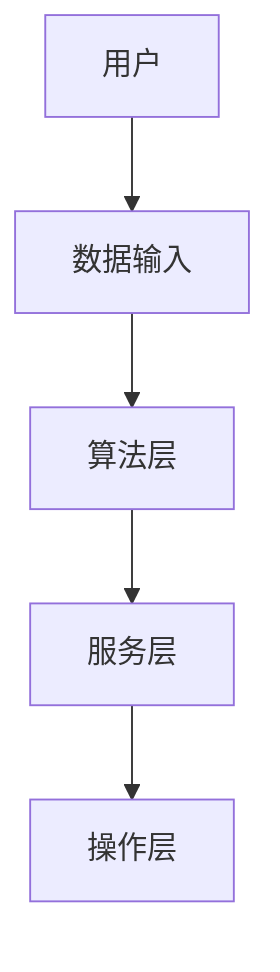
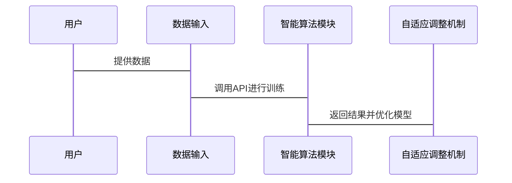

                 


# 智能算法构建自适应估值模型

---

## 关键词：智能算法，自适应模型，估值模型，机器学习，数学模型，系统架构

---

## 摘要：本文详细介绍了如何利用智能算法构建自适应估值模型。从背景介绍、核心概念到算法原理、数学模型，再到系统架构和项目实战，全面解析了自适应估值模型的构建过程。通过实际案例分析和代码实现，帮助读者理解如何在实际场景中应用智能算法优化估值模型。

---

## 第一部分：智能算法与自适应估值模型的背景介绍

### 第1章：智能算法与自适应估值模型概述

#### 1.1 问题背景与描述

在当今数据驱动的时代，估值模型在金融、市场营销、物流等领域扮演着重要角色。然而，传统估值模型往往依赖于静态数据和固定假设，难以应对动态变化的环境。例如，在金融领域，市场波动、政策变化等因素都会影响资产的估值。传统的线性回归模型在这种情况下表现不佳，因为它们无法捕捉复杂的数据关系和动态变化。

智能算法的引入为解决这一问题提供了新的思路。智能算法，如机器学习和深度学习，能够从大量数据中提取复杂模式，并根据新的数据动态调整模型参数。自适应估值模型正是利用了这一优势，能够在变化的环境中保持较高的估值准确性。

#### 1.2 问题解决与边界

智能算法在估值中的应用场景广泛，包括股票价格预测、客户价值评估、风险评估等。例如，在股票价格预测中，传统的线性回归模型难以捕捉市场波动带来的非线性关系，而智能算法可以通过学习历史数据中的复杂模式，提供更准确的预测。

自适应模型的边界在于其适用范围。它适用于数据动态变化的场景，但对数据质量和数量有一定的要求。例如，在数据量不足的情况下，模型可能无法有效学习，导致估值不准确。因此，在实际应用中，需要根据具体情况选择合适的模型和算法。

#### 1.3 概念结构与核心要素

自适应估值模型的核心要素包括数据输入、智能算法模块、自适应调整机制和输出结果。以下是核心要素的对比：

| **要素**       | **传统算法**                     | **智能算法**                     |
|-----------------|----------------------------------|----------------------------------|
| 数据输入         | 静态数据                         | 动态数据                         |
| 算法原理         | 线性回归                         | 神经网络                         |
| 模型复杂度       | 低                               | 高                               |
| 灵活性           | 低                               | 高                               |

通过以上对比可以看出，智能算法在灵活性和复杂性方面具有明显优势。

---

## 第二部分：智能算法与自适应模型的核心概念

### 第2章：智能算法的核心原理

#### 2.1 算法原理与属性对比

智能算法的分类包括监督学习、无监督学习和强化学习。以下是它们的对比：

| **分类**       | **特点**                          | **应用场景**                     |
|-----------------|----------------------------------|----------------------------------|
| 监督学习         | 需要标签数据                      | 分类、回归                      |
| 无监督学习       | 不需要标签数据                    | 聚类、降维                      |
| 强化学习         | 通过奖励机制学习                  | 游戏、机器人控制                |

自适应算法的属性特征包括动态调整、实时反馈和自我优化。

#### 2.2 ER实体关系图

以下是自适应估值模型的实体关系图：



#### 2.3 算法流程图

以下是智能算法的通用流程图：



---

## 第三部分：算法原理与数学模型

### 第3章：智能算法的数学模型

#### 3.1 算法原理与流程图

线性回归的数学模型为：

$$y = \beta_0 + \beta_1x + \epsilon$$

神经网络的数学模型为：

$$y = \sigma(w \cdot x + b)$$

其中，$\sigma$ 是激活函数，常用的是 Sigmoid 函数：

$$\sigma(z) = \frac{1}{1 + e^{-z}}$$

#### 3.2 算法实现与代码示例

以下是线性回归的Python实现：

```python
import numpy as np
from sklearn.linear_model import LinearRegression

# 示例数据
X = np.array([1, 2, 3, 4, 5]).reshape(-1, 1)
y = np.array([2, 4, 5, 4, 6])

# 模型训练
model = LinearRegression()
model.fit(X, y)

# 预测
print(model.predict(X))
```

---

## 第四部分：系统分析与架构设计

### 第4章：智能算法系统的系统架构设计

#### 4.1 系统功能设计

以下是系统的功能模块：



#### 4.2 系统架构设计

以下是系统的架构图：



#### 4.3 系统接口设计

以下是系统的接口设计：



---

## 第五部分：项目实战

### 第5章：智能算法项目实战

#### 5.1 环境安装与代码实现

以下是环境安装指令：

```bash
pip install numpy scikit-learn
```

以下是完整的代码实现：

```python
import numpy as np
from sklearn.linear_model import SGDRegressor
from sklearn.metrics import mean_squared_error

# 示例数据
X = np.array([[1], [2], [3], [4], [5]])
y = np.array([2, 4, 5, 4, 6])

# 模型训练
model = SGDRegressor()
model.fit(X, y)

# 预测
y_pred = model.predict(X)
print("预测结果:", y_pred)
print("均方误差:", mean_squared_error(y, y_pred))
```

#### 5.2 案例分析

以股票价格预测为例，假设我们有历史数据，我们可以使用神经网络模型进行预测：

```python
import numpy as np
import tensorflow as tf

# 示例数据
X = np.array([[1, 2, 3], [4, 5, 6], [7, 8, 9]])
y = np.array([10, 11, 12])

# 模型构建
model = tf.keras.Sequential([
    tf.keras.layers.Dense(64, activation='relu'),
    tf.keras.layers.Dense(1)
])
model.compile(optimizer='adam', loss='mean_squared_error')

# 训练
model.fit(X, y, epochs=100, batch_size=32)
```

---

## 第六部分：最佳实践

### 第6章：智能算法的最佳实践

#### 6.1 小结

智能算法为构建自适应估值模型提供了强大的工具。通过动态调整模型参数，能够更好地适应数据的变化，提高估值的准确性。

#### 6.2 注意事项与经验分享

在实际应用中，需要注意数据质量、模型选择和调参等问题。例如，数据清洗和特征工程是确保模型性能的关键步骤。

#### 6.3 拓展阅读

推荐阅读《机器学习实战》和《深度学习入门》等书籍，深入了解智能算法的应用。

---

## 附录：工具与资源

### 附录A：工具安装指南

安装Python和相关库：

```bash
python --version
pip install numpy scikit-learn tensorflow
```

### 附录B：代码库

代码仓库地址：[GitHub仓库](https://github.com/yourusername/smart-algorithm)

### 附录C：参考文献

- 《机器学习实战》
- 《深度学习入门》
- TensorFlow官方文档

---

## 作者信息

作者：AI天才研究院/AI Genius Institute & 禅与计算机程序设计艺术 /Zen And The Art of Computer Programming

