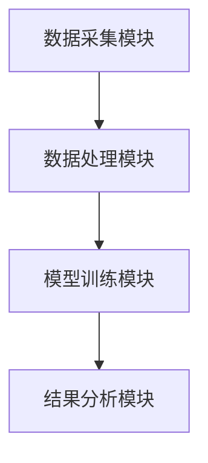
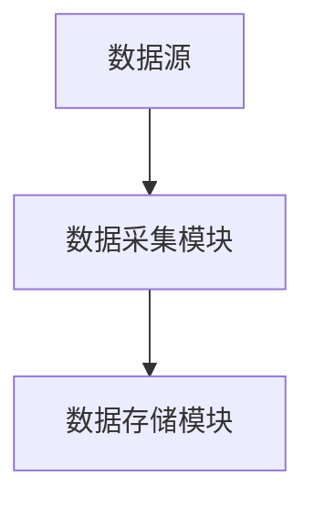

                 


# 智能算法识别市场异常与套利机会

> 关键词：智能算法，市场异常，套利机会，机器学习，深度学习，金融数据分析

> 摘要：本文将深入探讨智能算法在识别金融市场异常和套利机会中的应用。通过结合机器学习、深度学习和时间序列分析等技术，分析金融市场数据，识别潜在的套利机会和市场异常现象，为投资者提供科学决策支持。

---

## 第1章: 市场异常与套利机会概述

### 1.1 什么是市场异常
#### 1.1.1 市场异常的定义
市场异常是指金融市场中的价格、交易量或其他市场指标偏离正常波动范围的现象。这些异常可能由突发事件、市场操纵或其他不可预测的因素引起。

#### 1.1.2 市场异常的类型
- **短期波动**：如价格突然跳水或飙升。
- **长期趋势逆转**：市场长期趋势的突然改变。
- **市场操纵**：人为操控价格或交易量。

#### 1.1.3 市场异常的影响
- 影响投资者决策。
- 影响市场稳定性。
- 提供套利机会。

### 1.2 什么是套利机会
#### 1.2.1 套利的定义
套利是指利用不同市场或资产之间的价格差异，通过同时买低价格市场和卖高价格市场来获利的行为。

#### 1.2.2 套利的基本原理
- 利用价格差异。
- 利用市场效率不足。
- 利用市场不完全竞争。

#### 1.2.3 套利的类型
- **无风险套利**：利用价格差异，无市场风险。
- **有风险套利**：存在市场波动风险。
- **跨市场套利**：利用不同市场的价格差异。

### 1.3 智能算法在市场异常与套利中的作用
#### 1.3.1 数据分析能力
智能算法能够处理海量数据，发现隐藏的模式和趋势。

#### 1.3.2 高速计算能力
智能算法可以在极短时间内完成复杂计算，抓住瞬息万变的市场机会。

#### 1.3.3 自适应学习能力
智能算法能够根据市场变化不断调整模型，提高识别准确率。

---

## 第2章: 智能算法的核心原理

### 2.1 机器学习算法
#### 2.1.1 监督学习
- **回归分析**：用于预测连续型变量，如股票价格。
- **分类分析**：用于分类市场状态，如正常或异常。

#### 2.1.2 无监督学习
- **聚类分析**：发现市场中的异常群组。
- **关联规则学习**：发现市场中的关联模式。

#### 2.1.3 强化学习
- **策略学习**：通过试错方式优化投资策略。

### 2.2 深度学习算法
#### 2.2.1 神经网络
- **卷积神经网络（CNN）**：用于图像识别和特征提取。
- **循环神经网络（RNN）**：用于时间序列分析。

#### 2.2.2 图神经网络（GNN）
- **图结构数据**：用于分析市场网络结构，发现异常交易。

### 2.3 时间序列分析
#### 2.3.1 时间序列的基本特征
- 趋势性。
- 周期性。
- 随机性。

#### 2.3.2 常见的时间序列模型
- **ARIMA模型**：自回归积分滑动模型。
- **LSTM网络**：长短期记忆网络。

---

## 第3章: 市场异常识别的数学模型

### 3.1 回归分析
#### 3.1.1 线性回归
公式：
$$ y = \beta_0 + \beta_1x + \epsilon $$
其中，$y$ 是目标变量，$x$ 是自变量，$\beta_0$ 和 $\beta_1$ 是回归系数，$\epsilon$ 是误差项。

#### 3.1.2 逻辑回归
公式：
$$ P(Y=1|X) = \frac{e^{\beta_0 + \beta_1x}}{1 + e^{\beta_0 + \beta_1x}} $$
用于分类问题。

### 3.2 时间序列分析模型
#### 3.2.1 ARIMA模型
公式：
$$ (1 - B)^d (1 - \phi_1B - \dots - \phi_pB^p)(1 - \theta_1B - \dots - \theta_qB^q)X_t = \alpha_t $$

#### 3.2.2 LSTM网络
LSTM单元结构包括输入门、遗忘门和输出门，公式如下：
$$
i_t = \sigma(W_i \cdot [h_{t-1}, x_t])
$$
$$
f_t = \sigma(W_f \cdot [h_{t-1}, x_t])
$$
$$
o_t = \sigma(W_o \cdot [h_{t-1}, x_t])
$$
$$
h_t = o_t \cdot \cosh(W_c \cdot [h_{t-1}, x_t])
$$

---

## 第4章: 套利机会识别的系统架构

### 4.1 系统架构设计
#### 4.1.1 功能模块划分
- 数据采集模块。
- 数据处理模块。
- 模型训练模块。
- 结果分析模块。

#### 4.1.2 系统架构图


### 4.2 数据流与交互流程
#### 4.2.1 数据采集流程


#### 4.2.2 系统接口设计
- 数据接口：提供API用于数据输入和输出。
- 模型接口：提供API用于模型训练和预测。

---

## 第5章: 项目实战与代码实现

### 5.1 环境搭建
#### 5.1.1 Python环境安装
使用Anaconda安装Python 3.8以上版本。

#### 5.1.2 必要库的安装
安装以下库：
- NumPy
- Pandas
- Scikit-learn
- Keras
- TensorFlow

### 5.2 核心算法实现
#### 5.2.1 时间序列异常检测代码
```python
import numpy as np
from sklearn.ensemble import IsolationForest

# 生成模拟数据
data = np.random.normal(loc=0, scale=1, size=1000)
data[500:550] = np.random.normal(loc=10, scale=1, size=50)

# 使用Isolation Forest检测异常
model = IsolationForest(n_estimators=100, contamination=0.05)
model.fit(data.reshape(-1, 1))
outliers = model.predict(data.reshape(-1, 1)) == -1
```

#### 5.2.2 套利机会识别代码
```python
from tensorflow.keras.models import Sequential
from tensorflow.keras.layers import LSTM, Dense

# 定义LSTM模型
model = Sequential()
model.add(LSTM(64, input_shape=(timesteps, features)))
model.add(Dense(1, activation='sigmoid'))
model.compile(loss='binary_crossentropy', optimizer='adam', metrics=['accuracy'])
```

### 5.3 实际案例分析
#### 5.3.1 案例背景介绍
以某金融市场的股票价格数据为例，分析是否存在套利机会。

#### 5.3.2 数据分析与处理
使用时间序列分析模型识别价格异常波动。

#### 5.3.3 算法结果解读
根据模型预测结果，识别套利机会并制定交易策略。

---

## 第6章: 最佳实践与注意事项

### 6.1 最佳实践
#### 6.1.1 数据质量的重要性
确保数据的完整性和准确性。

#### 6.1.2 算法选择的策略
根据具体问题选择合适的算法。

#### 6.1.3 模型优化
通过交叉验证和超参数调优提高模型性能。

### 6.2 注意事项
- 避免过度拟合。
- 注意市场风险。
- 定期更新模型。

### 6.3 总结
智能算法为识别市场异常和套利机会提供了强大的工具，但需要结合市场实际情况合理应用。

---

作者：AI天才研究院/AI Genius Institute & 禅与计算机程序设计艺术 /Zen And The Art of Computer Programming

