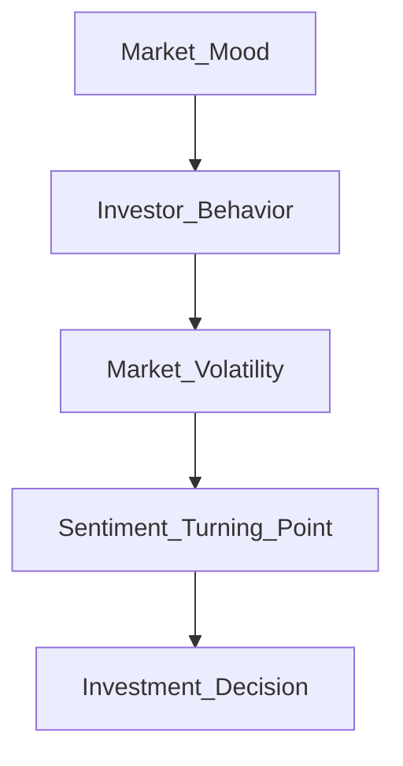
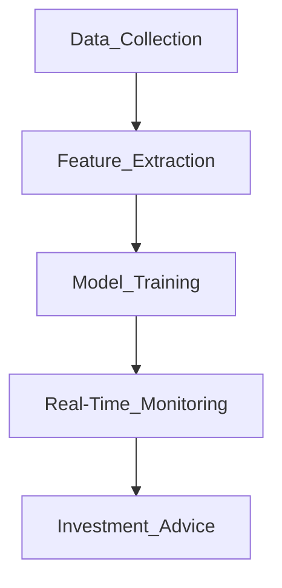
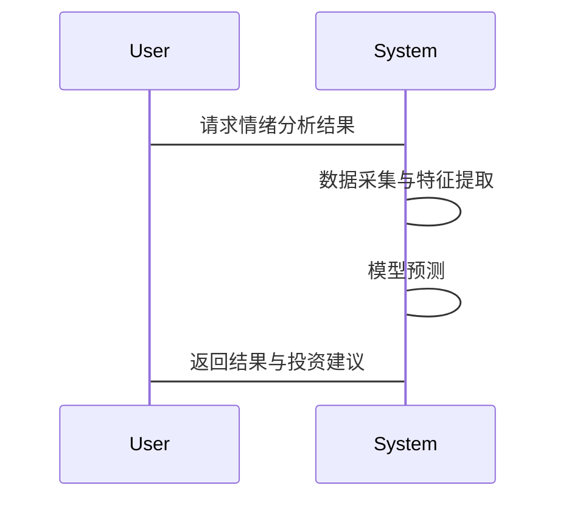

                 


# 智能算法识别市场情绪拐点

## 关键词：智能算法、市场情绪、情绪拐点、机器学习、自然语言处理、时间序列分析

## 摘要：  
本文详细探讨了如何利用智能算法识别市场情绪拐点。通过结合机器学习、自然语言处理和时间序列分析，本文提出了一个系统化的解决方案，帮助投资者在金融市场中更准确地捕捉市场情绪变化。文章从市场情绪的基本概念出发，逐步分析了情绪拐点识别的核心算法、系统架构和实际应用场景，最后通过具体案例展示了如何将这些技术落地实施。

---

## 第一部分：市场情绪与智能算法概述

### 第1章：市场情绪的基本概念

#### 1.1 市场情绪的定义与特征  
- **市场情绪**是指市场参与者（投资者、交易员等）的总体情绪状态，反映了他们对市场未来走势的乐观或悲观态度。  
- **特征**：  
  1. **波动性**：市场情绪会随着市场环境的变化而波动。  
  2. **滞后性**：情绪变化通常滞后于市场实际走势。  
  3. **周期性**：市场情绪具有一定的周期性，与经济周期密切相关。  

#### 1.2 问题背景与需求分析  
- **传统方法的局限性**：  
  - 技术分析依赖于固定的技术指标，难以捕捉情绪变化的复杂性。  
  - 基本分析依赖于基本面数据，忽略了市场参与者的情绪影响。  
- **智能算法的优势**：  
  - 可以实时捕捉市场情绪的变化。  
  - 能够从非结构化数据（如新闻、社交媒体）中提取情绪特征。  
  - 通过机器学习模型，可以预测情绪拐点并提供投资建议。  

#### 1.3 智能算法的核心技术  
- **机器学习**：用于从历史数据中学习情绪变化的模式。  
- **自然语言处理（NLP）**：用于分析新闻、社交媒体等文本数据，提取情绪特征。  
- **时间序列分析**：用于分析市场数据的时间依赖性，预测未来的情绪变化。  

---

## 第二部分：市场情绪分析的核心概念与联系

### 第2章：情绪指标与数据特征

#### 2.1 情绪指标的分类与对比  
- **常见情绪指标**：  
  1. **VIX指数**：衡量市场波动性的指标，被称为“恐慌指数”。  
  2. **投资者情绪指数（IPI）**：基于投资者行为调查的情绪指标。  
  3. **社交媒体情绪指数**：基于社交媒体数据计算的情绪指标。  
- **对比表格**：  

| 指标名称 | 数据来源 | 计算方法 | 优缺点 |  
|----------|----------|----------|--------|  
| VIX指数 | 期权市场 | 基于波动率计算 | 数据可靠，但滞后性较强 |  
| IPI | 投资者调查 | 基于问卷调查 | 数据全面，但更新频率低 |  
| 社交媒体情绪指数 | 社交媒体 | 基于文本分析 | 数据实时性强，但准确性较低 |  

#### 2.2 数据特征的提取与分析  
- **文本数据的特征提取**：  
  - 分词：将文本数据分割成词语或短语。  
  - 情感分类：将文本分为积极、消极或中性情绪。  
  - 情绪强度：量化情绪的强度（如0.1到0.9）。  
- **时间序列数据的特征提取**：  
  - 均值、标准差、自相关系数等。  
- **多模态数据的特征融合**：  
  - 将文本数据和市场数据（如价格、成交量）进行融合，提取综合特征。  

#### 2.3 情绪分析的实体关系图  


---

## 第三部分：智能算法识别情绪拐点的算法原理

### 第3章：情绪分析算法的设计与实现

#### 3.1 数据预处理与特征工程  
- **文本数据的清洗与分词**：  
  - 清洗：去除无关字符、停用词等。  
  - 分词：使用分词工具（如jieba）将文本分割成词语。  
- **时间序列数据的标准化**：  
  - 对数据进行归一化处理，使其具有可比性。  
- **特征选择与降维**：  
  - 使用主成分分析（PCA）对高维特征进行降维。  

#### 3.2 基于NLP的情绪分析模型  
- **情感分类模型的设计**：  
  - 使用卷积神经网络（CNN）或循环神经网络（RNN）进行情感分类。  
  - 示例代码：  
    ```python
    import tensorflow as tf
    model = tf.keras.Sequential([
        tf.keras.layers.Embedding(input_dim=10000, output_dim=16),
        tf.keras.layers.Conv1D(filters=16, kernel_size=3, padding='same'),
        tf.keras.layers.MaxPooling1D(pool_size=2),
        tf.keras.layers.Dense(1, activation='sigmoid')
    ])
    ```
- **基于Transformer的注意力机制**：  
  - 使用Transformer模型，捕捉文本中的长距离依赖关系。  

#### 3.3 时间序列分析模型  
- **基于ARIMA的拐点预测**：  
  - ARIMA模型用于捕捉时间序列的趋势和周期性变化。  
  - 示例代码：  
    ```python
    from statsmodels.tsa.arima.model import ARIMA
    model = ARIMA(train_data, order=(5,1,0))
    model_fit = model.fit()
    ```
- **基于LSTM的模型**：  
  - LSTM（长短期记忆网络）用于捕捉时间序列的长期依赖关系。  
  - 示例代码：  
    ```python
    from tensorflow.keras.layers import LSTM, Dense
    model = tf.keras.Sequential([
        LSTM(64, return_sequences=True),
        LSTM(32),
        Dense(1)
    ])
    ```

---

## 第四部分：系统分析与架构设计方案

### 第4章：系统功能设计与架构

#### 4.1 问题场景介绍  
- 系统目标：实时监测市场情绪，识别情绪拐点，并提供投资建议。  
- 使用场景：投资者、量化交易员、金融机构等。  

#### 4.2 系统功能设计  
- **数据采集模块**：  
  - 从新闻网站、社交媒体等渠道获取文本数据。  
  - 从金融市场获取价格、成交量等数据。  
- **特征提取模块**：  
  - 对文本数据进行分词、情感分类等处理。  
  - 对时间序列数据进行特征提取。  
- **模型训练模块**：  
  - 使用机器学习模型对情绪拐点进行预测。  
- **实时监测模块**：  
  - 实时监控市场情绪变化，识别拐点。  
- **投资建议模块**：  
  - 根据情绪拐点提供投资策略建议。  

#### 4.3 系统架构设计  


#### 4.4 系统接口设计  
- **数据接口**：  
  - REST API：提供市场数据和情绪分析结果的接口。  
- **用户接口**：  
  - Web界面：用户可以查看实时情绪变化和投资建议。  

#### 4.5 系统交互设计  


---

## 第五部分：项目实战与案例分析

### 第5章：项目实战

#### 5.1 环境安装与数据准备  
- **环境安装**：  
  - 安装Python、TensorFlow、PyTorch、NLTK等工具。  
- **数据准备**：  
  - 下载历史市场数据（如股票价格、成交量）。  
  - 下载新闻、社交媒体等文本数据。  

#### 5.2 核心代码实现  
- **数据预处理**：  
  ```python
  import pandas as pd
  data = pd.read_csv('market_data.csv')
  text_data = pd.read_csv('news_data.csv')
  ```
- **特征提取**：  
  ```python
  from sklearn.feature_extraction.text import TfidfVectorizer
  vectorizer = TfidfVectorizer()
  text_features = vectorizer.fit_transform(text_data['content'])
  ```
- **模型训练**：  
  ```python
  from sklearn.model_selection import train_test_split
  from sklearn.ensemble import RandomForestClassifier
  X_train, X_test, y_train, y_test = train_test_split(features, labels, test_size=0.2)
  model = RandomForestClassifier()
  model.fit(X_train, y_train)
  ```

#### 5.3 案例分析  
- **案例1**：使用社交媒体数据预测市场情绪拐点。  
- **案例2**：使用历史市场数据验证模型的准确性。  

---

## 第六部分：总结与展望

### 第6章：总结与展望

#### 6.1 本章总结  
- 本文详细介绍了如何利用智能算法识别市场情绪拐点。  
- 通过结合NLP、机器学习和时间序列分析，提出了一个系统化的解决方案。  
- 实际案例验证了算法的有效性。  

#### 6.2 未来展望  
- **算法优化**：进一步优化机器学习模型，提高预测准确性。  
- **数据源扩展**：引入更多的数据源（如语音数据、视频数据）进行分析。  
- **应用场景拓展**：将算法应用于更多领域（如外汇市场、加密货币市场）。  

---

## 作者：AI天才研究院/AI Genius Institute & 禅与计算机程序设计艺术 /Zen And The Art of Computer Programming

