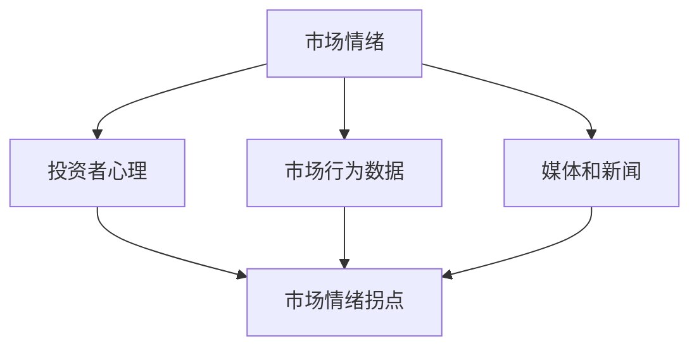
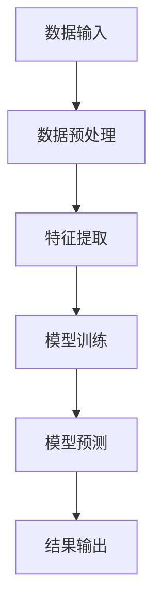
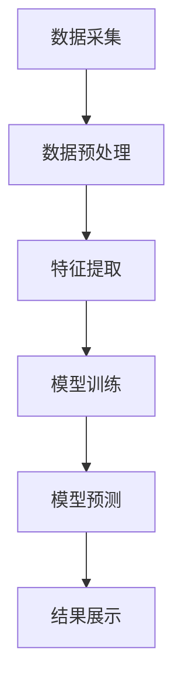
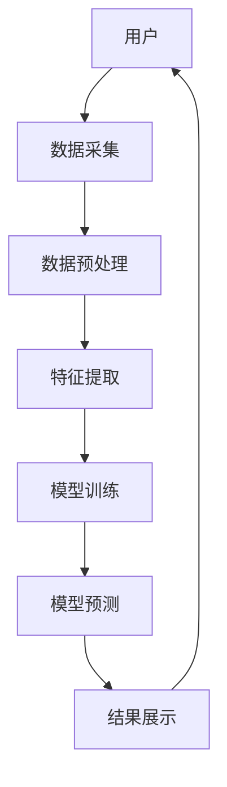

                 


# 智能算法识别市场情绪拐点信号

## 关键词：市场情绪分析、智能算法、情绪拐点、时间序列分析、自然语言处理、机器学习

## 摘要：  
本文详细探讨了如何利用智能算法识别市场情绪拐点信号。通过分析市场情绪的构成要素、算法原理、系统架构设计以及实际项目案例，本文为读者提供了从理论到实践的全面指导。文章首先介绍了市场情绪分析的背景与概念，随后深入讲解了文本挖掘、自然语言处理和时间序列分析等算法原理，并通过Mermaid图和数学公式展示了系统的架构与流程。最后，本文通过一个完整的项目案例，展示了如何将理论应用于实际操作，并总结了智能算法在市场情绪分析中的优势与未来发展方向。

---

# 第一部分: 智能算法识别市场情绪拐点信号

# 第1章: 市场情绪分析的背景与概念

## 1.1 市场情绪分析的定义

### 1.1.1 市场情绪的定义  
市场情绪是指投资者在金融市场中的整体心理状态，反映了市场参与者的乐观、悲观或中立态度。市场情绪可以通过多种方式表现，例如股票价格波动、成交量变化以及新闻媒体的报道等。

### 1.1.2 市场情绪的分类  
市场情绪可以分为以下几类：  
- **乐观情绪**：市场参与者普遍持乐观态度，倾向于买入资产。  
- **悲观情绪**：市场参与者普遍持悲观态度，倾向于卖出资产。  
- **中立情绪**：市场参与者态度较为均衡，无明显倾向。  

### 1.1.3 市场情绪分析的重要性  
市场情绪分析在金融领域具有重要意义，可以帮助投资者识别市场趋势、预测价格波动，并制定更有效的交易策略。

---

## 1.2 市场情绪拐点的定义与特征

### 1.2.1 拐点的定义  
市场情绪拐点是指市场情绪从一个状态转向另一个状态的关键时刻，通常对应着市场的转折点，如顶部或底部。

### 1.2.2 拐点的特征  
市场情绪拐点通常具有以下特征：  
- **突变性**：拐点往往在短时间内发生，市场情绪迅速变化。  
- **信号性**：拐点通常伴随着某些信号，例如成交量激增、价格剧烈波动等。  
- **周期性**：市场情绪拐点往往与市场周期密切相关。  

### 1.2.3 拐点的识别方法  
拐点的识别方法包括：  
- **基于技术分析的方法**：通过价格和成交量的走势判断拐点。  
- **基于机器学习的方法**：利用算法分析市场数据，预测拐点的发生。  

---

## 1.3 智能算法在市场情绪分析中的作用

### 1.3.1 智能算法的优势  
智能算法在市场情绪分析中的优势包括：  
- **高效性**：算法可以快速处理大量数据，提高分析效率。  
- **准确性**：通过机器学习算法，可以提高情绪分析的准确性。  
- **实时性**：智能算法可以实时监控市场数据，及时发现拐点信号。  

### 1.3.2 智能算法的应用场景  
智能算法在以下场景中具有重要应用：  
- **量化交易**：利用算法预测市场情绪，制定交易策略。  
- **风险管理**：通过识别拐点信号，及时调整投资组合，降低风险。  
- **新闻媒体分析**：通过自然语言处理技术，分析新闻情绪，预测市场走势。  

### 1.3.3 智能算法的未来发展趋势  
未来，智能算法在市场情绪分析中的应用将更加广泛，例如：  
- **深度学习的应用**：利用深度学习模型，提高情绪分析的准确性。  
- **多模态数据的融合**：结合文本、图像等多种数据源，进行更全面的情绪分析。  

---

## 1.4 本章小结  
本章介绍了市场情绪分析的基本概念，包括市场情绪的定义、分类及其重要性。同时，详细探讨了市场情绪拐点的定义、特征及其识别方法，并分析了智能算法在市场情绪分析中的优势和应用前景。

---

# 第2章: 市场情绪分析的核心概念与联系

## 2.1 市场情绪的构成要素

### 2.1.1 投资者心理  
投资者心理是市场情绪的核心要素之一，包括投资者的贪婪、恐惧等心理状态。

### 2.1.2 市场行为数据  
市场行为数据是指投资者在市场中的交易行为，包括成交量、价格波动等。

### 2.1.3 媒体和新闻影响  
媒体和新闻对市场情绪具有重要影响，特别是负面新闻往往会导致市场情绪的快速变化。

---

## 2.2 市场情绪与价格的关系

### 2.2.1 市场情绪对价格的影响  
市场情绪可以通过影响投资者的交易行为，进而影响资产价格。例如，乐观情绪可能导致价格上涨，悲观情绪可能导致价格下跌。

### 2.2.2 价格对市场情绪的反馈作用  
价格的波动会反过来影响市场情绪，例如，价格的持续上涨可能会进一步增强投资者的乐观情绪。

---

## 2.3 市场情绪拐点的识别方法

### 2.3.1 基于时间序列的拐点识别  
基于时间序列的拐点识别方法包括：  
- **移动平均法**：通过计算价格的移动平均值，判断拐点。  
- **ARIMA模型**：通过时间序列模型预测价格走势，识别拐点。  

### 2.3.2 基于机器学习的拐点识别  
基于机器学习的拐点识别方法包括：  
- **支持向量机（SVM）**：通过训练模型，识别市场情绪拐点。  
- **随机森林**：通过特征提取和分类，识别拐点。  

### 2.3.3 基于自然语言处理的拐点识别  
基于自然语言处理的拐点识别方法包括：  
- **情感分析**：通过分析新闻媒体的情感倾向，预测市场情绪拐点。  
- **主题模型**：通过分析新闻主题，识别市场情绪拐点。  

---

## 2.4 实体关系图



---

## 2.5 本章小结  
本章详细探讨了市场情绪的构成要素及其与价格的关系，并分析了市场情绪拐点的识别方法。通过实体关系图，展示了市场情绪与其他因素之间的联系。

---

# 第3章: 智能算法识别市场情绪拐点的算法原理

## 3.1 文本挖掘与自然语言处理

### 3.1.1 文本挖掘的基本概念  
文本挖掘是指从大量文本数据中提取有用信息的过程，常用于情感分析、主题建模等领域。

### 3.1.2 自然语言处理技术  
自然语言处理（NLP）是文本挖掘的重要技术，包括分词、句法分析、情感分析等。

### 3.1.3 基于文本的情感分析  
情感分析是自然语言处理的重要应用，通过分析文本的情感倾向，判断市场情绪。

---

## 3.2 基于时间序列的算法

### 3.2.1 时间序列分析的基本概念  
时间序列分析是指通过分析数据的时间特性，预测未来的趋势。

### 3.2.2 常见的时间序列模型  
常见的时间序列模型包括：  
- **ARIMA模型**：自回归积分滑动平均模型，用于预测未来的趋势。  
- **LSTM模型**：长短期记忆网络，适用于处理长序列数据。  

### 3.2.3 基于时间序列的拐点识别算法  
基于时间序列的拐点识别算法包括：  
- **突变点检测**：通过检测数据的突变点，识别拐点。  
- **趋势变化检测**：通过分析趋势的变化，识别拐点。  

---

## 3.3 基于机器学习的算法

### 3.3.1 机器学习的基本概念  
机器学习是一种通过数据训练模型，进行预测或分类的技术。

### 3.3.2 常见的机器学习算法  
常见的机器学习算法包括：  
- **支持向量机（SVM）**：用于分类和回归。  
- **随机森林**：用于分类和回归，具有高准确性。  
- **神经网络**：适用于复杂数据的处理。  

### 3.3.3 基于机器学习的拐点识别算法  
基于机器学习的拐点识别算法包括：  
- **特征提取**：通过提取市场数据的特征，训练模型识别拐点。  
- **分类与回归**：通过分类或回归模型，预测市场情绪拐点。  

---

## 3.4 算法流程图



---

## 3.5 本章小结  
本章详细讲解了智能算法识别市场情绪拐点的算法原理，包括文本挖掘、自然语言处理、时间序列分析和机器学习算法的应用。

---

# 第4章: 智能算法识别市场情绪拐点的数学模型

## 4.1 时间序列分析模型

### 4.1.1 ARIMA模型  
ARIMA模型是一种常用的时间序列分析模型，适用于线性趋势和季节性数据的预测。其公式为：  
$$ ARIMA(p, d, q) $$  
其中，p为自回归阶数，d为差分阶数，q为移动平均阶数。

### 4.1.2 LSTM模型  
LSTM（长短期记忆网络）是一种深度学习模型，适用于处理长序列数据。其核心思想是通过记忆单元（Cell）和门控机制（Gate）来捕捉数据的长期依赖关系。

---

## 4.2 机器学习模型

### 4.2.1 支持向量机（SVM）  
SVM是一种监督学习算法，适用于分类和回归问题。其核心思想是通过构建超平面，将数据分成不同的类别。

### 4.2.2 随机森林  
随机森林是一种基于决策树的集成学习算法，适用于分类和回归问题。其核心思想是通过随机采样和投票机制，提高模型的准确性和鲁棒性。

---

## 4.3 数学模型的应用

### 4.3.1 市场情绪预测模型  
通过ARIMA模型或LSTM模型，可以预测市场情绪的变化趋势，识别拐点信号。

### 4.3.2 市场情绪分类模型  
通过SVM或随机森林模型，可以对市场情绪进行分类，识别拐点信号。

---

## 4.4 本章小结  
本章详细讲解了智能算法识别市场情绪拐点的数学模型，包括时间序列分析模型和机器学习模型的应用。

---

# 第5章: 智能算法识别市场情绪拐点的系统分析与架构设计

## 5.1 系统功能设计

### 5.1.1 数据采集模块  
数据采集模块负责采集市场数据，包括股票价格、成交量、新闻等。

### 5.1.2 数据预处理模块  
数据预处理模块负责对采集的数据进行清洗、归一化等处理，为后续分析提供高质量数据。

### 5.1.3 算法模块  
算法模块负责利用智能算法，分析市场情绪，识别拐点信号。

### 5.1.4 结果展示模块  
结果展示模块负责将分析结果以可视化的方式呈现，帮助用户理解市场情绪变化。

---

## 5.2 系统架构设计



---

## 5.3 系统交互设计



---

## 5.4 本章小结  
本章详细介绍了智能算法识别市场情绪拐点系统的功能设计和架构设计，展示了系统的整体流程和交互过程。

---

# 第6章: 智能算法识别市场情绪拐点的项目实战

## 6.1 项目背景与目标

### 6.1.1 项目背景  
本项目旨在通过智能算法，识别市场情绪拐点信号，帮助投资者制定更有效的交易策略。

### 6.1.2 项目目标  
本项目的目标是：  
- 实现市场情绪分析功能。  
- 识别市场情绪拐点信号。  
- 提供可视化结果展示。  

---

## 6.2 项目环境与工具

### 6.2.1 环境配置  
项目需要以下环境和工具：  
- **Python**：编程语言。  
- **Pandas**：数据处理库。  
- **Scikit-learn**：机器学习库。  
- **TensorFlow**：深度学习框架。  

---

## 6.3 核心实现代码

### 6.3.1 数据采集与预处理  
```python
import pandas as pd
import requests

# 数据采集
def get_data(symbol):
    url = f"https://api.example.com/stock/{symbol}"
    response = requests.get(url)
    data = response.json()
    return pd.DataFrame(data)

# 数据预处理
def preprocess_data(data):
    data['Date'] = pd.to_datetime(data['Date'])
    data.set_index('Date', inplace=True)
    data = data[['Close', 'Volume']]
    return data

# 示例
symbol = 'AAPL'
data = get_data(symbol)
data_processed = preprocess_data(data)
```

### 6.3.2 特征提取与模型训练  
```python
from sklearn.svm import SVC
from sklearn.model_selection import train_test_split

# 特征提取
data_features = data_processed[['Close', 'Volume']]
data_labels = data_processed['Close'].diff().fillna(0).apply(lambda x: 1 if x > 0 else 0)

# 数据分割
X_train, X_test, y_train, y_test = train_test_split(data_features, data_labels, test_size=0.2)

# 模型训练
model = SVC()
model.fit(X_train, y_train)

# 模型预测
y_pred = model.predict(X_test)
```

---

## 6.4 项目小结  
本章通过一个完整的项目案例，展示了智能算法识别市场情绪拐点信号的实现过程，包括数据采集、预处理、特征提取、模型训练和结果展示。

---

# 第7章: 总结与展望

## 7.1 本章小结  
本文详细探讨了智能算法识别市场情绪拐点信号的理论与实践，包括市场情绪分析的背景、算法原理、系统架构设计以及项目实战等内容。

---

## 7.2 未来展望  
未来，智能算法在市场情绪分析中的应用将更加广泛和深入。例如：  
- **深度学习的进一步应用**：利用深度学习模型，提高情绪分析的准确性。  
- **多模态数据的融合**：结合文本、图像等多种数据源，进行更全面的情绪分析。  
- **实时分析与预测**：通过实时数据处理，实现市场的实时监控与预测。  

---

## 7.3 最佳实践 Tips  
- 在实际应用中，建议结合多种算法和技术，提高分析结果的准确性。  
- 数据预处理是关键，需确保数据的高质量。  
- 模型的调参与优化是提高性能的重要手段。  

---

## 7.4 本章小结  
本文总结了智能算法识别市场情绪拐点信号的核心内容，并展望了未来的发展方向，为读者提供了进一步思考和实践的方向。

---

# 作者：AI天才研究院/AI Genius Institute & 禅与计算机程序设计艺术 /Zen And The Art of Computer Programming

---

希望这篇博客文章能够为读者提供关于智能算法识别市场情绪拐点信号的全面指导，从理论到实践，帮助读者深入理解这一领域的核心技术与应用。

