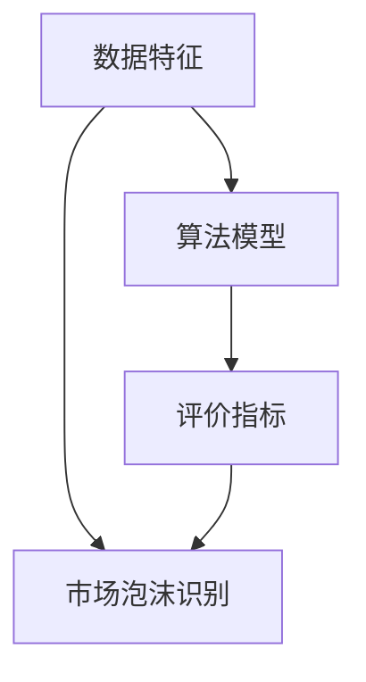
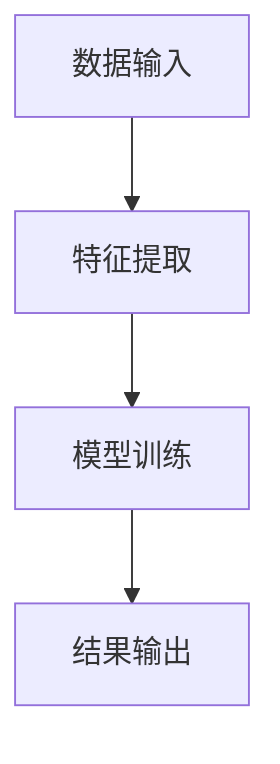
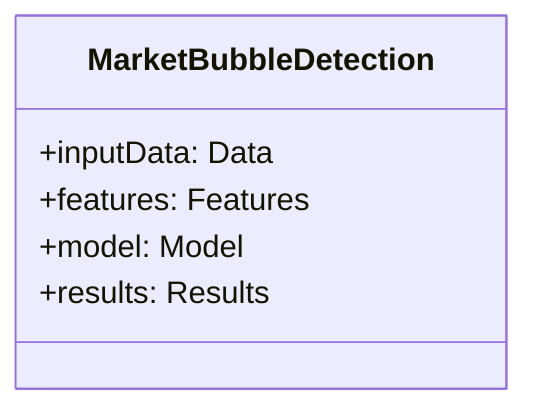
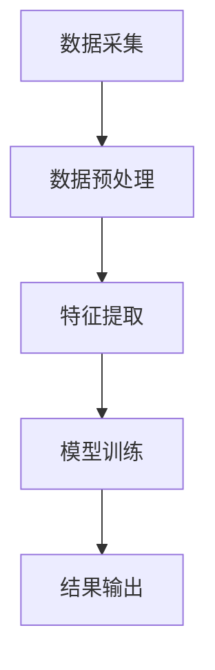
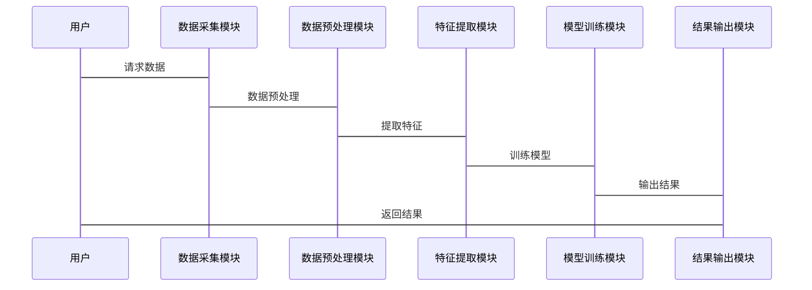

                 


# 智能算法识别市场泡沫形成

## 关键词
智能算法、市场泡沫、金融分析、数据科学、风险管理

## 摘要
本文探讨如何利用智能算法识别市场泡沫的形成，通过分析市场泡沫的定义、形成机制及其对经济的影响，介绍多种智能算法的应用，包括回归分析、时间序列分析和机器学习算法。本文还详细讲解了这些算法的原理、实现步骤及实际案例，并总结了最佳实践和未来研究方向。

---

# 第1章: 市场泡沫与智能算法概述

## 1.1 市场泡沫的定义与特征
### 1.1.1 市场泡沫的定义
市场泡沫是指资产价格在短时间内急剧上涨，远远超过其实际价值，最终导致价格崩溃的现象。市场泡沫通常发生在金融市场中，如股票、房地产等。

### 1.1.2 市场泡沫的形成机制
市场泡沫的形成机制复杂，通常涉及市场参与者的行为、信息不对称、市场情绪等因素。当市场参与者过度乐观或恐慌时，价格可能会偏离实际价值。

### 1.1.3 市场泡沫的经济影响
市场泡沫的破裂通常会导致经济衰退、企业倒闭和失业率上升。因此，识别市场泡沫对于经济稳定和风险管理至关重要。

### 1.1.4 智能算法的作用
智能算法可以通过分析历史数据和市场行为，识别潜在的市场泡沫，从而帮助投资者做出更明智的决策。

## 1.2 智能算法的基本概念
### 1.2.1 算法的基本定义
算法是一系列明确的步骤，用于解决问题或完成特定任务。智能算法是一种能够适应数据变化并做出决策的算法。

### 1.2.2 智能算法的核心特点
智能算法具有自适应性、学习能力和优化能力，能够根据数据变化调整模型。

### 1.2.3 智能算法与传统算法的区别
传统算法依赖于固定的规则，而智能算法能够通过学习和优化来适应数据变化。

## 1.3 市场泡沫识别的必要性
### 1.3.1 市场泡沫识别的背景
随着金融市场的复杂化，传统的市场分析方法难以准确识别市场泡沫。

### 1.3.2 市场泡沫识别的意义
及时识别市场泡沫可以帮助投资者避免重大损失，维护金融市场的稳定。

### 1.3.3 智能算法在市场泡沫识别中的作用
智能算法可以通过分析大量数据，识别潜在的市场泡沫，并提供预警。

## 1.4 本章小结
本章介绍了市场泡沫的定义、形成机制和经济影响，以及智能算法的基本概念和在市场泡沫识别中的作用。

---

# 第2章: 市场泡沫形成机制的分析

## 2.1 市场泡沫的形成过程
### 2.1.1 市场参与者的行为分析
市场参与者的行为通常受到情绪和利益驱动，可能导致价格的非理性波动。

### 2.1.2 市场信息不对称的影响
信息不对称可能导致市场参与者做出错误决策，进而引发市场泡沫。

### 2.1.3 市场情绪与价格波动的关系
市场情绪通常与价格波动密切相关，过度乐观的情绪可能导致价格虚高。

## 2.2 市场泡沫的特征分析
### 2.2.1 价格与价值的偏离
当资产价格远高于其实际价值时，市场可能存在泡沫。

### 2.2.2 市场参与者的非理性行为
市场参与者的行为通常受到情绪驱动，可能导致价格的非理性波动。

### 2.2.3 市场波动的异常性
市场泡沫通常伴随着异常波动，如成交量激增和价格急剧上涨。

## 2.3 市场泡沫的分类与阶段
### 2.3.1 泡沫形成的初期阶段
市场参与者开始对某种资产产生兴趣，价格逐渐上涨。

### 2.3.2 泡沫形成的中期阶段
价格持续上涨，市场参与者蜂拥而入，导致价格远高于实际价值。

### 2.3.3 泡沫形成的后期阶段
价格达到顶峰，市场参与者开始撤离，价格迅速下跌。

## 2.4 本章小结
本章分析了市场泡沫的形成过程、特征和分类，为后续的算法分析奠定了基础。

---

# 第3章: 智能算法在市场泡沫识别中的核心概念

## 3.1 数据特征与市场泡沫识别
### 3.1.1 数据特征的定义
数据特征是指能够反映市场泡沫的关键指标，如价格波动、成交量等。

### 3.1.2 数据特征与市场泡沫的关系
特定的数据特征可以作为市场泡沫的预警信号。

### 3.1.3 数据特征的提取方法
通过统计分析和机器学习方法提取数据特征。

## 3.2 算法模型与市场泡沫识别
### 3.2.1 算法模型的分类
常用的算法模型包括回归分析、时间序列分析和机器学习算法。

### 3.2.2 算法模型的优缺点
不同算法模型有不同的优缺点，需要根据具体情况选择合适的模型。

### 3.2.3 算法模型的选择依据
选择算法模型时需要考虑数据特征、模型复杂度和计算效率等因素。

## 3.3 评价指标与市场泡沫识别
### 3.3.1 评价指标的定义
评价指标用于衡量算法模型的性能，如准确率、召回率等。

### 3.3.2 评价指标的计算方法
通过混淆矩阵和分类报告计算模型的性能指标。

### 3.3.3 评价指标的优化方向
通过调整模型参数和优化算法提高模型性能。

## 3.4 核心概念与联系的 mermaid 图


## 3.5 本章小结
本章介绍了数据特征、算法模型和评价指标的核心概念及其在市场泡沫识别中的联系。

---

# 第4章: 市场泡沫识别的算法原理

## 4.1 算法原理概述
### 4.1.1 算法原理的基本概念
算法原理是智能算法的核心逻辑，用于解决特定问题。

### 4.1.2 算法原理的核心要素
包括数据输入、特征提取、模型训练和结果输出。

### 4.1.3 算法原理的应用场景
适用于金融市场分析、经济预测等领域。

## 4.2 常见算法的原理分析
### 4.2.1 回归分析
回归分析通过建立变量之间的关系模型，预测资产价格。

### 4.2.2 时间序列分析
时间序列分析通过分析历史数据，识别价格波动的模式。

### 4.2.3 机器学习算法
机器学习算法通过训练数据，学习市场泡沫的特征，进行分类或预测。

## 4.3 算法原理的 mermaid 流程图


## 4.4 算法的数学模型与公式
### 4.4.1 线性回归模型
$$ y = \beta_0 + \beta_1 x + \epsilon $$

### 4.4.2 机器学习模型
使用随机森林或支持向量机（SVM）进行分类或回归。

## 4.5 本章小结
本章详细讲解了回归分析、时间序列分析和机器学习算法的原理及其在市场泡沫识别中的应用。

---

# 第5章: 系统分析与架构设计方案

## 5.1 问题场景介绍
### 5.1.1 项目背景
本项目旨在利用智能算法识别市场泡沫，帮助投资者做出明智决策。

### 5.1.2 项目目标
开发一个能够实时监测市场泡沫的系统。

## 5.2 系统功能设计
### 5.2.1 领域模型


### 5.2.2 系统架构设计


### 5.2.3 接口设计
系统提供API接口，供外部调用。

### 5.2.4 交互流程图


## 5.3 本章小结
本章详细描述了系统架构设计和功能模块，为后续的实现提供了指导。

---

# 第6章: 项目实战

## 6.1 环境安装
### 6.1.1 安装Python
```bash
python --version
```

### 6.1.2 安装相关库
```bash
pip install pandas numpy scikit-learn
```

## 6.2 系统核心实现源代码
### 6.2.1 数据采集
```python
import pandas as pd
data = pd.read_csv('market_data.csv')
```

### 6.2.2 特征提取
```python
from sklearn.preprocessing import StandardScaler
scaler = StandardScaler()
features = scaler.fit_transform(data[['price', 'volume']])
```

### 6.2.3 模型训练
```python
from sklearn.ensemble import RandomForestClassifier
model = RandomForestClassifier()
model.fit(features, labels)
```

### 6.2.4 结果输出
```python
importances = model.feature_importances_
print(importances)
```

## 6.3 实际案例分析
### 6.3.1 案例背景
分析某段时间内的房地产数据，识别是否存在市场泡沫。

### 6.3.2 数据分析
通过回归分析和时间序列分析，识别价格波动的模式。

### 6.3.3 模型训练
使用随机森林算法训练模型，识别市场泡沫。

### 6.3.4 结果分析
模型成功识别了市场泡沫，并提供了预警信号。

## 6.4 项目小结
本章通过实际案例展示了智能算法在市场泡沫识别中的应用，验证了算法的有效性。

---

# 第7章: 最佳实践与总结

## 7.1 最佳实践 tips
### 7.1.1 数据质量的重要性
确保数据准确性和完整性。

### 7.1.2 模型调优
通过交叉验证和网格搜索优化模型性能。

### 7.1.3 结果验证
使用历史数据验证模型的准确性和稳定性。

## 7.2 总结
智能算法在市场泡沫识别中具有重要作用，能够帮助投资者做出明智决策，维护金融市场稳定。

## 7.3 展望
未来的研究方向包括结合NLP技术和区块链技术，进一步提高市场泡沫识别的准确性和实时性。

---

# 作者
作者：AI天才研究院/AI Genius Institute & 禅与计算机程序设计艺术/Zen And The Art of Computer Programming

