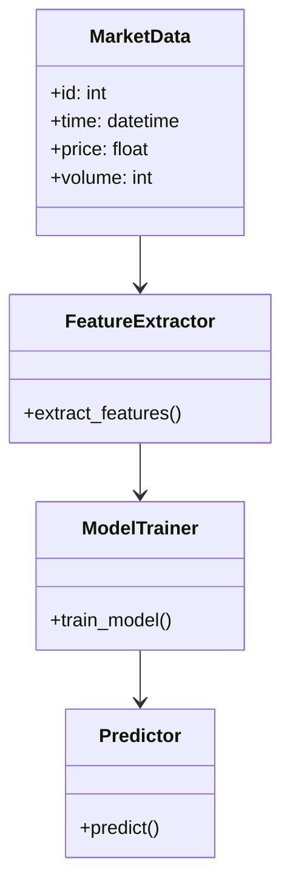
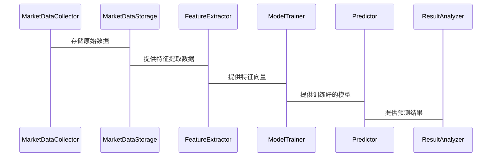

                 


# 智能算法识别市场结构性变化

> 关键词：智能算法、市场结构性变化、时间序列分析、机器学习、数据分析

> 摘要：本文将详细介绍智能算法在识别市场结构性变化中的应用。通过分析市场数据的特征和变化规律，结合时间序列分析、机器学习等技术，探讨如何利用智能算法发现市场中的潜在模式和结构性转变。文章内容包括市场结构性变化的定义、智能算法的核心技术、时间序列分析的实现步骤、系统架构设计、项目实战以及最佳实践等，帮助读者全面理解智能算法在市场分析中的作用。

---

## 第一部分: 智能算法识别市场结构性变化概述

### 第1章: 市场结构性变化概述

#### 1.1 市场结构性变化的定义与特征
##### 1.1.1 市场结构性变化的定义
市场结构性变化是指市场中某些关键要素（如价格、需求、供给、竞争格局等）发生显著变化的过程。这些变化可能源于外部环境的变化（如政策调整、经济波动）、行业趋势的演变或技术创新等。

##### 1.1.2 市场结构性变化的特征
- **渐进性**：结构性变化通常是一个渐进的过程，而非突变。
- **复杂性**：市场因素相互作用，导致结构性变化的表现形式复杂。
- **可预测性**：通过数据分析和建模，可以发现结构性变化的早期信号。

##### 1.1.3 市场结构性变化的分类
- **需求侧变化**：消费者偏好、购买行为的变化。
- **供给侧变化**：生产技术、成本结构的变化。
- **竞争格局变化**：市场份额、竞争者数量的变化。

#### 1.2 智能算法的作用与意义
##### 1.2.1 智能算法的基本概念
智能算法是指通过机器学习、数据挖掘等技术，模拟人类智能的算法。其核心在于从数据中提取模式和洞察，从而辅助决策。

##### 1.2.2 智能算法在市场分析中的应用
- **预测市场趋势**：通过时间序列分析预测未来市场走势。
- **识别市场拐点**：发现市场结构性变化的关键点。
- **优化资源配置**：基于算法结果优化企业运营策略。

##### 1.2.3 智能算法的优势与局限性
- **优势**：高效性、准确性、可扩展性。
- **局限性**：依赖数据质量、算法选择和参数调优。

#### 1.3 本章小结
本章介绍了市场结构性变化的定义、特征及其分类，并探讨了智能算法在市场分析中的作用和意义，为后续章节奠定了基础。

---

## 第二部分: 智能算法的核心技术

### 第2章: 智能算法基础

#### 2.1 算法的基本概念
##### 2.1.1 算法的定义与特点
算法是解决问题的步骤化方法，具有确定性、有限性、有效性等特点。

##### 2.1.2 算法的分类与应用场景
- **分类**：机器学习算法、数据挖掘算法、时间序列分析算法。
- **应用场景**：金融分析、市场预测、客户行为分析等。

#### 2.2 智能算法的核心技术
##### 2.2.1 机器学习算法
- **监督学习**：如线性回归、支持向量机（SVM）。
- **无监督学习**：如聚类分析（K-means）。
- **深度学习**：如神经网络（CNN、RNN）。

##### 2.2.2 数据挖掘算法
- **关联规则挖掘**：如Apriori算法。
- **分类与回归树（CART）**：用于分类和回归分析。

##### 2.2.3 时间序列分析算法
- **ARIMA模型**：用于预测时间序列数据。
- **LSTM网络**：适合处理长期依赖关系。

#### 2.3 算法选择与优化策略
##### 2.3.1 算法选择的原则
- 数据类型：分类、回归、聚类等问题选择不同的算法。
- 数据规模：大数据场景选择高效的算法。
- 业务目标：根据预测精度、计算时间等目标选择算法。

##### 2.3.2 算法优化的方法
- **参数调优**：如网格搜索（Grid Search）。
- **特征选择**：去除冗余特征，提升模型性能。
- **集成学习**：如随机森林、梯度提升树。

##### 2.3.3 算法评估指标
- **准确率**：分类问题中的常见指标。
- **均方误差（MSE）**：回归问题中的常见指标。
- **F1分数**：综合考虑精确率和召回率。

#### 2.4 本章小结
本章详细介绍了智能算法的核心技术，包括机器学习、数据挖掘和时间序列分析算法，并探讨了算法选择与优化策略。

---

## 第三部分: 时间序列分析与市场预测

### 第3章: 时间序列分析与市场预测

#### 3.1 时间序列分析的基本原理
##### 3.1.1 时间序列的定义与特征
时间序列是指按照时间顺序排列的数据，其特征包括趋势性、周期性、随机性等。

##### 3.1.2 时间序列分析的数学模型
- **线性回归模型**：用于捕捉趋势性。
- **ARIMA模型**：考虑自相关性和移动平均性。

#### 3.2 常用时间序列分析算法
##### 3.2.1 ARIMA模型
ARIMA（自回归积分滑动平均模型）适用于线性时间序列数据。

##### 3.2.2 LSTM网络
LSTM（长短期记忆网络）适合处理非线性时间序列数据。

##### 3.2.3 Prophet模型
Prophet模型是Facebook开源的简单且高效的预测模型。

#### 3.3 时间序列分析的实现步骤
##### 3.3.1 数据预处理
- 数据清洗：处理缺失值、异常值。
- 数据标准化：归一化处理。

##### 3.3.2 模型训练
- 确定模型参数：如ARIMA的p、d、q参数。
- 训练模型：使用训练数据拟合模型。

##### 3.3.3 模型评估与优化
- 使用验证数据评估模型性能。
- 调整模型参数，优化预测结果。

#### 3.4 本章小结
本章通过ARIMA、LSTM和Prophet模型，详细讲解了时间序列分析的实现步骤及其在市场预测中的应用。

---

## 第四部分: 市场数据特征提取与分析

### 第4章: 市场数据特征提取与分析

#### 4.1 数据特征提取的基本方法
##### 4.1.1 基于统计的方法
- 均值、方差、相关系数等统计指标。

##### 4.1.2 基于机器学习的方法
- 主成分分析（PCA）：降维处理。
- 线性判别分析（LDA）：特征提取。

##### 4.1.3 基于深度学习的方法
- 卷积神经网络（CNN）：提取图像特征。
- 循环神经网络（RNN）：提取序列特征。

#### 4.2 市场数据特征的分类与选择
##### 4.2.1 特征的分类
- 数值型特征：如价格、销量。
- 分类型特征：如性别、地区。

##### 4.2.2 特征选择的策略
- 基于统计的方法：如卡方检验。
- 基于机器学习的方法：如LASSO回归。

##### 4.2.3 特征工程的实现
- 特征组合：将多个特征组合成新的特征。
- 特征变换：如标准化、对数变换。

#### 4.3 数据特征对市场结构性变化的影响
##### 4.3.1 特征对预测结果的影响
- 关键特征：如价格、需求量。
- 非关键特征：如天气、季节性因素。

##### 4.3.2 特征与市场变化的关系
- 强相关特征：如价格与销量高度相关。
- 弱相关特征：如广告投放与销量弱相关。

#### 4.4 本章小结
本章探讨了市场数据特征提取的方法及其对市场结构性变化的影响。

---

## 第五部分: 系统分析与架构设计

### 第5章: 系统分析与架构设计

#### 5.1 问题场景介绍
- 项目背景：市场数据的采集、分析与预测。
- 项目目标：识别市场结构性变化，辅助决策。

#### 5.2 系统功能设计
##### 5.2.1 领域模型设计


##### 5.2.2 系统架构设计


##### 5.2.3 系统接口设计
- 数据接口：数据采集模块与存储模块之间的接口。
- 模型接口：特征提取模块与模型训练模块之间的接口。

##### 5.2.4 系统交互设计


#### 5.3 本章小结
本章通过系统架构设计，展示了智能算法识别市场结构性变化的整体流程。

---

## 第六部分: 项目实战

### 第6章: 项目实战

#### 6.1 环境安装与配置
- **工具安装**：Python、TensorFlow、Keras、scikit-learn。
- **数据准备**：获取市场数据，如股票价格、销售数据。

#### 6.2 系统核心实现源代码
##### 6.2.1 数据预处理代码
```python
import pandas as pd
import numpy as np

# 数据加载
data = pd.read_csv('market_data.csv')

# 数据清洗
data.dropna(inplace=True)
data = data.iloc[:100]  # 取前100条数据
```

##### 6.2.2 模型训练代码
```python
from sklearn.model_selection import train_test_split
from sklearn.linear_model import LinearRegression

# 数据分割
X = data[['price', 'volume']]
y = data['target']

X_train, X_test, y_train, y_test = train_test_split(X, y, test_size=0.2)

# 模型训练
model = LinearRegression()
model.fit(X_train, y_train)
```

##### 6.2.3 模型预测代码
```python
# 预测结果
y_pred = model.predict(X_test)

# 结果评估
from sklearn.metrics import mean_squared_error
print(mean_squared_error(y_test, y_pred))
```

#### 6.3 代码应用解读与分析
- 数据预处理：加载数据，清洗数据，提取特征。
- 模型训练：选择算法，训练模型。
- 模型预测：使用训练好的模型进行预测，并评估结果。

#### 6.4 实际案例分析
- 案例背景：某行业市场数据的分析。
- 案例实现：基于时间序列分析预测市场趋势。
- 案例结果：识别出市场结构性变化的关键点。

#### 6.5 项目小结
本章通过实际案例，展示了智能算法在识别市场结构性变化中的具体应用。

---

## 第七部分: 最佳实践与总结

### 第7章: 最佳实践与总结

#### 7.1 最佳实践 tips
- 数据预处理：确保数据质量，减少特征冗余。
- 模型选择：根据问题类型选择合适的算法。
- 模型评估：使用多种指标评估模型性能。

#### 7.2 小结
智能算法在识别市场结构性变化中具有重要作用，通过时间序列分析、特征提取和机器学习等技术，可以帮助企业发现市场潜在变化，优化决策。

#### 7.3 注意事项
- 数据隐私：确保数据处理符合隐私保护法规。
- 模型解释性：选择可解释性强的算法，便于业务理解。
- 模型更新：定期更新模型，适应市场变化。

#### 7.4 拓展阅读
- 《机器学习实战》：学习机器学习算法的具体实现。
- 《时间序列分析》：深入理解时间序列分析的方法。

---

## 作者：AI天才研究院/AI Genius Institute & 禅与计算机程序设计艺术 /Zen And The Art of Computer Programming

