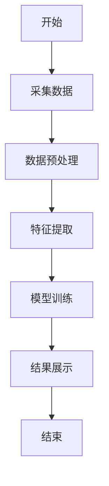
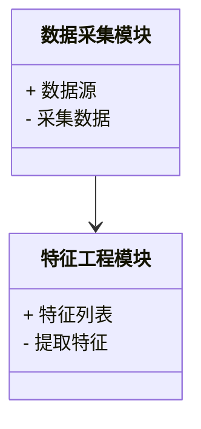
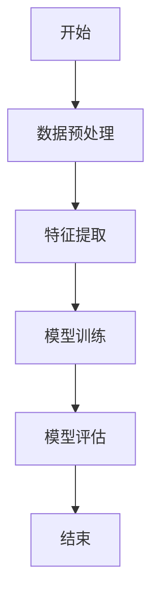
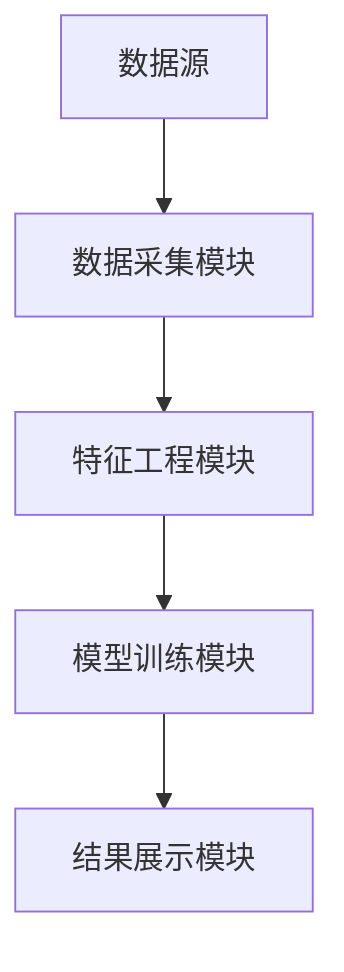
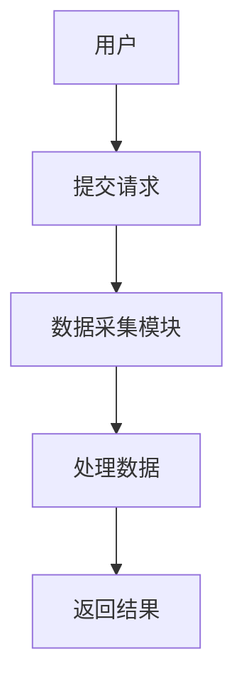

                 


# 智能算法识别隐藏的财务风险

> 关键词：智能算法，财务风险，隐藏风险，机器学习，风险管理

> 摘要：本文深入探讨了智能算法在识别隐藏财务风险中的应用。通过分析财务数据的特征和风险形成机制，结合监督学习、无监督学习和深度学习算法，构建了一个完整的系统架构。文章从算法原理、系统设计到项目实战，详细阐述了如何利用智能算法识别隐藏的财务风险，并提供了实际案例分析和最佳实践建议。

---

## 第1章：智能算法与隐藏财务风险的背景介绍

### 1.1 隐藏财务风险的定义与特征

#### 1.1.1 隐藏财务风险的定义
隐藏财务风险是指那些隐藏在财务数据背后，尚未被发现或被忽视的潜在风险。这些风险可能源于数据中的异常值、欺诈行为或市场波动。

#### 1.1.2 隐藏财务风险的特征
- **隐蔽性**：隐藏在正常数据中的异常模式。
- **动态性**：随市场环境变化而变化。
- **复杂性**：涉及多维度的数据关联。

#### 1.1.3 隐藏财务风险的分类
- **欺诈风险**：如虚假交易、账单造假。
- **操作风险**：如内部错误或失误。
- **市场风险**：如价格波动引发的损失。

### 1.2 智能算法的定义与特点

#### 1.2.1 智能算法的定义
智能算法是基于数据驱动的自动化决策方法，利用机器学习、深度学习等技术，从数据中提取隐含信息并进行预测或分类。

#### 1.2.2 智能算法的核心特点
- **数据驱动**：依赖大量数据进行学习。
- **自动化**：能够自动调整模型参数。
- **适应性**：能够适应数据变化。

#### 1.2.3 智能算法与传统算法的区别
| 特性          | 传统算法                     | 智能算法                     |
|---------------|------------------------------|------------------------------|
| 学习方式      | 需要明确规则                 | 通过数据学习                 |
| 数据需求      | 数据量小，规则明确           | 数据量大，规则隐含           |
| 应用场景      | 简单决策问题                 | 复杂模式识别                 |

### 1.3 智能算法在财务风险管理中的应用背景

#### 1.3.1 财务风险管理的传统方法与局限性
传统方法依赖人工审查和固定规则，存在效率低、覆盖面窄的问题。

#### 1.3.2 智能算法在财务风险管理中的优势
- **高效性**：快速处理大量数据。
- **准确性**：识别复杂模式，减少误判。
- **适应性**：实时更新模型，应对变化。

#### 1.3.3 隐藏财务风险的识别需求
隐藏风险的隐蔽性和复杂性要求采用更先进的技术手段。

### 1.4 本章小结
本章介绍了隐藏财务风险的基本概念和分类，对比了智能算法与传统算法的特点，强调了智能算法在财务风险管理中的重要性。

---

## 第2章：隐藏财务风险的核心概念与联系

### 2.1 隐藏财务风险的核心要素

#### 2.1.1 财务数据的特征
- 结构化数据（如交易记录）和非结构化数据（如文本报告）。

#### 2.1.2 隐藏风险的形成机制
内部欺诈、市场波动、操作失误等因素共同作用的结果。

#### 2.1.3 风险与收益的平衡
高收益伴随高风险，需在两者之间找到平衡点。

### 2.2 智能算法的核心原理

#### 2.2.1 监督学习与无监督学习的对比
| 特性          | 监督学习                    | 无监督学习                  |
|---------------|-----------------------------|-----------------------------|
| 数据类型      | 标签数据                   | 无标签数据                 |
| 目标          | 预测标签                   | 发现数据结构               |

#### 2.2.2 深度学习与传统机器学习的对比
- **传统机器学习**：依赖特征工程，模型结构简单。
- **深度学习**：自动提取特征，模型结构复杂。

#### 2.2.3 算法的可解释性与鲁棒性
- **可解释性**：传统算法（如线性回归）可解释性强。
- **鲁棒性**：深度学习模型在数据充足时表现更好。

### 2.3 隐藏财务风险与智能算法的关联

#### 2.3.1 数据驱动的风险识别
通过机器学习从数据中发现隐藏模式。

#### 2.3.2 智能算法在风险预测中的应用
- **监督学习**：预测风险等级。
- **无监督学习**：发现异常交易。

#### 2.3.3 风险模型的构建与优化
结合多种算法，构建混合模型以提高准确率。

### 2.4 本章小结
本章分析了隐藏财务风险的核心要素，对比了智能算法的不同类型，探讨了它们在风险识别中的应用。

---

## 第3章：智能算法识别隐藏财务风险的核心概念与联系

### 3.1 隐藏财务风险的识别流程

#### 3.1.1 数据采集与预处理
- **数据来源**：企业财务系统、交易记录。
- **预处理步骤**：清洗、标准化、特征提取。

#### 3.1.2 特征提取与选择
- **特征提取**：如PCA（主成分分析）。
- **特征选择**：如基于重要性排序选择关键特征。

#### 3.1.3 模型训练与评估
- **训练过程**：调整模型参数，优化性能。
- **评估指标**：准确率、召回率、F1分数。

### 3.2 智能算法的核心原理

#### 3.2.1 监督学习算法

##### 3.2.1.1 线性回归
$$ y = \beta_0 + \beta_1x_1 + \beta_2x_2 + \ldots + \beta_nx_n $$
适用于预测连续型变量。

##### 3.2.1.2 支持向量机（SVM）
通过构建超平面进行分类，适用于小规模数据。

##### 3.2.1.3 随机森林
基于决策树的集成方法，适合高维数据。

#### 3.2.2 无监督学习算法

##### 3.2.2.1 K-means聚类
将数据分为K个簇，适用于无标签数据。

##### 3.2.2.2 DBSCAN聚类
基于密度的聚类方法，适合发现异常点。

##### 3.2.2.3 主成分分析（PCA）
通过降维提取主要特征。

#### 3.2.3 深度学习算法

##### 3.2.3.1 神经网络
多层感知机（MLP）用于分类任务。

##### 3.2.3.2 卷积神经网络（CNN）
适用于图像数据，但在文本处理中也有应用。

### 3.3 隐藏财务风险的识别模型

#### 3.3.1 基于监督学习的风险分类模型
- 使用随机森林进行分类，准确率高。
- 使用梯度提升树（如XGBoost）优化性能。

#### 3.3.2 基于无监督学习的异常检测模型
- 使用DBSCAN检测异常交易。
- 使用Isolation Forest识别异常点。

#### 3.3.3 混合模型的应用
结合监督和无监督算法，先分类后聚类，提高准确率。

### 3.4 本章小结
本章详细讲解了隐藏财务风险的识别流程，对比了不同算法的优缺点，展示了如何构建混合模型以提高识别效果。

---

## 第4章：智能算法识别隐藏财务风险的算法原理

### 4.1 监督学习算法

#### 4.1.1 线性回归
适用于预测连续型变量，如预测违约概率。

#### 4.1.2 支持向量机（SVM）
适用于小规模分类任务，如欺诈检测。

#### 4.1.3 随机森林
适用于高维数据，如多特征的财务数据分析。

### 4.2 无监督学习算法

#### 4.2.1 K-means聚类
适用于客户分群，发现潜在风险群体。

#### 4.2.2 DBSCAN聚类
适用于异常检测，识别交易中的异常点。

#### 4.2.3 主成分分析（PCA）
通过降维提取主要特征，减少计算复杂度。

### 4.3 深度学习算法

#### 4.3.1 神经网络
适用于复杂的非线性关系，如市场波动预测。

#### 4.3.2 卷积神经网络（CNN）
适用于图像数据，但在文本处理中也有应用。

### 4.4 本章小结
本章详细讲解了监督学习、无监督学习和深度学习算法的原理及其在隐藏财务风险识别中的应用。

---

## 第5章：系统分析与架构设计

### 5.1 问题场景介绍
企业需要实时监控财务数据，识别隐藏风险。

### 5.2 系统功能设计

#### 5.2.1 数据采集模块
- **功能**：从数据库中获取财务数据。
- **流程图**：


#### 5.2.2 特征工程模块
- **功能**：提取关键特征，如交易金额、时间等。
- **类图**：


#### 5.2.3 模型训练模块
- **功能**：训练分类模型，如随机森林。
- **流程图**：


#### 5.2.4 结果展示模块
- **功能**：可视化模型输出，如风险等级。

### 5.3 系统架构设计

#### 5.3.1 系统架构图


#### 5.3.2 系统交互流程图


### 5.4 系统接口设计
- **输入接口**：接收财务数据。
- **输出接口**：展示风险报告。

### 5.5 本章小结
本章设计了一个完整的系统架构，从数据采集到结果展示，详细描述了各模块的功能和交互流程。

---

## 第6章：项目实战

### 6.1 环境安装

#### 6.1.1 安装Python
```bash
python --version
pip install --upgrade pip
```

#### 6.1.2 安装机器学习库
```bash
pip install scikit-learn
pip install xgboost
pip install tensorflow
```

### 6.2 核心代码实现

#### 6.2.1 数据预处理
```python
import pandas as pd
data = pd.read_csv('financial_data.csv')
data = data.dropna()
```

#### 6.2.2 特征工程
```python
from sklearn.preprocessing import StandardScaler
scaler = StandardScaler()
X_scaled = scaler.fit_transform(data)
```

#### 6.2.3 模型训练
```python
from sklearn.ensemble import RandomForestClassifier
model = RandomForestClassifier()
model.fit(X_scaled, y)
```

#### 6.2.4 模型评估
```python
from sklearn.metrics import accuracy_score
y_pred = model.predict(X_test)
print("准确率:", accuracy_score(y_test, y_pred))
```

### 6.3 实际案例分析

#### 6.3.1 案例背景
分析一家企业的财务数据，识别隐藏的欺诈交易。

#### 6.3.2 数据分析
```python
import matplotlib.pyplot as plt
plt.hist(data['交易金额'], bins=20)
plt.show()
```

#### 6.3.3 模型实现
```python
import joblib
joblib.dump(model, 'financial_risk_model.pkl')
```

### 6.4 项目小结
本章通过实际案例展示了如何利用智能算法识别隐藏财务风险，从环境配置到代码实现，详细讲解了每一步的操作。

---

## 第7章：最佳实践与小结

### 7.1 最佳实践

#### 7.1.1 数据质量
确保数据准确性和完整性。

#### 7.1.2 模型选择
根据问题类型选择合适的算法。

#### 7.1.3 模型优化
通过交叉验证和超参数调整提升性能。

#### 7.1.4 模型解释
使用LIME或SHAP解释模型决策。

### 7.2 小结
智能算法在隐藏财务风险识别中的应用前景广阔，但需注意数据隐私和模型泛化能力。

### 7.3 注意事项
- 数据隐私保护。
- 模型的可解释性。
- 模型的实时更新。

### 7.4 拓展阅读
- 《机器学习实战》
- 《深度学习》

### 7.5 本章小结
本章总结了全文，提供了实际应用中的最佳实践建议，并指出了未来的研究方向。

---

## 作者：AI天才研究院/AI Genius Institute & 禅与计算机程序设计艺术 /Zen And The Art of Computer Programming

---

以上是《智能算法识别隐藏的财务风险》的完整目录大纲和文章内容。通过一步步的分析和推理，详细阐述了智能算法在识别隐藏财务风险中的应用，从背景介绍到项目实战，为读者提供了全面的技术指导和实践案例。

