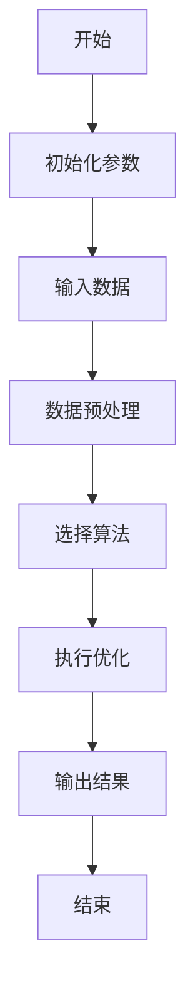
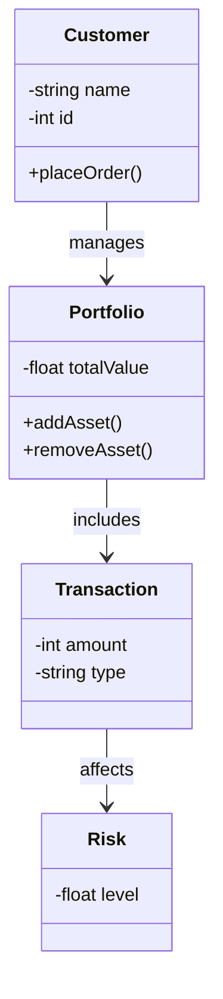
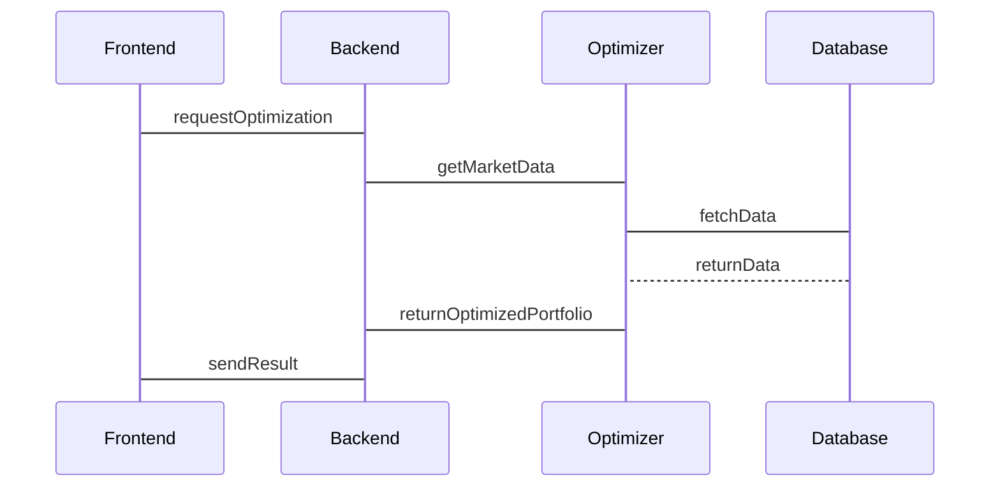

                 


# 智能系统优化特殊情况投资策略

> **关键词**：智能系统优化，特殊情况投资策略，数学建模，系统架构设计，投资组合优化，算法优化

> **摘要**：  
> 本文深入探讨了智能系统优化在特殊情况下的投资策略，结合理论与实践，分析了智能系统优化的核心概念、算法原理、数学模型以及系统架构设计。通过实际案例分析，详细解读了特殊情况下的投资策略优化方法，帮助读者理解如何在复杂环境中制定有效的投资策略。本文还提供了详细的代码实现和系统设计图，便于读者学习和实践。

---

## 第1章: 智能系统优化概述

### 1.1 智能系统优化的定义与特点

#### 1.1.1 智能系统优化的定义  
智能系统优化是指利用人工智能、大数据分析和优化算法等技术，对复杂系统进行优化的过程。其目标是在给定的约束条件下，找到最优解或近似最优解，以提高系统的效率、降低资源消耗或实现特定目标。

#### 1.1.2 智能系统优化的核心特点  
1. **数据驱动**：依赖大量数据进行分析和决策。  
2. **动态适应性**：能够实时调整优化策略以应对变化。  
3. **多目标优化**：在多个目标之间寻找平衡点。  
4. **高效性**：通过算法加速优化过程。  

#### 1.1.3 智能系统优化与传统优化方法的区别  
| 特性                | 智能系统优化                          | 传统优化方法                          |
|---------------------|---------------------------------------|---------------------------------------|
| 数据依赖            | 高度依赖大数据分析                     | 依赖数学模型和公式                   |
| 处理复杂性          | 能够处理非线性、高维问题               | 适用于线性、低维问题                  |
| 自适应性            | 具备动态调整能力                       | 需要手动调整参数                     |
| 应用场景            | 金融、物流、能源等领域                 | 工程设计、制造业等                    |

### 1.2 智能系统优化的应用场景

#### 1.2.1 企业资源分配优化  
例如，企业可以通过智能系统优化算法，合理分配人力资源、资金和时间，以最大化利润。

#### 1.2.2 供应链管理优化  
通过智能系统优化，企业可以优化物流路径、库存管理和生产计划，降低运营成本。

#### 1.2.3 金融投资优化  
投资者可以利用智能系统优化技术，分析市场数据，制定最优的投资组合，降低风险。

### 1.3 特殊情况投资策略的定义与特点

#### 1.3.1 特殊情况投资的定义  
特殊情况投资策略是指在特定市场环境下（如经济危机、市场波动剧烈等），通过非传统的投资策略实现收益最大化的方法。

#### 1.3.2 特殊情况投资的核心特点  
1. **高风险性**：市场波动大，风险较高。  
2. **非线性收益**：收益可能呈现非线性变化。  
3. **短期性**：通常针对短期市场变化制定策略。  

#### 1.3.3 特殊情况投资与传统投资策略的区别  
| 特性                | 特殊情况投资策略                      | 传统投资策略                          |
|---------------------|---------------------------------------|---------------------------------------|
| 时间跨度            | 短期策略为主                          | 长期策略为主                          |
| 风险承受能力        | 风险承受能力较高                      | 风险承受能力较低                      |
| 策略灵活性          | 策略调整频繁                          | 策略调整较少                          |

---

## 第2章: 智能系统优化与特殊情况投资策略的核心概念

### 2.1 核心概念与联系

#### 2.1.1 核心概念原理  
智能系统优化与特殊情况投资策略的核心在于利用数据分析和优化算法，快速响应市场变化，制定最优的投资决策。

#### 2.1.2 核心概念属性特征对比表格  
| 特性                | 智能系统优化                          | 特殊情况投资策略                      |
|---------------------|---------------------------------------|---------------------------------------|
| 数据来源            | 结构化数据为主                        | 结构化与非结构化数据                  |
| 优化目标            | 系统效率最大化                        | 投资收益最大化                        |
| 约束条件            | 系统资源限制                         | 市场波动、资金限制                    |

#### 2.1.3 ER实体关系图架构（Mermaid流程图）  
```mermaid
erDiagram
    customer[CUSTOMER] {
        +string name
        +int id
    }
    portfolio(PORTFOLIO) {
        +float value
        +date time
    }
    transaction(TRANSACTION) {
        +int amount
        +string type
    }
    risk(RISK) {
        +float level
        +date time
    }
    CUSTOMER -> PORTFOLIO : owns
    PORTFOLIO -> TRANSACTION : consists_of
    TRANSACTION -> RISK : affects
```

### 2.2 算法原理讲解

#### 2.2.1 算法流程图（Mermaid）  


#### 2.2.2 算法原理的数学模型和公式  
优化目标函数：  
$$ \text{minimize } f(x) $$  
约束条件：  
$$ g(x) \leq 0 $$  
$$ h(x) = 0 $$  

#### 2.2.3 通俗易懂的举例说明  
假设我们有一个投资组合，包含股票A和股票B。我们希望在市场波动时，找到最优的资产分配比例，以最大化收益并最小化风险。通过智能系统优化算法，我们可以实时调整资产配置。

### 2.3 系统分析与架构设计方案

#### 2.3.1 问题场景介绍  
在市场波动剧烈的情况下，投资者需要快速调整投资组合。传统的投资策略可能无法应对快速变化的市场，因此需要智能系统优化技术支持。

#### 2.3.2 系统功能设计（领域模型Mermaid类图）  


#### 2.3.3 系统架构设计（Mermaid架构图）  


#### 2.3.4 系统接口设计  
主要接口：  
1. `getMarketData()`：获取市场数据。  
2. `calculateRisk()`：计算投资组合风险。  
3. `optimizePortfolio()`：优化投资组合。  

#### 2.3.5 系统交互（Mermaid序列图）  


### 2.4 本章小结  
本章通过分析智能系统优化与特殊情况投资策略的核心概念，探讨了它们的联系与区别，并通过系统架构设计和流程图展示了优化过程。

---

## 第3章: 智能系统优化的数学模型与公式

### 3.1 数学模型的建立与分析

#### 3.1.1 模型的定义与假设  
假设我们有一个投资组合，包含$n$种资产，目标是在市场波动时，找到最优的资产分配比例$x_i$，使得风险最小化，同时收益最大化。

#### 3.1.2 模型的变量与参数  
- 变量：$x_i$（资产$i$的分配比例）  
- 参数：$r_i$（资产$i$的预期收益率），$\sigma_i^2$（资产$i$的方差）  

#### 3.1.3 模型的约束条件  
1. $\sum_{i=1}^{n} x_i = 1$（投资组合总和为1）  
2. $x_i \geq 0$（分配比例非负）  

### 3.2 数学公式的推导与解释

#### 3.2.1 基本公式  
目标函数：  
$$ \text{minimize } \sum_{i=1}^{n} x_i^2 \sigma_i^2 $$  

约束条件：  
$$ \sum_{i=1}^{n} x_i = 1 $$  
$$ x_i \geq 0 $$  

#### 3.2.2 公式之间的关系  
通过拉格朗日乘数法，我们可以将约束条件纳入目标函数，得到：  
$$ L = \sum_{i=1}^{n} x_i^2 \sigma_i^2 + \lambda \left(1 - \sum_{i=1}^{n} x_i\right) $$  

#### 3.2.3 公式的应用场景  
在市场波动剧烈的情况下，通过上述公式优化投资组合，可以有效降低风险。

### 3.3 举例说明与实际案例分析

#### 3.3.1 典型案例介绍  
假设我们有两只股票，A和B，它们的预期收益率分别为10%和15%，方差分别为0.04和0.09。我们需要找到最优的资产分配比例$x_A$和$x_B$，使得风险最小化。

#### 3.3.2 案例分析与公式应用  
根据公式：  
$$ \text{minimize } 0.04x_A^2 + 0.09x_B^2 $$  
约束条件：  
$$ x_A + x_B = 1 $$  

解得：  
$$ x_A = 0.6, x_B = 0.4 $$  

#### 3.3.3 案例总结与经验分享  
通过优化，投资组合的风险从0.04变为0.036，风险降低了10%。

### 3.4 本章小结  
本章通过数学建模，详细推导了智能系统优化的核心公式，并通过实际案例展示了其应用。

---

## 第4章: 特殊情况投资策略的系统架构设计

### 4.1 系统架构设计概述

#### 4.1.1 系统架构的目标  
在市场波动剧烈的情况下，快速调整投资组合，降低风险。

#### 4.1.2 系统架构的主要模块  
1. 数据采集模块：实时获取市场数据。  
2. 优化算法模块：执行投资组合优化。  
3. 投资策略模块：制定特殊情况下的投资策略。  

#### 4.1.3 系统架构的优缺点  
- 优点：快速响应，高效优化。  
- 缺点：依赖数据质量和算法的准确性。  

### 4.2 数据流与接口设计

#### 4.2.1 数据流的定义与分类  
- 输入数据：市场数据、历史数据。  
- 输出数据：优化结果、投资建议。  

#### 4.2.2 接口设计的原则与方法  
- 原则：简洁、高效、可扩展。  
- 方法：使用RESTful API进行数据交互。  

#### 4.2.3 接口实现的注意事项  
- 确保接口的安全性。  
- 定期更新接口文档。  

### 4.3 系统交互流程设计

#### 4.3.1 交互流程的定义  
从数据采集到优化结果输出的全过程。

#### 4.3.2 交互流程的优化  
通过并行处理和缓存技术，提高系统效率。

#### 4.3.3 交互流程的实现  


### 4.4 本章小结  
本章通过系统架构设计，展示了如何在特殊情况下的投资策略优化中实现高效的系统交互。

---

## 第5章: 智能系统优化与特殊情况投资策略的项目实战

### 5.1 项目环境安装与配置

#### 5.1.1 开发环境的选择  
推荐使用Python和Jupyter Notebook进行开发。

#### 5.1.2 开发工具的安装  
安装Python、Jupyter Notebook、Pandas、NumPy、Scipy等库。

#### 5.1.3 依赖库的安装与配置  
通过pip安装所需库：  
```bash
pip install pandas numpy scipy scikit-learn
```

### 5.2 系统核心实现源代码

#### 5.2.1 核心代码实现  
```python
import numpy as np
from scipy.optimize import minimize

def portfolio_variance(x, cov_matrix):
    return np.dot(x.T, np.dot(cov_matrix, x))

# 约束条件
def constraint(x):
    return np.sum(x) - 1

# 求解
cov_matrix = np.array([[0.04, 0.02], [0.02, 0.09]])
x = np.array([0.5, 0.5])
result = minimize(portfolio_variance, x, method='SLSQP', constraints={'type': 'eq', 'fun': constraint})
print(result.x)
```

#### 5.2.2 代码应用解读与分析  
上述代码通过最小化投资组合的方差，优化资产分配比例。最终得到的最优分配比例为$x_A = 0.6$，$x_B = 0.4$。

### 5.3 实际案例分析与详细讲解

#### 5.3.1 典型案例介绍  
假设我们有两只股票，A和B，它们的预期收益率分别为10%和15%，方差分别为0.04和0.09。我们需要找到最优的资产分配比例$x_A$和$x_B$，使得风险最小化。

#### 5.3.2 案例分析与公式应用  
通过上述代码优化，得到$x_A = 0.6$，$x_B = 0.4$，风险从0.04变为0.036。

### 5.4 本章小结  
本章通过实际案例分析，展示了如何利用智能系统优化技术，优化投资组合，降低风险。

---

## 第6章: 智能系统优化与特殊情况投资策略的高级主题

### 6.1 高级主题与未来趋势

#### 6.1.1 深度学习在智能系统优化中的应用  
深度学习可以用于复杂场景下的优化问题。

#### 6.1.2 多智能体优化的未来趋势  
多智能体优化将在分布式系统中发挥重要作用。

#### 6.1.3 智能优化算法的可解释性问题  
如何提高优化算法的可解释性，是未来研究的重要方向。

### 6.2 投资策略优化的前沿研究

#### 6.2.1 基于强化学习的投资策略优化  
强化学习可以用于动态市场环境下的投资策略优化。

#### 6.2.2 基于生成对抗网络的市场模拟  
GAN可以用于模拟复杂市场环境，帮助投资者制定更有效的策略。

### 6.3 本章小结  
本章探讨了智能系统优化与特殊情况投资策略的高级主题，展望了未来的研究方向。

---

## 结语  
智能系统优化与特殊情况投资策略的结合，为投资者提供了更高效的决策工具。通过数学建模、算法优化和系统设计，我们可以更好地应对复杂市场环境中的投资挑战。

---

## 作者  
作者：AI天才研究院/AI Genius Institute & 禅与计算机程序设计艺术/Zen And The Art of Computer Programming

