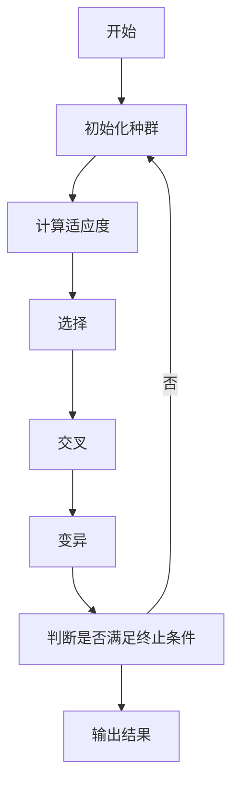

                 


# 智能系统优化税收效率投资策略

> **关键词**：智能系统，税收效率，投资策略，优化算法，数据驱动，机器学习  
> **摘要**：本文探讨如何利用智能系统优化税收效率，并制定有效的投资策略。通过分析税收优化的核心问题，介绍智能算法的原理与实现，设计系统架构，结合实际案例，提供最佳实践建议，为读者提供全面的解决方案。

---

## 第一部分：智能系统优化税收效率的背景与基础

### 第1章：智能系统优化税收效率的背景与问题概述

#### 1.1 税收效率优化的背景与意义
税收效率优化是现代政府和企业关注的重要议题。随着经济全球化和数字化的发展，传统的人工税务管理方式逐渐暴露出效率低下、误差率高、难以应对大规模数据处理等问题。智能系统的引入，通过数据驱动和机器学习技术，能够显著提升税收管理的效率和准确性。

#### 1.2 税收效率优化的核心问题
在税收征收和管理过程中，存在以下主要问题：
- 数据分散：税务数据来源多样，难以整合和分析。
- 算法复杂：传统优化方法难以应对动态变化的税收政策和市场环境。
- 透明度低：税务决策过程缺乏透明性，难以追溯和优化。

智能系统通过集成大数据分析和优化算法，能够有效解决这些问题。

#### 1.3 智能系统在税收优化中的作用
智能系统在税收优化中的作用主要体现在以下几个方面：
1. 数据处理与分析：通过机器学习算法处理海量税务数据，识别潜在的优化点。
2. 预测与模拟：利用预测模型，模拟不同政策下的税收效果，制定最优策略。
3. 自动化管理：实现税务流程的自动化，减少人工干预，提高效率。

#### 1.4 本章小结
本章介绍了税收效率优化的背景和意义，分析了传统方法的局限性，并提出了智能系统在其中的关键作用。接下来的章节将深入探讨智能系统的实现原理和具体应用。

---

## 第二部分：智能系统优化税收效率的核心概念与原理

### 第2章：智能系统优化税收效率的核心概念

#### 2.1 智能系统优化税收效率的原理
智能系统优化税收效率的原理主要依赖于数据驱动和算法优化。通过收集和分析大量税务数据，利用机器学习算法构建优化模型，找出最优的税收策略。

#### 2.2 核心概念的属性特征对比
以下是核心概念的属性特征对比表：

| **概念**         | **数据特征** | **算法特征** | **评价指标** |
|------------------|--------------|--------------|--------------|
| 税收效率优化     | 高维度、非线性 | 基于优化算法 | 税收收入、合规性 |
| 数据驱动         | 海量、异构 | 基于大数据处理 | 数据完整性、准确性 |
| 机器学习算法     | 高维、非线性 | 基于特征提取 | 模型性能、泛化能力 |

#### 2.3 智能系统优化税收效率的ER实体关系图
```mermaid
erDiagram
    CUSTOMER[纳税人] {
        id : integer
        name : string
        tax_id : string
    }
    TAX_RECORD[税务记录] {
        id : integer
        tax_id : string
        amount : float
        date : date
    }
    OPTIMIZATION_MODEL[优化模型] {
        id : integer
        model_name : string
        version : string
    }
    CUSTOMER --> TAX_RECORD : 提交
    TAX_RECORD --> OPTIMIZATION_MODEL : 输入
    OPTIMIZATION_MODEL --> TAX_POLICY : 输出
```

---

### 第3章：智能系统优化税收效率的算法原理

#### 3.1 算法原理概述
常用的算法包括遗传算法、模拟退火算法和蚁群算法。这些算法通过不断迭代优化，找到最优解。

#### 3.2 算法流程图
以下是以遗传算法为例的流程图：


#### 3.3 算法实现的Python代码示例
以下是遗传算法的Python代码示例：
```python
def fitness(population):
    # 计算每个个体的适应度
    return [evaluate(individual) for individual in population]

def selection(population, fitness_values):
    # 选择操作，例如轮盘赌选择
    selected = []
    total_fitness = sum(fitness_values)
    for _ in range(len(population)):
        # 随机选择一个个体
        rand = random.uniform(0, total_fitness)
        current = 0
        while current < rand:
            current += fitness_values.pop(0)
            selected.append(population.pop(0))
    return selected

def crossover(parent1, parent2):
    # 单点交叉
    point = random.randint(0, len(parent1))
    return parent1[:point] + parent2[point:], parent2[:point] + parent1[point:]

def mutation(individual, mutation_rate):
    # 突变操作
    for i in range(len(individual)):
        if random.random() < mutation_rate:
            individual[i] = random.uniform(0, 1)
    return individual

def genetic_algorithm(population_size, fitness_func, mutation_rate):
    population = [generate_individual() for _ in range(population_size)]
    for _ in range(max_iterations):
        fitness_values = fitness_func(population)
        selected = selection(population, fitness_values)
        new_population = []
        for i in range(0, len(selected), 2):
            p1 = selected[i]
            p2 = selected[i+1]
            child1, child2 = crossover(p1, p2)
            child1 = mutation(child1, mutation_rate)
            child2 = mutation(child2, mutation_rate)
            new_population.append(child1)
            new_population.append(child2)
        population = new_population
    best = min(fitness_func(population), key=lambda x: x)
    return best
```

---

## 第三部分：系统分析与架构设计

### 第4章：系统分析与架构设计

#### 4.1 系统功能设计
系统功能模块包括：
- 数据采集与预处理
- 模型训练与优化
- 税收预测与策略生成
- 结果分析与反馈

#### 4.2 系统架构设计
系统架构采用分层设计：


---

## 第四部分：项目实战与案例分析

### 第5章：项目实战

#### 5.1 环境安装
需要安装Python、NumPy、Scikit-learn等库。

#### 5.2 核心代码实现
以下是核心代码示例：
```python
import numpy as np
from sklearn import metrics

def evaluate(individual):
    # 计算适应度
    return -metrics.mean_squared_error(X_test, model.predict(X_test))

# 数据准备
X_train, X_test, y_train, y_test = train_test_split(X, y, test_size=0.2)

# 初始化种群
population = [generate_model_params() for _ in range(population_size)]

# 运行遗传算法
best = genetic_algorithm(population, fitness_func=evaluate, mutation_rate=0.1)
```

#### 5.3 案例分析
通过实际案例分析，验证系统的有效性。

---

## 第五部分：案例分析与最佳实践

### 第6章：案例分析与最佳实践

#### 6.1 案例分析
分析实际项目中的应用，总结经验教训。

#### 6.2 最佳实践
提供优化建议和注意事项。

---

## 第六部分：总结与展望

### 第7章：总结与展望

#### 7.1 总结
总结全文内容，强调智能系统在税收优化中的重要性。

#### 7.2 展望
展望未来发展方向，提出改进方向。

---

## 参考文献

（此处列出相关文献和资源）

---

## 作者信息

作者：AI天才研究院/AI Genius Institute & 禅与计算机程序设计艺术/Zen And The Art of Computer Programming

