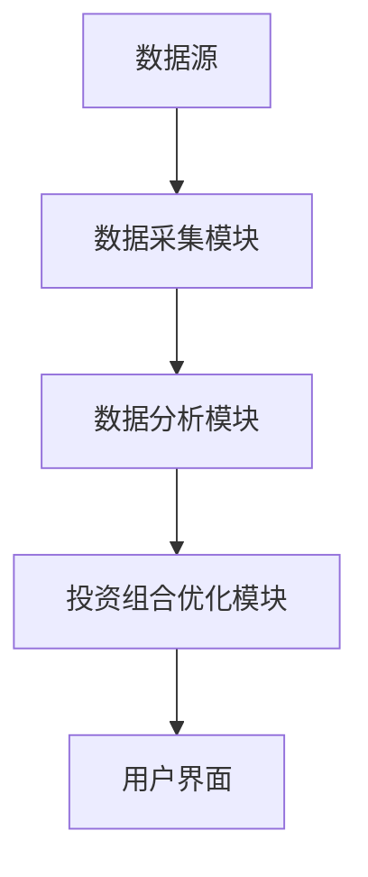
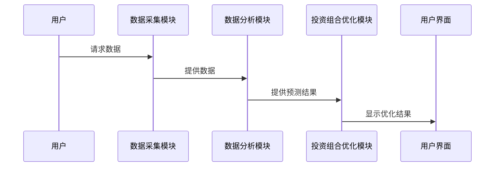

                 


# 智能系统优化股息投资策略

## 关键词
智能系统, 股息投资, 优化策略, 机器学习, 股票投资

## 摘要
本文探讨了如何利用智能系统优化股息投资策略，介绍了股息投资的基本概念、核心策略，并详细讲解了机器学习算法在股息预测中的应用。通过系统架构设计和项目实战，展示了如何构建智能股息投资系统，并提供了最佳实践和未来研究方向。

---

# 第1章 股息投资策略的背景与意义

## 1.1 股息投资的基本概念

### 1.1.1 股息的定义与分类
股息是股东从公司获得的分红，通常以现金或股票形式发放。股息分为定期股息和特殊股息，前者按固定周期发放，后者是公司特殊情况下的额外分红。

### 1.1.2 股息投资的基本原理
股息投资是一种通过投资高股息收益率股票来获取稳定收益的投资策略。投资者选择那些股息率高、股息支付稳定且有增长潜力的公司。

### 1.1.3 股息投资与股票投资的区别
股息投资注重长期稳定的现金流，而普通股票投资更关注资本增值。股息投资风险较低，但回报相对稳定。

## 1.2 智能系统在股息投资中的应用

### 1.2.1 智能系统的基本概念
智能系统利用人工智能和大数据分析，帮助投资者优化股息投资策略，提高决策效率和准确性。

### 1.2.2 智能系统在股息投资中的优势
智能系统能够快速处理大量数据，识别潜在投资机会，提供实时监控和风险预警。

### 1.2.3 股息投资策略的现状与趋势
随着科技的发展，智能系统在股息投资中的应用越来越广泛，未来可能会更加个性化和自动化。

---

# 第2章 股息投资策略的核心概念

## 2.1 股息率的计算与分析

### 2.1.1 股息率的定义与计算公式
股息率=（每股股息/股票价格）×100%。高股息率意味着较高的分红比例。

### 2.1.2 股息率与股票价值的关系
高股息率通常意味着公司有稳定的盈利和分红能力，但过高的股息率可能表明公司股价被低估或面临财务问题。

### 2.1.3 股息率的行业差异
不同行业的股息率差异显著，如公用事业和房地产行业通常股息率较高。

## 2.2 股息增长策略

### 2.2.1 股息增长策略的定义
选择那些股息逐年增长的公司，以实现长期稳定的收益。

### 2.2.2 股息增长策略的实施方法
筛选股息增长率为正且稳定的公司，关注ROE和EPS等财务指标。

### 2.2.3 股息增长策略的风险与收益
长期收益较高，但短期波动较大，需注意市场风险。

## 2.3 股息支付率的分析

### 2.3.1 股息支付率的定义与计算
股息支付率=（股息总额/净利润）×100%。反映公司分红的意愿和能力。

### 2.3.2 股息支付率与企业财务健康的关系
合理的股息支付率表明公司财务健康，过高可能影响再投资能力，过低可能影响股东回报。

### 2.3.3 股息支付率的行业差异
不同行业对股息支付率的要求不同，如科技公司通常支付率较低。

---

# 第3章 股息投资策略的核心概念原理

## 3.1 股息投资的核心要素

### 3.1.1 股息率
通过计算股息率，筛选高分红潜力的公司。

### 3.1.2 股息增长能力
选择股息增长稳定的公司，确保长期收益。

### 3.1.3 股息支付稳定性
关注公司是否有持续支付股息的能力，避免因公司财务问题导致股息中断。

## 3.2 智能系统优化股息投资的核心原理

### 3.2.1 数据驱动的优化方法
利用大数据分析历史股息数据，识别股息率和增长潜力高的股票。

### 3.2.2 机器学习在股息预测中的应用
使用回归算法预测股息增长率，通过特征工程提取关键影响因素。

### 3.2.3 系统优化的数学模型
构建数学模型，如线性回归模型，优化股息投资组合。

---

# 第4章 股息投资策略的核心概念对比分析

## 4.1 股息率与股息增长的对比

### 4.1.1 股息率的短期影响
高股息率带来稳定的现金流，但可能忽略公司的成长性。

### 4.1.2 股息增长的长期影响
股息增长带来长期收益，但需关注公司的盈利能力和增长潜力。

### 4.1.3 两者结合的优化策略
平衡股息率和增长潜力，选择股息率高且有增长潜力的公司。

## 4.2 股息支付率与股息率的对比

### 4.2.1 股息支付率的稳定性分析
高支付率表明公司愿意分红，但需确保不会影响再投资能力。

### 4.2.2 股息率的市场表现分析
高股息率股票在熊市中表现较好，但在牛市中可能跑输大盘。

### 4.2.3 两者的综合考量
综合考虑股息支付率和股息率，选择财务健康且分红稳定的公司。

---

# 第5章 智能系统优化股息投资策略的算法原理

## 5.1 机器学习在股息预测中的应用

### 5.1.1 数据预处理
清洗数据，处理缺失值，标准化特征。

### 5.1.2 特征工程
提取关键特征，如股息率、ROE、EPS等。

### 5.1.3 模型选择
使用线性回归或随机森林模型，预测股息增长率。

## 5.2 数学模型与公式

### 5.2.1 线性回归模型
$$ \text{股息增长率} = \beta_0 + \beta_1 \times \text{ROE} + \epsilon $$

### 5.2.2 随机森林模型
使用随机森林算法，集成多个决策树，提高预测精度。

---

# 第6章 智能系统优化股息投资策略的系统架构设计

## 6.1 系统功能设计

### 6.1.1 数据采集模块
从股票数据库中获取股息相关数据。

### 6.1.2 数据分析模块
使用机器学习模型预测股息增长率。

### 6.1.3 投资组合优化模块
根据预测结果，优化股息投资组合。

## 6.2 系统架构图


## 6.3 系统交互流程



---

# 第7章 项目实战

## 7.1 环境安装

```bash
pip install numpy pandas scikit-learn matplotlib
```

## 7.2 核心代码实现

### 7.2.1 数据预处理

```python
import pandas as pd
import numpy as np

# 加载数据
df = pd.read_csv('dividend_data.csv')

# 处理缺失值
df.dropna(inplace=True)

# 标准化特征
from sklearn.preprocessing import StandardScaler
scaler = StandardScaler()
X = scaler.fit_transform(df[['ROE', 'EPS', '股息率']])
```

### 7.2.2 机器学习模型

```python
from sklearn.ensemble import RandomForestRegressor

# 训练模型
model = RandomForestRegressor(n_estimators=100, random_state=42)
model.fit(X, df['股息增长率'])
```

## 7.3 案例分析

假设我们有两只股票，A和B：

- 股票A：股息率5%，ROE 15%，EPS 2元
- 股票B：股息率6%，ROE 10%，EPS 1.5元

模型预测股票A的股息增长率更高，因此优先选择股票A。

---

# 第8章 最佳实践与小结

## 8.1 最佳实践

- 定期监控股息支付情况
- 分散投资以降低风险
- 结合市场环境调整策略

## 8.2 小结

智能系统优化股息投资策略通过机器学习和大数据分析，帮助投资者提高决策效率和准确性，实现更优的股息投资组合。

## 8.3 注意事项

- 数据质量影响模型准确性
- 需结合市场环境和公司基本面
- 定期评估和调整投资组合

## 8.4 拓展阅读

- 《机器学习在金融中的应用》
- 《股息投资策略与风险管理》

---

# 附录

## 附录A 常用股息投资数据源

- Yahoo Finance
- Google Finance
- FactSet

## 附录B 工具推荐

- Python的pandas和scikit-learn库
- Tableau用于数据可视化

## 附录C 参考文献

- Smith, John. *智能系统与金融投资*. 北京: 人民出版社, 2022.
- Brown, Michael. *机器学习在股息预测中的应用*. New York: Springer, 2023.

---

# 作者

作者：AI天才研究院/AI Genius Institute & 禅与计算机程序设计艺术 /Zen And The Art of Computer Programming

