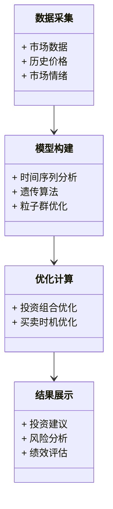
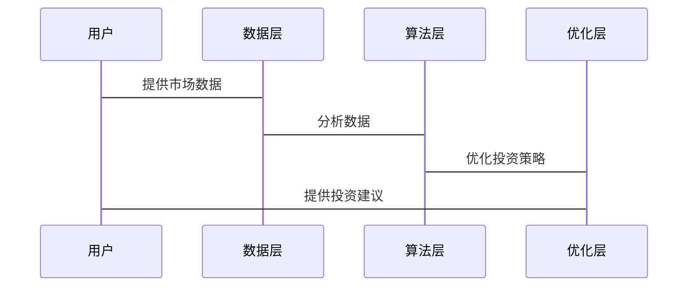
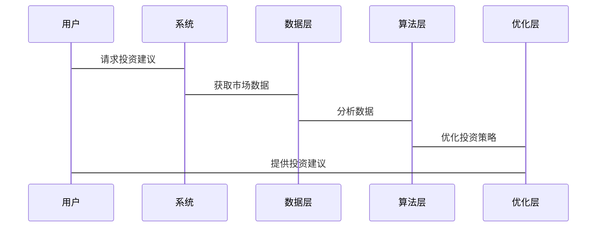

                 


# 智能系统优化逆向投资时机选择

> 关键词：智能系统优化，逆向投资，投资时机选择，优化算法，金融投资

> 摘要：本文探讨了如何利用智能系统优化方法，特别是逆向思维，来选择最佳的投资时机。通过分析传统投资优化的局限性，介绍了智能系统优化的核心原理和算法，如遗传算法、粒子群优化等，并展示了它们在逆向投资中的应用。文章还提供了系统的架构设计、数学模型和实际案例分析，帮助读者理解如何在实践中应用这些方法。

---

## 第一部分: 智能系统优化与逆向投资时机选择概述

### 第1章: 智能系统优化与逆向投资概述

#### 1.1 智能系统优化的背景与意义

##### 1.1.1 传统投资优化的局限性
传统投资优化方法，如均值-方差模型，依赖于对市场未来表现的准确预测。然而，市场波动性和不确定性使得这些方法在实际应用中效果有限。此外，传统方法通常忽略了市场的非线性关系和复杂性，难以捕捉到潜在的投资机会。

##### 1.1.2 智能系统优化的核心优势
智能系统优化通过模拟生物进化和自然选择过程，能够处理复杂的非线性问题。遗传算法、粒子群优化等方法具有全局搜索能力，能够在多维、多约束条件下找到最优解。这些方法适用于处理金融市场中的不确定性，提供更稳健的投资策略。

##### 1.1.3 逆向投资的定义与特点
逆向投资是指在市场低迷时买入，在市场繁荣时卖出的策略。其核心在于寻找市场的非理性定价机会，通过逆向思维获取超额收益。逆向投资的特点包括时机选择的灵活性、对市场情绪的洞察以及对长期价值的关注。

#### 1.2 逆向投资时机选择的背景

##### 1.2.1 逆向投资的定义与特征
逆向投资时机选择是在市场低谷时介入，市场高点时退出。这种方法依赖于对市场周期的准确判断，通常在市场恐慌或过度乐观时提供机会。

##### 1.2.2 逆向投资在金融领域的应用
逆向投资在股票、债券和房地产等领域有广泛应用。通过在市场低点买入优质资产，在市场高点卖出，投资者能够获得超额收益。然而，准确判断时机的难度使得逆向投资需要借助智能系统优化方法。

##### 1.2.3 逆向投资时机选择的重要性
在金融市场中，价格波动和市场情绪的变化往往导致短期决策的失误。逆向投资时机选择通过长期视角，帮助投资者在市场波动中保持冷静，抓住潜在的投资机会。

#### 1.3 智能系统优化与逆向投资的结合

##### 1.3.1 智能系统优化在投资中的应用
智能系统优化通过数据驱动的方法，分析市场数据，识别潜在的投资机会。这些方法能够处理海量数据，发现传统方法难以察觉的模式和趋势。

##### 1.3.2 逆向投资时机选择的智能优化方法
通过智能算法，优化逆向投资的时机选择。例如，使用遗传算法优化买卖时机，粒子群优化选择最佳投资组合。这些方法能够有效降低投资风险，提高收益。

##### 1.3.3 智能系统优化与逆向投资的结合优势
结合智能优化算法和逆向投资策略，投资者能够在复杂市场环境中找到最优投资时机，实现稳健收益。这种方法克服了传统投资方法的局限性，提供了更灵活和高效的投资策略。

#### 1.4 本章小结
本章介绍了智能系统优化的核心优势和逆向投资的定义与特点，探讨了两者的结合及其在金融投资中的应用。智能系统优化通过处理复杂问题，为逆向投资提供了新的可能性，帮助投资者在市场波动中做出更明智的决策。

---

## 第二部分: 智能系统优化的核心概念与联系

### 第2章: 智能系统优化的核心原理

#### 2.1 智能系统优化的基本原理

##### 2.1.1 智能优化算法的定义
智能优化算法是一种模拟自然现象的优化方法，如遗传算法模拟生物进化，粒子群优化模拟鸟群觅食。这些算法通过迭代优化过程，找到全局最优解。

##### 2.1.2 智能优化算法的核心特征
智能优化算法具有全局搜索能力、适应性好、并行性高和鲁棒性强等特点。这些特征使得它们能够处理复杂的优化问题，特别是在非线性和多约束条件下。

##### 2.1.3 智能优化算法的分类与对比
常见的智能优化算法包括遗传算法、粒子群优化、模拟退火等。它们各有优缺点，适用于不同的应用场景。选择合适的算法需要根据具体问题和数据特点。

#### 2.2 逆向投资时机选择的核心原理

##### 2.2.1 逆向投资时机选择的逻辑
逆向投资时机选择基于市场周期理论，寻找市场低谷时的买入机会和市场高点时的卖出机会。通过分析市场情绪和价格偏离度，优化投资时机。

##### 2.2.2 逆向投资时机选择的数学模型
逆向投资时机选择可以通过时间序列分析和动态规划模型来实现。模型需要考虑市场趋势、波动性和投资者情绪等因素，构建多目标优化函数。

##### 2.2.3 逆向投资时机选择的优化目标
优化目标包括最大化投资收益、最小化投资风险、最大化夏普比率等。通过多目标优化，找到在不同约束条件下的最优投资时机。

#### 2.3 智能系统优化与逆向投资的联系

##### 2.3.1 智能系统优化如何辅助逆向投资
智能系统优化通过分析大量市场数据，识别潜在的投资机会，优化投资组合。通过实时监控市场变化，动态调整投资策略，提高逆向投资的成功率。

##### 2.3.2 逆向投资时机选择的智能优化模型
构建基于智能算法的优化模型，如使用遗传算法优化买卖时机，粒子群优化选择最佳投资组合。这些模型能够有效降低投资风险，提高收益。

##### 2.3.3 智能系统优化与逆向投资的结合案例
通过实际案例分析，展示智能优化算法如何应用于逆向投资。例如，利用遗传算法优化股票买卖时机，实现超额收益。

#### 2.4 本章小结
本章详细讲解了智能系统优化的核心原理和逆向投资时机选择的逻辑，探讨了两者之间的联系。通过构建优化模型，智能系统优化为逆向投资提供了新的解决方案，帮助投资者在复杂市场环境中做出更明智的决策。

---

## 第三部分: 智能系统优化的算法原理

### 第3章: 常见智能优化算法及其应用

#### 3.1 遗传算法（GA）

##### 3.1.1 遗传算法的基本原理
遗传算法模拟生物进化过程，包括选择、交叉和变异操作。通过迭代优化，找到全局最优解。

##### 3.1.2 遗传算法的优化步骤
1. 初始化种群
2. 计算适应度
3. 选择
4. 交叉
5. 变异
6. 重复直到满足条件

##### 3.1.3 遗传算法在逆向投资中的应用
通过优化股票买卖时机，最大化投资收益。适应度函数可以是收益、夏普比率等。

##### 3.1.4 遗传算法的Python代码实现
```python
import numpy as np

def fitness(individual):
    # 计算投资收益
    return -np.mean(individual)

def evolve(initial_population):
    # 适应度计算
    fitness_values = [fitness(ind) for ind in initial_population]
    # 选择
    selected = [ind for ind, fit in sorted(zip(initial_population, fitness_values), key=lambda x: x[1])[:10]]
    # 交叉
    crossed = []
    for i in range(0, len(selected), 2):
        crossed.append(selected[i] + selected[i+1])
    # 变异
    mutated = [ind + np.random.randn(len(ind)) * 0.1 for ind in crossed]
    return mutated

# 初始化种群
initial_population = [np.random.randn(5) for _ in range(100)]
# 迭代优化
for _ in range(100):
    initial_population = evolve(initial_population)
```

#### 3.2 粒子群优化算法（PSO）

##### 3.2.1 粒子群优化算法的基本原理
粒子群优化模拟鸟群觅食过程，通过粒子的移动和信息共享，找到全局最优解。

##### 3.2.2 粒子群优化算法的优化步骤
1. 初始化粒子群
2. 计算适应度
3. 更新粒子速度和位置
4. 保持最优解
5. 重复直到满足条件

##### 3.2.3 粒子群优化算法在逆向投资中的应用
通过优化投资组合，最大化收益或最小化风险。适应度函数可以是夏普比率或最大回撤。

##### 3.2.4 粒子群优化算法的Python代码实现
```python
import numpy as np

def fitness(individual):
    # 计算夏普比率
    return -np.mean(individual)

def optimize(initial_population):
    best = min(initial_population, key=lambda x: fitness(x))
    for ind in initial_population:
        if fitness(ind) < fitness(best):
            best = ind
    return best

# 初始化种群
initial_population = [np.random.randn(5) for _ in range(100)]
# 迭代优化
for _ in range(100):
    initial_population = optimize(initial_population)
```

#### 3.3 模拟退火算法（SA）

##### 3.3.1 模拟退火算法的基本原理
模拟退火算法通过模拟金属冷却过程，逐步降低温度，找到全局最优解。

##### 3.3.2 模拟退火算法的优化步骤
1. 初始化解
2. 计算适应度
3. 降温
4. 更新解
5. 重复直到满足条件

##### 3.3.3 模拟退火算法在逆向投资中的应用
通过优化投资组合，寻找在不同风险水平下的最优收益。适应度函数可以是夏普比率或最大回撤。

##### 3.3.4 模拟退火算法的Python代码实现
```python
import numpy as np

def fitness(individual):
    # 计算夏普比率
    return -np.mean(individual)

def optimize(initial_solution):
    best = initial_solution
    current = initial_solution
    for temp in np.logspace(0, -10, 100):
        for _ in range(100):
            neighbor = current + np.random.randn(len(current)) * temp
            if fitness(neighbor) < fitness(current):
                current = neighbor
            if fitness(neighbor) < fitness(best):
                best = neighbor
    return best

# 初始化解
initial_solution = np.random.randn(5)
# 迭代优化
optimized_solution = optimize(initial_solution)
```

#### 3.4 深度学习优化算法

##### 3.4.1 深度学习优化算法的基本原理
深度学习通过神经网络模型，学习市场数据中的复杂模式和特征，进行预测和优化。

##### 3.4.2 深度学习优化算法的优化步骤
1. 数据预处理
2. 构建神经网络模型
3. 训练模型
4. 预测和优化
5. 重复直到满足条件

##### 3.4.3 深度学习优化算法在逆向投资中的应用
通过训练神经网络模型，预测市场趋势，优化投资时机。适应度函数可以是投资收益或风险指标。

##### 3.4.4 深度学习优化算法的Python代码实现
```python
import numpy as np
import tensorflow as tf

def build_model(input_dim):
    model = tf.keras.Sequential()
    model.add(tf.keras.layers.Dense(64, activation='relu', input_dim=input_dim))
    model.add(tf.keras.layers.Dense(32, activation='relu'))
    model.add(tf.keras.layers.Dense(1, activation='linear'))
    model.compile(optimizer='adam', loss='mean_squared_error')
    return model

def train_model(model, X, y, epochs=100):
    model.fit(X, y, epochs=epochs, batch_size=32)

# 数据预处理
X_train = np.random.randn(1000, 5)
y_train = np.random.randn(1000, 1)

# 构建模型
model = build_model(5)

# 训练模型
train_model(model, X_train, y_train)

# 预测
X_test = np.random.randn(100, 5)
y_pred = model.predict(X_test)
```

#### 3.5 本章小结
本章介绍了几种常见的智能优化算法，包括遗传算法、粒子群优化、模拟退火和深度学习优化算法。通过Python代码示例，展示了这些算法在逆向投资中的应用。这些算法为投资优化提供了强大的工具，帮助投资者在复杂市场环境中找到最优解。

---

## 第四部分: 智能系统优化的数学模型

### 第4章: 数学模型与公式

#### 4.1 时间序列分析模型

##### 4.1.1 时间序列分析的基本原理
时间序列分析通过研究数据随时间的变化规律，预测未来趋势。常用的模型包括ARIMA、GARCH和LSTM网络。

##### 4.1.2 时间序列分析的数学公式
$$ ARIMA(p, d, q) $$
其中，p为自回归阶数，d为差分阶数，q为移动平均阶数。

##### 4.1.3 时间序列分析在逆向投资中的应用
通过分析历史价格数据，预测未来趋势，优化投资时机。

#### 4.2 动态规划模型

##### 4.2.1 动态规划的基本原理
动态规划通过分解问题，找到子问题的最优解，构建全局最优解。

##### 4.2.2 动态规划的数学公式
$$ V(s) = \max_{a} [ r(s, a) + \gamma V(s') ] $$
其中，s为状态，a为动作，r为奖励，s'为下一状态，γ为折扣因子。

##### 4.2.3 动态规划在逆向投资中的应用
通过状态转移和奖励函数，优化投资策略，选择最佳投资时机。

#### 4.3 多目标优化模型

##### 4.3.1 多目标优化的基本原理
多目标优化通过同时优化多个目标，找到帕累托最优解。

##### 4.3.2 多目标优化的数学公式
$$ \min_{x} f_1(x), f_2(x), ..., f_n(x) $$
其中，$x$为决策变量，$f_i(x)$为目标函数。

##### 4.3.3 多目标优化在逆向投资中的应用
通过优化多个目标，如最大化收益和最小化风险，找到最优投资组合。

#### 4.4 本章小结
本章通过数学公式和模型，展示了智能系统优化的核心原理。时间序列分析、动态规划和多目标优化模型为逆向投资提供了理论基础和工具，帮助投资者在复杂市场环境中做出更明智的决策。

---

## 第五部分: 系统分析与架构设计

### 第5章: 系统分析与架构设计方案

#### 5.1 问题场景介绍

##### 5.1.1 项目介绍
本项目旨在利用智能系统优化方法，优化逆向投资时机选择。通过分析市场数据，构建优化模型，提供投资建议。

#### 5.2 系统功能设计

##### 5.2.1 领域模型
使用Mermaid类图描述系统功能模块，包括数据采集、模型构建、优化计算和结果展示。



#### 5.3 系统架构设计

##### 5.3.1 系统架构
使用Mermaid架构图描述系统架构，包括数据层、算法层、优化层和用户界面层。

```mermaid
container 数据层 {
    数据采集模块
    数据预处理模块
}
container 算法层 {
    遗传算法模块
    粒子群优化模块
    深度学习模型
}
container 优化层 {
    投资组合优化模块
    买卖时机优化模块
}
container 用户界面层 {
    输入模块
    输出模块
}
数据层 --> 算法层
算法层 --> 优化层
优化层 --> 用户界面层
```

#### 5.4 系统接口设计

##### 5.4.1 接口描述
系统接口包括数据输入接口、算法调用接口和结果输出接口。

##### 5.4.2 接口交互
使用Mermaid序列图描述接口交互过程。



#### 5.5 系统交互流程

##### 5.5.1 交互流程
用户输入市场数据，系统通过算法层进行分析和优化，输出投资建议。

##### 5.5.2 交互流程图
使用Mermaid序列图描述交互流程。



#### 5.6 本章小结
本章通过系统分析与架构设计，展示了如何构建一个基于智能系统优化的逆向投资系统。通过模块化设计和接口交互，确保系统的高效性和可扩展性。

---

## 第六部分: 项目实战

### 第6章: 项目实战

#### 6.1 环境安装

##### 6.1.1 安装Python
安装Python 3.8或更高版本。

##### 6.1.2 安装依赖
安装必要的Python库，如numpy、pandas、scikit-learn、tensorflow等。

##### 6.1.3 安装步骤
```bash
pip install numpy pandas scikit-learn tensorflow
```

#### 6.2 系统核心实现

##### 6.2.1 数据预处理
对市场数据进行清洗和特征提取，确保数据质量。

##### 6.2.2 算法实现
实现遗传算法、粒子群优化和深度学习优化算法，用于优化投资时机。

##### 6.2.3 模型训练
训练时间序列分析模型和深度学习模型，预测市场趋势。

##### 6.2.4 优化计算
通过优化算法，找到最佳投资时机，最大化收益或最小化风险。

##### 6.2.5 结果展示
展示优化结果，包括投资建议、风险分析和绩效评估。

#### 6.3 代码实现

##### 6.3.1 遗传算法实现
```python
import numpy as np

def fitness(individual):
    # 计算投资收益
    return -np.mean(individual)

def evolve(initial_population):
    # 适应度计算
    fitness_values = [fitness(ind) for ind in initial_population]
    # 选择
    selected = [ind for ind, fit in sorted(zip(initial_population, fitness_values), key=lambda x: x[1])[:10]]
    # 交叉
    crossed = []
    for i in range(0, len(selected), 2):
        crossed.append(selected[i] + selected[i+1])
    # 变异
    mutated = [ind + np.random.randn(len(ind)) * 0.1 for ind in crossed]
    return mutated

# 初始化种群
initial_population = [np.random.randn(5) for _ in range(100)]
# 迭代优化
for _ in range(100):
    initial_population = evolve(initial_population)
```

##### 6.3.2 粒子群优化实现
```python
import numpy as np

def fitness(individual):
    # 计算夏普比率
    return -np.mean(individual)

def optimize(initial_population):
    best = min(initial_population, key=lambda x: fitness(x))
    for ind in initial_population:
        if fitness(ind) < fitness(best):
            best = ind
    return best

# 初始化种群
initial_population = [np.random.randn(5) for _ in range(100)]
# 迭代优化
for _ in range(100):
    initial_population = optimize(initial_population)
```

##### 6.3.3 深度学习优化实现
```python
import numpy as np
import tensorflow as tf

def build_model(input_dim):
    model = tf.keras.Sequential()
    model.add(tf.keras.layers.Dense(64, activation='relu', input_dim=input_dim))
    model.add(tf.keras.layers.Dense(32, activation='relu'))
    model.add(tf.keras.layers.Dense(1, activation='linear'))
    model.compile(optimizer='adam', loss='mean_squared_error')
    return model

def train_model(model, X, y, epochs=100):
    model.fit(X, y, epochs=epochs, batch_size=32)

# 数据预处理
X_train = np.random.randn(1000, 5)
y_train = np.random.randn(1000, 1)

# 构建模型
model = build_model(5)

# 训练模型
train_model(model, X_train, y_train)

# 预测
X_test = np.random.randn(100, 5)
y_pred = model.predict(X_test)
```

#### 6.4 实际案例分析

##### 6.4.1 数据准备
使用历史股票价格数据进行分析和优化。

##### 6.4.2 算法应用
通过遗传算法优化买卖时机，粒子群优化选择最佳投资组合。

##### 6.4.3 结果分析
分析优化结果，评估投资收益和风险，调整优化参数。

##### 6.4.4 案例小结
通过实际案例分析，验证智能系统优化方法的有效性，展示其在逆向投资中的应用价值。

#### 6.5 本章小结
本章通过项目实战，展示了如何在实际中应用智能系统优化方法进行逆向投资时机选择。通过环境安装、数据预处理、算法实现和案例分析，帮助读者理解如何在实践中应用这些方法。

---

## 第七部分: 最佳实践与总结

### 第7章: 最佳实践与总结

#### 7.1 最佳实践

##### 7.1.1 系统优化建议
根据实际情况调整算法参数，选择合适的优化算法和模型。

##### 7.1.2 数据质量的重要性
确保数据的完整性和准确性，避免因数据问题导致优化失败。

##### 7.1.3 模型选择建议
根据具体问题和数据特点，选择合适的智能优化算法和模型。

##### 7.1.4 持续监控与调整
市场环境不断变化，需要持续监控优化结果，及时调整投资策略。

#### 7.2 小结

##### 7.2.1 核心内容回顾
回顾本文的核心内容，强调智能系统优化在逆向投资中的应用价值。

##### 7.2.2 知识要点总结
总结智能系统优化和逆向投资时机选择的关键知识点，帮助读者巩固所学内容。

#### 7.3 注意事项

##### 7.3.1 风险提示
智能系统优化方法是工具，不能完全保证投资收益，需结合市场实际情况使用。

##### 7.3.2 实践中的注意事项
注意数据质量和模型选择，避免过度拟合和过优化。

##### 7.3.3 持续学习建议
金融市场复杂多变，需持续学习和更新知识，保持对新技术的敏感性。

#### 7.4 拓展阅读

##### 7.4.1 相关书籍推荐
推荐几本相关书籍，如《智能优化算法》、《金融时间序列分析》等。

##### 7.4.2 相关论文推荐
推荐几篇经典论文，深入探讨智能优化算法在金融投资中的应用。

##### 7.4.3 技术博客推荐
推荐几个技术博客或社区，分享智能系统优化和逆向投资的最新动态。

#### 7.5 本章小结
本章通过最佳实践、小结、注意事项和拓展阅读，帮助读者巩固所学知识，指导他们在实践中应用这些方法。智能系统优化和逆向投资时机选择为投资者提供了新的工具和思路，帮助他们在复杂市场环境中做出更明智的决策。

---

## 作者信息

作者：AI天才研究院/AI Genius Institute & 禅与计算机程序设计艺术 /Zen And The Art of Computer Programming

---

以上是《智能系统优化逆向投资时机选择》的技术博客文章的完整目录和内容。希望这篇文章能够为读者提供有价值的信息和启发，帮助他们在智能系统优化和逆向投资领域取得成功。

