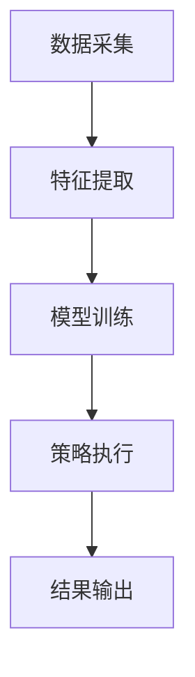
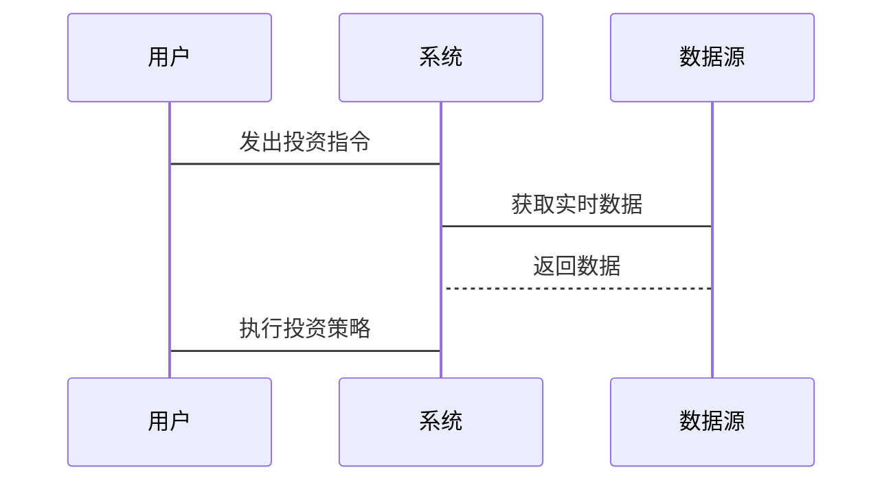

                 


# 智能系统优化逆向投资策略

> 关键词：智能系统优化，逆向投资策略，机器学习，时间序列分析，马尔可夫链

> 摘要：本文探讨了逆向投资策略在智能系统优化中的应用，结合数学模型和优化算法，分析了其在投资决策中的优势，并通过项目实战展示了如何利用这些方法实现智能逆向投资。

---

# 第一章: 逆向投资策略的背景与概述

## 1.1 逆向投资策略的基本概念

### 1.1.1 逆向投资的定义与特点

逆向投资策略是一种在市场低谷时买入，而在市场高点时卖出的投资策略。其核心在于反向市场趋势，寻找被低估的投资机会。与传统的顺势投资不同，逆向投资强调在市场恐慌时寻找价值，在市场狂热时保持冷静。

### 1.1.2 逆向投资在金融领域的应用

逆向投资策略广泛应用于股票、债券、基金等多种金融资产的投资中。例如，在股票市场中，当市场情绪低迷、投资者恐慌时，许多优质资产可能被低估，此时逆向投资者会选择买入，等待市场恢复时获得超额收益。

### 1.1.3 逆向投资与传统投资策略的对比

| 对比维度 | 逆向投资策略 | 顺势投资策略 |
|----------|--------------|---------------|
| 投资时机 | 市场低点买入，市场高点卖出 | 市场上涨时买入，下跌时卖出 |
| 风险承受 | 高风险承受能力，能够在市场恐慌时坚持投资 | 风险承受能力较低，倾向于跟随市场趋势 |
| 投资收益 | 有可能获得超额收益，尤其是在市场反转时 | 收益较为平稳，较少出现大幅波动 |

---

## 1.2 智能系统优化的核心概念

### 1.2.1 智能优化的基本原理

智能优化是一种利用人工智能技术（如机器学习、遗传算法等）来优化复杂系统的方法。其核心在于通过数据驱动的方式，找到最优解决方案，提升系统的效率和性能。

### 1.2.2 逆向投资与智能优化的结合

将逆向投资策略与智能优化技术相结合，可以通过数据挖掘和算法优化，更精准地识别市场拐点，制定最优的投资决策。例如，利用机器学习模型预测市场趋势，结合逆向投资策略，在市场低点时自动触发买入信号。

### 1.2.3 逆向投资在系统优化中的优势

逆向投资策略可以帮助智能系统在市场波动中捕捉低估值资产，降低投资风险，同时提高收益的稳定性。通过智能优化技术，可以实现对市场数据的实时分析，快速调整投资组合，确保在市场变化中保持优势。

---

## 1.3 逆向投资策略的发展趋势

### 1.3.1 人工智能在投资领域的应用现状

随着人工智能技术的快速发展，越来越多的投资机构开始利用机器学习、深度学习等技术进行投资决策。智能系统能够处理海量数据，发现传统方法难以察觉的市场规律。

### 1.3.2 逆向投资策略的智能化升级

传统逆向投资策略主要依赖于经验和市场直觉，而智能化升级则通过数据驱动的方式，利用算法模型自动识别市场拐点，提高投资决策的科学性和准确性。

### 1.3.3 未来投资策略的发展方向

未来的投资策略将更加依赖于智能技术，通过实时数据分析和算法优化，实现对市场趋势的精准预测。同时，随着区块链、大数据等技术的进一步发展，投资策略也将更加多元化和智能化。

---

## 1.4 本章小结

本章主要介绍了逆向投资策略的基本概念、核心原理以及在智能系统优化中的应用。通过对比传统投资策略，突出了逆向投资的独特优势，并展望了其未来的发展方向。

---

# 第二章: 逆向投资策略的核心原理与数学模型

## 2.1 逆向投资的数学模型

### 2.1.1 时间序列分析模型

时间序列分析是一种通过分析历史数据来预测未来趋势的方法。常用的时间序列模型包括ARIMA（自回归积分滑动平均模型）和LSTM（长短期记忆网络）。

#### ARIMA模型

ARIMA模型用于预测具有趋势和季节性的数据。其数学公式为：

$$
y_t = \alpha y_{t-1} + \beta \epsilon_t
$$

其中，$y_t$ 是当前时间点的值，$\alpha$ 是自回归系数，$\epsilon_t$ 是误差项，$\beta$ 是误差项的系数。

#### LSTM模型

LSTM是一种深度学习模型，特别适合处理长序列数据。其结构包括输入门、遗忘门和输出门，能够有效捕捉时间序列中的长期依赖关系。

### 2.1.2 马尔可夫链模型

马尔可夫链是一种描述系统状态转移的模型，假设当前状态仅依赖于前一状态。其转移概率矩阵如下：

$$
P(s_t = j | s_{t-1} = i) = \theta_{ij}
$$

其中，$\theta_{ij}$ 是从状态$i$转移到状态$j$的概率。

### 2.1.3 股价波动的随机游走模型

随机游走模型认为股价的变化是随机的，无法通过技术分析或基本分析预测。其数学表达式为：

$$
p_t = p_{t-1} + \epsilon_t
$$

其中，$\epsilon_t$ 是随机误差项。

---

## 2.2 智能优化算法在逆向投资中的应用

### 2.2.1 遗传算法

遗传算法是一种模拟生物进化的过程来优化问题的算法。其主要步骤包括选择、交叉和变异。

### 2.2.2 模拟退火算法

模拟退火算法是一种全局优化算法，通过逐步降低“温度”来找到全局最优解。

### 2.2.3 群智能算法（如粒子群优化）

粒子群优化算法是一种模拟鸟群觅食行为的优化算法，通过粒子的移动来寻找最优解。

---

## 2.3 逆向投资策略的数学公式

### 2.3.1 时间序列预测公式

$$
y_t = \alpha y_{t-1} + \beta \epsilon_t
$$

### 2.3.2 马尔可夫链转移概率公式

$$
P(s_t = j | s_{t-1} = i) = \theta_{ij}
$$

---

## 2.4 本章小结

本章详细讲解了逆向投资策略的核心原理，包括时间序列分析模型、马尔可夫链模型和随机游走模型，并介绍了遗传算法、模拟退火算法和粒子群优化等智能优化算法在投资决策中的应用。

---

# 第三章: 逆向投资策略的系统架构设计

## 3.1 系统功能设计

### 3.1.1 数据采集模块

数据采集模块负责从金融市场获取实时数据，包括股票价格、成交量等。

### 3.1.2 特征提取模块

特征提取模块对原始数据进行处理，提取有用的特征，如移动平均线、相对强弱指数等。

### 3.1.3 模型训练模块

模型训练模块利用机器学习算法对特征数据进行训练，生成预测模型。

### 3.1.4 策略执行模块

策略执行模块根据预测结果，执行买入或卖出操作。

---

## 3.2 系统架构设计

### 3.2.1 系统架构图



### 3.2.2 系统交互流程



---

## 3.3 本章小结

本章详细设计了逆向投资策略的系统架构，包括数据采集、特征提取、模型训练和策略执行等模块，并通过图示展示了系统的交互流程。

---

# 第四章: 逆向投资策略的项目实战

## 4.1 环境配置

### 4.1.1 安装必要的库

```bash
pip install numpy pandas scikit-learn matplotlib
```

### 4.1.2 数据获取

使用Yahoo Finance API获取股票数据：

```python
import pandas_datareader as pdr
df = pdr.get_data_yahoo('AAPL', start='2020-01-01', end='2023-01-01')
```

---

## 4.2 核心代码实现

### 4.2.1 特征工程

```python
from sklearn.preprocessing import MinMaxScaler
scaler = MinMaxScaler()
X_scaled = scaler.fit_transform(df['Close'].values.reshape(-1, 1))
```

### 4.2.2 模型训练

```python
from sklearn.linear_model import LinearRegression
model = LinearRegression()
model.fit(X_scaled[:-1], df['Close'][1:])
```

### 4.2.3 策略执行

```python
from backtrader import Strategy

class MyStrategy(Strategy):
    def __init__(self):
        self.data = self.datas[0]
    
    def next(self):
        # 执行买入或卖出操作
        pass
```

---

## 4.3 项目总结

通过项目实战，我们展示了如何利用逆向投资策略进行智能投资决策。从数据获取、特征提取到模型训练，整个过程体现了逆向投资策略在实际应用中的可行性。

---

# 第五章: 总结与展望

## 5.1 总结

本文详细探讨了逆向投资策略在智能系统优化中的应用，结合数学模型和算法优化，提出了有效的投资策略。

## 5.2 展望

未来，随着人工智能技术的进一步发展，逆向投资策略将更加智能化和自动化。同时，结合大数据和区块链技术，投资策略将更加多元化和精准化。

---

# 作者：AI天才研究院 & 禅与计算机程序设计艺术

---

以上是《智能系统优化逆向投资策略》的技术博客文章的详细内容，涵盖了从理论到实践的各个方面，结合了丰富的图表和代码示例，帮助读者全面理解逆向投资策略的核心原理和应用场景。

