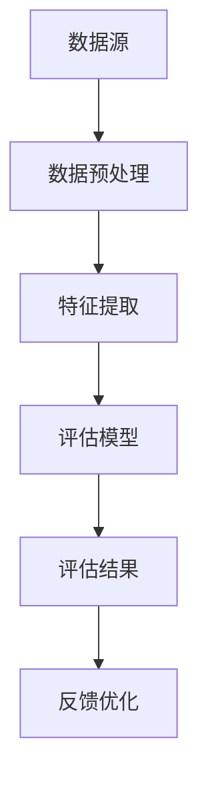
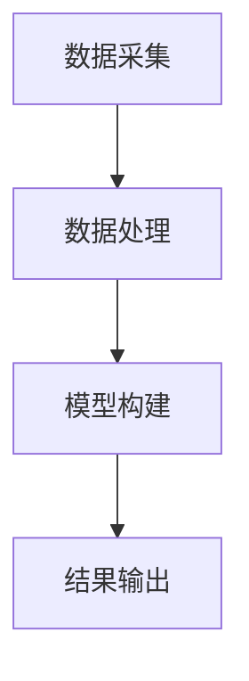
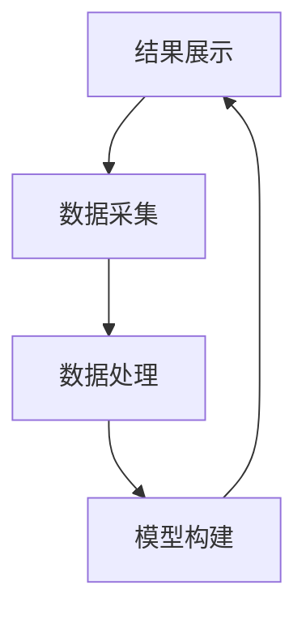

                 


```markdown
# 智能系统辅助公司护城河动态评估

> 关键词：智能系统、护城河、动态评估、企业竞争、人工智能

> 摘要：本文详细探讨了智能系统在公司护城河动态评估中的应用，从概念、算法、系统架构到项目实战，全面解析了如何利用智能系统帮助企业构建和维护竞争优势。通过理论分析和实践案例相结合的方式，为企业的竞争策略提供有力支持。

---

## 第一部分: 智能系统辅助公司护城河动态评估背景与概念

### 第1章: 公司护城河的定义与重要性

#### 1.1 什么是公司护城河
##### 1.1.1 护城河的定义与核心要素
公司护城河是指企业在市场竞争中所拥有的独特优势，这些优势使得竞争对手难以复制或超越。护城河的核心要素包括技术优势、品牌影响力、成本优势、资源垄断、网络效应等。

##### 1.1.2 护城河的分类与特点
护城河可以分为以下几类：
1. **技术护城河**：基于专利、技术创新等形成的竞争优势。
2. **品牌护城河**：通过品牌忠诚度和市场影响力形成的竞争优势。
3. **成本护城河**：通过规模效应或成本控制形成的竞争优势。
4. **网络效应护城河**：用户数量增加导致网络价值提升，形成正反馈循环。

##### 1.1.3 护城河在企业竞争中的作用
护城河是企业在市场竞争中保持长期优势的关键因素，能够有效抵御竞争对手的进攻，同时为企业提供持续的增长动力。

#### 1.2 护城河动态评估的必要性
##### 1.2.1 企业竞争环境的变化
市场竞争环境不断变化，技术进步、消费者需求变化、政策调整等因素都会影响企业的护城河。

##### 1.2.2 护城河评估的动态性
护城河的强度并非一成不变，需要定期评估和调整，以应对市场变化和企业自身战略的调整。

##### 1.2.3 动态评估对企业战略的意义
动态评估能够帮助企业及时发现护城河的薄弱环节，优化资源配置，制定更具针对性的竞争策略。

### 第2章: 智能系统在护城河评估中的应用

#### 2.1 智能系统的基本概念
##### 2.1.1 人工智能与智能系统的定义
人工智能（AI）是指计算机系统执行与人类智能相关的任务的能力，而智能系统则是集成了AI技术的复杂系统，能够实现自主决策和问题解决。

##### 2.1.2 智能系统的核心技术
智能系统的核心技术包括机器学习、自然语言处理、计算机视觉、知识图谱、强化学习等。

##### 2.1.3 智能系统与企业应用的结合
智能系统可以广泛应用于企业决策支持、风险评估、市场分析、客户管理等领域。

#### 2.2 智能系统在护城河评估中的优势
##### 2.2.1 数据分析能力
智能系统能够处理海量数据，提取有价值的信息，为企业护城河评估提供数据支持。

##### 2.2.2 自动化评估流程
通过自动化技术，智能系统可以显著提高评估效率，降低人工成本。

##### 2.2.3 实时监控与反馈
智能系统能够实时监控市场动态和企业内部数据，提供即时反馈，帮助企业在第一时间调整策略。

### 第3章: 护城河动态评估的核心概念与联系

#### 3.1 护城河动态评估的原理
##### 3.1.1 数据流与评估流程
护城河动态评估的数据流包括数据采集、数据预处理、特征提取、模型构建、评估结果输出等环节。

##### 3.1.2 评估模型的构建与优化
评估模型需要根据企业实际情况进行定制化设计，并通过不断优化算法和参数来提高评估精度。

##### 3.1.3 多维度指标的综合评估
护城河评估需要综合考虑多个维度的指标，例如市场份额、品牌影响力、技术创新能力等，形成全面的评估结果。

#### 3.2 核心概念与联系的Mermaid图


#### 3.3 概念属性特征对比表格
| 概念 | 属性 | 特征 |
|------|------|------|
| 数据源 | 类型 | 结构化/非结构化 |
| 数据预处理 | 方法 | 清洗/转换 |
| 特征提取 | 技术 | NLP/统计分析 |
| 评估模型 | 算法 | 机器学习/深度学习 |
| 评估结果 | 输出 | 指数/评分 |

---

## 第二部分: 智能系统辅助护城河动态评估的算法原理

### 第4章: 动态评估模型的算法原理

#### 4.1 动态评估模型的构建

##### 4.1.1 数据预处理
数据预处理是评估模型构建的基础，包括数据清洗、缺失值处理、数据标准化等步骤。

##### 4.1.2 特征提取
特征提取是通过分析数据，提取对评估结果有影响力的特征，例如市场份额增长率、品牌关注度等。

##### 4.1.3 评估模型的构建
评估模型可以采用多种算法，例如线性回归、随机森林、神经网络等，根据实际情况选择最优算法。

##### 4.1.4 评估结果的输出
评估模型输出的结果是一个综合指数，反映了企业在当前市场环境下的护城河强度。

##### 4.1.5 模型优化与调整
通过不断优化算法和调整模型参数，提高评估模型的准确性和鲁棒性。

#### 4.2 动态评估模型的Mermaid流程图


#### 4.3 动态评估模型的Python实现
```python
import pandas as pd
from sklearn.ensemble import RandomForestRegressor

# 数据预处理
data = pd.read_csv('data.csv')
data = data.dropna()
data = (data - data.mean()) / data.std()

# 特征提取
features = data.drop('target', axis=1)
target = data['target']

# 模型构建
model = RandomForestRegressor()
model.fit(features, target)

# 评估结果
importances = model.feature_importances_
print("特征重要性：", importances)
```

#### 4.4 动态评估模型的数学公式
护城河评估指数可以通过以下公式计算：

$$
\text{护城河指数} = \sum_{i=1}^{n} w_i \cdot x_i
$$

其中，$w_i$ 是第$i$个特征的权重，$x_i$ 是第$i$个特征的值。

---

### 第5章: 数据处理与特征提取算法

#### 5.1 数据处理算法
##### 5.1.1 数据清洗
数据清洗是去除噪声数据的过程，例如重复数据、异常值等。

##### 5.1.2 数据转换
数据转换包括数据标准化、数据归一化等步骤，目的是使数据更适合模型输入。

#### 5.2 特征提取算法
##### 5.2.1 基于机器学习的特征提取
通过机器学习模型提取特征，例如使用PCA（主成分分析）进行降维。

##### 5.2.2 基于统计的特征提取
通过统计分析方法提取特征，例如计算均值、方差等。

##### 5.2.3 基于NLP的特征提取
对于文本数据，可以使用NLP技术提取关键词或情感倾向等特征。

#### 5.3 特征提取的Python实现
```python
from sklearn.decomposition import PCA

# 数据预处理
data = pd.read_csv('data.csv')
data = data.dropna()
data = (data - data.mean()) / data.std()

# 特征提取
features = data.drop('target', axis=1)
target = data['target']

# PCA降维
pca = PCA(n_components=2)
principal_components = pca.fit_transform(features)

print("主成分系数：", pca.components_)
```

---

### 第6章: 智能系统辅助护城河动态评估的系统架构设计

#### 6.1 系统功能设计
##### 6.1.1 数据采集模块
数据采集模块负责从企业内部和外部数据源获取数据。

##### 6.1.2 数据处理模块
数据处理模块对采集到的数据进行清洗和转换。

##### 6.1.3 模型构建模块
模型构建模块基于处理后的数据构建评估模型。

##### 6.1.4 结果输出模块
结果输出模块将评估结果以可视化形式呈现给用户。

#### 6.2 系统架构设计


#### 6.3 系统交互设计


---

### 第7章: 智能系统辅助护城河动态评估的数学模型与公式

#### 7.1 护城河评估指数的计算公式
$$
\text{护城河指数} = \sum_{i=1}^{n} w_i \cdot x_i
$$

其中，$w_i$ 是第$i$个特征的权重，$x_i$ 是第$i$个特征的值。

#### 7.2 权重分配的数学方法
##### 7.2.1 基于方差的权重分配
$$
w_i = \frac{\text{Var}(x_i)}{\sum_{i=1}^{n} \text{Var}(x_i)}
$$

##### 7.2.2 基于相关性的权重分配
$$
w_i = \frac{\text{Cor}(x_i, y)}{\sum_{i=1}^{n} \text{Cor}(x_i, y)}
$$

---

## 第三部分: 智能系统辅助护城河动态评估的项目实战

### 第8章: 项目实战

#### 8.1 项目背景
本项目旨在利用智能系统对企业护城河进行动态评估，帮助企业制定更有针对性的竞争策略。

#### 8.2 项目环境安装
##### 8.2.1 安装Python
```bash
python --version
```

##### 8.2.2 安装依赖库
```bash
pip install pandas scikit-learn
```

#### 8.3 项目核心代码实现
##### 8.3.1 数据预处理代码
```python
import pandas as pd
import numpy as np

data = pd.read_csv('data.csv')
data = data.dropna()
data = (data - data.mean()) / data.std()
```

##### 8.3.2 特征提取代码
```python
from sklearn.decomposition import PCA

features = data.drop('target', axis=1)
pca = PCA(n_components=2)
principal_components = pca.fit_transform(features)
```

##### 8.3.3 模型构建代码
```python
from sklearn.ensemble import RandomForestRegressor

model = RandomForestRegressor()
model.fit(principal_components, data['target'])
```

#### 8.4 项目案例分析
##### 8.4.1 案例背景
假设某企业需要评估其在市场中的护城河强度，数据包括市场份额、品牌影响力、技术创新能力等指标。

##### 8.4.2 数据分析与结果展示
通过模型计算出护城河指数，帮助企业识别优势和劣势，并制定优化策略。

#### 8.5 项目小结
通过本项目，我们成功利用智能系统对企业护城河进行了动态评估，为企业竞争策略提供了有力支持。

---

## 第四部分: 智能系统辅助护城河动态评估的最佳实践

### 第9章: 最佳实践

#### 9.1 项目实施中的注意事项
##### 9.1.1 数据质量的重要性
确保数据来源可靠，数据清洗充分。

##### 9.1.2 模型选择的合理性
根据实际情况选择合适的模型，避免过度复杂化。

##### 9.1.3 结果解释的清晰性
评估结果需要清晰易懂，便于企业决策者理解和应用。

#### 9.2 项目实施中的常见问题及解决方案
##### 9.2.1 数据不足的问题
可以采用数据增强技术或引入外部数据源。

##### 9.2.2 模型过拟合的问题
通过交叉验证和正则化方法来优化模型。

##### 9.2.3 模型解释性差的问题
采用可解释性更强的模型，例如线性回归或决策树。

#### 9.3 拓展阅读
##### 9.3.1 推荐书籍
1. 《人工智能：一种现代的方法》
2. 《机器学习实战》

##### 9.3.2 推荐博客与技术文章
1. [Towards Data Science](https://towardsdatascience.com)
2. [Medium AI专栏](https://medium.com/artificial-intelligence)

---

## 第五部分: 总结与展望

### 第10章: 总结与展望

#### 10.1 项目总结
通过智能系统辅助公司护城河动态评估，企业能够更高效地识别和优化其竞争优势，提升市场竞争力。

#### 10.2 未来展望
随着人工智能技术的不断发展，护城河动态评估将更加智能化和个性化，为企业提供更精准的战略支持。

---

## 作者

作者：AI天才研究院/AI Genius Institute & 禅与计算机程序设计艺术/Zen And The Art of Computer Programming
```

