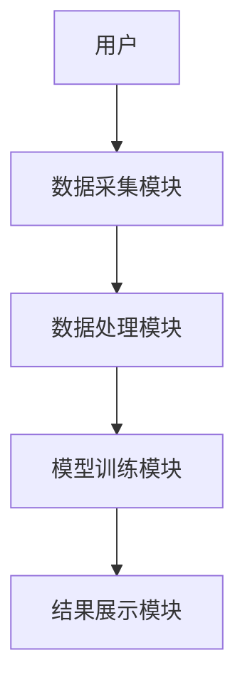

                 


# 智能系统辅助公司护城河评估

## 关键词
智能系统，护城河评估，企业竞争力，数据分析，机器学习，系统架构

## 摘要
护城河是企业在市场竞争中维持长期竞争优势的关键。随着智能化技术的发展，智能系统在护城河评估中的作用日益重要。本文系统地探讨了智能系统在护城河评估中的应用，从数据采集、分析到模型构建，再到系统架构设计，结合实际案例分析，展示了如何利用智能系统提升护城河评估的效率和准确性。通过详细讲解相关算法和系统设计，本文为读者提供了一套完整的解决方案。

---

## 第1章: 智能系统辅助护城河评估的背景与意义

### 1.1 护城河的定义与内涵

#### 1.1.1 护城河的定义
护城河是企业在市场中建立的竞争优势，使其能够抵御竞争对手的侵蚀。这种优势可以是技术、品牌、资源、成本或商业模式等。

#### 1.1.2 护城河的核心要素
- **技术优势**：企业掌握的核心技术和专利。
- **市场地位**：企业在市场中的份额和影响力。
- **资源壁垒**：企业独有的资源，如原材料、数据等。
- **经济模式**：独特的商业模式或成本结构。

#### 1.1.3 护城河的分类与特征
护城河可以分为技术型、资源型、市场型和模式型四种类型，每种类型都有其独特的特征和评估指标。

---

### 1.2 智能系统在护城河评估中的作用

#### 1.2.1 智能系统的基本概念
智能系统是通过人工智能技术实现的自动化决策支持系统，能够处理海量数据，提取有用信息，辅助人类进行决策。

#### 1.2.2 智能系统在企业评估中的优势
- **高效性**：智能系统能够快速处理大量数据，提高评估效率。
- **准确性**：通过机器学习算法，智能系统能够提供更精准的评估结果。
- **动态性**：智能系统能够实时更新数据，适应市场变化。

#### 1.2.3 护城河评估与智能系统的结合
通过智能系统，企业可以实时监控市场动态，评估自身竞争优势，并制定相应的战略调整。

---

### 1.3 本文的核心目标与框架

#### 1.3.1 核心目标
本文旨在探讨智能系统在护城河评估中的应用，提供一套完整的解决方案，帮助企业在竞争中建立和维护护城河。

#### 1.3.2 框架结构
- 第1章：背景与意义
- 第2章：护城河的构成要素
- 第3章：智能系统辅助护城河评估的关键技术
- 第4章：算法实现与系统架构设计
- 第5章：项目实战与案例分析

---

## 第2章: 护城河的构成要素

### 2.1 技术优势

#### 2.1.1 技术优势的定义
技术优势是指企业在技术开发、创新和应用方面拥有的独特优势。

#### 2.1.2 技术优势的评估指标
- 技术专利数量
- 技术创新速度
- 技术应用效果

#### 2.1.3 案例分析
以某科技公司为例，通过分析其专利数量和技术应用情况，评估其技术优势。

### 2.2 市场地位

#### 2.2.1 市场地位的定义
市场地位是指企业在市场中的份额和影响力。

#### 2.2.2 市场地位的评估指标
- 市场份额
- 品牌知名度
- 客户忠诚度

#### 2.2.3 案例分析
以某行业龙头企业为例，分析其市场份额和品牌影响力。

### 2.3 资源壁垒

#### 2.3.1 资源壁垒的定义
资源壁垒是指企业通过独有的资源（如原材料、数据）建立的竞争优势。

#### 2.3.2 资源壁垒的评估指标
- 资源独占性
- 资源获取成本
- 资源利用率

#### 2.3.3 案例分析
以某资源型企业为例，分析其资源壁垒的构建与应用。

### 2.4 经济模式

#### 2.4.1 经济模式的定义
经济模式是指企业的收入来源和成本结构。

#### 2.4.2 经济模式的评估指标
- 收入来源多样性
- 成本结构优化
- 资本回报率

#### 2.4.3 案例分析
以某互联网公司为例，分析其独特的商业模式和成本结构。

---

## 第3章: 智能系统辅助护城河评估的关键技术

### 3.1 数据采集与处理

#### 3.1.1 数据采集的定义与方法
数据采集是通过各种渠道获取企业相关数据的过程。

#### 3.1.2 数据处理的技术与流程
- 数据清洗
- 数据转换
- 数据存储

#### 3.1.3 数据清洗与预处理
通过去除噪声数据、填补缺失值等方法，确保数据质量。

### 3.2 数据分析与建模

#### 3.2.1 数据分析的定义与方法
数据分析是通过对数据的统计分析，提取有用信息的过程。

#### 3.2.2 数据建模的原理与流程
- 数据建模的基本原理
- 数据建模的步骤与流程

#### 3.2.3 常用数据分析工具与技术
- Python的pandas库
- 数据可视化工具如Matplotlib

### 3.3 智能算法与模型

#### 3.3.1 机器学习算法的定义与分类
机器学习算法分为监督学习、无监督学习和强化学习。

#### 3.3.2 深度学习算法的定义与分类
深度学习算法包括卷积神经网络（CNN）、循环神经网络（RNN）等。

#### 3.3.3 智能算法在护城河评估中的应用
通过机器学习算法，对企业各项指标进行预测和评估。

---

## 第4章: 护城河评估的数学模型与算法实现

### 4.1 护城河评估的数学模型

#### 4.1.1 护城河评估的指标体系
- 技术优势指标
- 市场地位指标
- 资源壁垒指标
- 经济模式指标

#### 4.1.2 护城河评估的权重分配
通过层次分析法（AHP）确定各指标的权重。

#### 4.1.3 护城河评估的综合得分计算
综合得分公式：$$ S = \sum_{i=1}^{n} w_i x_i $$，其中$w_i$为权重，$x_i$为指标值。

### 4.2 算法实现的步骤与流程

#### 4.2.1 数据预处理
- 数据清洗
- 数据标准化

#### 4.2.2 模型训练
- 选择合适的机器学习算法
- 训练模型

#### 4.2.3 模型评估与优化
- 交叉验证
- 调参优化

---

## 第5章: 系统架构设计与项目实战

### 5.1 系统架构设计

#### 5.1.1 功能模块设计
- 数据采集模块
- 数据处理模块
- 模型训练模块
- 结果展示模块

#### 5.1.2 系统架构图


#### 5.1.3 系统交互流程
用户输入数据，系统处理并训练模型，最后展示评估结果。

### 5.2 项目实战

#### 5.2.1 环境安装
安装Python、机器学习库（如scikit-learn、TensorFlow）。

#### 5.2.2 核心代码实现

```python
import pandas as pd
from sklearn.model import LinearRegression

# 数据加载
data = pd.read_csv('data.csv')

# 数据预处理
X = data[['技术优势', '市场地位', '资源壁垒', '经济模式']]
y = data['综合得分']

# 模型训练
model = LinearRegression()
model.fit(X, y)

# 模型预测
new_data = pd.DataFrame({'技术优势': [0.8], '市场地位': [0.7], '资源壁垒': [0.9], '经济模式': [0.8]})
prediction = model.predict(new_data)
print(prediction)
```

#### 5.2.3 案例分析
通过实际数据，展示模型的应用效果和评估结果。

---

## 第6章: 总结与展望

### 6.1 总结
智能系统在护城河评估中的应用显著提升了评估效率和准确性，为企业提供了有力支持。

### 6.2 展望
未来，随着人工智能技术的进步，护城河评估将更加智能化和精准化。

---

## 作者：AI天才研究院/AI Genius Institute & 禅与计算机程序设计艺术 /Zen And The Art of Computer Programming

---

**本文通过系统地分析护城河的构成要素，结合智能系统的关键技术，提供了完整的解决方案。从数据采集到模型训练，再到系统设计，本文详细讲解了智能系统辅助护城河评估的全过程，为企业建立和维护竞争优势提供了有力支持。**

