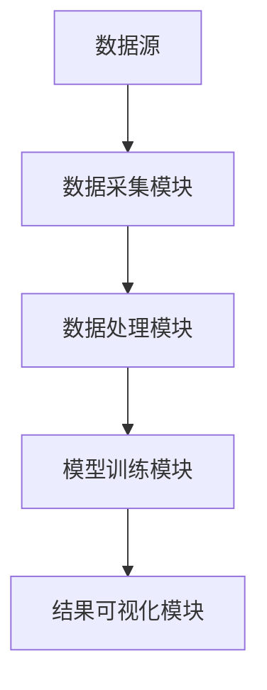

                 


# 智能系统辅助公司文化影响评估

> 关键词：智能系统，公司文化，影响评估，数据分析，算法模型

> 摘要：本文探讨了智能系统在公司文化影响评估中的应用。通过分析数据采集、处理和建模的过程，结合实际案例，展示了如何利用机器学习和自然语言处理技术，量化公司文化的影响，并为企业提供改进建议。

---

# 第一部分：背景与概念

## 第1章：公司文化与智能系统概述

### 1.1 公司文化的定义与重要性

- **公司文化的定义**：公司文化是企业在长期经营中形成的，由价值观、信念、行为规范和习惯组成的整体。
- **公司文化的核心要素**：
  1. 企业使命与愿景
  2. 核心价值观
  3. 行为规范
  4. 团队氛围
- **公司文化对企业发展的影响**：
  - 正面影响：提高员工满意度、增强凝聚力、促进创新
  - 负面影响：可能导致员工流失、内部冲突、创新不足

### 1.2 智能系统的定义与特点

- **智能系统的定义**：智能系统是能够感知环境、处理信息并做出决策的系统，具备学习、推理和自适应能力。
- **智能系统的核心特点**：
  1. 数据驱动
  2. 自动化处理
  3. 高度可扩展性
  4. 实时响应

### 1.3 智能系统在公司文化评估中的应用背景

- **问题背景**：
  - 公司文化评估通常依赖主观判断，难以量化
  - 传统方法耗时且成本高
  - 数据分散，难以整合
- **解决方法**：
  - 利用智能系统进行数据采集、分析和建模
  - 通过机器学习和自然语言处理技术，量化文化影响

---

# 第二部分：方法与技术

## 第2章：数据采集与处理

### 2.1 数据来源

- **员工反馈**：包括满意度调查、离职面谈、员工评价
- **行为数据**：如会议记录、项目完成情况、沟通频率
- **外部数据**：行业基准、竞争对手分析

### 2.2 数据预处理

- **数据清洗**：去除噪声数据、填补缺失值
- **数据转换**：将非结构化数据（如文本）转化为结构化数据
- **特征提取**：从文本中提取关键词、情感倾向

### 2.3 数据分析方法

- **文本挖掘**：使用Python的NLTK库进行关键词提取和主题建模
  ```python
  from nltk import word_tokenize, FreqDist
  text = "员工满意度低的主要原因是沟通不畅和职业发展机会不足"
  words = word_tokenize(text)
  freq = FreqDist(words)
  print(freq.most_common(5))  # 输出前5个高频词
  ```
- **情感分析**：使用VADER情感分析器判断员工情绪
  ```python
  from nltk.sentiment import SentimentIntensityAnalyzer
  analyzer = SentimentIntensityAnalyzer()
  print(analyzer.polarity_scores("员工对管理层的决策感到不满"))  # 输出情感倾向
  ```

## 第3章：算法模型与实现

### 3.1 机器学习模型

- **分类模型**：如随机森林、SVM，用于预测文化类型
  ```python
  from sklearn.ensemble import RandomForestClassifier
  model = RandomForestClassifier(n_estimators=100, random_state=42)
  model.fit(X_train, y_train)
  y_pred = model.predict(X_test)
  ```

- **聚类模型**：如K-means，用于将公司文化分为不同类别
  ```python
  from sklearn.cluster import KMeans
  kmeans = KMeans(n_clusters=3, random_state=42)
  kmeans.fit(X)
  y_kmeans = kmeans.predict(X)
  ```

### 3.2 模型评估

- **评估指标**：准确率、召回率、F1分数
- **交叉验证**：使用K折交叉验证评估模型稳定性

---

# 第三部分：系统实现与架构

## 第4章：系统架构设计

### 4.1 系统功能模块

- **数据采集模块**：负责收集员工反馈、行为数据
- **数据处理模块**：清洗、转换和特征提取
- **模型训练模块**：构建并训练机器学习模型
- **结果可视化模块**：展示文化评估结果和改进建议

### 4.2 系统架构图



---

# 第四部分：应用与案例

## 第5章：实际应用案例

### 5.1 案例背景

- 某科技公司希望通过智能系统评估公司文化，发现存在的问题。

### 5.2 数据收集与分析

- 收集员工反馈：500份调查问卷，分析关键词如“沟通”、“职业发展”
- 行为数据：会议记录、项目完成情况
- 情感分析：员工对管理层的评价

### 5.3 模型实现

- 使用随机森林分类模型，将公司文化分为4类
- 聚类分析发现，30%的员工属于“创新不足”类别

### 5.4 结果解读与建议

- 提供文化改进建议，如加强内部沟通、增加职业培训机会
- 建议管理层定期进行文化评估，确保文化与企业战略一致

---

# 总结

智能系统辅助公司文化影响评估，通过数据驱动的方法，帮助企业量化文化影响，发现潜在问题，并提供改进建议。未来，随着AI技术的进步，文化评估将更加精准和实时。

---

**作者：AI天才研究院 & 禅与计算机程序设计艺术**

