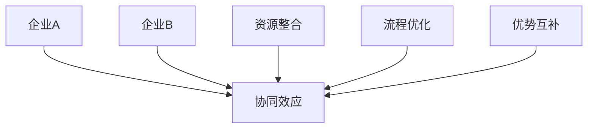
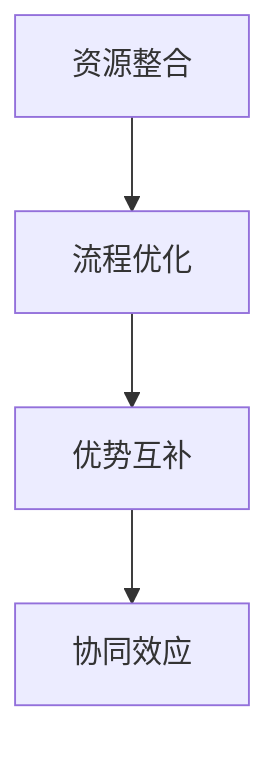
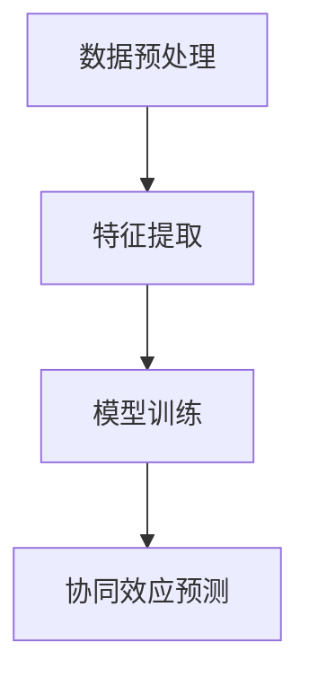
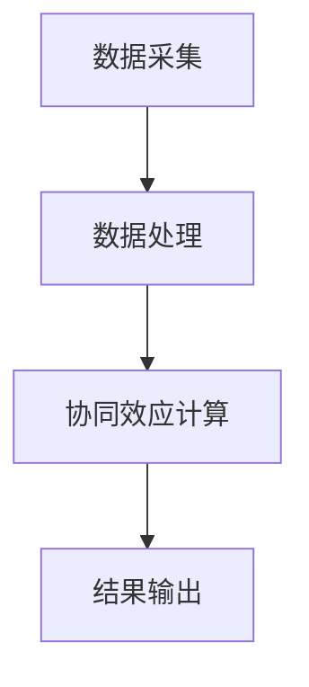
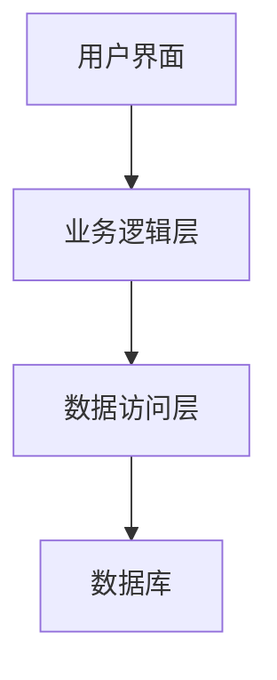
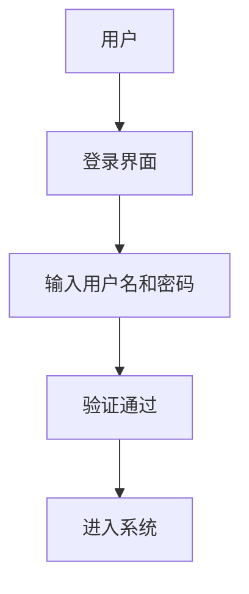

                 


# 智能系统辅助并购协同效应量化

## 关键词：智能系统、并购、协同效应、量化、机器学习、系统架构

## 摘要：  
并购协同效应的量化是企业在并购过程中实现价值最大化的重要手段。传统的协同效应评估方法存在主观性高、复杂性大、难以量化等问题。随着人工智能和大数据技术的快速发展，智能系统辅助并购协同效应量化成为可能。本文从背景、核心概念、算法原理、系统架构、项目实战等角度，详细探讨如何利用智能系统实现并购协同效应的量化，并通过实际案例展示其应用价值。

---

# 第一部分: 智能系统辅助并购协同效应量化概述

## 第1章: 并购协同效应的背景与问题

### 1.1 并购协同效应的定义与核心概念
#### 1.1.1 什么是并购协同效应  
并购协同效应是指企业在并购过程中，通过整合资源、优化流程、共享优势等方式，实现成本节约、收入增长等价值提升的效果。它是企业并购成功的关键指标之一。

#### 1.1.2 协同效应的分类与特点  
协同效应可以分为财务协同效应和战略协同效应。财务协同效应主要指成本节约、税盾效应等；战略协同效应则指市场扩展、技术互补等。其特点是隐蔽性、动态性和复杂性。

#### 1.1.3 协同效应的量化意义  
量化协同效应可以帮助企业在并购决策中更科学地评估潜在价值，优化整合方案，降低并购风险。

---

### 1.2 并购协同效应的计算与挑战  
#### 1.2.1 协同效应的计算方法  
传统的协同效应计算方法包括加法模型、乘法模型等，但这些方法主观性高，难以准确量化。

#### 1.2.2 协同效应计算中的常见问题  
- 数据不完整或不准确；  
- 协同效应的因果关系难以明确；  
- 评估时间窗口的选择困难。

#### 1.2.3 智能系统辅助的必要性  
智能系统可以通过大数据分析、机器学习等技术，解决传统方法的局限性，提高协同效应的量化精度。

---

### 1.3 智能系统辅助并购协同效应的背景  
#### 1.3.1 人工智能在金融领域的应用  
人工智能技术在金融领域的广泛应用为并购协同效应的智能化计算提供了技术支持。

#### 1.3.2 并购协同效应的智能化计算需求  
企业对并购协同效应的精准评估需求日益增长，传统方法已无法满足实际需求。

#### 1.3.3 当前技术发展现状  
随着大数据和AI技术的快速发展，智能系统辅助并购协同效应量化已成为可能。

---

### 1.4 本章小结  
本章从背景和问题的角度，阐述了并购协同效应的定义、分类、量化意义，以及智能系统辅助的必要性和技术背景。

---

## 第2章: 协同效应的核心概念与联系  

### 2.1 协同效应的原理与属性  
#### 2.1.1 协同效应的原理分析  
协同效应的实现依赖于资源整合、流程优化和优势互补。

#### 2.1.2 协同效应的属性特征  
- 整体性：协同效应是企业整体价值的体现；  
- 动态性：协同效应在整合过程中动态变化；  
- 复杂性：协同效应涉及多个因素的相互作用。

#### 2.1.3 协同效应与相关概念的对比  
通过对比协同效应与整合效应、协同优势等概念，明确其独特性和适用范围。

---

### 2.2 协同效应的实体关系图  
#### 2.2.1 实体关系图的构建  
通过Mermaid图展示协同效应涉及的主要实体及其关系。



#### 2.2.2 实体关系图的分析  
分析实体关系图，明确协同效应的关键驱动因素。

#### 2.2.3 实体关系图的优化  
通过优化实体关系图，提高协同效应的可量化性。

---

### 2.3 协同效应的核心要素  
#### 2.3.1 核心要素的定义  
协同效应的核心要素包括资源整合、流程优化、优势互补等。

#### 2.3.2 核心要素之间的关系  
通过Mermaid图展示核心要素之间的相互作用。



#### 2.3.3 核心要素的量化方法  
通过量化各核心要素，综合评估协同效应的实现程度。

---

### 2.4 本章小结  
本章从核心概念和联系的角度，详细分析了协同效应的原理、属性、实体关系图和核心要素。

---

## 第3章: 协同效应的算法原理  

### 3.1 协同效应的计算模型  
#### 3.1.1 协同效应的数学模型  
通过数学公式量化协同效应。

$$ \text{协同效应} = \alpha \times \text{资源整合} + \beta \times \text{流程优化} + \gamma \times \text{优势互补} $$

#### 3.1.2 协同效应的计算公式  
详细阐述协同效应的计算公式及其参数设置。

#### 3.1.3 协同效应的优化算法  
通过机器学习优化协同效应的计算模型。

---

### 3.2 协同效应的机器学习方法  
#### 3.2.1 机器学习在协同效应  
通过机器学习算法，如回归分析、聚类分析等，实现协同效应的智能化计算。

#### 3.2.2 协同效应的机器学习流程图  
通过Mermaid图展示机器学习的流程。



#### 3.2.3 协同效应的Python代码实现  
通过Python代码实现协同效应的机器学习模型。

```python
# 示例代码
import numpy as np
import pandas as pd
from sklearn.linear_model import LinearRegression

# 数据加载
data = pd.read_csv('merged_data.csv')

# 特征与目标分离
X = data[['资源整合', '流程优化', '优势互补']]
y = data['协同效应']

# 模型训练
model = LinearRegression()
model.fit(X, y)

# 预测协同效应
predicted_synergy = model.predict(X)
```

---

### 3.3 本章小结  
本章从算法原理的角度，详细阐述了协同效应的数学模型、机器学习方法和代码实现。

---

## 第4章: 系统分析与架构设计  

### 4.1 系统分析  
#### 4.1.1 问题场景介绍  
描述并购协同效应量化系统的目标和应用场景。

#### 4.1.2 系统功能设计  
通过Mermaid图展示系统功能模块。



#### 4.1.3 系统架构设计  
通过Mermaid图展示系统架构。



#### 4.1.4 系统接口设计  
描述系统接口的设计和交互流程。

#### 4.1.5 系统交互流程图  
通过Mermaid图展示系统交互流程。



---

### 4.2 本章小结  
本章从系统分析与架构设计的角度，详细阐述了系统的功能模块、架构设计和交互流程。

---

## 第5章: 项目实战  

### 5.1 项目背景  
介绍并购协同效应量化项目的背景和目标。

### 5.2 环境安装与配置  
指导读者如何安装和配置开发环境。

### 5.3 系统核心实现  
#### 5.3.1 数据采集与处理  
通过Python代码实现数据的采集和处理。

```python
import pandas as pd

# 数据采集
data = pd.read_csv('merged_data.csv')

# 数据处理
data_cleaned = data.dropna()
```

#### 5.3.2 协同效应计算  
通过机器学习模型实现协同效应的计算。

```python
# 协同效应计算
model = LinearRegression()
model.fit(X, y)
predicted_synergy = model.predict(X)
```

#### 5.3.3 系统功能实现  
通过代码实现系统的功能模块。

### 5.4 实际案例分析  
通过具体案例分析协同效应的量化过程。

### 5.5 项目小结  
总结项目的实施过程和成果。

---

## 第6章: 总结与展望  

### 6.1 总结  
回顾全文，总结并购协同效应量化的核心内容和实现方法。

### 6.2 最佳实践 tips  
给出在实践中应用智能系统辅助并购协同效应量化的一些建议。

### 6.3 注意事项  
提醒读者在实际操作中需要注意的问题。

### 6.4 拓展阅读  
推荐相关领域的书籍和资源，供读者进一步学习。

---

## 作者：AI天才研究院/AI Genius Institute & 禅与计算机程序设计艺术 /Zen And The Art of Computer Programming  

---

通过以上目录结构和内容安排，我们详细探讨了智能系统辅助并购协同效应量化的各个方面，从理论到实践，从算法到系统设计，为读者提供了全面的指导。

