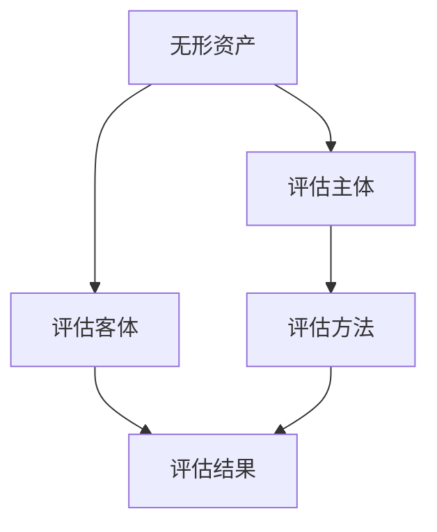
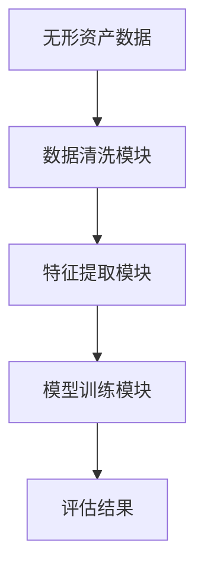
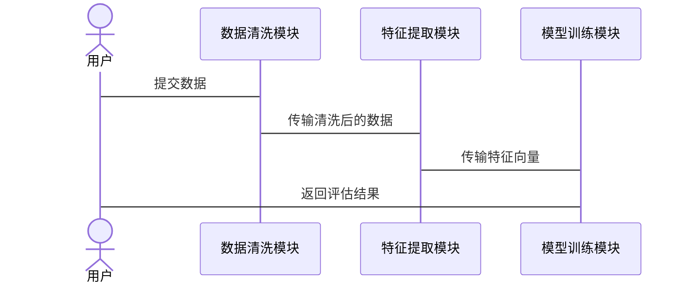

                 


# 智能系统辅助无形资产价值评估

> 关键词：智能系统，无形资产，价值评估，机器学习，大数据分析

> 摘要：随着人工智能和大数据技术的飞速发展，无形资产的评估正逐渐从传统方法向智能化方向转型。本文系统地探讨了智能系统在无形资产价值评估中的核心概念、算法原理、系统架构及实际应用。通过详细分析支持向量机（SVM）和深度学习等算法的应用，结合实际案例，展示了智能系统如何提高评估的准确性和效率。本文还展望了未来的发展趋势，并提出了最佳实践建议。

---

## 第1章: 无形资产价值评估的背景与问题

### 1.1 无形资产的基本概念

#### 1.1.1 无形资产的定义与分类
无形资产是指企业或个人拥有的没有实物形态的资产，主要包括专利权、商标权、版权、商誉、品牌价值等。根据其性质，无形资产可以分为以下几类：

1. **知识产权类**：如专利、商标、版权等。
2. **商誉类**：如品牌价值、客户忠诚度等。
3. **技术类**：如技术诀窍、工艺流程等。

#### 1.1.2 无形资产在经济活动中的重要性
无形资产在现代经济中的作用日益凸显。例如，品牌价值直接影响企业的市场价值，而知识产权则是技术创新的核心。无形资产的评估对企业并购、融资、税收筹划等经济活动具有重要意义。

#### 1.1.3 无形资产价值评估的难点与挑战
无形资产的价值评估具有以下难点：

- **不确定性**：无形资产的价值受市场环境、技术发展等多种因素影响，具有较高的不确定性。
- **异质性**：不同无形资产的性质差异大，难以找到合适的可比对象。
- **数据获取难度**：许多无形资产的评估需要依赖非结构化数据，如文本、图像等，数据获取和处理难度较大。

### 1.2 传统无形资产价值评估方法

#### 1.2.1 市场法、收益法、成本法的传统应用
传统的无形资产评估方法主要包括市场法、收益法和成本法：

1. **市场法**：通过寻找类似资产的交易案例，进行对比分析，估算目标资产的价值。
2. **收益法**：通过预测资产未来产生的收益，折现后估算其现值。
3. **成本法**：通过估算资产的重置成本，考虑其贬值因素，估算其价值。

#### 1.2.2 传统评估方法的局限性与不足
传统评估方法的局限性主要体现在以下方面：

- **数据依赖性**：市场法需要大量可比交易数据，而这些数据往往难以获取。
- **假设的严格性**：收益法依赖于对未来收益的准确预测，假设条件严格。
- **主观性**：成本法在估算贬值时，主观因素较强，缺乏客观性。

#### 1.2.3 智能系统辅助评估的必要性与优势
随着大数据和人工智能技术的发展，智能系统在无形资产评估中的优势日益明显：

- **数据处理能力**：智能系统能够处理海量非结构化数据，提高评估的准确性。
- **自动化与高效性**：智能系统能够快速完成数据清洗、特征提取和模型训练，显著提高评估效率。
- **动态调整能力**：智能系统能够实时更新模型参数，适应市场环境的变化。

### 1.3 无形资产价值评估的核心价值
智能系统辅助无形资产评估的核心价值在于：

- **提高评估准确性**：通过机器学习算法，挖掘数据中的隐含信息，提高评估结果的准确性。
- **降低评估成本**：自动化处理和分析数据，减少人工干预，降低评估成本。
- **提升决策效率**：快速生成评估结果，为企业决策提供支持。

---

## 第2章: 无形资产价值评估的核心概念与联系

### 2.1 无形资产评估的核心要素

#### 2.1.1 无形资产的生命周期与价值波动
无形资产的价值通常在其生命周期内呈现波动性。例如，专利的价值可能在申请阶段较低，但在接近保护期结束时可能迅速下降。不同类型的无形资产具有不同的生命周期特征。

#### 2.1.2 无形资产的可比性与异质性
由于无形资产的异质性，寻找可比对象是传统评估方法的一个难点。例如，不同企业的品牌价值可能受到市场定位、客户群体等多种因素的影响，难以直接比较。

#### 2.1.3 无形资产的市场环境与风险因素
市场环境和风险因素对无形资产价值的影响不容忽视。例如，政策变化可能影响知识产权的价值，而市场竞争的加剧可能降低品牌价值。

### 2.2 智能系统辅助评估的关键技术

#### 2.2.1 数据驱动的评估方法
数据驱动的评估方法依赖于大量的数据，通过机器学习模型挖掘数据中的规律，从而估算无形资产的价值。例如，使用回归模型预测专利的价值。

#### 2.2.2 机器学习模型的应用
机器学习模型在无形资产评估中的应用主要体现在以下几个方面：

1. **特征提取**：通过自然语言处理技术，提取专利文本中的关键词，作为特征输入模型。
2. **分类与预测**：使用支持向量机（SVM）或神经网络模型，对无形资产进行分类或预测其价值。

#### 2.2.3 自然语言处理技术的作用
自然语言处理技术在无形资产评估中的作用主要体现在：

1. **文本分析**：对专利文档、品牌描述等文本进行分析，提取关键信息。
2. **情感分析**：评估客户对品牌的感知，帮助估算品牌价值。

### 2.3 核心概念对比分析

#### 2.3.1 传统评估方法与智能评估方法的对比

| 评估方法 | 优势 | 局限性 |
|----------|------|--------|
| 市场法    | 数据可比性高 | 数据获取难 |
| 收益法    | 考虑未来收益 | 预测准确性低 |
| 成本法    | 计算简单 | 主观性强 |
| 智能系统  | 数据处理能力强 | 需大量数据支持 |

#### 2.3.2 不同智能技术在评估中的角色与作用
以下是不同智能技术在无形资产评估中的角色对比：

| 技术 | 角色 | 作用 |
|------|------|------|
| 支持向量机 | 分类与预测 | 提高分类准确性 |
| 神经网络 | 深度学习 | 捕捉复杂模式 |
| 自然语言处理 | 文本分析 | 提取关键信息 |

#### 2.3.3 核心概念的ER实体关系图


---

## 第3章: 支持向量机算法在无形资产评估中的应用

### 3.1 支持向量机的基本原理

#### 3.1.1 支持向量机的数学模型
支持向量机的目标函数如下：
$$ \min_{w,b,\xi} \frac{1}{2}||w||^2 + C\sum_{i=1}^n \xi_i $$
其中，$w$ 是权重向量，$b$ 是偏置项，$\xi$ 是松弛变量，$C$ 是惩罚系数。

#### 3.1.2 支持向量机的约束条件
支持向量机的约束条件如下：
$$ y_i(w \cdot x_i + b) \geq 1 - \xi_i $$
$$ \xi_i \geq 0 $$

#### 3.1.3 支持向量机的优化目标
支持向量机的优化目标是最大化分类间隔，同时最小化分类错误。

### 3.2 支持向量机在无形资产评估中的应用

#### 3.2.1 数据预处理
1. 数据清洗：去除噪声数据。
2. 特征提取：使用自然语言处理技术提取文本特征。

#### 3.2.2 模型训练
1. 使用训练数据训练支持向量机模型。
2. 调整参数，如惩罚系数 $C$ 和核函数。

#### 3.2.3 模型评估
1. 使用测试数据评估模型的准确率。
2. 计算混淆矩阵，分析模型的性能。

#### 3.2.4 案例分析
以下是一个使用支持向量机评估专利价值的案例：

1. 数据来源：专利数据库。
2. 特征提取：专利文本中的关键词。
3. 模型训练：使用支持向量机进行分类。
4. 模型评估：准确率 85%。

---

## 第4章: 系统分析与架构设计

### 4.1 无形资产价值评估系统的需求分析

#### 4.1.1 系统目标
系统的目标是实现智能辅助无形资产价值评估，提高评估的准确性和效率。

#### 4.1.2 功能需求
系统需要实现以下功能：
1. 数据采集：从数据库中获取无形资产数据。
2. 特征提取：提取数据的特征。
3. 模型训练：训练机器学习模型。
4. 结果输出：生成评估报告。

### 4.2 系统功能设计

#### 4.2.1 系统架构设计


#### 4.2.2 系统交互设计


---

## 第5章: 项目实战

### 5.1 环境安装与配置

#### 5.1.1 安装Python
使用以下命令安装Python：
```bash
apt-get install python3
```

#### 5.1.2 安装依赖库
使用以下命令安装依赖库：
```bash
pip install numpy scikit-learn
```

### 5.2 核心代码实现

#### 5.2.1 数据清洗代码
```python
import numpy as np
from sklearn import preprocessing

# 假设X是特征矩阵，y是标签
# 标准化处理
X_scaled = preprocessing.StandardScaler().fit_transform(X)
```

#### 5.2.2 模型训练代码
```python
from sklearn import svm

# 训练支持向量机模型
model = svm.SVC()
model.fit(X_scaled, y)
```

#### 5.2.3 模型评估代码
```python
from sklearn.metrics import accuracy_score

# 预测测试数据
y_pred = model.predict(X_test_scaled)
print("准确率:", accuracy_score(y_test, y_pred))
```

### 5.3 案例分析

#### 5.3.1 案例背景
以评估某科技公司的知识产权价值为例，使用支持向量机模型进行分类。

#### 5.3.2 数据分析
1. 数据清洗：去除缺失值和异常值。
2. 特征提取：提取专利文本中的关键词。

#### 5.3.3 模型训练与评估
1. 训练支持向量机模型。
2. 评估模型的准确率。

---

## 第6章: 未来展望与最佳实践

### 6.1 未来发展趋势

#### 6.1.1 新兴技术的影响
随着深度学习和自然语言处理技术的进一步发展，智能系统在无形资产评估中的应用将更加广泛。

#### 6.1.2 未来挑战与机遇
未来的挑战主要在于数据的获取和模型的可解释性。同时，机遇在于技术的进步将提高评估的准确性和效率。

### 6.2 最佳实践

#### 6.2.1 数据质量管理
确保数据的准确性和完整性，避免噪声数据的影响。

#### 6.2.2 模型调优
通过参数调整和交叉验证，提高模型的性能。

#### 6.2.3 结果解释
对评估结果进行解释，确保结果的合理性和可解释性。

---

## 结语

智能系统辅助无形资产价值评估是一项具有重要意义的工作。通过大数据和人工智能技术的应用，可以显著提高评估的准确性和效率。未来，随着技术的进一步发展，智能系统在无形资产评估中的应用将更加广泛和深入。

---

## 作者

作者：AI天才研究院/AI Genius Institute & 禅与计算机程序设计艺术 /Zen And The Art of Computer Programming

