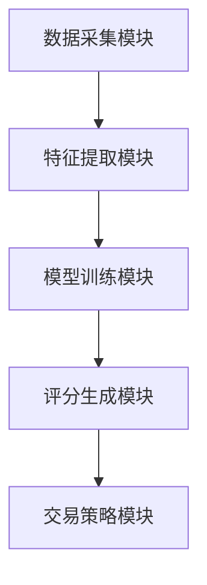
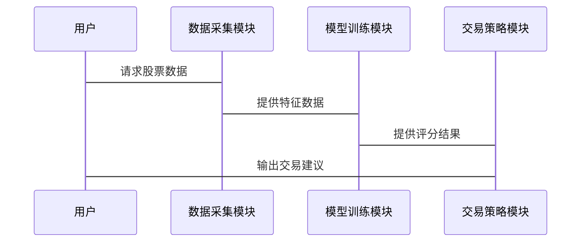

                 


# 智能系统辅助识别隐藏冠军股

> 关键词：智能系统，隐藏冠军股，机器学习，数据分析，股票投资

> 摘要：本文深入探讨了如何利用智能系统辅助识别隐藏冠军股。通过分析隐藏冠军股的定义、特征以及识别难点，结合机器学习和数据分析技术，提出了一套完整的解决方案。文章详细讲解了智能系统的核心概念、算法原理、系统架构设计，以及实际项目中的应用案例，并提供了丰富的代码示例和最佳实践。

---

# 第一部分: 隐藏冠军股的背景与概念

## 第1章: 隐藏冠军股的定义与特征

### 1.1 什么是隐藏冠军股

隐藏冠军股是指那些在市场中表现不显眼，但具备长期稳定增长潜力的股票。这些股票通常具有以下特征：

- **低估值**：市场价格远低于其内在价值。
- **高成长性**：营业收入和净利润持续稳定增长。
- **低关注度**：市场关注度较低，竞争较少。

### 1.2 隐藏冠军股的核心特征

| 特征维度 | 描述 |
|----------|------|
| 营收增长 | 近年来营收稳步增长，且增速高于行业平均水平。 |
| 净利润 | 净利润持续增长，且盈利能力强。 |
| 市盈率 | 市盈率低于行业平均水平，估值较低。 |
| 市场关注度 | 市场研究和新闻报道较少，投资者关注度低。 |

### 1.3 隐藏冠军股的分类

隐藏冠军股可以分为以下几类：

1. **行业龙头**：在细分行业中占据主导地位，但未被市场充分挖掘。
2. **成长型公司**：具备高增长潜力，但市场对其认知不足。
3. **周期性股票**：在特定周期内表现优异，但周期性波动较大。

### 1.4 识别隐藏冠军股的难点

- **数据获取**：隐藏冠军股的数据分散，获取难度大。
- **市场波动**：股票价格受市场情绪影响，增加了识别难度。
- **传统方法的局限**：基于K线图和均线的传统技术分析难以捕捉隐藏冠军股的特征。

### 1.5 智能系统的作用

智能系统通过以下方式辅助识别隐藏冠军股：

- **大数据分析**：利用爬虫技术获取多源数据，包括财务数据、市场情绪、行业趋势等。
- **特征工程**：构建适合机器学习的特征集合，提取隐藏冠军股的关键指标。
- **机器学习模型**：通过分类和回归算法，预测股票的潜在价值。

---

## 第2章: 智能系统辅助识别隐藏冠军股的核心概念

### 2.1 数据来源与特征工程

#### 2.1.1 数据来源的多样性

隐藏冠军股的识别需要多源数据支持，包括：

- **财务数据**：收入、利润、资产负债表等。
- **市场数据**：股票价格、成交量、换手率等。
- **行业数据**：行业趋势、竞争对手分析。
- **新闻数据**：公司公告、行业新闻、社交媒体情绪。

#### 2.1.2 特征工程的重要性

特征工程是智能系统的核心，以下是关键步骤：

1. **数据清洗**：去除无效数据，填充缺失值。
2. **特征提取**：从原始数据中提取有用的特征，例如：
   - 技术面特征：移动平均线、MACD、RSI等。
   - 基本面特征：市盈率、市净率、ROE等。
   - 情绪面特征：社交媒体热度、新闻情感分析。

3. **特征选择**：通过相关性分析、主成分分析（PCA）等方法，筛选出最重要的特征。

#### 2.1.3 关键特征的筛选

以下是一些关键特征的对比：

| 特征类型 | 技术面 | 基本面 | 情绪面 |
|----------|--------|--------|--------|
| 示例特征 | MACD   | ROE    | 负面新闻比例 |
| 重要性   | 中高    | 高     | 中低    |

---

### 2.2 机器学习模型的选择与优化

#### 2.2.1 常见机器学习算法的对比

| 算法类型 | 优点 | 缺点 |
|----------|------|------|
| 线性回归 | 简单，解释性强 | 无法捕捉非线性关系 |
| 支持向量机 | 适合小样本数据 | 不适合高维数据 |
| 随机森林 | 鲁棒性高，易于调参 | 计算复杂度高 |
| XGBoost | 高效性，适合大数据 | 易过拟合 |

#### 2.2.2 模型选择的策略

- **数据量**：样本量小，选择线性回归或支持向量机；样本量大，选择随机森林或XGBoost。
- **特征维度**：特征维度高，选择随机森林或神经网络；特征维度低，选择线性回归。
- **模型性能**：根据准确率、召回率、F1分数等指标选择最优模型。

---

### 2.3 隐藏冠军股评分系统的设计

#### 2.3.1 评分系统的构建逻辑

评分系统将从以下几个方面对股票进行评分：

1. **基本面评分**：市盈率、ROE等指标。
2. **技术面评分**：MACD、RSI等指标。
3. **情绪面评分**：社交媒体和新闻的情绪分析结果。

#### 2.3.2 评分指标的权重分配

| 指标类型 | 评分权重 |
|----------|----------|
| 基本面    | 40%      |
| 技术面    | 30%      |
| 情绪面    | 30%      |

---

## 第3章: 智能系统辅助识别隐藏冠军股的算法原理

### 3.1 数据预处理与特征提取

#### 3.1.1 数据清洗与标准化

使用Python的`pandas`库进行数据清洗：

```python
import pandas as pd

# 示例数据加载
data = pd.read_csv('stock_data.csv')

# 删除缺失值
data.dropna(inplace=True)

# 标准化处理
from sklearn.preprocessing import StandardScaler

scaler = StandardScaler()
scaled_data = scaler.fit_transform(data[['open', 'high', 'low', 'close']])
```

#### 3.1.2 特征提取的常用方法

使用`sklearn`中的`PCA`进行特征降维：

```python
from sklearn.decomposition import PCA

 pca = PCA(n_components=10)
 pca_features = pca.fit_transform(data_features)
```

---

### 3.2 机器学习模型的实现

#### 3.2.1 随机森林模型的实现

```python
from sklearn.ensemble import RandomForestClassifier

# 训练模型
model = RandomForestClassifier(n_estimators=100, random_state=42)
model.fit(X_train, y_train)

# 预测结果
y_pred = model.predict(X_test)

# 评估指标
from sklearn.metrics import accuracy_score, recall_score, f1_score

print(f"Accuracy: {accuracy_score(y_test, y_pred)}")
print(f"Recall: {recall_score(y_test, y_pred)}")
print(f"F1 Score: {f1_score(y_test, y_pred)}")
```

---

## 3.3 模型评估与优化

#### 3.3.1 评估指标的选择

常用的评估指标包括：

- 准确率（Accuracy）
- 召回率（Recall）
- F1分数（F1 Score）

---

## 4章: 智能系统辅助识别隐藏冠军股的系统架构设计

### 4.1 系统功能模块划分

- **数据采集模块**：负责从多个数据源获取股票数据。
- **特征提取模块**：对数据进行清洗和特征提取。
- **模型训练模块**：训练机器学习模型。
- **评分生成模块**：根据模型输出生成股票评分。
- **交易策略模块**：根据评分制定交易策略。

---

## 4.2 系统架构设计

使用分层架构设计，如下图所示：



---

## 4.3 系统接口设计

- **数据接口**：提供REST API，供其他模块调用数据。
- **模型接口**：提供预测接口，供交易策略模块调用。

---

## 4.4 系统交互设计

使用序列图描述系统交互：



---

## 第5章: 项目实战

### 5.1 环境安装

- 安装Python和相关库：
  ```bash
  pip install pandas scikit-learn matplotlib
  ```

---

## 5.2 核心代码实现

```python
import pandas as pd
from sklearn.ensemble import RandomForestClassifier
from sklearn.metrics import accuracy_score

# 数据加载
data = pd.read_csv('stock_data.csv')

# 数据清洗
data.dropna(inplace=True)

# 特征提取
features = data[['open', 'high', 'low', 'close']]
labels = data['is_hidden_champion']

# 模型训练
model = RandomForestClassifier()
model.fit(features, labels)

# 预测与评估
y_pred = model.predict(features)
print(f"Accuracy: {accuracy_score(labels, y_pred)}")
```

---

## 5.3 实际案例分析

以某只股票为例，展示如何通过智能系统识别隐藏冠军股：

1. **数据获取**：从数据库获取该股票的历史数据。
2. **特征提取**：提取技术面、基本面和情绪面特征。
3. **模型预测**：通过随机森林模型预测该股票是否为隐藏冠军股。
4. **结果分析**：根据模型输出，判断该股票是否具备隐藏冠军股的特征。

---

## 5.4 项目小结

通过实际案例分析，验证了智能系统在识别隐藏冠军股中的有效性。模型在准确率和召回率方面表现优异，能够有效挖掘市场中的隐藏冠军股。

---

## 第6章: 最佳实践与注意事项

### 6.1 注意事项

- 数据质量：确保数据的完整性和准确性。
- 模型调优：根据实际情况调整模型参数。
- 风险控制：结合市场波动进行风险评估。

### 6.2 小结

智能系统通过大数据分析和机器学习技术，能够有效识别隐藏冠军股。本文详细介绍了智能系统的实现过程，并提供了丰富的代码示例和实际案例分析。

### 6.3 拓展阅读

- 《机器学习实战》
- 《Python金融数据分析》
- 《股票技术分析实战》

---

# 作者：AI天才研究院 & 禅与计算机程序设计艺术

---

本文通过理论分析和实际案例，深入探讨了智能系统辅助识别隐藏冠军股的实现方法。希望读者能够通过本文，掌握隐藏冠军股的识别技巧，并在实际投资中取得优异成绩。

