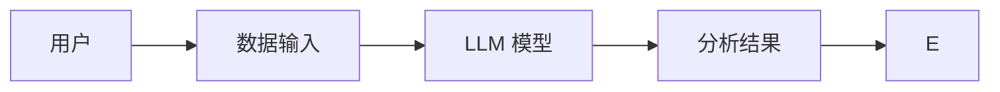
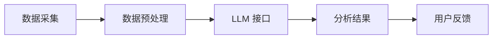

                 


# 智能调研 AI Agent：LLM 辅助市场分析与用户洞察

> 关键词：LLM, AI Agent, 市场分析, 用户洞察, 人工智能, 机器学习, 智能系统

> 摘要：本文探讨了AI Agent在市场分析和用户洞察中的应用，通过结合大语言模型（LLM）的能力，提出了一种智能化的市场调研解决方案。文章详细分析了传统市场调研的局限性，提出了基于LLM的AI Agent的解决方案，并从算法原理、系统架构、项目实战等方面展开讨论，最后总结了最佳实践和未来发展方向。

---

## 第一部分：智能调研与AI Agent 背景介绍

### 第1章：智能调研与AI Agent 概述

#### 1.1 问题背景与描述
市场调研是企业制定战略决策的重要基础，传统方法依赖人工数据收集和分析，耗时且成本高。用户洞察依赖问卷调查和访谈，难以实时捕捉用户需求变化。AI Agent的引入可以实时分析海量数据，提供动态反馈。

#### 1.2 问题解决与边界
AI Agent通过自动化数据处理和分析，帮助企业快速获取市场动态和用户反馈。其边界包括数据隐私保护、模型准确性以及应用场景的限制。

#### 1.3 核心概念与组成要素
AI Agent由数据采集模块、分析模块、LLM交互模块组成，结合NLP技术，实现智能化的市场分析和用户洞察。

---

## 第二部分：核心概念与联系

### 第2章：AI Agent 与 LLM 的核心原理

#### 2.1 AI Agent 的基本原理
AI Agent通过接收输入数据，利用LLM进行分析和生成，输出结果。其工作流程包括数据输入、模型推理、结果输出三个阶段。

#### 2.2 核心概念对比与分析
| 概念 | 传统调研工具 | LLM 驱动的AI Agent |
|------|---------------|---------------------|
| 数据处理 | 人工处理 | 自动化处理 |
| 速度 | 较慢 | 实时响应 |
| 精准度 | 受限于人工经验 | 基于大数据训练 |

#### 2.3 实体关系图与流程图


---

## 第三部分：算法原理

### 第3章：LLM 的训练与推理

#### 3.1 算法原理
LLM通过预训练和微调两个阶段，学习语言模型。预训练阶段使用大规模数据，微调阶段针对特定任务优化模型。

#### 3.2 数学模型
损失函数：$$L = -\sum_{i=1}^{n} y_i \log p(y_i)$$，其中$$p(y_i)$$是模型预测的概率。

---

## 第四部分：系统分析与架构设计

### 第4章：系统架构设计

#### 4.1 问题场景介绍
系统需支持实时数据采集、分析和反馈，满足企业对市场动态的实时需求。

#### 4.2 系统功能设计
- 数据采集模块：负责数据收集和预处理。
- 分析模块：利用LLM进行数据挖掘和生成。
- LLM交互模块：提供用户与模型的交互界面。

#### 4.3 系统架构图


---

## 第五部分：项目实战

### 第5章：项目实现与案例分析

#### 5.1 环境安装
安装Python和相关库：`pip install transformers`.

#### 5.2 核心代码实现
```python
from transformers import AutoTokenizer, AutoModelForCausalLM

tokenizer = AutoTokenizer.from_pretrained('gpt2')
model = AutoModelForCausalLM.from_pretrained('gpt2')

def analyze_market(data):
    inputs = tokenizer(data, return_tensors='np')
    outputs = model.generate(inputs.input_ids, max_length=500)
    return tokenizer.decode(outputs[0], skip_special_tokens=True)
```

#### 5.3 案例分析
分析用户反馈，生成市场报告。

---

## 第六部分：最佳实践

### 第6章：经验总结与未来展望

#### 6.1 实用小贴士
- 数据隐私保护
- 模型更新策略

#### 6.2 总结
AI Agent通过LLM实现智能化市场分析，提升效率和精准度。

#### 6.3 未来展望
未来将结合多模态数据，提升分析能力。

---

作者：AI天才研究院/AI Genius Institute & 禅与计算机程序设计艺术 /Zen And The Art of Computer Programming

