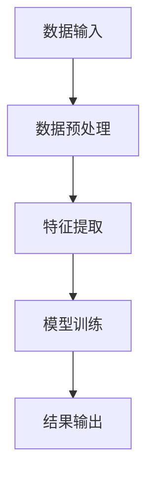
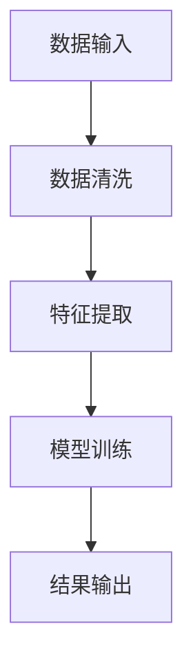
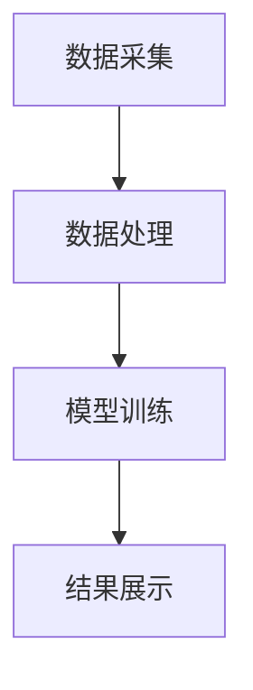
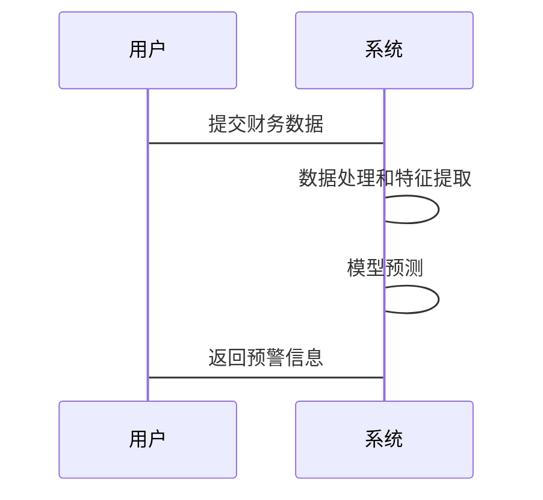

                 


# 智能财务舞弊检测系统

> 关键词：智能财务，舞弊检测，机器学习，深度学习，数据挖掘，财务分析

> 摘要：智能财务舞弊检测系统通过利用先进的机器学习和深度学习算法，结合大数据分析技术，实现对财务数据的智能监控和异常检测。本文将详细介绍该系统的背景、核心原理、算法实现、系统架构以及实际应用案例，帮助读者全面理解智能财务舞弊检测的技术与实践。

---

# 第一部分: 背景介绍

## 第1章: 财务舞弊检测的背景与挑战

### 1.1 财务舞弊的定义与特征
#### 1.1.1 财务舞弊的定义
财务舞弊是指在财务报表、会计记录或其他财务相关文档中，故意提供虚假信息或隐瞒重要信息的行为。这种行为通常是为了掩盖财务问题、逃避税务责任或谋取不当利益。

#### 1.1.2 财务舞弊的主要特征
- 数据不一致：财务数据与实际业务不符。
- 交易异常：如突然增加的关联交易、异常大额交易等。
- 账务操纵：通过虚构收入、虚减支出等手段 manipulate 财务报表。

#### 1.1.3 财务舞弊的分类与表现形式
- 按照行为主体分类：个人舞弊、集体舞弊。
- 按照舞弊手段分类：虚假交易、虚构资产、账务调整等。

### 1.2 智能化财务舞弊检测的必要性
#### 1.2.1 传统财务舞弊检测的局限性
传统财务舞弊检测主要依赖人工审核和简单的规则匹配，存在以下问题：
- 人工审核效率低，成本高。
- 规则匹配难以覆盖所有可能的舞弊场景。
- 易受主观因素影响，检测精度有限。

#### 1.2.2 智能化检测的优势与价值
智能化财务舞弊检测系统利用大数据分析和人工智能技术，能够实现以下优势：
- 自动化、实时化检测，提高效率。
- 能够发现复杂、隐蔽的舞弊行为。
- 可扩展性强，支持多种数据源和检测场景。

#### 1.2.3 当前技术发展对财务舞弊检测的影响
- 人工智能技术的进步（如深度学习、自然语言处理）为财务舞弊检测提供了新的工具。
- 大数据技术的发展使得海量财务数据的处理和分析成为可能。

### 1.3 智能财务舞弊检测系统的边界与外延
#### 1.3.1 系统的功能边界
- 输入：财务数据、业务数据。
- 输出：舞弊风险评分、异常交易预警。

#### 1.3.2 系统的外延与扩展性
- 支持多种数据源（如财务报表、交易记录、合同文本等）。
- 可扩展至其他领域的舞弊检测（如税务舞弊、采购舞弊）。

#### 1.3.3 系统与其他系统的接口关系
- 与企业 ERP 系统对接，获取实时财务数据。
- 与风险管理系统集成，提供风险评估和预警。

### 1.4 本章小结
通过本章的介绍，我们了解了财务舞弊的基本概念、智能化检测的必要性以及系统的边界和外延。接下来，我们将深入探讨智能财务舞弊检测系统的核心原理和实现方法。

---

# 第二部分: 智能财务舞弊检测系统的核心概念与联系

## 第2章: 智能财务舞弊检测的核心原理

### 2.1 财务数据的特征提取
#### 2.1.1 数据预处理方法
- 数据清洗：处理缺失值、异常值。
- 数据标准化：将不同量纲的特征进行标准化处理。
- 数据增强：通过数据变换增加数据多样性。

#### 2.1.2 关键特征的识别与选择
- 利用特征重要性分析（如信息增益、LASSO回归）识别关键特征。
- 使用主成分分析（PCA）降维，提取核心特征。

#### 2.1.3 特征提取的数学模型
- 使用线性回归模型分析特征与舞弊行为的相关性。
- 通过随机森林模型提取特征重要性。

### 2.2 财务舞弊检测的算法选择
#### 2.2.1 传统机器学习算法
- 支持向量机（SVM）：适用于小规模数据分类。
- 随机森林：适用于特征较多的场景，能够处理非线性关系。

#### 2.2.2 深度学习算法
- 神经网络模型：适用于大规模、复杂特征的场景。
- LSTM：用于时间序列数据的分析，捕捉长期依赖关系。

#### 2.2.3 混合算法的优势
- 将传统机器学习与深度学习结合，提升检测精度和效率。

### 2.3 智能财务舞弊检测系统的流程图


### 2.4 核心概念对比表
| 对比项 | 传统方法 | 智能方法 |
|--------|----------|----------|
| 数据处理 | 简单规则匹配 | 复杂特征提取 |
| 检测精度 | 较低 | 较高 |
| 计算效率 | 较高 | 较低 |

### 2.5 本章小结
通过本章的分析，我们了解了智能财务舞弊检测系统的核心原理和实现方法，接下来我们将深入探讨系统的具体实现和实际应用。

---

# 第三部分: 智能财务舞弊检测系统的算法原理

## 第3章: 基于机器学习的舞弊检测算法

### 3.1 机器学习算法的选择与优化
#### 3.1.1 支持向量机（SVM）的应用
- SVM适用于小规模数据分类，通过核函数处理非线性关系。
- 通过网格搜索（Grid Search）优化参数（C、gamma等）。

#### 3.1.2 随机森林（Random Forest）的优势
- 随机森林通过随机选择特征和样本，减少过拟合风险。
- 使用特征重要性分析，识别关键特征。

#### 3.1.3 算法调优与参数选择
- 使用交叉验证（Cross Validation）评估模型性能。
- 调整学习率、树深等参数，优化模型性能。

### 3.2 基于深度学习的舞弊检测
#### 3.2.1 神经网络模型的构建
- 使用多层感知机（MLP）进行分类，通过隐藏层提取特征。
- 通过批量归一化（Batch Normalization）加速训练。

#### 3.2.2 LSTM在时间序列数据中的应用
- LSTM适用于分析时间序列数据，捕捉长期依赖关系。
- 通过细胞状态（Cell State）保存长期信息。

#### 3.2.3 深度学习模型的训练与优化
- 使用Adam优化器（Adam Optimizer）进行训练。
- 通过早停（Early Stopping）防止过拟合。

### 3.3 算法流程图


### 3.4 算法实现的数学模型
#### 3.4.1 支持向量机的数学模型
$$ \text{损失函数} = \sum_{i=1}^{n} \xi_i + \frac{1}{2} \lambda \sum_{j=1}^{d} \omega_j^2 $$
$$ \text{对偶问题} = \max_{\alpha} \sum_{i=1}^{n} \alpha_i y_i - \frac{1}{2} \sum_{i,j=1}^{n} y_i y_j \alpha_i \alpha_j K(x_i, x_j) $$

#### 3.4.2 LSTM的数学模型
$$ f_t = \text{激活函数}(W_f x_t + U_f h_{t-1} + b_f) $$
$$ i_t = \text{激活函数}(W_i x_t + U_i h_{t-1} + b_i) $$
$$ c_t = f_t \cdot c_{t-1} + i_t \cdot g_t $$
$$ h_t = \text{激活函数}(W_o x_t + U_o h_{t-1} + b_o) $$

### 3.5 本章小结
通过本章的分析，我们了解了基于机器学习和深度学习的舞弊检测算法，接下来我们将探讨系统的具体架构和实现。

---

# 第四部分: 智能财务舞弊检测系统的系统分析与架构设计

## 第4章: 系统功能设计

### 4.1 系统应用场景
- 企业财务审计：实时监控财务数据，发现异常交易。
- 第三方审计机构：利用系统辅助审计工作。
- 政府监管：监控企业财务数据，防范税收流失。

### 4.2 系统功能模块
#### 4.2.1 数据采集模块
- 从企业 ERP 系统获取财务数据。
- 支持多种数据格式（如 CSV、Excel、数据库）。

#### 4.2.2 数据处理模块
- 数据清洗：处理缺失值、异常值。
- 数据转换：将数据转换为模型可接受的格式。

#### 4.2.3 模型训练模块
- 使用训练好的模型进行预测。
- 支持在线学习，实时更新模型。

#### 4.2.4 结果展示模块
- 可视化展示异常交易。
- 提供风险评分和预警信息。

### 4.3 系统架构设计


### 4.4 系统交互设计


### 4.5 本章小结
通过本章的分析，我们了解了智能财务舞弊检测系统的功能设计和架构设计，接下来我们将探讨系统的实际应用和优化方法。

---

# 第五部分: 智能财务舞弊检测系统的项目实战

## 第5章: 项目实战

### 5.1 环境安装与配置
- 安装 Python 和相关库（如 scikit-learn、Keras、TensorFlow）。
- 安装数据处理工具（如 Pandas、NumPy）。

### 5.2 系统核心实现源代码
#### 5.2.1 数据预处理代码
```python
import pandas as pd
import numpy as np

# 读取数据
data = pd.read_csv('financial_data.csv')

# 处理缺失值
data = data.dropna()

# 标准化处理
from sklearn.preprocessing import StandardScaler
scaler = StandardScaler()
scaled_data = scaler.fit_transform(data)
```

#### 5.2.2 模型训练代码
```python
from sklearn.ensemble import RandomForestClassifier
from sklearn.model_selection import train_test_split

# 划分训练集和测试集
X_train, X_test, y_train, y_test = train_test_split(scaled_data, labels, test_size=0.2)

# 训练模型
model = RandomForestClassifier(n_estimators=100, max_depth=10, random_state=42)
model.fit(X_train, y_train)

# 评估模型
print("Accuracy:", model.score(X_test, y_test))
```

#### 5.2.3 结果展示代码
```python
import matplotlib.pyplot as plt

# 绘制混淆矩阵
from sklearn.metrics import confusion_matrix, ConfusionMatrixDisplay
cm = confusion_matrix(y_test, model.predict(X_test))
disp = ConfusionMatrixDisplay(confusion_matrix=cm, display_labels=model.classes_)
disp.plot(cmap='Blues')
plt.show()
```

### 5.3 项目小结
通过本章的实战，我们了解了智能财务舞弊检测系统的具体实现和应用，接下来我们将总结系统的优化方法和未来发展方向。

---

# 第六部分: 最佳实践与未来展望

## 第6章: 最佳实践与未来展望

### 6.1 最佳实践
- 数据预处理：确保数据质量，避免噪声干扰。
- 特征选择：选择关键特征，提高检测精度。
- 模型优化：通过交叉验证和网格搜索优化模型参数。

### 6.2 未来展望
- 异常检测的实时化：利用流数据处理技术，实现实时预警。
- 多模态数据融合：结合文本、图像等多模态数据，提高检测精度。
- 自适应模型：开发自适应模型，能够自动调整检测策略。

### 6.3 注意事项
- 数据隐私：确保数据处理过程中的隐私保护。
- 模型解释性：提高模型的可解释性，便于审计和决策。

### 6.4 拓展阅读
- 《Python机器学习实战》：学习机器学习的基础知识。
- 《深度学习入门：基于Python》：了解深度学习的基本原理。

### 6.5 本章小结
通过本章的总结，我们了解了智能财务舞弊检测系统的优化方法和未来发展方向。

---

# 作者：AI天才研究院 & 禅与计算机程序设计艺术

---

通过以上目录大纲，我们可以看到《智能财务舞弊检测系统》这篇文章将从背景、原理、实现、应用等多个方面全面介绍智能财务舞弊检测系统的核心内容，帮助读者系统地理解和掌握这一技术。

