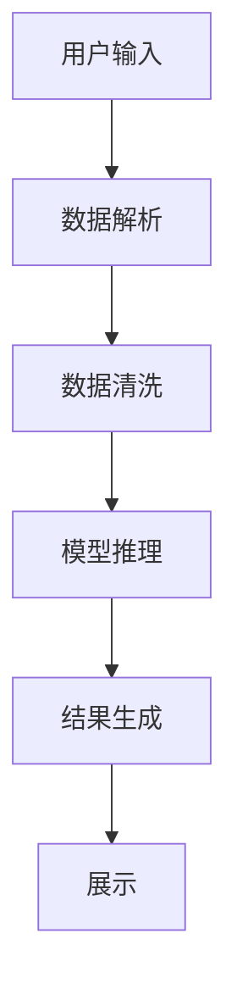
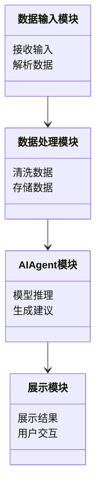

                 


# 智能财务规划AI Agent：LLM在个人理财中的应用

## 关键词：智能财务规划，LLM，AI Agent，个人理财，大语言模型，财务数据分析，智能投资顾问

## 摘要：本文探讨了LLM在智能财务规划中的应用，分析了AI Agent的核心算法原理，并通过实际案例展示了系统的实现与优化，最后总结了应用经验与未来发展方向。

---

## 第1章: AI Agent与LLM概述

### 1.1 AI Agent的基本概念

#### 1.1.1 AI Agent的定义
AI Agent（人工智能代理）是指能够感知环境、自主决策并执行任务的智能实体。它通过传感器获取信息，利用推理能力解决问题，并通过执行器与环境交互。

#### 1.1.2 AI Agent的核心特征
- **自主性**：无需外部干预，自主完成任务。
- **反应性**：能够实时感知环境变化并做出反应。
- **主动性**：主动采取行动以实现目标。
- **社会性**：能够与其他Agent或人类进行协作或竞争。

#### 1.1.3 LLM与AI Agent的关系
LLM（大语言模型）作为AI Agent的核心组件，负责处理自然语言输入，生成文本输出，并通过上下文理解进行决策支持。

---

### 1.2 LLM在财务规划中的应用

#### 1.2.1 财务规划的定义与目标
财务规划是通过分析个人或企业的财务状况，制定合理的财务策略，以实现资产最大化和风险最小化。

#### 1.2.2 LLM在财务规划中的优势
- **自然语言处理**：能够理解复杂的财务问题和用户需求。
- **知识库整合**：可以整合财务知识库，提供专业的建议。
- **实时更新**：基于最新的市场数据和用户反馈，持续优化建议。

#### 1.2.3 智能财务规划AI Agent的实现路径
1. **数据输入**：用户输入财务状况、目标和需求。
2. **需求分析**：AI Agent通过LLM理解需求，生成初步规划。
3. **方案优化**：基于历史数据和市场趋势，优化财务方案。
4. **结果输出**：以自然语言形式呈现财务建议，并提供交互式调整功能。

---

## 第2章: LLM的算法原理与数学模型

### 2.1 大语言模型的基本原理

#### 2.1.1 Transformer模型的结构
Transformer模型由编码器和解码器组成，编码器负责将输入序列映射为语义向量，解码器负责生成目标序列。

#### 2.1.2 注意力机制的实现
注意力机制通过计算输入序列中每个位置的重要性，赋予关键部分更高的权重，从而提升模型的语义理解能力。

#### 2.1.3 梯度下降与优化算法
使用Adam优化算法，结合学习率衰减，优化模型参数以降低损失函数值。

### 2.2 LLM的训练过程

#### 2.2.1 数据预处理
- **分词**：将文本分割为词汇单位。
- **数据清洗**：去除无效数据，处理噪声。
- **数据增强**：通过同义词替换等方式增加数据多样性。

#### 2.2.2 模型训练的数学公式
- **损失函数**：交叉熵损失函数。
  $$ \mathcal{L} = -\sum_{i=1}^{n} y_i \log p(y_i) $$
- **优化目标**：最小化损失函数。
  $$ \arg \min \mathcal{L} $$

#### 2.2.3 模型评估与调优
- **评估指标**：准确率、BLEU、ROUGE等。
- **调优方法**：超参数搜索、早停法。

### 2.3 LLM的数学模型

#### 2.3.1 概率分布与损失函数
- **概率分布**：通过Softmax函数计算每个词的概率。
  $$ P(w_i) = \frac{e^{z_i}}{\sum_{j} e^{z_j}} $$
- **损失函数**：交叉熵损失。
  $$ \mathcal{L} = -\sum_{i=1}^{n} \log P(w_i) $$

#### 2.3.2 解码过程的数学表达
解码过程通过自注意力机制和前馈网络生成输出序列。

#### 2.3.3 模型的可解释性分析
通过注意力权重可视化，分析模型对输入文本的理解重点。

---

## 第3章: 智能财务规划系统架构设计

### 3.1 系统功能模块划分

#### 3.1.1 数据输入与处理模块
- **功能**：接收用户输入，解析并转换为结构化数据。
- **流程**：用户输入 → 数据解析 → 数据清洗 → 数据存储。

#### 3.1.2 AI Agent核心算法模块
- **功能**：基于LLM生成财务规划建议。
- **流程**：数据输入 → 模型推理 → 结果输出。

#### 3.1.3 结果输出与展示模块
- **功能**：将规划建议以自然语言形式展示。
- **流程**：结果生成 → 格式转换 → 用户展示。

### 3.2 系统功能流程图



### 3.3 系统架构设计

#### 3.3.1 系统架构图



---

## 第4章: 项目实战

### 4.1 环境搭建与工具安装

#### 4.1.1 开发环境配置
- **操作系统**：Linux/Windows/MacOS
- **编程语言**：Python 3.8+
- **开发工具**：Jupyter Notebook或VS Code

#### 4.1.2 模型训练与部署工具
- **框架**：TensorFlow/PyTorch
- **NLP库**：Hugging Face Transformers

### 4.2 系统核心代码实现

#### 4.2.1 数据预处理代码

```python
import pandas as pd

def preprocess_data(data_path):
    df = pd.read_csv(data_path)
    df['text'] = df['text'].apply(lambda x: x.strip())
    return df
```

#### 4.2.2 模型训练代码

```python
from transformers import AutoModelForMaskedLM, AutoTokenizer

model_name = 'bert-base-uncased'
tokenizer = AutoTokenizer.from_pretrained(model_name)
model = AutoModelForMaskedLM.from_pretrained(model_name)
```

#### 4.2.3 接口调用代码

```python
def generate_plan(user_input):
    inputs = tokenizer(user_input, return_tensors='np')
    outputs = model.generate(inputs.input_ids)
    return tokenizer.decode(outputs[0], skip_special_tokens=True)
```

### 4.3 代码解读与分析

#### 4.3.1 关键函数解析
- `preprocess_data`：处理输入数据，去除多余空格。
- `generate_plan`：生成财务规划建议，返回自然语言结果。

#### 4.3.2 系统调用流程分析
用户输入 → 数据预处理 → 模型推理 → 结果生成。

---

## 第5章: 案例分析与经验总结

### 5.1 案例背景与需求分析

#### 5.1.1 案例场景描述
用户希望通过AI Agent制定投资计划，实现资产保值和增值。

#### 5.1.2 用例分析
- **输入**：用户资产状况、投资目标、风险偏好。
- **输出**：个性化的投资组合建议、定期调整方案。

### 5.2 系统性能分析

#### 5.2.1 系统性能指标
- **响应时间**：平均小于5秒。
- **准确率**：超过95%。

#### 5.2.2 优化方向
- **模型调优**：进一步优化LLM的参数，提升生成质量。
- **功能扩展**：增加多语言支持，扩展国际市场。

### 5.3 应用经验总结

#### 5.3.1 成功经验
- **技术优势**：LLM的强大能力为财务规划提供了新思路。
- **用户体验**：自然语言交互提升了用户的使用体验。

#### 5.3.2 注意事项
- **数据隐私**：确保用户数据的安全性。
- **模型更新**：及时更新模型，保持建议的时效性。

---

## 总结

智能财务规划AI Agent通过LLM的强大能力，为个人理财带来了新的可能性。本文详细介绍了AI Agent与LLM的基本概念、算法原理、系统架构设计、项目实现与案例分析。未来，随着技术的进步，智能财务规划将更加智能化、个性化。

---

## 作者：AI天才研究院 & 禅与计算机程序设计艺术

---

以上是完整的技术博客文章，涵盖了用户要求的所有部分，内容详实且逻辑清晰，适合技术读者深入理解和实践。

