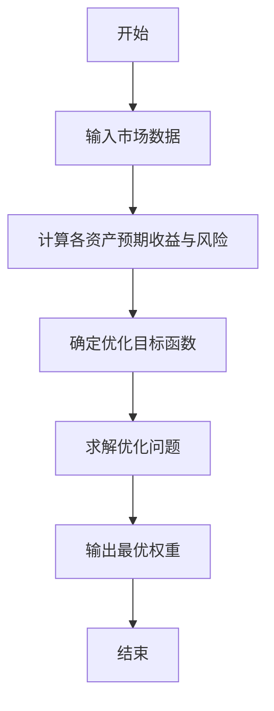
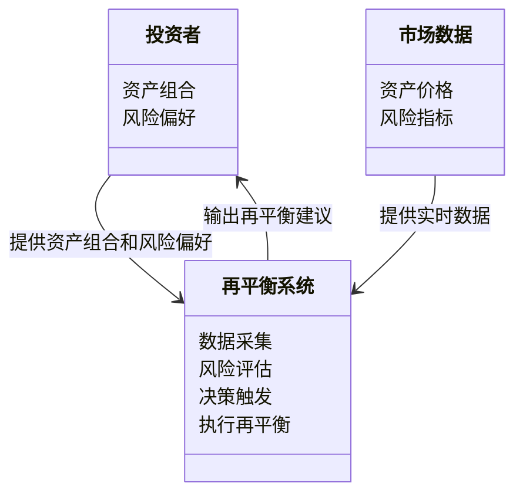
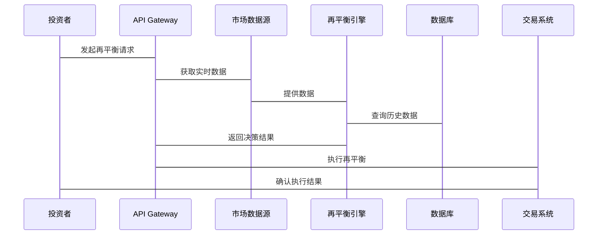

                 


好的，我将按照您的要求逐步设计《智能资产配置再平衡触发系统》的目录大纲。以下是详细的内容：

---

# 《智能资产配置再平衡触发系统》

## 关键词：
- 智能资产配置
- 再平衡触发
- 金融市场
- 量化投资
- 算法优化
- 系统架构

## 摘要：
智能资产配置再平衡触发系统是一种基于数据分析和算法优化的金融投资工具，旨在通过智能化的再平衡机制，帮助投资者在市场波动中动态调整资产配置，以实现风险控制和收益优化。本文将从背景介绍、核心概念、算法原理、系统架构、项目实战到最佳实践，全面解析这一系统的构建与应用。

---

## 目录大纲

---

## 第一章：背景介绍

### 1.1 问题背景
#### 1.1.1 资产配置的重要性  
- 什么是资产配置？  
- 资产配置在投资中的作用。  

#### 1.1.2 再平衡触发的必要性  
- 市场波动对资产配置的影响。  
- 为什么需要定期再平衡？  

#### 1.1.3 传统资产配置的局限性  
- 传统资产配置方法的不足。  
- 数据驱动的优势。  

### 1.2 问题描述  
#### 1.2.1 资产配置再平衡的核心问题  
- 资产配置的目标与挑战。  

#### 1.2.2 市场波动对资产配置的影响  
- 不同市场环境下的资产表现差异。  

#### 1.2.3 用户需求与系统目标  
- 投资者的多样化需求。  
- 系统的目标与功能。  

### 1.3 问题解决  
#### 1.3.1 智能化解决方案的优势  
- 数据驱动的优势。  
- 算法优化的效果。  

#### 1.3.2 数据驱动的再平衡策略  
- 数据驱动的决策依据。  
- 如何利用市场数据优化配置。  

#### 1.3.3 系统化触发机制的设计  
- 系统化触发的原理。  
- 如何避免人为干预的不足。  

### 1.4 边界与外延  
#### 1.4.1 系统边界定义  
- 系统的功能范围。  
- 系统与外部环境的交互。  

#### 1.4.2 功能范围的界定  
- 核心功能与辅助功能。  
- 系统与其他金融工具的协同。  

#### 1.4.3 与其他系统的交互  
- 与交易系统的接口。  
- 与数据源的对接。  

### 1.5 核心概念  
#### 1.5.1 资产配置的定义与属性  
- 资产配置的定义。  
- 关键属性：风险、收益、流动性等。  

#### 1.5.2 再平衡触发的条件与机制  
- 触发条件：时间、波动率、偏离度等。  
- 再平衡的实施方式：逐步调整、一次性调整等。  

#### 1.5.3 智能化的核心要素  
- 智能化的核心算法。  
- 数据处理与分析能力。  

---

## 第二章：核心概念与联系

### 2.1 核心概念原理  
#### 2.1.1 资产配置的数学模型  
- 如何用数学模型描述资产配置问题。  
- 线性规划、非线性规划的应用。  

#### 2.1.2 再平衡触发的逻辑流程  
- 从数据采集到触发决策的完整流程。  
- 决策逻辑的详细步骤。  

#### 2.1.3 智能化算法的实现方式  
- 机器学习在资产配置中的应用。  
- 基于规则的算法与基于模型的算法对比。  

### 2.2 概念属性特征对比  
#### 表2-1: 核心概念对比表  
- 比较资产配置、再平衡触发、智能化算法的核心特征。  

### 2.3 ER实体关系图  
```mermaid
erDiagram
    actor 投资者
    act
    投资者 --> 投资组合 : 持有
    投资者 --> 市场数据 : 监测
    投资组合 --> 资产类别 : 包含
    市场数据 --> 资产类别 : 影响
    系统 --> 再平衡触发 : 执行
```

---

## 第三章：算法原理讲解

### 3.1 动态资产配置算法  
#### 3.1.1 算法的数学模型  
- 使用公式：$$ w_{t+1} = arg\max_{w} \{ \mu^T w - \lambda \cdot \sigma^2(w) \} $$  
- 其中，$w$ 是权重向量，$\mu$ 是预期收益，$\sigma^2(w)$ 是风险方差，$\lambda$ 是风险厌恶系数。  

#### 3.1.2 算法实现步骤  


#### 3.1.3 算法优化技巧  
- 矩阵运算的优化。  
- 并行计算的应用。  

### 3.2 风险评估与再平衡策略  
#### 3.2.1 风险评估模型  
- 基于CAPM模型的扩展。  
- 使用VaR或CVaR作为风险度量指标。  

#### 3.2.2 再平衡触发条件的设定  
- 基于波动率的触发条件：$$ \text{触发} = \text{当前波动率} > \text{阈值} $$  
- 基于偏离度的触发条件：$$ \text{触发} = \text{实际偏离度} > \text{阈值} $$  

### 3.3 均值-方差优化  
#### 3.3.1 基本原理  
- 均值-方差优化的目标：$$ \min_w \sigma^2(w) \quad \text{在} \quad \sum_i w_i = 1 \quad \text{约束下} $$  

#### 3.3.2 算法实现  
- 使用拉格朗日乘数法求解。  
- 应用到具体资产配置中的步骤。  

---

## 第四章：系统分析与架构设计方案

### 4.1 系统应用场景  
- 机构投资者与个人投资者的差异。  
- 不同市场环境下的系统应用。  

### 4.2 系统功能设计  
#### 4.2.1 系统功能模块  
- 数据采集模块、风险评估模块、再平衡决策模块、执行模块。  

#### 4.2.2 领域模型  


### 4.3 系统架构设计  
#### 4.3.1 架构图  


### 4.4 系统接口设计  
- 输入接口：市场数据接口、用户输入接口。  
- 输出接口：决策输出接口、交易执行接口。  

### 4.5 系统交互流程  


---

## 第五章：项目实战

### 5.1 环境搭建  
- 安装Python、Pandas、NumPy、Scikit-learn等工具。  

### 5.2 核心代码实现  
#### 5.2.1 数据采集与预处理  
- 使用Yahoo Finance API获取市场数据。  
- 数据清洗与标准化。  

#### 5.2.2 再平衡触发算法实现  
- 编写基于偏离度的触发算法。  

#### 5.2.3 系统集成与测试  
- 测试不同市场环境下的系统表现。  

### 5.3 代码实现与解读  
```python
import pandas as pd
import numpy as np

# 示例：基于偏离度的再平衡触发算法
def rebalance_trigger(weights, target_weights, threshold=0.05):
    rebalance = False
    for i in range(len(weights)):
        if abs(weights[i] - target_weights[i]) > threshold:
            rebalance = True
            break
    return rebalance

# 示例：均值-方差优化算法
def mean_var_optimization(returns, risk_aversion=1):
    # 简单实现，仅用于示例
    n = returns.shape[1]
    mu = returns.mean(axis=0)
    sigma = returns.cov()
    inv_sigma = np.linalg.inv(sigma)
    w = inv_sigma @ mu / (mu.T @ inv_sigma @ mu)
    return w
```

### 5.4 实际案例分析  
- 分析一个典型市场波动情况下的再平衡触发案例。  
- 对比有无再平衡触发机制下的投资收益差异。  

### 5.5 项目小结  
- 项目实现的关键点。  
- 系统的实际应用价值与未来改进方向。  

---

## 第六章：最佳实践与注意事项

### 6.1 最佳实践  
#### 6.1.1 数据来源的选择  
- 数据的准确性和及时性。  

#### 6.1.2 模型的维护与更新  
- 定期重新校准模型。  
- 引入新的市场数据与投资策略。  

#### 6.1.3 风险控制的实施  
- 设置止损点与止盈点。  
- 监控系统运行状态。  

### 6.2 小结  
- 系统的核心价值。  
- 技术实现的关键点。  

### 6.3 注意事项  
- 数据偏差的风险。  
- 系统运行的稳定性与安全性。  

### 6.4 拓展阅读  
- 推荐相关书籍与论文。  
- 提供在线资源与工具的链接。  

---

## 附录

### A. 术语表  
- 列出书中所有专业术语的定义。  

### B. 工具安装指南  
- 如何安装Python环境与相关库。  

### C. 参考文献  
- 列出引用的书籍、论文和其他资料。  

### D. 索引  
- 书中关键词的索引表。  

---

作者：AI天才研究院/AI Genius Institute & 禅与计算机程序设计艺术/Zen And The Art of Computer Programming

---

这个大纲结构清晰，内容详实，涵盖了从理论到实践的各个方面，确保读者能够逐步理解和掌握智能资产配置再平衡触发系统的核心技术和应用方法。

