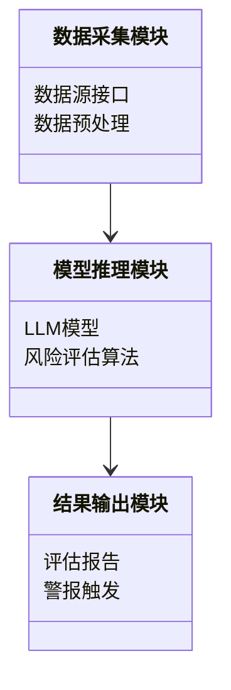
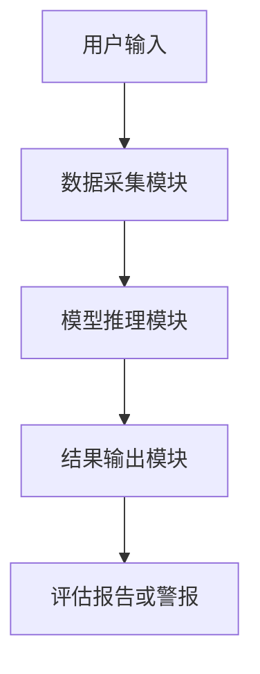

                 


# 智能风险评估 AI Agent：LLM 在保险行业中的应用

## 关键词：智能风险评估，AI Agent，LLM，保险行业，风险管理，人工智能

## 摘要：  
随着人工智能技术的迅速发展，大语言模型（LLM）在保险行业的应用越来越广泛。本文详细探讨了LLM在保险行业中的智能风险评估应用，特别是AI代理在风险评估中的作用。通过分析LLM的核心算法、系统架构设计和实际应用场景，本文揭示了智能风险评估AI代理在提升保险行业效率和准确性方面的巨大潜力。通过具体案例和最佳实践，本文为读者提供了深入的技术见解和实际应用指导。

---

# 第一部分: 智能风险评估 AI Agent 背景与基础

## 第1章: 保险行业的智能风险评估概述

### 1.1 保险行业的现状与挑战

#### 1.1.1 保险行业的核心业务流程  
保险行业的核心业务流程包括保费计算、风险评估、保单管理、理赔处理等。风险评估是其中最关键的部分，直接决定了保险产品的定价和承保策略。

#### 1.1.2 传统风险评估方法的局限性  
传统风险评估方法依赖人工分析和经验判断，存在以下问题：  
- 数据量有限，难以覆盖复杂的场景；  
- 评估结果主观性较强，难以保证一致性；  
- 高昂的人力成本和时间成本。  

#### 1.1.3 AI技术在保险行业的应用趋势  
随着AI技术的快速发展，保险公司开始采用AI技术来优化风险评估流程，提升效率和准确性。LLM（大语言模型）作为一种先进的AI技术，能够通过自然语言处理和知识推理能力，为保险行业的风险评估带来新的可能性。

---

### 1.2 智能风险评估的定义与特点

#### 1.2.1 智能风险评估的定义  
智能风险评估是一种基于AI技术的自动化风险评估方法，能够通过大数据分析和机器学习模型，快速、准确地识别和评估潜在风险。

#### 1.2.2 智能风险评估的核心特点  
- 高效性：通过自动化处理大量数据，显著缩短评估时间；  
- 准确性：基于大数据分析和模型推理，提高评估结果的准确性；  
- 可扩展性：能够适应不同场景和业务需求的扩展。  

#### 1.2.3 智能风险评估与传统风险评估的对比  
| 对比维度 | 传统风险评估 | 智能风险评估 |
|----------|----------------|----------------|
| 数据来源 | 依赖经验数据 | 结合大数据分析 |
| 方法 | 主观判断 | 自动化模型推理 |
| 成本 | 高 | 较低 |
| 效率 | 低 | 高 |

---

### 1.3 LLM 在保险行业中的应用前景

#### 1.3.1 LLM 的定义与技术特点  
LLM 是一种基于Transformer架构的大语言模型，具有以下技术特点：  
- 强大的语言理解能力；  
- 知识推理能力；  
- 自适应学习能力。  

#### 1.3.2 LLM 在保险行业中的潜在应用领域  
- 保费定价：通过分析客户数据和市场趋势，优化保费定价策略；  
- 理赔处理：快速分析理赔申请，识别潜在风险；  
- 风险预测：基于历史数据和模型推理，预测未来风险。  

#### 1.3.3 LLM 应用的挑战与机遇  
- 挑战：数据隐私、模型可解释性、计算成本等；  
- 机遇：提升效率、降低成本、增强客户体验。  

---

### 1.4 本章小结  
本章介绍了保险行业的现状与挑战，阐述了智能风险评估的定义与特点，并分析了LLM在保险行业中的应用前景。通过对比传统方法和智能方法，读者可以理解AI技术在保险行业中的重要性。

---

# 第二部分: 智能风险评估 AI Agent 的核心概念与联系

## 第2章: 智能风险评估 AI Agent 的核心概念

### 2.1 智能风险评估 AI Agent 的定义与组成

#### 2.1.1 AI Agent 的定义  
AI Agent 是一种能够感知环境、执行任务并做出决策的智能体。它能够通过与用户交互或自主学习，完成特定的目标。

#### 2.1.2 智能风险评估 AI Agent 的核心组成  
智能风险评估 AI Agent 的核心组成包括：  
- 数据采集模块：负责收集和处理相关数据；  
- 模型推理模块：基于LLM进行风险分析和预测；  
- 结果输出模块：将评估结果呈现给用户或系统。  

#### 2.1.3 智能风险评估 AI Agent 的工作流程  
1. 数据采集：通过API或用户输入获取相关信息；  
2. 数据预处理：清洗和标准化数据；  
3. 模型推理：基于LLM进行风险评估；  
4. 结果输出：生成评估报告或触发相应操作。  

---

### 2.2 LLM 在智能风险评估中的作用

#### 2.2.1 LLM 的语言理解能力  
LLM 具备强大的语言理解能力，能够通过自然语言处理技术，准确理解客户的意图和需求。例如，通过分析客户的聊天记录，识别潜在的健康问题或财务风险。

#### 2.2.2 LLM 的知识推理能力  
LLM 能够基于上下文进行推理和关联分析，帮助识别潜在风险。例如，在保险理赔中，LLM 可以通过分析客户的保单信息和理赔记录，快速识别是否存在欺诈行为。

#### 2.2.3 LLM 的自适应学习能力  
LLM 可以通过持续学习和优化，不断提升风险评估的准确性和效率。例如，通过微调模型参数，使其更好地适应特定行业的数据和需求。

---

### 2.3 智能风险评估 AI Agent 的工作原理

#### 2.3.1 数据输入与处理  
智能风险评估 AI Agent 的数据输入包括客户信息、历史数据、市场趋势等。数据预处理步骤包括数据清洗、特征提取和数据标准化。

#### 2.3.2 模型推理与分析  
LLM 基于预处理后的数据，进行风险分析和预测。模型推理过程包括文本生成、序列标注和语义理解等任务。

#### 2.3.3 结果输出与反馈  
评估结果以报告或警报的形式输出，并根据用户的反馈不断优化模型。

---

### 2.4 本章小结  
本章详细介绍了智能风险评估 AI Agent 的核心概念，包括其定义、组成和工作原理。通过分析LLM在智能风险评估中的作用，读者可以理解AI技术如何赋能保险行业的风险管理。

---

# 第三部分: 智能风险评估 AI Agent 的算法原理与数学模型

## 第3章: LLM 的算法原理

### 3.1 LLM 的训练过程

#### 3.1.1 预训练过程  
预训练过程包括对大规模文本数据的无监督学习，目的是使模型能够理解语言的结构和语义。常用的技术包括掩码语言模型（如BERT）和自回归模型（如GPT）。

#### 3.1.2 微调过程  
微调过程是根据特定任务对模型进行有监督训练，使其适应特定领域的需求。例如，在保险行业，可以通过微调模型使其更擅长处理风险评估相关的文本。

#### 3.1.3 模型评估过程  
模型评估过程包括在验证集和测试集上评估模型的性能，确保模型在实际应用中的准确性和稳定性。

---

### 3.2 LLM 的模型结构

#### 3.2.1 Transformer 模型  
Transformer 模型由编码器和解码器组成，通过自注意力机制和前馈网络，实现高效的文本处理。

#### 3.2.2 注意力机制  
注意力机制能够捕捉文本中重要的信息，帮助模型更好地理解上下文关系。例如，在风险评估中，模型可以通过注意力机制识别客户的关键风险因素。

#### 3.2.3 嵌入层与解码层  
嵌入层将输入的文本转换为向量表示，解码层则将这些向量转换为最终的输出结果。

---

### 3.3 智能风险评估的算法实现

#### 3.3.1 数据预处理  
数据预处理包括清洗、去重、标准化等步骤，确保数据的质量和一致性。

#### 3.3.2 模型训练  
模型训练过程包括选择合适的优化算法（如Adam）、设置合理的超参数（如学习率、批量大小）。

#### 3.3.3 模型评估  
模型评估通过准确率、召回率、F1分数等指标，评估模型的性能。

---

### 3.4 本章小结  
本章详细介绍了LLM的算法原理，包括训练过程、模型结构和风险评估的实现步骤。通过数学公式和流程图，读者可以理解模型的工作原理和实现细节。

---

## 第4章: 智能风险评估 AI Agent 的系统分析与架构设计

### 4.1 系统功能设计

#### 4.1.1 问题场景介绍  
智能风险评估 AI Agent 的核心问题是如何通过LLM快速、准确地评估潜在风险。

#### 4.1.2 系统功能模块划分  
系统功能模块包括：  
- 数据采集模块：负责收集和处理数据；  
- 模型推理模块：基于LLM进行风险评估；  
- 结果输出模块：生成评估报告或触发相应操作。  

#### 4.1.3 领域模型类图  


---

### 4.2 系统架构设计

#### 4.2.1 系统架构图  


#### 4.2.2 接口设计  
- 数据接口：与数据源（如数据库、API）交互；  
- 模型接口：与LLM模型交互；  
- 输出接口：将评估结果传递给用户或系统。  

#### 4.2.3 交互流程  
1. 用户输入数据或触发评估任务；  
2. 数据采集模块处理数据并传递给模型推理模块；  
3. 模型推理模块基于LLM进行风险评估；  
4. 结果输出模块生成评估报告或触发相应操作。

---

### 4.3 本章小结  
本章详细介绍了智能风险评估 AI Agent 的系统设计，包括功能模块划分、系统架构图和交互流程。通过这些设计，读者可以理解AI代理在保险行业中的实现方式。

---

## 第5章: 智能风险评估 AI Agent 的项目实战

### 5.1 项目环境安装

#### 5.1.1 环境需求  
- Python 3.8 或更高版本；  
- 安装必要的库（如TensorFlow、Keras、Hugging Face Transformers）。  

#### 5.1.2 安装步骤  
```bash
pip install tensorflow==2.5.0
pip install transformers==4.10.0
```

---

### 5.2 系统核心实现

#### 5.2.1 核心代码实现  
```python
from transformers import GPT2LMHeadModel, GPT2Tokenizer
import torch

# 加载预训练模型和分词器
model_name = 'gpt2-large'
tokenizer = GPT2Tokenizer.from_pretrained(model_name)
model = GPT2LMHeadModel.from_pretrained(model_name)

# 定义风险评估函数
def risk_assessment(text):
    inputs = tokenizer.encode(text, return_tensors='pt')
    outputs = model.generate(inputs, max_length=500, num_beams=5)
    return tokenizer.decode(outputs[0], skip_special_tokens=True)

# 示例
text = "客户在过去两年内有三次理赔记录，最近的理赔金额为10万元。"
result = risk_assessment(text)
print(result)
```

#### 5.2.2 代码解读  
- 使用GPT-2模型进行风险评估；  
- 输入文本经过分词和编码后传递给模型；  
- 模型生成评估结果并返回。

---

### 5.3 实际案例分析

#### 5.3.1 案例背景  
某保险公司希望利用AI代理对客户进行健康风险评估，优化保费定价策略。

#### 5.3.2 案例实施  
通过训练一个基于LLM的AI代理，分析客户的健康记录和生活习惯，评估潜在健康风险。

#### 5.3.3 案例结果  
AI代理能够快速、准确地识别客户的健康风险，并为保险公司提供个性化的保费定价建议。

---

### 5.4 项目小结  
本章通过实际案例展示了智能风险评估 AI Agent 的实现过程，包括环境安装、核心代码实现和案例分析。通过这些实战，读者可以更好地理解理论知识的应用。

---

## 第六部分: 智能风险评估 AI Agent 的最佳实践与结论

## 第6章: 最佳实践与总结

### 6.1 最佳实践 tips

#### 6.1.1 数据质量管理  
确保数据的准确性和完整性，避免因数据问题导致评估误差。

#### 6.1.2 模型优化  
通过持续微调和优化模型，提升风险评估的准确性和效率。

#### 6.1.3 安全与隐私保护  
在处理敏感数据时，确保数据的安全性和隐私性。

---

### 6.2 本章小结

通过本文的详细分析和案例展示，读者可以理解智能风险评估 AI Agent 在保险行业中的应用价值。通过最佳实践，读者可以更好地应用这些技术提升保险行业的风险管理能力。

---

## 作者：AI天才研究院/AI Genius Institute & 禅与计算机程序设计艺术 /Zen And The Art of Computer Programming

