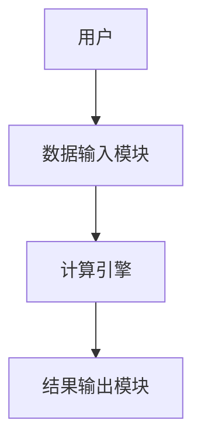
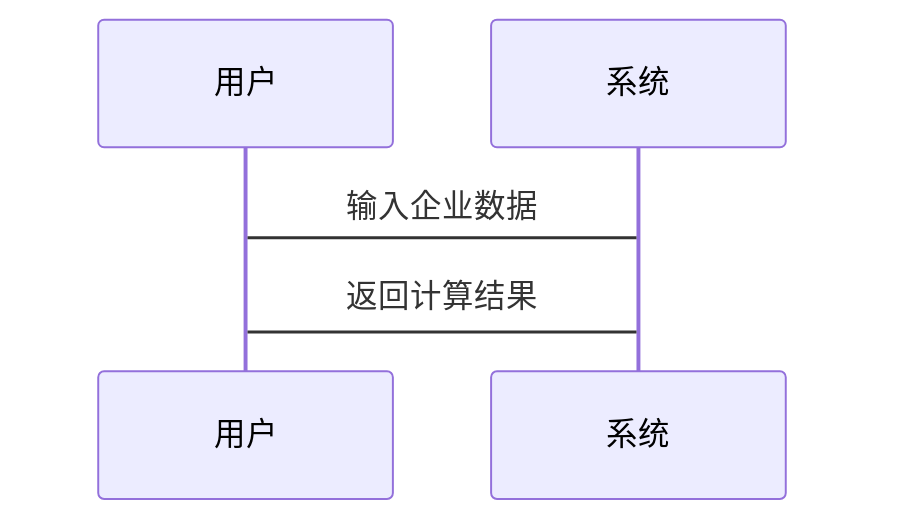

                 


# 本杰明·格雷厄姆的企业价值计算方法

> 关键词：企业价值计算，本杰明·格雷厄姆，价值投资，内在价值，安全边际，投资分析，企业价值评估

> 摘要：本文详细介绍了本杰明·格雷厄姆的企业价值计算方法，从核心概念、算法原理、系统架构到项目实战，深入剖析了该方法的理论基础和实际应用。通过本文，读者将能够掌握如何使用格雷厄姆的方法来评估企业的内在价值，并基于此做出投资决策。

---

## 第1章: 企业价值计算的基本概念

### 1.1 企业价值计算的背景与意义

#### 1.1.1 企业价值计算的基本概念
企业价值计算是评估企业整体价值的重要方法，其核心在于确定企业的内在价值，以便投资者做出合理的投资决策。本杰明·格雷厄姆作为价值投资的鼻祖，提出了基于基本面分析的企业价值计算方法。

#### 1.1.2 企业价值计算的重要性
企业价值计算能够帮助投资者识别被低估的企业，从而实现长期稳定的收益。通过对企业价值的准确评估，投资者可以避免盲目跟风，降低投资风险。

#### 1.1.3 本杰明·格雷厄姆的贡献
格雷厄姆是价值投资的奠基人，他提出了“安全边际”和“内在价值”等核心概念，并开发了多种企业价值计算方法。这些方法至今仍然是投资分析的重要工具。

### 1.2 企业价值计算的核心要素

#### 1.2.1 企业价值的定义
企业价值（Enterprise Value, EV）是企业整体价值的度量，包括股权价值、债权价值和所有者权益。计算企业价值的公式为：
$$ EV = EBIT \times (1 + WACC) $$

#### 1.2.2 核心要素的识别
企业价值计算的核心要素包括：
1. **EBIT（息税折旧前利润）**：反映企业的盈利能力和运营效率。
2. **WACC（加权平均资本成本）**：反映企业的融资成本和资本结构。
3. **永续增长率（g）**：反映企业的长期增长潜力。

#### 1.2.3 核心要素的量化
核心要素的量化需要结合企业的财务报表和行业数据进行分析。例如，EBIT可以通过利润表计算，WACC需要结合企业的资本结构和市场利率进行估算。

### 1.3 企业价值计算的边界与外延

#### 1.3.1 计算范围的界定
企业价值计算的范围通常包括企业全部股权价值，但不包括现金和债务等短期资产。公式为：
$$ EV = 市值 + 债务 + 现金储备 $$

#### 1.3.2 计算模型的适用性
格雷厄姆的企业价值计算方法适用于成熟企业，尤其是那些具有稳定盈利能力和明确增长潜力的企业。

#### 1.3.3 计算结果的解释
企业价值计算结果需要结合市场环境和行业特点进行解释。例如，在市场低迷时期，企业价值可能被低估，从而为投资者提供买入机会。

### 1.4 核心概念与联系

#### 1.4.1 核心概念原理
格雷厄姆的企业价值计算方法基于以下核心概念：
1. **内在价值**：企业的实际价值，不依赖于市场波动。
2. **安全边际**：内在价值与市场价格之间的差额，确保投资的安全性。

#### 1.4.2 概念属性特征对比表格
下表对比了格雷厄姆方法与其他方法的核心概念属性：

| 方法          | 内在价值计算 | 安全边际 | 资本结构 | 适用场景 |
|---------------|--------------|----------|----------|----------|
| 格雷厄姆方法  | 基于EBIT和WACC | 明显存在 | 稳定资本 | 成熟企业 |
| 市盈率法       | 基于净利润     | 无       | 无       | 初期企业 |

#### 1.4.3 ER实体关系图架构
以下是企业价值计算的实体关系图：

```mermaid
erDiagram
    企业价值<--(拥有)--> 股权价值
    股权价值<--(包含)--> 债务价值
    债务价值<--(依赖)--> 资本结构
    资本结构<--(影响)--> WACC
```

---

## 第2章: 格雷厄姆的企业价值计算方法

### 2.1 格雷厄姆的基本思路

#### 2.1.1 价值投资的核心理念
价值投资的核心理念是寻找被市场低估的企业，通过长期持有实现收益。格雷厄姆强调“安全边际”，即内在价值与市场价格的差额。

#### 2.1.2 企业内在价值的定义
内在价值是基于企业未来现金流的现值，公式为：
$$ V = \sum_{t=1}^{n} \frac{CF_t}{(1 + r)^t} $$

#### 2.1.3 投资安全边际的概念
安全边际是市场价格低于内在价值的部分，公式为：
$$ MS = V - P $$

### 2.2 格雷厄姆的企业价值计算模型

#### 2.2.1 模型的基本框架
格雷厄姆的企业价值计算模型基于以下步骤：
1. **计算EBIT**：通过企业过去三年的平均EBIT估算未来现金流。
2. **估算永续增长率**：假设企业未来每年增长率为g。
3. **计算WACC**：基于企业的资本成本和市场利率估算WACC。
4. **计算内在价值**：使用永续年金公式计算企业价值。

#### 2.2.2 模型的输入参数
模型的主要输入参数包括：
1. **EBIT**：企业过去三年的平均EBIT。
2. **永续增长率（g）**：通常假设为5%。
3. **WACC**：基于市场利率和资本结构估算。

#### 2.2.3 模型的输出结果
模型输出企业的内在价值（EV）和安全边际（MS）。

### 2.3 格雷厄姆方法与其他方法的对比

#### 2.3.1 其他企业价值计算方法概述
常见的企业价值计算方法包括市盈率法、市净率法和DCF模型。

#### 2.3.2 格雷厄姆方法的独特性
格雷厄姆方法的独特性在于其基于安全边际的保守投资策略，强调风险控制和长期价值。

#### 2.3.3 方法适用场景的对比
格雷厄姆方法适用于成熟企业，而DCF模型适用于高增长企业。

---

## 第3章: 企业价值计算的算法原理

### 3.1 格雷厄姆算法的基本原理

#### 3.1.1 算法的输入与输出
算法输入包括EBIT、永续增长率和WACC，输出为内在价值和安全边际。

#### 3.1.2 算法的步骤分解
1. **计算EBIT**：基于企业财务报表估算EBIT。
2. **估算永续增长率**：假设每年增长率为g。
3. **计算WACC**：基于市场利率和资本结构估算WACC。
4. **计算内在价值**：使用永续年金公式计算EV。
5. **计算安全边际**：EV减去当前市场价格。

#### 3.1.3 算法的数学模型
以下是算法的主要数学模型：
$$ V = \frac{EBIT \times (1 + g)}{WACC - g} $$

### 3.2 算法的数学模型与公式

#### 3.2.1 内在价值计算公式
$$ V = \frac{EBIT \times (1 + g)}{WACC - g} $$

#### 3.2.2 安全边际计算公式
$$ MS = V - P $$

### 3.3 算法的实现与优化

#### 3.3.1 算法的实现步骤
1. **收集数据**：获取企业的EBIT、WACC和市场价格。
2. **计算内在价值**：使用公式计算V。
3. **计算安全边际**：计算MS。
4. **输出结果**：显示内在价值和安全边际。

#### 3.3.2 算法的优化建议
1. **动态调整增长率**：根据市场变化调整g。
2. **优化WACC计算**：基于最新市场利率和资本结构。

#### 3.3.3 算法的复杂度分析
格雷厄姆算法的复杂度较低，主要基于基本财务数据的计算。

---

## 第4章: 企业价值计算的系统分析与架构设计

### 4.1 系统功能设计

#### 4.1.1 问题场景介绍
企业价值计算系统需要支持多种计算方法和数据输入，帮助投资者快速评估企业价值。

#### 4.1.2 系统功能模块
系统功能模块包括数据输入、计算引擎和结果输出。

#### 4.1.3 系统功能流程
1. **数据输入**：用户输入企业财务数据。
2. **计算引擎**：系统自动计算内在价值和安全边际。
3. **结果输出**：显示计算结果和投资建议。

### 4.2 系统架构设计

#### 4.2.1 系统架构图
以下是系统架构图：



#### 4.2.2 系统功能模块
系统功能模块包括数据输入模块、计算引擎和结果输出模块。

### 4.3 系统接口设计

#### 4.3.1 系统接口设计
系统接口包括：
1. **数据输入接口**：支持Excel和CSV格式的数据输入。
2. **计算接口**：支持多种企业价值计算方法。

#### 4.3.2 系统交互图
以下是系统交互图：



---

## 第5章: 项目实战

### 5.1 环境安装

#### 5.1.1 安装Python
安装Python 3.8及以上版本。

#### 5.1.2 安装依赖库
安装pandas和numpy库：
```bash
pip install pandas numpy
```

### 5.2 核心实现

#### 5.2.1 计算EBIT
```python
import pandas as pd

def calculate_ebit(revenue, cost):
    return revenue - cost
```

#### 5.2.2 计算WACC
```python
def calculate_wacc(market_value, cost_of_debt, cost_of_equity, debt_equity_ratio):
    return (market_value * cost_of_debt * debt_equity_ratio + market_value * cost_of_equity) / (debt_equity_ratio + 1)
```

### 5.3 案例分析

#### 5.3.1 案例分析
以某公司为例，计算其企业价值：
1. **EBIT**：100万元。
2. **永续增长率（g）**：5%。
3. **WACC**：8%。
4. **计算内在价值**：
$$ V = \frac{100 \times (1 + 0.05)}{0.08 - 0.05} = 3500万元 $$

### 5.4 项目小结
通过案例分析，我们可以看到格雷厄姆方法在实际应用中的有效性。

---

## 第6章: 最佳实践与注意事项

### 6.1 最佳实践 tips

#### 6.1.1 数据准确性
确保输入数据的准确性，尤其是EBIT和WACC。

#### 6.1.2 方法选择
根据企业特点选择合适的计算方法。

#### 6.1.3 风险控制
关注市场变化和企业经营环境。

### 6.2 小结

#### 6.2.1 核心概念总结
格雷厄姆方法的核心在于内在价值和安全边际。

#### 6.2.2 应用场景总结
该方法适用于成熟企业和长期投资。

### 6.3 注意事项

#### 6.3.1 数据风险
避免过度依赖历史数据。

#### 6.3.2 方法局限性
格雷厄姆方法在高增长企业中的应用有限。

#### 6.3.3 投资纪律
坚持价值投资的原则，避免情绪化投资。

### 6.4 拓展阅读

#### 6.4.1 推荐书籍
1. 《证券分析》（ Benjamin Graham & David Dodd）
2. 《价值投资实战》（Philip A. Fisher）

#### 6.4.2 推荐博客
1. [格雷厄姆投资思想](https://www.gurufocus.com)
2. [价值投资实践](https://www.valueinvestit.com)

---

## 作者：AI天才研究院 & 禅与计算机程序设计艺术

