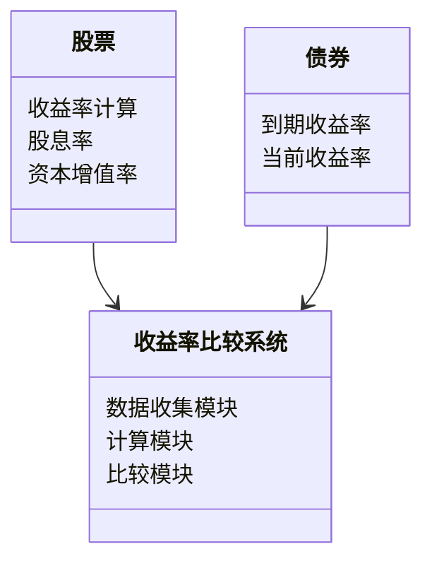
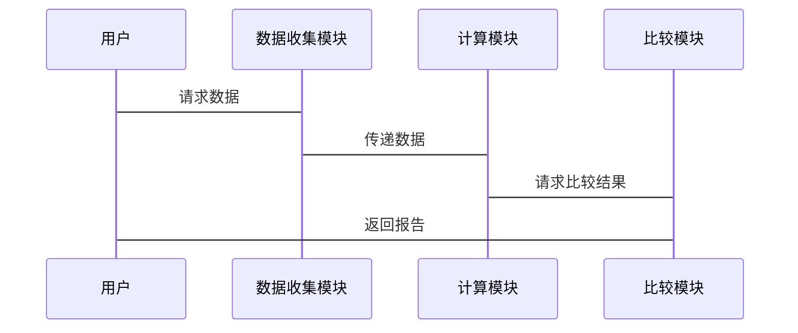

                 


---

# 本杰明·格雷厄姆的股债收益率比较分析

## 关键词：股债收益率、股票收益率、债券收益率、本杰明·格雷厄姆、投资分析

## 摘要：  
本文深入探讨了本杰明·格雷厄姆关于股债收益率比较的理论与实践。通过分析股票与债券的收益率计算方法、比较维度和影响因素，结合实际案例和系统架构，帮助投资者更好地理解如何在股债之间做出最优选择。文章从基础概念出发，逐步展开，最终提供可操作的投资策略。

---

## 第1章: 股债收益率比较分析的背景与意义

### 1.1 股票与债券的基本概念

#### 1.1.1 股票的定义与特点
- **股票**：代表公司所有权的凭证，股东享有分红权和投票权。
- **特点**：
  - 长期收益潜力大。
  - 风险较高，波动性大。
  - 受宏观经济和公司业绩影响。

#### 1.1.2 债券的定义与特点
- **债券**：债务工具，发行人承诺在特定时间内支付利息和本金。
- **特点**：
  - 收益相对稳定。
  - 风险较低，波动性小。
  - 受利率和宏观经济影响。

#### 1.1.3 股票与债券的主要区别
- **收益来源**：股票通过股息和资本增值，债券通过固定利息。
- **风险**：股票风险高于债券。
- **流动性**：两者均具有较高流动性，但股票市场波动更大。

### 1.2 股债收益率比较的意义

#### 1.2.1 投资者选择股债资产的决策依据
- 投资者根据风险承受能力和收益目标选择资产配置。

#### 1.2.2 股债收益率比较对投资组合优化的作用
- 通过比较股债收益率，优化资产配置，平衡风险与收益。

#### 1.2.3 股债收益率比较在风险管理中的应用
- 帮助投资者在不同市场环境下调整投资策略，降低风险。

### 1.3 股债收益率比较的背景与现状

#### 1.3.1 股债市场的发展历程
- 股票市场起源于17世纪的荷兰，债券市场同样历史悠久。
- 现代金融市场的发展为股债收益率比较提供了数据基础。

#### 1.3.2 本杰明·格雷厄姆的学术贡献
- 格雷厄姆是价值投资的创始人，强调安全边际和长期投资。
- 他提出了股债收益率比较的理论框架。

#### 1.3.3 当前股债收益率比较的热点问题
- 利率变化对股债收益率的影响。
- 经济周期对股债收益率的影响。

### 1.4 本章小结
- 本章介绍了股债的基本概念、比较意义及背景，为后续分析奠定基础。

---

## 第2章: 股票与债券收益率的核心概念

### 2.1 股票收益率的定义与计算

#### 2.1.1 股票收益率的计算公式
- **股息率**：$ \text{股息率} = \frac{\text{每股股息}}{\text{股票价格}} \times 100\% $。
- **资本增值率**：$ \text{资本增值率} = \frac{\text{期末价} - \text{期初价}}{\text{期初价}} \times 100\% $。

#### 2.1.2 股票收益率的类型
- 简单收益率、复利收益率、几何平均收益率。

#### 2.1.3 股票收益率的影响因素
- 宏观经济、行业状况、公司业绩、市场情绪。

### 2.2 债券收益率的定义与计算

#### 2.2.1 债券收益率的计算公式
- **到期收益率**：$ \text{到期收益率} = \frac{\text{票面利息} + \text{面值收回} - \text{购买价格}}{\text{购买价格}} \times \frac{1}{\text{期限}} $。
- **当前收益率**：$ \text{当前收益率} = \frac{\text{年利息}}{\text{债券价格}} \times 100\% $。

#### 2.2.2 债券收益率的类型
- 当前收益率、到期收益率、即期收益率。

#### 2.2.3 债券收益率的影响因素
- 利率水平、债券期限、市场供需。

### 2.3 股票与债券收益率的核心区别

#### 2.3.1 收益来源的不同
- 股票：股息和资本增值。
- 债券：固定利息和本金偿还。

#### 2.3.2 风险程度的不同
- 股票风险高，债券风险低。

#### 2.3.3 价格波动的不同
- 股票波动大，债券波动小。

### 2.4 股票与债券收益率的联系

#### 2.4.1 利率对股债收益率的共同影响
- 利率上升，债券收益率上升，股票收益率可能下降。

#### 2.4.2 经济周期对股债收益率的影响
- 经济繁荣时，股票收益高；经济衰退时，债券收益相对稳定。

#### 2.4.3 投资者风险偏好的影响
- 风险偏好高的投资者倾向于股票，风险偏好低的倾向于债券。

### 2.5 本章小结
- 本章详细介绍了股债收益率的核心概念及其区别与联系。

---

## 第3章: 股票与债券收益率的比较分析方法

### 3.1 股票与债券收益率的比较维度

#### 3.1.1 绝对收益率比较
- 比较股票和债券的绝对收益率，判断哪种资产收益更高。

#### 3.1.2 相对收益率比较
- 计算股票和债券的收益率差异，判断哪种资产更具吸引力。

#### 3.1.3 风险调整后的收益率比较
- 使用夏普比率等指标，考虑风险因素后的收益率比较。

### 3.2 股票与债券收益率的比较指标

#### 3.2.1 股票的股息率
- 通过股息率判断股票的分红能力。

#### 3.2.2 债券的到期收益率
- 通过到期收益率判断债券的收益潜力。

#### 3.2.3 其他相关指标
- 夏普比率：$ \text{夏普比率} = \frac{\text{超额收益}}{\text{收益的标准差}} $。

### 3.3 股票与债券收益率的比较流程

#### 3.3.1 数据收集与整理
- 收集股票和债券的历史收益率数据。

#### 3.3.2 数据分析与计算
- 使用数学模型计算股债收益率。

#### 3.3.3 比较与优化
- 根据比较结果优化资产配置。

### 3.4 本章小结
- 本章介绍了股债收益率比较的维度、指标和流程。

---

## 第4章: 股票与债券收益率的系统分析与架构设计

### 4.1 系统功能设计（领域模型）

#### 4.1.1 领域模型（Mermaid 类图）


### 4.2 系统架构设计（Mermaid 架构图）

```mermaid
docker
    services:
      db:
        image: postgres:latest
        volumes:
          - ./db:/var/lib/postgresql/data
        ports:
          - "5432:5432"
      web:
        image: python:3.9
        depends_on:
          - db
        ports:
          - "8000:8000"
        environment:
          - DB_HOST=db
          - DB_PORT=5432
          - DB_USER=user
          - DB_PASSWORD=password
```

### 4.3 系统接口设计

#### 4.3.1 数据接口
- 数据收集模块从数据库获取股票和债券数据。

#### 4.3.2 计算接口
- 计算模块调用收益率计算函数，返回股债收益率。

#### 4.3.3 比较接口
- 比较模块根据收益率结果生成报告。

### 4.4 系统交互设计（Mermaid 序列图）



### 4.5 本章小结
- 本章通过系统架构设计，展示了如何实现股债收益率比较的自动化流程。

---

## 第5章: 股票与债券收益率的项目实战

### 5.1 环境安装

```python
# 安装依赖
pip install pandas numpy matplotlib
```

### 5.2 系统核心实现源代码

```python
import pandas as pd
import numpy as np

def stock_yield(price, dividend):
    return (dividend / price) * 100

def bond_yield(price, face_value, coupon_rate, years):
    return ((face_value * coupon_rate) / price) * 100

# 示例数据
stock_prices = [100, 105, 110]
stock_dividends = [2, 3, 4]

bond_prices = [95, 100, 105]
bond_face = 100
bond_coupon = 5
years = 5

# 计算股票和债券收益率
stock_yields = [stock_yield(p, d) for p, d in zip(stock_prices, stock_dividends)]
bond_yields = [bond_yield(p, bond_face, bond_coupon, years) for p in bond_prices]

print("股票收益率:", stock_yields)
print("债券收益率:", bond_yields)
```

### 5.3 代码应用解读与分析
- 上述代码展示了如何计算股票和债券的收益率，并进行比较。

### 5.4 实际案例分析
- 以某公司股票和国债为例，计算并比较其收益率。

### 5.5 本章小结
- 本章通过实际项目，展示了如何应用股债收益率比较的理论。

---

## 第6章: 股票与债券收益率比较的最佳实践与总结

### 6.1 注意事项
- 数据的准确性和完整性。
- 模型的适用性和局限性。

### 6.2 小结
- 本章总结了股债收益率比较的实践经验和注意事项。

### 6.3 拓展阅读
- 推荐相关书籍和文献，供读者深入学习。

### 6.4 本章小结
- 本章提供了股债收益率比较的实践建议和总结。

---

## 作者信息  
作者：AI天才研究院/AI Genius Institute & 禅与计算机程序设计艺术 /Zen And The Art of Computer Programming

