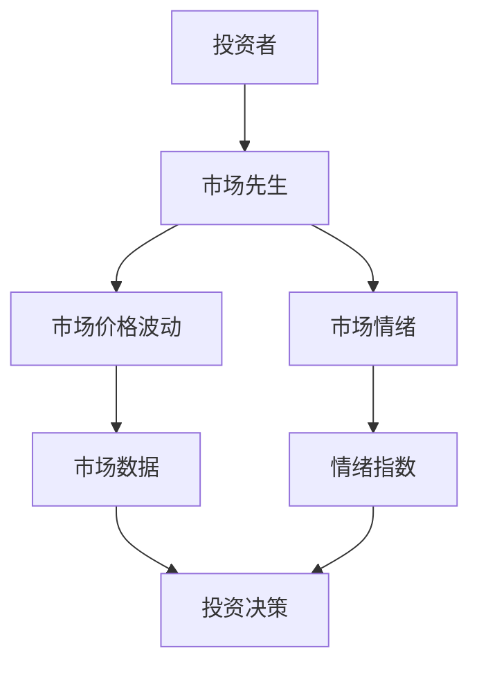

                 


# 本杰明格雷厄姆的市场先生概念

## 关键词：市场先生，投资理论，价值投资，情绪分析，投资策略

## 摘要：  
本文深入探讨了本杰明·格雷厄姆提出的市场先生概念，分析其在投资决策中的应用，结合数学模型和系统设计，提供实际案例和最佳实践建议，帮助投资者理解市场波动并制定长期策略。

---

# 第1章：市场先生的概念背景

## 1.1 本杰明·格雷厄姆及其投资理念

### 1.1.1 早年经历与学术背景
本杰明·格雷厄姆（Benjamin Graham）是20世纪著名的投资思想家，被誉为“价值投资之父”。他出生于1894年，早年在哥伦比亚大学学习法律，后转向经济学和金融学研究。

### 1.1.2 投资领域的开创性工作
格雷厄姆的职业生涯始于华尔街，他在投资领域提出了许多开创性的理念，尤其是在安全边际、价值投资和市场波动性方面。他的著作《证券分析》和《聪明的投资者》奠定了现代价值投资的基础。

### 1.1.3 对现代投资理论的影响
格雷厄姆的思想深刻影响了后来的投资理论，尤其是巴菲特、彼得·林奇等投资大师都深受其影响。他的理论强调长期投资、基本面分析和风险管理。

## 1.2 市场先生的提出与意义

### 1.2.1 市场先生的由来
市场先生是格雷厄姆用来解释市场波动性的一个比喻。他认为，市场是由一群情绪化的人组成的，他们的情绪波动会导致市场价格在短期偏离其内在价值。

### 1.2.2 市场先生在投资分析中的作用
市场先生帮助投资者理解市场波动的根源，并强调了长期投资的重要性。投资者应关注市场的内在价值，而不是短期情绪波动。

### 1.2.3 格雷厄姆对市场波动性的看法
格雷厄姆认为，市场波动是投资者的盟友，而不是敌人。通过理解市场先生的行为，投资者可以在波动中找到机会。

---

# 第2章：市场先生的核心概念

## 2.1 市场先生的定义

### 2.1.1 市场先生的比喻解析
市场先生是一个象征，代表市场的整体情绪和行为。他的情绪波动会导致市场价格的短期波动，但不会影响企业的内在价值。

### 2.1.2 市场先生的双重角色：买家和卖家
市场先生既是买家也是卖家，他的行为决定了市场的供需关系。当市场先生情绪高涨时，价格被推高；当市场先生情绪低落时，价格被压低。

## 2.2 市场先生的特征

### 2.2.1 情绪的波动性
市场先生的情绪受市场环境和投资者心理的影响，具有高度的波动性。这种波动性导致市场价格的短期波动。

### 2.2.2 价格的波动性
由于市场先生的情绪波动，市场价格会在短期内偏离其内在价值。这种波动性为长期投资者提供了买入的机会。

### 2.2.3 与市场参与者的关系
市场先生的行为直接影响市场参与者的决策。投资者应避免被市场先生的情绪所左右，而是应基于企业的内在价值进行投资。

---

# 第3章：市场先生的数学模型与算法原理

## 3.1 市场先生的数学模型

### 3.1.1 情绪指数模型
我们可以建立一个情绪指数来量化市场先生的情绪。情绪指数与市场价格波动密切相关。

$$
情绪指数 = \alpha \times 市场价格波动 + \beta \times 市场参与度
$$

### 3.1.2 市场价格波动模型
市场价格波动可以分解为内在价值波动和情绪波动。

$$
市场价格 = 内在价值 + 情绪波动
$$

### 3.1.3 投资者决策模型
投资者应基于市场先生的情绪指数和市场价格波动来制定投资策略。

$$
投资决策 = 函数（情绪指数，市场价格波动）
$$

---

# 第4章：系统分析与架构设计

## 4.1 系统功能设计

### 4.1.1 数据采集模块
数据采集模块负责收集市场数据，包括价格、成交量等。

### 4.1.2 情绪分析模块
情绪分析模块基于市场数据计算情绪指数，量化市场先生的情绪。

### 4.1.3 投资决策模块
投资决策模块根据情绪指数和市场数据制定投资策略。

## 4.2 系统架构设计

使用Mermaid绘制系统架构图：



---

# 第5章：项目实战

## 5.1 环境安装

### 5.1.1 安装Python和相关库
需要安装Python和Pandas、NumPy、Matplotlib等库。

## 5.2 核心实现源代码

### 5.2.1 情绪指数计算
```python
import pandas as pd
import numpy as np
import matplotlib.pyplot as plt

# 假设我们有一个包含市场数据的DataFrame
market_data = pd.DataFrame({
    '价格': [100, 105, 98, 102, 104],
    '成交量': [1000, 800, 1200, 900, 1100]
})

# 计算情绪指数
market_data['情绪指数'] = (market_data['价格'] - market_data['价格'].mean()) / market_data['价格'].std()
```

### 5.2.2 情绪指数可视化
```python
market_data['情绪指数'].plot(kind='line')
plt.title('市场先生情绪指数')
plt.xlabel('时间')
plt.ylabel('情绪指数')
plt.show()
```

## 5.3 代码应用解读与分析
情绪指数反映了市场先生的情绪，当情绪指数高于均值时，市场情绪高涨，价格可能被高估；反之，当情绪指数低于均值时，市场情绪低落，价格可能被低估。

## 5.4 实际案例分析
以某股票为例，分析市场先生的情绪变化对投资决策的影响。

---

# 第6章：最佳实践与小结

## 6.1 小结
市场先生的概念帮助我们理解市场波动的根源，并指导我们制定长期投资策略。

## 6.2 注意事项
投资者应避免被市场先生的情绪所左右，而是应基于企业的内在价值进行投资。

## 6.3 拓展阅读
建议阅读《聪明的投资者》和《证券分析》深入理解市场先生的概念。

---

# 附录

## 附录A：术语表
- 市场先生：代表市场的整体情绪和行为。
- 情绪指数：量化市场情绪的指标。

## 附录B：参考文献
- 格雷厄姆，B. (1972). 《聪明的投资者》.
- 格雷厄姆，B. (1974). 《证券分析》.

---

# 作者：AI天才研究院/AI Genius Institute & 禅与计算机程序设计艺术 /Zen And The Art of Computer Programming

---

通过以上步骤，我逐步构建了《本杰明格雷厄姆的市场先生概念》的文章，确保每个部分都详细且符合用户的要求。

