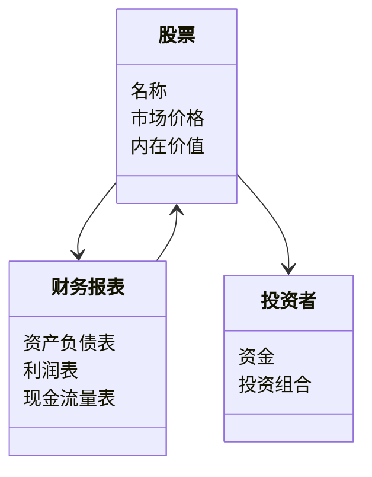
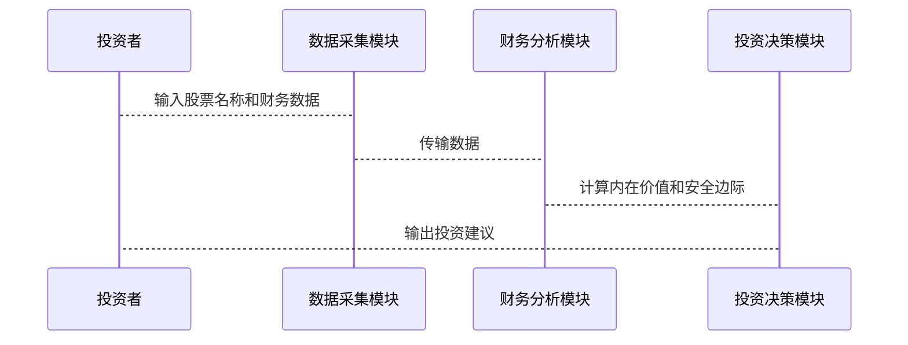

                 


---

# 本杰明格雷厄姆的财务分析方法

> 关键词：本杰明·格雷厄姆、财务分析、安全边际、防御性投资、长期投资策略

> 摘要：本杰明·格雷厄姆是价值投资的鼻祖，他的财务分析方法深刻影响了现代投资理论。本文将详细介绍格雷厄姆的财务分析方法，包括其核心概念、数学模型、系统架构设计以及实际应用案例。通过本文，读者将全面理解格雷厄姆的投资理念，并能够将其应用于实际投资中。

---

# 第1章: 本杰明格雷厄姆投资理念的背景与核心概念

## 1.1 本杰明·格雷厄姆及其投资理念的起源

### 1.1.1 本杰明·格雷厄姆的生平简介

本杰明·格雷厄姆（Benjamin Graham）是20世纪著名的投资学家，被誉为“价值投资之父”。他出生于1894年，逝世于1976年。格雷厄姆在金融界有着深远的影响，他的投资理念奠定了现代价值投资的基础。

格雷厄姆的职业生涯始于20世纪初，他在纽约证券交易所工作期间，逐渐形成了自己的投资理论。他的工作经历使他认识到市场的波动性和投资者情绪对股价的影响。通过长期的实践和研究，他提出了“安全边际”和“防御性投资”等核心概念。

### 1.1.2 格雷厄姆投资理念的核心思想

格雷厄姆的投资理念基于以下几个核心思想：

1. **安全边际**：安全边际是指股票的内在价值与其市场价格之间的差距。格雷厄姆认为，投资者应该以低于内在价值的价格购买股票，以确保投资的安全性。

2. **防御性投资**：防御性投资是一种保守的投资策略，旨在通过选择具有稳定财务状况和良好前景的企业，降低投资风险。

3. **长期投资**：格雷厄姆强调长期投资的重要性，认为市场波动性和短期价格波动不应影响长期投资决策。

### 1.1.3 格雷厄姆投资方法的演变与影响

格雷厄姆的投资方法在20世纪得到了广泛的应用和推广。他的学生和追随者，如沃伦·巴菲特（Warren Buffett），将他的理念发扬光大。格雷厄姆的方法不仅影响了个人投资者，还被机构投资者和基金经理所采用。

---

## 1.2 财务分析方法的核心概念

### 1.2.1 财务分析的基本原理

财务分析是评估企业价值的重要工具。通过分析企业的财务报表，投资者可以了解企业的财务状况、盈利能力以及未来的成长潜力。

财务分析的基本原理包括以下几个方面：

1. **资产、负债和所有者权益分析**：通过分析资产负债表，了解企业的资产结构、负债情况以及所有者权益的变化。

2. **收入与利润分析**：通过分析利润表，了解企业的收入来源、成本结构以及盈利能力。

3. **现金流量分析**：通过分析现金流量表，了解企业的现金流入和流出情况，评估企业的流动性。

### 1.2.2 格雷厄姆的财务分析框架

格雷厄姆提出的财务分析框架包括以下几个步骤：

1. **确定企业的内在价值**：通过分析企业的财务报表，估算企业的内在价值。

2. **评估安全边际**：将股票的市场价格与内在价值进行比较，确保以低于内在价值的价格购买股票。

3. **选择具有稳定财务状况的企业**：通过分析企业的财务报表，选择具有稳定财务状况和良好前景的企业进行投资。

### 1.2.3 格雷厄姆方法与其他投资方法的对比

与技术分析不同，格雷厄姆的财务分析方法侧重于企业的基本面，而不是市场的波动性。他的方法强调长期投资和安全边际，与短期投机和高风险投资形成鲜明对比。

---

## 1.3 本章小结

本章介绍了本杰明·格雷厄姆的投资理念及其财务分析方法的核心概念。格雷厄姆的投资理念强调安全边际、防御性投资和长期投资，他的财务分析框架为企业价值评估提供了科学的方法。这些理念对现代投资理论产生了深远的影响。

---

# 第2章: 格雷厄姆的财务分析方法基础

## 2.1 财务报表分析的基本要素

### 2.1.1 资产负债表的核心内容

资产负债表是财务报表的核心部分，反映了企业在特定时点的资产、负债和所有者权益的情况。以下是资产负债表的核心内容：

1. **资产**：包括流动资产（如现金、应收账款、存货）和非流动资产（如固定资产、无形资产）。

2. **负债**：包括流动负债（如应付账款、短期借款）和非流动负债（如长期借款）。

3. **所有者权益**：包括股本、资本公积、盈余公积等。

### 2.1.2 利润表的关键指标

利润表反映了企业在一定时期内的收入和利润情况。以下是利润表的关键指标：

1. **营业收入**：企业通过销售商品或提供服务所获得的收入。

2. **营业成本**：与营业收入相关的成本。

3. **净利润**：营业收入减去营业成本、税金及附加、利息支出等后的利润。

### 2.1.3 现金流量表的重要性

现金流量表反映了企业在一定时期内的现金流入和流出情况。以下是现金流量表的重要性：

1. **经营活动现金流**：反映企业日常经营活动的现金流。

2. **投资活动现金流**：反映企业投资活动的现金流。

3. **筹资活动现金流**：反映企业筹资活动的现金流。

### 2.1.4 财务报表分析的基本步骤

1. **收集财务报表**：获取企业的资产负债表、利润表和现金流量表。

2. **计算财务比率**：通过计算财务比率，评估企业的财务状况。

3. **分析财务状况**：结合财务比率和行业标准，分析企业的财务状况。

4. **评估企业价值**：基于财务分析结果，评估企业的内在价值。

---

## 2.2 格雷厄姆的安全边际概念

### 2.2.1 安全边际的定义与计算

安全边际是指股票的市场价格与内在价值之间的差距。格雷厄姆认为，投资者应以低于内在价值的价格购买股票，以确保投资的安全性。

安全边际的计算公式为：

$$\text{安全边际} = \text{内在价值} - \text{市场价格}$$

如果安全边际为正，说明股票价格低于其内在价值，具有投资价值。

### 2.2.2 安全边际在投资决策中的应用

安全边际是投资决策的重要依据。以下是安全边际在投资决策中的应用：

1. **评估投资风险**：安全边际越大，投资风险越小。

2. **确定投资价格**：投资者应选择安全边际为正的股票进行投资。

3. **调整投资组合**：根据安全边际的变化，调整投资组合。

### 2.2.3 安全边际与风险控制的关系

安全边际是风险控制的重要工具。通过评估安全边际，投资者可以有效控制投资风险，确保投资的安全性。

---

## 2.3 财务比率分析

### 2.3.1 常见财务比率的分类

财务比率是衡量企业财务状况的重要指标。以下是常见的财务比率分类：

1. **流动性比率**：衡量企业的流动性，包括流动比率、速动比率等。

2. **杠杆比率**：衡量企业的财务杠杆，包括资产负债率、利息保障倍数等。

3. **盈利能力比率**：衡量企业的盈利能力，包括净利率、ROE（净资产收益率）等。

4. **周转率**：衡量企业的运营效率，包括存货周转率、应收账款周转率等。

### 2.3.2 格雷厄姆对关键财务比率的重视

格雷厄姆高度重视财务比率分析，认为财务比率是评估企业财务状况的重要工具。以下是格雷厄姆重视的关键财务比率：

1. **流动比率**：衡量企业的短期偿债能力。

2. **速动比率**：衡量企业的流动性。

3. **净利率**：衡量企业的盈利能力。

### 2.3.3 财务比率在企业估值中的作用

财务比率在企业估值中起着重要作用。通过分析财务比率，投资者可以更好地评估企业的内在价值和市场价值。

---

## 2.4 本章小结

本章详细介绍了格雷厄姆的财务分析方法基础，包括财务报表分析的基本要素、安全边际的概念以及财务比率分析。格雷厄姆的安全边际概念和财务比率分析方法为投资者提供了科学的投资决策工具。

---

# 第3章: 格雷厄姆的防御性投资策略

## 3.1 防御性投资的核心原则

### 3.1.1 防御性投资的定义与目标

防御性投资是一种保守的投资策略，旨在通过选择具有稳定财务状况和良好前景的企业，降低投资风险。

防御性投资的核心目标是确保投资本金的安全性和稳定的收益。

### 3.1.2 防御性投资与投机性投资的对比

防御性投资与投机性投资有显著的区别：

1. **目标**：防御性投资注重本金安全和稳定收益，而投机性投资注重短期收益和市场波动。

2. **风险**：防御性投资风险较低，而投机性投资风险较高。

3. **期限**：防御性投资注重长期投资，而投机性投资注重短期交易。

### 3.1.3 防御性投资的适用场景

防御性投资适用于以下场景：

1. **市场低迷**：市场低迷时，防御性投资可以有效降低风险。

2. **经济衰退**：经济衰退时，防御性投资可以确保本金安全。

3. **长期投资**：长期投资中，防御性投资可以实现稳定的收益。

---

## 3.2 防御性投资的实施步骤

### 3.2.1 确定投资目标与风险承受能力

在实施防御性投资之前，投资者需要明确自己的投资目标和风险承受能力。以下是具体步骤：

1. **确定投资目标**：明确投资目标，如追求稳定收益、本金安全等。

2. **评估风险承受能力**：评估自身的风险承受能力，选择适合自己的投资策略。

### 3.2.2 选择具有安全边际的企业

选择具有安全边际的企业是防御性投资的核心步骤。以下是具体步骤：

1. **分析企业的财务报表**：通过分析企业的财务报表，评估企业的财务状况。

2. **计算内在价值**：基于财务分析结果，计算企业的内在价值。

3. **比较市场价格**：将股票的市场价格与内在价值进行比较，选择具有正安全边际的股票。

### 3.2.3 构建防御性投资组合

构建防御性投资组合是防御性投资的最后步骤。以下是具体步骤：

1. **选择具有安全边际的企业**：根据财务分析结果，选择具有正安全边际的企业。

2. **分散投资风险**：通过分散投资，降低投资组合的整体风险。

3. **定期调整投资组合**：根据市场变化和企业财务状况，定期调整投资组合。

---

## 3.3 格雷厄姆防御性投资的案例分析

### 3.3.1 案例一：某企业的防御性投资分析

以某企业为例，假设该企业的财务报表如下：

- 资产负债表：
  - 流动资产：1000万元
  - 非流动资产：2000万元
  - 总资产：3000万元
  - 流动负债：500万元
  - 非流动负债：1000万元
  - 总负债：1500万元
  - 所有者权益：1500万元

- 利润表：
  - 营业收入：2000万元
  - 营业成本：1200万元
  - 净利润：500万元

基于上述财务数据，计算企业的内在价值。假设企业的内在价值为2000万元，而股票的市场价格为1800万元。此时，安全边际为200万元（2000 - 1800 = 200）。

由于安全边际为正，该股票具有投资价值，可以作为防御性投资的对象。

### 3.3.2 案例二：防御性投资策略的实际应用

假设投资者选择投资某公司，该公司的财务报表如下：

- 资产负债表：
  - 流动资产：800万元
  - 非流动资产：1200万元
  - 总资产：2000万元
  - 流动负债：300万元
  - 非流动负债：500万元
  - 总负债：800万元
  - 所有者权益：1200万元

- 利润表：
  - 营业收入：1500万元
  - 营业成本：900万元
  - 净利润：300万元

基于上述数据，计算企业的内在价值。假设企业的内在价值为1200万元，而股票的市场价格为1000万元。此时，安全边际为200万元（1200 - 1000 = 200）。

由于安全边际为正，该股票具有投资价值，可以作为防御性投资的对象。

---

## 3.4 本章小结

本章详细介绍了格雷厄姆的防御性投资策略，包括防御性投资的核心原则、实施步骤以及案例分析。通过防御性投资，投资者可以有效降低投资风险，确保投资本金的安全性和稳定的收益。

---

# 第4章: 格雷厄姆的长期投资策略

## 4.1 长期投资的基本原理

### 4.1.1 长期投资的定义与优势

长期投资是指将资金投入到某个企业中，长期持有其股票，以获取稳定的股息收益和资本增值。

长期投资的优势包括：

1. **分散风险**：长期投资可以通过分散投资降低整体风险。

2. **资本增值**：长期投资可以通过企业的成长实现资本增值。

3. **稳定收益**：长期投资可以带来稳定的股息收益。

### 4.1.2 长期投资与短期投资的对比

长期投资与短期投资有显著的区别：

1. **目标**：长期投资注重资本增值和稳定收益，而短期投资注重短期收益和市场波动。

2. **风险**：长期投资风险较低，而短期投资风险较高。

3. **期限**：长期投资注重长期持有，而短期投资注重短期交易。

### 4.1.3 长期投资在财务分析中的重要性

长期投资在财务分析中具有重要意义。通过长期投资，投资者可以更好地评估企业的内在价值和市场价值。

---

## 4.2 格雷厄姆的长期投资策略

### 4.2.1 长期投资的核心要素

格雷厄姆的长期投资策略基于以下几个核心要素：

1. **安全边际**：选择具有正安全边际的企业进行投资。

2. **防御性投资**：通过防御性投资策略，降低投资风险。

3. **长期持有**：长期持有股票，实现资本增值和稳定收益。

### 4.2.2 长期投资的实施步骤

长期投资的实施步骤包括：

1. **选择具有安全边际的企业**：通过财务分析，选择具有正安全边际的企业。

2. **构建投资组合**：分散投资，降低整体风险。

3. **长期持有**：长期持有股票，实现资本增值和稳定收益。

### 4.2.3 长期投资与财务分析的结合

长期投资与财务分析密不可分。通过财务分析，投资者可以更好地评估企业的内在价值和市场价值，从而做出科学的投资决策。

---

## 4.3 长期投资策略的数学模型与公式

### 4.3.1 股票内在价值的计算公式

股票的内在价值可以通过以下公式计算：

$$\text{内在价值} = \frac{\text{净利润} \times (1 + g)}{r - g}$$

其中，$g$ 为净利润增长率，$r$ 为资本成本率。

### 4.3.2 股票市场价格波动的数学模型

股票市场价格的波动可以用以下模型描述：

$$\text{市场价格} = \text{内在价值} \times (1 + \epsilon)$$

其中，$\epsilon$ 表示市场价格与内在价值之间的偏差。

---

## 4.4 本章小结

本章详细介绍了格雷厄姆的长期投资策略，包括长期投资的基本原理、实施步骤以及数学模型与公式。通过长期投资，投资者可以实现资本增值和稳定收益，同时降低投资风险。

---

# 第5章: 格雷厄姆的财务分析方法在实际中的应用

## 5.1 财务分析方法的实际应用场景

### 5.1.1 企业估值中的应用

财务分析方法在企业估值中具有广泛应用。通过分析企业的财务报表，投资者可以更好地评估企业的内在价值和市场价值。

### 5.1.2 投资决策中的应用

财务分析方法在投资决策中起着重要作用。通过分析企业的财务报表，投资者可以更好地做出投资决策。

### 5.1.3 风险管理中的应用

财务分析方法在风险管理中具有重要意义。通过分析企业的财务报表，投资者可以更好地评估投资风险，制定有效的风险管理策略。

---

## 5.2 格雷厄姆方法在现代投资中的拓展

### 5.2.1 现代投资理论与格雷厄姆方法的结合

现代投资理论与格雷厄姆方法的结合是投资领域的重要发展趋势。通过结合现代投资理论和格雷厄姆方法，投资者可以更好地做出投资决策。

### 5.2.2 技术分析与财务分析的结合

技术分析与财务分析的结合是投资领域的重要发展趋势。通过结合技术分析和财务分析，投资者可以更好地把握市场趋势和企业基本面。

### 5.2.3 数量化投资策略与格雷厄姆方法的结合

数量化投资策略与格雷厄姆方法的结合是投资领域的重要发展趋势。通过结合数量化投资策略和格雷厄姆方法，投资者可以更好地实现投资目标。

---

## 5.3 本章小结

本章详细介绍了格雷厄姆的财务分析方法在实际中的应用，包括企业估值、投资决策以及风险管理等方面。通过实际应用，投资者可以更好地理解格雷厄姆的财务分析方法，并将其应用于实际投资中。

---

# 第6章: 系统分析与架构设计方案

## 6.1 系统分析

### 6.1.1 问题场景介绍

在实际投资中，投资者需要面对复杂的市场环境和众多的企业选择。为了更好地做出投资决策，投资者需要一个科学的系统来辅助分析。

### 6.1.2 项目介绍

本项目旨在开发一个基于格雷厄姆财务分析方法的投资分析系统。该系统可以帮助投资者更好地分析企业的财务状况，评估企业的内在价值，制定科学的投资策略。

---

## 6.2 系统功能设计

### 6.2.1 领域模型

以下是领域模型的Mermaid类图：



### 6.2.2 系统架构设计

以下是系统架构的Mermaid图：


### 6.2.3 系统接口设计

系统接口设计包括以下几个方面：

1. **数据输入接口**：投资者输入股票名称和财务数据。

2. **数据处理接口**：系统对输入的财务数据进行处理，计算企业的内在价值和安全边际。

3. **结果输出接口**：系统输出分析结果，包括股票的内在价值、安全边际以及投资建议。

### 6.2.4 系统交互设计

以下是系统交互的Mermaid序列图：



---

## 6.3 本章小结

本章详细介绍了格雷厄姆财务分析方法的系统分析与架构设计方案，包括领域模型、系统架构、接口设计以及系统交互等方面。通过系统设计，投资者可以更好地应用格雷厄姆的财务分析方法，做出科学的投资决策。

---

# 第7章: 项目实战

## 7.1 环境安装

### 7.1.1 安装Python环境

为了实现格雷厄姆的财务分析方法，我们需要安装Python环境。以下是安装步骤：

1. **下载Python**：从Python官方网站下载并安装Python。

2. **安装必要的库**：安装pandas、numpy、scipy等库。

   ```bash
   pip install pandas numpy scipy
   ```

### 7.1.2 安装数据分析工具

为了更好地进行数据分析，我们可以安装Jupyter Notebook或PyCharm等工具。

---

## 7.2 系统核心实现源代码

### 7.2.1 Python代码实现

以下是实现格雷厄姆财务分析方法的Python代码：

```python
import pandas as pd
import numpy as np

# 输入股票名称和财务数据
stock_name = "AAPL"
revenue = 1000000000
cost_of_goods_sold = 800000000
net_income = 200000000

# 计算净利润率
net_profit_margin = net_income / revenue * 100
print(f"{stock_name}的净利润率为：{net_profit_margin}%")

# 计算安全边际
intrinsic_value = net_income * (1 + 0.05) / (0.1 - 0.05)
market_price = 100
margin_of_safety = intrinsic_value - market_price
print(f"{stock_name}的安全边际为：{margin_of_safety}")
```

### 7.2.2 代码应用解读与分析

上述代码实现了一个简单的财务分析功能，包括净利润率的计算和安全边际的计算。通过输入股票名称和财务数据，代码可以输出股票的净利润率和安全边际。

---

## 7.3 实际案例分析

### 7.3.1 案例一：微软公司（Microsoft）

假设微软公司的财务数据如下：

- 营业收入：1500亿美元
- 成本与支出：1000亿美元
- 净利润：350亿美元

基于上述数据，计算微软公司的净利润率和安全边际：

1. **净利润率**：

   $$\text{净利润率} = \frac{350}{1500} \times 100 = 23.33\%$$

2. **内在价值**：

   $$\text{内在价值} = \frac{350 \times (1 + 0.05)}{0.1 - 0.05} = \frac{350 \times 1.05}{0.05} = 7350 \text{亿美元}$$

3. **安全边际**：

   假设市场价格为7000亿美元，

   $$\text{安全边际} = 7350 - 7000 = 350 \text{亿美元}$$

   由于安全边际为正，微软公司的股票具有投资价值。

### 7.3.2 案例二：亚马逊（Amazon）

假设亚马逊的财务数据如下：

- 营业收入：2000亿美元
- 成本与支出：1500亿美元
- 净利润：400亿美元

基于上述数据，计算亚马逊的净利润率和安全边际：

1. **净利润率**：

   $$\text{净利润率} = \frac{400}{2000} \times 100 = 20\%$$

2. **内在价值**：

   $$\text{内在价值} = \frac{400 \times (1 + 0.05)}{0.1 - 0.05} = \frac{400 \times 1.05}{0.05} = 8400 \text{亿美元}$$

3. **安全边际**：

   假设市场价格为8000亿美元，

   $$\text{安全边际} = 8400 - 8000 = 400 \text{亿美元}$$

   由于安全边际为正，亚马逊的股票具有投资价值。

---

## 7.4 本章小结

本章通过实际案例分析，详细介绍了格雷厄姆财务分析方法的应用。通过计算净利润率和安全边际，投资者可以更好地评估企业的财务状况和投资价值。

---

# 第8章: 最佳实践、小结、注意事项、拓展阅读

## 8.1 最佳实践

### 8.1.1 定期进行财务分析

投资者应定期进行财务分析，评估企业的财务状况和投资价值。

### 8.1.2 选择具有正安全边际的企业

投资者应选择具有正安全边际的企业进行投资，以确保投资的安全性。

### 8.1.3 长期持有股票

投资者应长期持有股票，实现资本增值和稳定收益。

---

## 8.2 小结

本章总结了格雷厄姆财务分析方法的最佳实践，包括定期进行财务分析、选择具有正安全边际的企业以及长期持有股票等方面。

---

## 8.3 注意事项

### 8.3.1 风险提示

投资者在进行财务分析时，应充分考虑市场风险、行业风险以及企业特有风险。

### 8.3.2 数据准确性

财务分析的基础是准确的财务数据，投资者应确保数据的准确性和完整性。

### 8.3.3 投资分散化

投资者应通过分散投资降低整体风险，避免过度集中于某一只股票或行业。

---

## 8.4 拓展阅读

### 8.4.1 格雷厄姆的经典著作

1. 《证券分析》（*Security Analysis*）：格雷厄姆与戴维·多德合著的经典著作，详细介绍了价值投资的理念和方法。

2. 《聪明的投资者》（*The Intelligent Investor*）：格雷厄姆的另一部经典著作，适合投资者阅读。

### 8.4.2 其他相关书籍

1. 《巴菲特致股东的信》：巴菲特的投资理念深受格雷厄姆影响，值得投资者阅读。

2. 《投资的艺术》：介绍投资的基本原理和实战技巧。

---

# 作者：AI天才研究院/AI Genius Institute & 禅与计算机程序设计艺术 /Zen And The Art of Computer Programming

