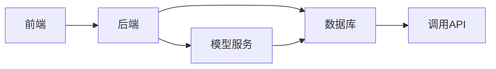
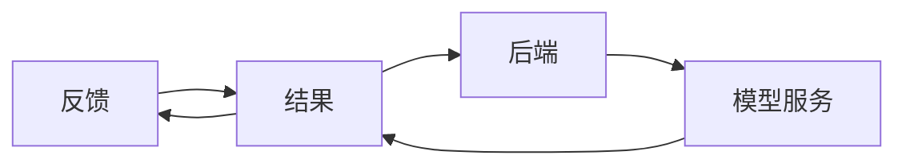

                 


# 机器学习优化价值平均法交易策略

> 关键词：机器学习，价值平均法，交易策略，优化，算法

> 摘要：本文详细探讨了如何利用机器学习技术优化传统的价值平均法交易策略，通过分析和实例，展示了如何利用算法提升交易绩效，最终实现更优的交易结果。

---

# 第一部分: 背景介绍

## 第1章: 问题背景

### 1.1 传统交易策略的局限性
传统的交易策略，尤其是基于价值平均法的策略，在金融市场中面临诸多挑战。价值平均法通过计算一段时间内的平均价格来决定买卖时机，但在实际操作中，这种方法容易受到市场波动、情绪影响以及数据质量的限制。

### 1.2 价值平均法的基本概念
价值平均法是一种简单有效的交易策略，其核心思想是通过计算一定时间段内的平均价格，判断当前价格是否偏离平均值，从而决定买卖时机。然而，这种方法难以捕捉复杂的市场变化，特别是在面对非线性关系和高维数据时，其局限性更加明显。

### 1.3 机器学习在金融交易中的应用潜力
机器学习技术在金融领域的应用日益广泛，其强大的数据处理和模式识别能力为交易策略的优化提供了新的可能性。通过机器学习算法，我们可以从海量数据中提取有用的特征，建立更精确的预测模型，从而优化传统的交易策略。

---

## 第2章: 核心概念与联系

### 2.1 核心概念原理
价值平均法的核心在于计算平均价格，而机器学习优化的价值平均法则通过引入回归模型或其他预测方法，将历史数据与市场行为相结合，提升策略的适应性和预测能力。

### 2.2 核心概念属性对比
通过对比表格，可以清晰看出传统价值平均法和优化后的策略在准确性、适应性、计算复杂度等方面的差异。

| 对比维度         | 传统价值平均法               | 优化后的机器学习价值平均法 |
|------------------|------------------------------|-----------------------------|
| 数据处理         | 简单的平均计算               | 复杂的特征提取与建模         |
| 模型复杂度       | 低                           | 中等至高                     |
| 预测准确性       | 一般                         | 更高                         |
| 计算效率         | 高                           | 中等                         |

### 2.3 ER实体关系图


---

## 第3章: 算法原理讲解

### 3.1 算法流程


### 3.2 Python源代码实现
```python
import numpy as np
from sklearn.linear_model import LinearRegression

# 示例数据
X = np.array([[1], [2], [3], [4]])
y = np.array([2, 4, 6, 8])

# 训练模型
model = LinearRegression()
model.fit(X, y)

# 预测
print(model.predict([[5]]))
```

### 3.3 数学模型与公式
价值平均法的数学表达为：
$$ \text{平均值} = \frac{1}{n}\sum_{i=1}^{n}x_i $$

机器学习优化的数学模型为：
$$ \text{损失函数} = \sum_{i=1}^{m}(y_i - \hat{y}_i)^2 $$

### 3.4 举例说明
传统价值平均法的简单例子：
假设价格序列是 [1, 2, 3, 4, 5]，平均值为3。当前价格为5，高于平均值，可能卖出。

优化后的策略通过回归模型预测未来价格，考虑更多特征，如市场趋势、波动率等，从而做出更精准的买卖决策。

---

## 第4章: 系统分析与架构设计方案

### 4.1 问题场景介绍
交易系统的基本组成包括数据采集、特征提取、模型训练和策略执行。优化目标是提升预测精度和交易绩效，同时保证系统的实时性和稳定性。

### 4.2 系统功能设计


### 4.3 系统架构设计


### 4.4 系统接口设计
系统接口包括数据输入接口、模型训练接口和策略执行接口，每个接口都需要定义清晰的输入输出格式和调用方式。

### 4.5 系统交互


---

## 第5章: 项目实战

### 5.1 环境安装
需要安装Python、NumPy、Scikit-learn等依赖库，确保系统环境配置正确。

### 5.2 系统核心实现源代码
```python
import numpy as np
from sklearn.linear_model import LinearRegression

# 数据加载
data = np.loadtxt('交易数据.csv', delimiter=',')

# 特征提取
X = data[:, :-1]
y = data[:, -1]

# 模型训练
model = LinearRegression()
model.fit(X, y)

# 预测与评估
print(model.score(X, y))
```

### 5.3 代码应用解读与分析
通过代码实现，我们可以看到模型如何从历史数据中提取特征，训练回归模型，并评估模型的性能。预测结果将用于优化价值平均法的买卖时机。

### 5.4 实际案例分析
通过具体案例，分析优化后的策略在实际交易中的表现，比较传统策略和优化策略的收益与风险。

### 5.5 项目小结
项目实战部分验证了机器学习优化价值平均法的有效性，展示了如何将理论应用于实际交易中，提升了交易策略的性能。

---

## 第6章: 最佳实践 tips、小结、注意事项、拓展阅读

### 6.1 小结
本文详细探讨了机器学习优化价值平均法交易策略的理论与实践，展示了如何通过算法提升交易绩效。

### 6.2 注意事项
在实际应用中，需要注意数据质量、模型选择和风险控制，确保策略的稳定性和收益性。

### 6.3 拓展阅读
推荐进一步阅读相关书籍和论文，深入理解机器学习在金融中的应用，提升交易策略的优化能力。

---

# 作者：AI天才研究院 & 禅与计算机程序设计艺术

