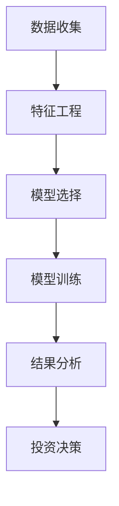
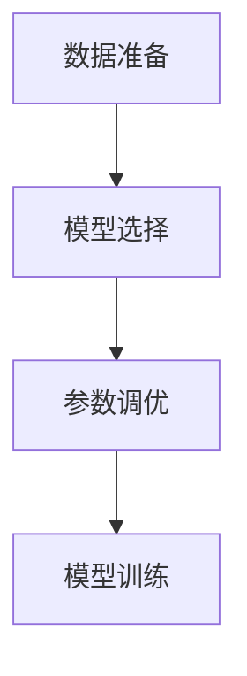
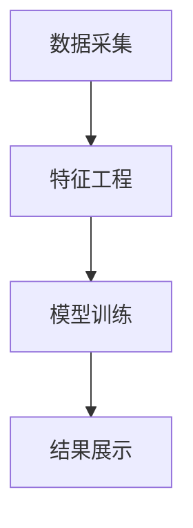

                 


# 《机器学习优化价值投资筛选流程》

**关键词**: 机器学习, 价值投资, 数据分析, 特征工程, 模型优化, 金融投资

**摘要**: 本文探讨了机器学习在价值投资筛选流程中的应用，从数据收集与预处理、特征工程、模型选择与优化、系统架构设计到项目实战，详细阐述了如何利用机器学习技术优化价值投资的筛选流程。通过理论分析与实际案例结合，本文展示了机器学习在金融投资中的潜力与优势，为投资者提供了一种高效、智能的投资决策支持工具。

---

# 第一章: 机器学习与价值投资的结合

## 1.1 机器学习的基本概念

### 1.1.1 机器学习的定义与核心概念

机器学习是一种人工智能技术，旨在通过数据训练模型，使其能够从数据中学习并做出预测或决策。核心概念包括：

- **监督学习**: 基于标记数据训练模型，预测新数据的标签。
- **无监督学习**: 在无标签数据中发现隐藏模式。
- **强化学习**: 通过与环境互动，学习最优策略。

### 1.1.2 机器学习的分类与特点

- **监督学习**: 如线性回归、支持向量机（SVM）。
- **无监督学习**: 如聚类分析、主成分分析（PCA）。
- **强化学习**: 如Q-Learning、深度强化学习（DRL）。

### 1.1.3 机器学习在金融领域的应用

- **股票预测**: 利用历史数据预测股价走势。
- **风险控制**: 通过模型评估投资组合的风险。
- **欺诈检测**: 识别异常交易行为。

### 1.1.4 图形化展示: 机器学习在金融中的应用流程



## 1.2 价值投资的基本概念

### 1.2.1 价值投资的定义与核心理念

价值投资是一种投资策略，通过分析公司的基本面，寻找被市场低估的股票进行长期投资。核心理念包括：

- **内在价值**: 通过财务指标评估公司的实际价值。
- **安全边际**: 买入价格低于内在价值，降低风险。

### 1.2.2 价值投资的筛选标准与流程

1. **财务指标**: 如市盈率（P/E）、市净率（P/B）、股息率等。
2. **行业分析**: 选择具有竞争优势的行业。
3. **公司治理**: 股东结构、管理团队等。

### 1.2.3 价值投资与传统投资的区别

- **传统投资**: 短期交易、技术分析。
- **价值投资**: 长期持有、基本面分析。

## 1.3 机器学习在价值投资中的应用前景

### 1.3.1 机器学习在金融分析中的优势

- **高效性**: 自动化处理大量数据。
- **准确性**: 提高预测和分类的精度。
- **适应性**: 及时调整模型应对市场变化。

### 1.3.2 机器学习在价值投资中的潜在应用场景

- **股票筛选**: 通过模型自动筛选出具有投资潜力的股票。
- **风险评估**: 评估个股及投资组合的风险。
- **市场预测**: 预测市场趋势，优化投资策略。

### 1.3.3 机器学习在价值投资中的挑战与机遇

- **挑战**: 数据质量、模型过拟合、市场不确定性。
- **机遇**: 提高投资效率、发现潜在机会。

## 1.4 本章小结

本章介绍了机器学习的基本概念、价值投资的核心理念以及两者结合的应用前景。通过图形化展示，我们展示了机器学习在价值投资中的潜在流程。

---

# 第二章: 数据收集与预处理

## 2.1 价值投资相关数据的收集

### 2.1.1 财务数据的收集与整理

- **收入与利润**: 收入、净利润等。
- **财务比率**: 如ROE（净资产收益率）、毛利率。

### 2.1.2 市场数据的收集与整理

- **股价与成交量**: 收盘价、成交量等。
- **市场指数**: 如上证指数、标普500。

### 2.1.3 公司基本面数据的收集与整理

- **行业地位**: 市场占有率、行业排名。
- **管理团队**: CEO背景、管理团队稳定性。

## 2.2 数据预处理

### 2.2.1 数据清洗与异常值处理

- **缺失值处理**: 删除或填充缺失值。
- **异常值处理**: 使用Z-score方法检测异常值。

### 2.2.2 数据标准化与归一化

- **标准化**: 将数据按比例缩放到均值为0，标准差为1。
- **归一化**: 将数据缩放到0-1范围。

### 2.2.3 数据特征的提取与选择

- **特征提取**: 如PCA提取主成分。
- **特征选择**: 使用Lasso回归选择重要特征。

## 2.3 数据集的划分

### 2.3.1 训练集、验证集与测试集的划分

- **训练集**: 用于模型训练。
- **验证集**: 用于调整模型参数。
- **测试集**: 用于评估模型性能。

### 2.3.2 数据集划分的策略与方法

- **比例分配**: 通常采用70%训练、20%验证、10%测试。
- **交叉验证**: 如K折交叉验证。

## 2.4 本章小结

本章详细介绍了价值投资相关数据的收集与预处理流程，包括数据清洗、标准化、特征提取等步骤。

---

# 第三章: 特征工程

## 3.1 特征工程的基本概念

### 3.1.1 特征工程的定义与作用

特征工程是通过数据变换和特征选择，提取对目标变量具有预测能力的特征。

### 3.1.2 特征工程的核心步骤

- **特征选择**: 选择重要特征。
- **特征变换**: 如PCA降维。
- **特征组合**: 如将多个特征组合成新特征。

## 3.2 价值投资筛选流程中的特征选择

### 3.2.1 财务指标的特征选择

- **ROE**: 净利润与净资产的比率。
- **毛利率**: 营业收入减去成本与营业收入的比率。

### 3.2.2 市场指标的特征选择

- **市盈率（P/E）**: 股价与每股收益的比率。
- **市净率（P/B）**: 股价与每股净资产的比率。

### 3.2.3 其他特征的考虑

- **管理团队稳定性**: CEO任期长短。
- **创新能力**: 专利数量、新产品发布频率。

## 3.3 特征工程的实现

### 3.3.1 特征的标准化与归一化

```python
from sklearn.preprocessing import StandardScaler

# 标准化
scaler = StandardScaler()
data_std = scaler.fit_transform(data)

# 归一化
from sklearn.preprocessing import MinMaxScaler
scaler = MinMaxScaler()
data_norm = scaler.fit_transform(data)
```

### 3.3.2 特征的降维方法

```python
from sklearn.decomposition import PCA

# PCA降维
pca = PCA(n_components=2)
principal_components = pca.fit_transform(data)
```

### 3.3.3 特征的交互与组合

```python
# 示例：将两个特征相乘
data['new_feature'] = data['feature1'] * data['feature2']
```

## 3.4 本章小结

本章详细介绍了特征工程在价值投资中的应用，包括特征选择、标准化、降维等方法。

---

# 第四章: 机器学习算法与模型选择

## 4.1 机器学习算法概述

### 4.1.1 监督学习算法

#### 线性回归

```latex
$$ y = \beta_0 + \beta_1 x + \epsilon $$
```

#### 支持向量机（SVM）

```latex
$$ \text{最大化} \sum_{i=1}^{n} [y_i (w \cdot x_i + b) - 1] $$
```

#### 决策树与随机森林

- **决策树**: 通过树状结构进行分类或回归。
- **随机森林**: 由多个决策树组成，提高模型鲁棒性。

### 4.1.2 非监督学习算法

#### 聚类分析

```latex
$$ \text{目标函数}: \sum_{i=1}^{k} \sum_{j=1}^{n_i} \|x_j - c_i\| $$
```

#### 主成分分析（PCA）

```latex
$$ \text{最大化} \sum_{i=1}^{m} \lambda_i $$
```

### 4.1.3 深度学习算法

#### 神经网络

```latex
$$ a^{(l+1)} = \sigma(w^{(l)} a^{(l)} + b^{(l)}) $$
```

#### 长短期记忆网络（LSTM）

```latex
$$ f_t = \sigma(W_f [h_{t-1}, x_t]) $$
```

## 4.2 算法选择的策略与方法

### 4.2.1 算法选择的依据

- **数据类型**: 分类、回归。
- **数据规模**: 小数据适合树模型，大数据适合深度学习。
- **计算资源**: GPU加速适合深度学习。

### 4.2.2 算法性能的评估指标

- **准确率**: 正确预测的比例。
- **精确率与召回率**: 考虑分类的混淆情况。
- **F1分数**: 调和平均数。

### 4.2.3 算法调优的技巧

- **参数调整**: 如网格搜索。
- **交叉验证**: 如K折交叉验证。
- **模型融合**: 如投票法。

## 4.3 本章小结

本章介绍了常用的机器学习算法，并讨论了算法选择的策略与方法。

---

# 第五章: 模型训练与评估

## 5.1 模型训练

### 5.1.1 模型训练的基本流程



### 5.1.2 模型选择

- **线性回归**: 适用于线性关系。
- **随机森林**: 适用于非线性关系。
- **深度学习**: 适用于复杂数据。

### 5.1.3 模型训练的实现

```python
from sklearn.ensemble import RandomForestClassifier

# 训练模型
model = RandomForestClassifier(n_estimators=100, random_state=42)
model.fit(X_train, y_train)
```

## 5.2 模型评估

### 5.2.1 评估指标

- **准确率**: $$\text{准确率} = \frac{\text{正确预测数}}{\text{总样本数}}$$
- **精确率与召回率**: 
  - $$\text{精确率} = \frac{\text{真阳性}}{\text{真阳性 + 假阳性}}$$
  - $$\text{召回率} = \frac{\text{真阳性}}{\text{真阳性 + 假阴性}}$$
- **F1分数**: $$F1 = 2 \cdot \frac{\text{精确率} \cdot \text{召回率}}{\text{精确率} + \text{召回率}}$$

### 5.2.2 模型优化

- **超参数调优**: 使用网格搜索。
- **特征重要性分析**: 使用SHAP值解释模型决策。

## 5.3 本章小结

本章详细介绍了模型训练与评估的过程，包括训练流程、评估指标和优化方法。

---

# 第六章: 系统架构设计

## 6.1 问题场景介绍

- **目标**: 构建一个价值投资筛选系统。
- **用户**: 投资者、机构投资者。

## 6.2 系统功能设计

### 6.2.1 功能模块

- **数据采集**: 获取股票数据。
- **特征工程**: 处理数据特征。
- **模型训练**: 训练预测模型。
- **结果展示**: 可视化投资建议。

### 6.2.2 系统功能流程图



## 6.3 系统架构设计

### 6.3.1 系统架构设计


### 6.3.2 系统接口设计

- **API接口**: 如RESTful API。
- **数据接口**: 如数据采集接口。

## 6.4 本章小结

本章设计了一个价值投资筛选系统的架构，包括功能模块、流程图和接口设计。

---

# 第七章: 项目实战

## 7.1 环境安装

```bash
pip install pandas numpy scikit-learn matplotlib
```

## 7.2 核心实现

### 7.2.1 数据处理

```python
import pandas as pd
import numpy as np

# 示例数据加载
data = pd.read_csv('stock_data.csv')
```

### 7.2.2 模型实现

```python
from sklearn.ensemble import RandomForestClassifier

# 训练模型
model = RandomForestClassifier()
model.fit(X_train, y_train)
```

### 7.2.3 结果分析

```python
from sklearn.metrics import classification_report

# 预测结果
y_pred = model.predict(X_test)
print(classification_report(y_test, y_pred))
```

## 7.3 实际案例分析

### 7.3.1 数据来源

- **股票数据**: 如苹果、谷歌等。

### 7.3.2 模型训练与预测

```python
# 示例预测
predicted_price = model.predict(X_test)
print(predicted_price)
```

## 7.4 本章小结

本章通过实际案例展示了如何利用机器学习优化价值投资筛选流程，从数据处理到模型训练，再到结果分析。

---

# 总结与展望

## 8.1 本章总结

本文详细介绍了机器学习在价值投资筛选流程中的应用，从数据处理到模型训练，再到系统设计，展示了机器学习在金融投资中的潜力。

## 8.2 展望

未来，随着技术的进步，机器学习在金融领域的应用将更加广泛，如实时交易、风险管理等。

---

# 作者信息

作者：AI天才研究院/AI Genius Institute & 禅与计算机程序设计艺术 /Zen And The Art of Computer Programming

---

**以上是文章的详细目录与内容结构，每个部分均包含具体的内容展开与代码实现，您可以根据实际需求进一步扩展每个部分的内容。**

