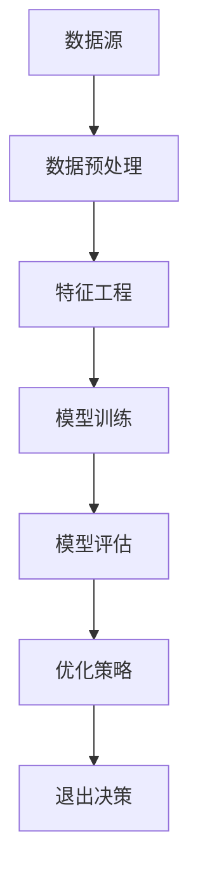
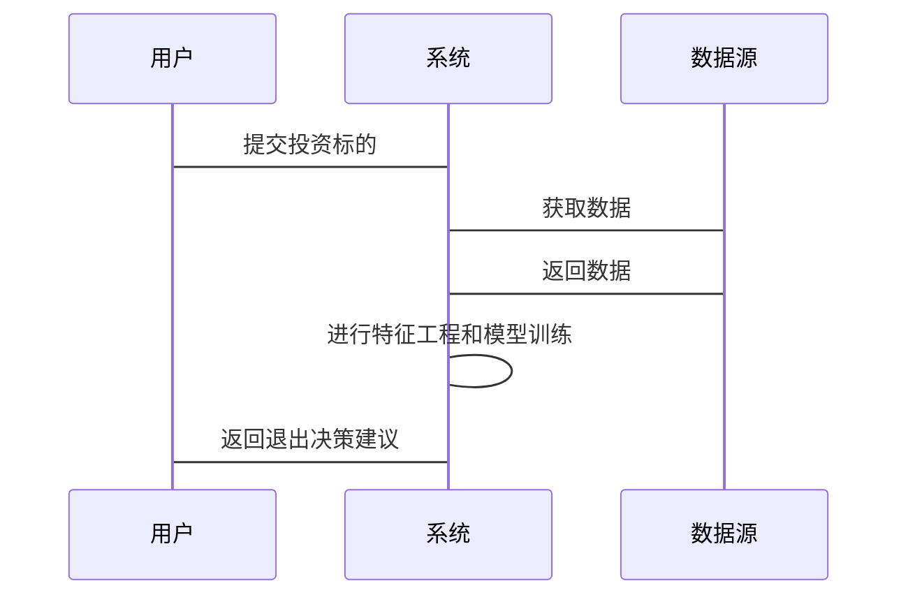

                 


# 机器学习优化价值投资退出决策

## 关键词
机器学习，价值投资，退出决策，优化，金融模型

## 摘要
本文探讨了机器学习在优化价值投资退出决策中的应用，通过分析和建模，展示了如何利用机器学习技术提升金融投资的决策效率和准确性。文章从基础概念到算法实现，再到系统设计，详细阐述了机器学习在价值投资中的潜力和实际应用，为投资者提供了科学的决策支持工具。

---

## 第一部分: 机器学习优化价值投资退出决策的背景与意义

### 第1章: 引言
#### 1.1 机器学习在金融投资中的应用
##### 1.1.1 机器学习的基本概念
机器学习是一种人工智能技术，通过数据训练模型，使其能够自动学习和改进。在金融领域，机器学习被广泛应用于股票预测、风险评估和投资组合优化。

##### 1.1.2 机器学习在金融投资中的重要性
金融市场的复杂性和不确定性使得传统的人工分析效率低下。机器学习通过处理大量数据，能够发现隐藏的模式，提高预测准确性。

##### 1.1.3 退出决策在投资中的作用
退出决策是指在适当的时候卖出投资标的以实现收益最大化。在价值投资中，正确的退出决策至关重要，直接影响投资收益。

#### 1.2 价值投资与退出决策的结合
##### 1.2.1 价值投资的核心理念
价值投资强调以低于内在价值的价格买入优质资产，长期持有，等待市场回归其真实价值。

##### 1.2.2 退出决策的优化需求
传统的退出决策依赖于经验和市场直觉，但这种方法存在主观性和片面性。机器学习可以通过分析历史数据，提供更客观的决策支持。

##### 1.2.3 机器学习在退出决策中的潜力
机器学习能够处理大量非结构化数据，识别潜在的市场趋势和风险因素，从而优化退出时机和策略。

### 第2章: 价值投资与退出决策的背景介绍
#### 2.1 价值投资的基本概念
##### 2.1.1 价值投资的定义
价值投资是一种投资策略，旨在通过分析企业的基本面，找到被市场低估的投资标的。

##### 2.1.2 价值投资的核心要素
- **内在价值**：企业未来现金流的现值。
- **安全边际**：买入价格低于内在价值，降低风险。
- **长期持有**：避免频繁交易，减少成本。

#### 2.2 退出决策的重要性
##### 2.2.1 退出决策的定义
退出决策是指投资者在何时以何种方式退出投资，以实现收益最大化。

##### 2.2.2 退出决策的类型
- **部分退出**：逐步卖出部分仓位。
- **完全退出**：一次性卖出所有仓位。
- **被动退出**：触发止损或止盈条件自动退出。

#### 2.3 传统退出决策方法的局限性
##### 2.3.1 基于经验的传统方法
传统方法依赖经验丰富的投资者判断，主观性强，难以系统化和量化。

##### 2.3.2 传统方法的局限性
- **信息不全**：难以整合多源数据。
- **决策滞后**：依赖人工分析，反应速度慢。
- **人为情绪影响**：投资者情绪可能导致错误决策。

##### 2.3.3 提高退出决策效率的需求
随着市场的复杂化，投资者需要更高效、客观的决策支持工具，以应对快速变化的市场环境。

---

## 第二部分: 机器学习优化价值投资退出决策的核心概念

### 第3章: 机器学习基础
#### 3.1 机器学习的基本原理
##### 3.1.1 机器学习的定义
机器学习是通过数据训练模型，使其能够自动学习和改进的技术。

##### 3.1.2 机器学习的核心算法
- **监督学习**：用于分类和回归任务。
- **无监督学习**：用于聚类和降维。
- **强化学习**：通过试错优化决策。

##### 3.1.3 机器学习在金融投资中的重要性
机器学习能够处理大量数据，识别复杂模式，提高投资决策的效率和准确性。

#### 3.2 特征工程
##### 3.2.1 特征工程的定义
特征工程是指从原始数据中提取有用的特征，以提高模型的性能。

##### 3.2.2 特征工程的重要性
特征工程能够显著提高模型的预测能力，是机器学习成功的关键因素之一。

##### 3.2.3 常见的特征工程方法
- **数据清洗**：处理缺失值和异常值。
- **特征选择**：选择重要的特征，降低维度。
- **特征变换**：将非数值特征转化为数值特征。

#### 3.3 模型评估与调优
##### 3.3.1 模型评估的常见指标
- **准确率**：正确分类的比例。
- **精确率**：预测为正类的样本中实际为正类的比例。
- **召回率**：实际为正类的样本中被正确分类的比例。

##### 3.3.2 超参数调优的方法
- **网格搜索**：遍历所有可能的参数组合，选择最优参数。
- **随机搜索**：随机选择参数组合，减少计算量。

##### 3.3.3 模型选择与优化
通过交叉验证选择最优模型，并进行调优以提高模型性能。

### 第4章: 机器学习优化价值投资的核心概念
#### 4.1 价值评估模型
##### 4.1.1 价值评估模型的定义
价值评估模型用于估算企业的内在价值，帮助投资者确定合理的买入价格。

##### 4.1.2 基于机器学习的价值评估模型
通过训练模型，利用企业财务数据和市场数据预测其内在价值。

##### 4.1.3 模型的优势
- **自动化**：自动处理大量数据，减少人为错误。
- **高精度**：通过机器学习算法提高预测的准确性。

#### 4.2 退出决策优化模型
##### 4.2.1 退出决策优化模型的定义
退出决策优化模型用于确定最佳的退出时机和方式，以最大化投资收益。

##### 4.2.2 基于机器学习的退出决策模型
通过分析历史数据，模型能够识别市场趋势和风险因素，优化退出决策。

##### 4.2.3 模型的核心要素
- **市场数据**：股票价格、成交量等。
- **企业基本面**：财务数据、行业地位等。
- **市场情绪**：投资者情绪指标，如VIX指数。

#### 4.3 价值评估与退出决策的关系
##### 4.3.1 价值评估对退出决策的影响
内在价值决定了投资标的的合理价格区间，影响退出决策的时机和价格。

##### 4.3.2 退出决策对投资收益的影响
及时、准确的退出决策能够最大化投资收益，降低潜在风险。

##### 4.3.3 机器学习在两者中的作用
机器学习能够整合多源数据，优化价值评估和退出决策的过程，提高整体投资效率。

---

## 第三部分: 机器学习优化价值投资退出决策的算法原理

### 第5章: 算法原理
#### 5.1 线性回归
##### 5.1.1 线性回归的定义
线性回归是一种统计方法，用于建立因变量与自变量之间的线性关系。

##### 5.1.2 线性回归的数学模型
$$ y = \beta_0 + \beta_1x + \epsilon $$

##### 5.1.3 线性回归的应用
用于预测股票价格的趋势，帮助投资者判断退出时机。

#### 5.2 随机森林
##### 5.2.1 随机森林的定义
随机森林是一种基于决策树的集成学习方法，通过组合多个决策树的结果提高预测准确性。

##### 5.2.2 随机森林的数学模型
$$ y = \text{median}(\{y_1, y_2, \ldots, y_n\}) $$

##### 5.2.3 随机森林的应用
用于分类和回归任务，帮助投资者识别市场趋势和风险因素。

#### 5.3 支持向量机
##### 5.3.1 支持向量机的定义
支持向量机是一种监督学习算法，用于分类和回归任务。

##### 5.3.2 支持向量机的数学模型
$$ \text{min} \frac{1}{2}||\mathbf{w}||^2 + C\sum_{i=1}^n \xi_i $$
$$ \text{s.t.} \quad y_i(\mathbf{w} \cdot \mathbf{x}_i + b) \geq 1 - \xi_i $$
$$ \xi_i \geq 0 $$

##### 5.3.3 支持向量机的应用
用于市场趋势预测，帮助投资者优化退出决策。

---

## 第四部分: 机器学习优化价值投资退出决策的系统架构设计

### 第6章: 系统架构设计
#### 6.1 系统整体架构
##### 6.1.1 系统架构图


#### 6.2 系统功能模块
##### 6.2.1 数据预处理模块
负责清洗和转换原始数据，确保数据质量。

##### 6.2.2 特征工程模块
提取和选择关键特征，提高模型性能。

##### 6.2.3 模型训练模块
训练机器学习模型，用于价值评估和退出决策。

##### 6.2.4 模型评估模块
评估模型性能，选择最优模型。

##### 6.2.5 优化策略模块
根据模型输出，制定最优退出策略。

#### 6.3 系统接口设计
##### 6.3.1 数据接口
与数据源对接，获取实时市场数据和企业基本面数据。

##### 6.3.2 模型接口
与第三方机器学习平台对接，调用模型进行预测。

#### 6.4 系统交互流程
##### 6.4.1 交互流程图


---

## 第五部分: 机器学习优化价值投资退出决策的项目实战

### 第7章: 项目实战
#### 7.1 环境安装
##### 7.1.1 环境需求
- Python 3.6+
- scikit-learn、pandas、numpy等库。

#### 7.2 数据收集
##### 7.2.1 数据源
从Yahoo Finance获取历史股价数据，从公司财报获取财务数据。

#### 7.3 特征工程
##### 7.3.1 数据清洗
处理缺失值和异常值。

##### 7.3.2 特征选择
使用相关性分析选择重要特征。

##### 7.3.3 数据转换
将非数值特征转换为数值特征。

#### 7.4 模型训练
##### 7.4.1 训练线性回归模型
代码示例：
```python
from sklearn.linear_model import LinearRegression
model = LinearRegression()
model.fit(X_train, y_train)
```

##### 7.4.2 训练随机森林模型
代码示例：
```python
from sklearn.ensemble import RandomForestRegressor
model = RandomForestRegressor(n_estimators=100)
model.fit(X_train, y_train)
```

#### 7.5 模型评估
##### 7.5.1 模型预测
使用测试数据进行预测，评估模型性能。

##### 7.5.2 模型调优
通过网格搜索优化模型参数。

#### 7.6 优化策略制定
##### 7.6.1 制定退出策略
基于模型预测结果，制定最优退出策略。

##### 7.6.2 实战案例分析
分析具体案例，展示模型的应用效果。

#### 7.7 项目总结
总结项目实施过程，提出改进建议。

---

## 第六部分: 总结与展望

### 第8章: 总结与展望
#### 8.1 总结
本文详细介绍了机器学习在优化价值投资退出决策中的应用，从理论到实践，展示了如何利用机器学习技术提高投资决策的效率和准确性。

#### 8.2 展望
未来，随着技术的进步，机器学习在金融领域的应用将更加广泛和深入。投资者可以通过更复杂的模型和算法，进一步优化退出决策，实现更高的投资收益。

---

## 作者：AI天才研究院/AI Genius Institute & 禅与计算机程序设计艺术 /Zen And The Art of Computer Programming

---

### 附录
#### 附录A: 机器学习相关术语表
- **特征工程**：数据预处理的过程，包括特征选择、特征变换等。
- **过拟合**：模型在训练数据上表现良好，但在测试数据上表现不佳的现象。
- **交叉验证**：通过多次划分训练集和测试集，评估模型的泛化能力。

#### 附录B: 代码示例
```python
import pandas as pd
import numpy as np
from sklearn.linear_model import LinearRegression
from sklearn.ensemble import RandomForestRegressor
from sklearn.model_selection import train_test_split
from sklearn.metrics import mean_squared_error

# 数据加载
data = pd.read_csv('investment_data.csv')

# 数据清洗
data = data.dropna()

# 特征选择
X = data[['price', 'volume', 'eps']]
y = data['target']

# 数据划分
X_train, X_test, y_train, y_test = train_test_split(X, y, test_size=0.2, random_state=42)

# 线性回归模型训练
lr_model = LinearRegression()
lr_model.fit(X_train, y_train)

# 随机森林模型训练
rf_model = RandomForestRegressor(n_estimators=100, random_state=42)
rf_model.fit(X_train, y_train)

# 模型预测
lr_pred = lr_model.predict(X_test)
rf_pred = rf_model.predict(X_test)

# 模型评估
lr_mse = mean_squared_error(y_test, lr_pred)
rf_mse = mean_squared_error(y_test, rf_pred)

print(f'线性回归模型 MSE: {lr_mse}')
print(f'随机森林模型 MSE: {rf_mse}')
```

#### 附录C: 进一步阅读的资料
- **书籍推荐**：
  - 《机器学习实战》
  - 《金融时间序列分析》
- **在线资源**：
  - [机器学习入门教程](https://tutorials.pytorch.kr/)
  - [金融数据分析库](https://pandas.pydata.org/pandas-docs/stable/user_guide/timeseries.html)

---

以上是《机器学习优化价值投资退出决策》的技术博客文章的完整内容，涵盖了从背景介绍到系统设计的各个方面，适合希望利用机器学习优化投资策略的读者阅读和实践。

