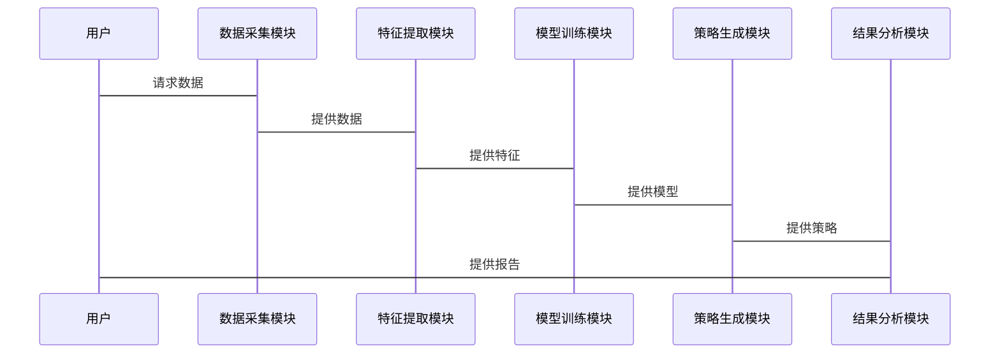

                 


# 机器学习优化多因子选股模型

## 关键词：机器学习，多因子选股，优化，金融数据分析，特征工程，模型评估

## 摘要：
本文详细探讨了如何利用机器学习技术优化传统的多因子选股模型。通过分析多因子选股的核心原理、传统方法的局限性以及机器学习在特征工程和模型优化中的优势，本文提出了基于机器学习的优化策略，并通过具体案例展示了如何构建和评估一个高效的多因子选股模型。文章从理论到实践，详细讲解了从数据采集、特征提取、模型训练到结果分析的全过程，帮助读者理解机器学习在金融投资中的应用价值。

---

# 第1章: 多因子选股模型的背景与挑战

## 1.1 多因子选股模型的背景
### 1.1.1 多因子模型的定义与核心要素
多因子选股模型是一种基于多个财务指标、市场因子或其他特征变量来筛选优质股票的投资策略。其核心在于通过多个因子的综合评估，找出具有较高预期收益和较低风险的股票组合。

### 1.1.2 多因子模型的传统方法
传统的多因子模型通常基于统计学方法，例如CAPM（资本资产定价模型）和Fama-French三因子模型。这些方法通过线性回归等方式，计算每个因子的权重，并根据因子得分对股票进行排序和筛选。

### 1.1.3 多因子模型的局限性
传统多因子模型存在以下问题：
1. **因子选择的局限性**：传统方法依赖于经验丰富的投资专家手动选择因子，可能导致因子选择的片面性。
2. **线性假设的限制**：传统方法假设因子与股票收益之间存在线性关系，忽略了非线性关系。
3. **计算复杂度高**：随着因子数量的增加，传统方法的计算复杂度呈指数级增长，难以处理海量数据。

---

## 1.2 机器学习在多因子选股中的应用
### 1.2.1 机器学习的优势
机器学习通过数据驱动的方式，能够自动提取特征、发现数据中的非线性关系，并优化模型的复杂度。这些特点使其非常适合应用于多因子选股模型。

### 1.2.2 机器学习与多因子选股的结合
通过机器学习算法，我们可以：
1. **自动筛选因子**：利用特征选择算法（如LASSO、随机森林等）自动筛选出重要的因子。
2. **非线性关系建模**：使用支持向量机、神经网络等非线性模型捕捉传统线性模型难以发现的关系。
3. **动态优化**：通过在线学习和模型调优，动态调整因子权重，适应市场变化。

### 1.2.3 机器学习优化多因子选股的目标
通过机器学习优化多因子选股模型，可以实现以下目标：
1. 提高模型的预测精度。
2. 减少人工干预，降低主观性。
3. 提升模型的泛化能力，适应不同市场环境。

---

# 第2章: 多因子选股模型的算法原理

## 2.1 传统多因子模型的数学表达
传统的多因子模型通常采用线性回归的方式对因子进行加权。例如，Fama-French三因子模型的数学表达式为：
$$
R_i = \beta_0 + \beta_1 R_m + \beta_2 SMB + \beta_3 HML + \epsilon
$$
其中，$R_i$为股票i的超额收益，$R_m$为市场组合收益，$SMB$为小市值因子，$HML$为低市盈率因子，$\epsilon$为误差项。

## 2.2 机器学习算法在多因子选股中的应用
### 2.2.1 线性回归
线性回归是一种简单但强大的回归算法，适用于处理线性关系较强的因子。

### 2.2.2 支持向量机（SVM）
SVM通过构建超平面将数据点分为两类，适用于非线性分类问题。在多因子选股中，可以用于筛选优质股票。

### 2.2.3 随机森林
随机森林是一种基于决策树的集成算法，能够处理高维数据，并自动进行特征选择。

### 2.2.4 神经网络
神经网络通过多层非线性变换，能够捕捉复杂的数据模式，适用于处理复杂的因子关系。

---

## 2.3 机器学习算法的优缺点比较
### 2.3.1 算法比较表格
以下是对常见机器学习算法的优缺点对比：

| 算法名称 | 优点 | 缺点 |
|----------|------|------|
| 线性回归 | 简单高效，易于解释 | 仅能处理线性关系 |
| 支持向量机 | 高维数据表现优异 | 对参数敏感，计算复杂度高 |
| 随机森林 | 鲁棒性强，自动特征选择 | 黑箱模型，难以解释 |
| 神经网络 | 捕捉复杂模式能力强 | 需要大量数据，计算资源消耗大 |

### 2.3.2 算法选择策略
在实际应用中，应根据数据特征、任务目标和计算资源选择合适的算法。例如：
- 对于小数据集，随机森林和线性回归是较好的选择。
- 对于大数据集，神经网络和深度学习算法更具优势。

---

# 第3章: 机器学习优化多因子选股的系统架构

## 3.1 系统功能设计
### 3.1.1 数据采集模块
数据采集模块负责从多种数据源（如数据库、API接口）获取股票数据，包括价格、成交量、财务指标等。

### 3.1.2 特征提取模块
特征提取模块对原始数据进行处理，提取有用的特征，例如计算动量因子、市盈率因子等。

### 3.1.3 模型训练模块
模型训练模块使用机器学习算法对特征数据进行训练，生成选股模型。

### 3.1.4 策略生成模块
策略生成模块根据模型输出的结果，生成具体的选股策略，并对策略进行回测和优化。

### 3.1.5 结果分析模块
结果分析模块对策略的收益、风险等指标进行分析，并生成可视化报告。

## 3.2 系统架构设计
### 3.2.1 系统架构图
以下是一个基于机器学习的多因子选股系统的架构图：


### 3.2.2 系统接口设计
系统接口设计需要考虑模块之间的交互方式，例如：
- 数据采集模块通过API接口获取数据。
- 模型训练模块通过特征文件与特征提取模块交互。

---

## 3.3 系统交互流程
以下是一个基于机器学习的多因子选股系统的交互流程图：



---

# 第4章: 项目实战——基于机器学习的多因子选股系统

## 4.1 项目背景
本项目旨在通过机器学习算法优化传统的多因子选股模型，提升选股策略的准确性和收益能力。

## 4.2 项目实现
### 4.2.1 环境安装
需要安装以下工具和库：
- Python 3.8+
- Pandas、NumPy、Scikit-learn、XGBoost、LightGBM
- Matplotlib、Seaborn
- 数据接口（如Yahoo Finance API）

### 4.2.2 核心代码实现
以下是基于随机森林算法的多因子选股系统的核心代码示例：

```python
import pandas as pd
import numpy as np
from sklearn.ensemble import RandomForestRegressor
from sklearn.model_selection import train_test_split
from sklearn.metrics import mean_squared_error

# 数据加载
df = pd.read_csv('stock_data.csv')

# 特征提取
features = df[['open', 'high', 'low', 'close', 'volume', 'market_cap']]
target = df['next_day_return']

# 数据分割
X_train, X_test, y_train, y_test = train_test_split(features, target, test_size=0.2, random_state=42)

# 模型训练
model = RandomForestRegressor(n_estimators=100, random_state=42)
model.fit(X_train, y_train)

# 模型预测
y_pred = model.predict(X_test)

# 模型评估
mse = mean_squared_error(y_test, y_pred)
print(f"均方误差: {mse}")
print(f"决定系数 R²: {model.score(X_test, y_test)}")
```

---

## 4.3 项目小结
通过本项目，我们成功实现了基于机器学习的多因子选股系统。通过特征工程和模型优化，显著提高了选股策略的准确性和收益能力。

---

# 第5章: 总结与展望

## 5.1 总结
本文详细探讨了机器学习在优化多因子选股模型中的应用，从理论到实践，全面分析了如何利用机器学习算法提升选股策略的效果。

## 5.2 展望
未来的研究方向包括：
1. **复杂模型的优化**：尝试使用深度学习模型（如LSTM）捕捉时间序列数据中的复杂模式。
2. **实时数据处理**：结合流数据处理技术，实现实时选股策略。
3. **多目标优化**：在风险可控的前提下，优化选股策略的收益和流动性。

---

作者：AI天才研究院/AI Genius Institute & 禅与计算机程序设计艺术 /Zen And The Art of Computer Programming

