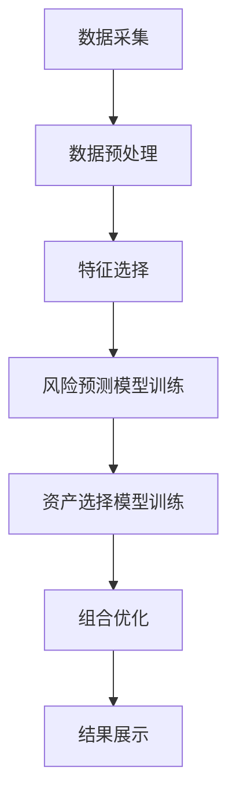
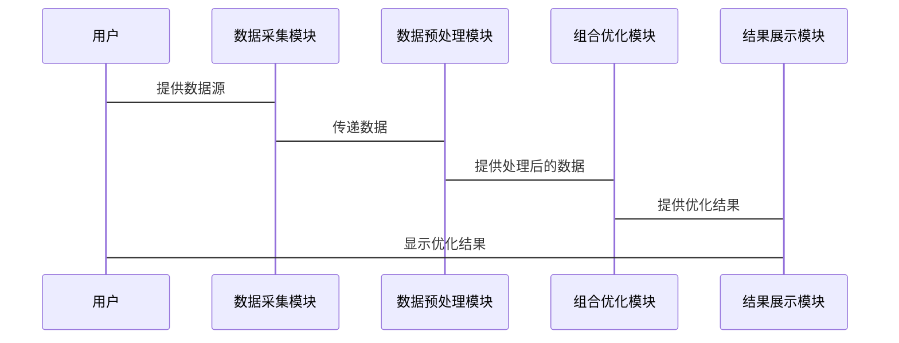

                 


# 机器学习优化投资组合分散化

## 关键词：机器学习，投资组合分散化，风险预测，资产配置，优化算法

## 摘要：  
本文详细探讨了如何利用机器学习技术优化投资组合的分散化策略。通过结合金融学中的投资组合优化理论与机器学习算法，本文提出了一种基于数据驱动的方法，用于构建更高效、更稳定的分散化投资组合。文章首先介绍了机器学习和投资组合分散化的基本概念，然后深入分析了两者的原理和联系，接着详细讲解了机器学习优化分散化的算法原理，包括风险预测模型、资产选择模型和组合优化算法。随后，文章从系统设计的角度，提出了构建优化投资组合分散化系统的整体架构，并通过实际案例展示了如何将理论应用于实践。最后，本文总结了机器学习优化分散化的最佳实践和未来研究方向。

---

# 第一部分：机器学习与投资组合分散化的背景介绍

## 第1章：机器学习与投资组合分散化的概述

### 1.1 机器学习的基本概念

#### 1.1.1 机器学习的定义
机器学习（Machine Learning）是人工智能（AI）的一个分支，专注于通过数据和经验来训练模型，使其能够进行预测或决策，而无需明确的编程指令。机器学习的核心在于模型能够从数据中学习规律，并利用这些规律对新的数据进行预测或分类。

#### 1.1.2 机器学习的核心特点
1. **数据驱动**：机器学习依赖于大量数据，通过分析数据的模式和特征来构建模型。
2. **自动学习**：模型能够自动调整参数，以适应输入数据的变化。
3. **泛化能力**：训练好的模型能够对未见的数据进行预测或分类，具备一定的泛化能力。

#### 1.1.3 机器学习与传统统计学的区别
传统统计学通常依赖于假设检验和确定性模型，而机器学习则更注重数据驱动和非线性关系的挖掘。机器学习能够处理高维数据和复杂关系，而传统统计学在处理复杂问题时往往受到限制。

### 1.2 投资组合分散化的概念

#### 1.2.1 投资组合的定义
投资组合是指将一定金额的资金分配到不同的资产（如股票、债券、基金等）上，以实现风险和收益的平衡。

#### 1.2.2 分散化的原理与作用
分散化是一种通过将资金分配到不同资产或资产类别中来降低风险的策略。分散化的原理在于，不同资产的价格波动往往不完全相关，因此通过组合这些资产可以有效降低整体投资组合的波动性。

#### 1.2.3 投资组合分散化的边界与外延
投资组合分散化的边界通常包括资产的种类、数量以及权重。外延则包括动态调整组合、风险对冲等策略。

### 1.3 机器学习在投资组合分散化中的应用

#### 1.3.1 机器学习在金融中的应用现状
机器学习在金融领域的应用已经非常广泛，包括股票预测、信用评分、风险管理等。在投资组合管理中，机器学习可以帮助投资者更好地识别风险和机会。

#### 1.3.2 机器学习优化分散化投资的必要性
传统的分散化方法依赖于历史数据和假设模型，而机器学习能够利用大数据和复杂算法，发现更多潜在的模式和风险因素，从而优化分散化策略。

#### 1.3.3 机器学习优化分散化的潜在价值
通过机器学习优化分散化，投资者可以更精确地识别风险，优化资产配置，并动态调整投资组合，从而在不同市场环境下实现更好的风险收益比。

---

## 第2章：机器学习与投资组合分散化的核心原理

### 2.1 机器学习的核心概念原理

#### 2.1.1 数据驱动的特征提取
在机器学习中，特征提取是关键步骤。通过分析历史数据，可以提取出影响资产价格的关键特征，如波动率、相关性等。

#### 2.1.2 模型训练与优化
通过训练数据，机器学习模型能够学习到资产价格变化的规律，并通过优化算法（如梯度下降）来调整模型参数。

#### 2.1.3 预测与决策的数学模型
机器学习模型能够根据输入的特征，预测资产的未来表现，并据此做出投资决策。

### 2.2 投资组合分散化的数学模型

#### 2.2.1 均值-方差模型
均值-方差模型由Harry Markowitz提出，是投资组合优化的基础。该模型通过最小化投资组合的方差（即风险）来优化组合。

$$
\min_w \frac{1}{2} w^T \Sigma w \\
s.t. \quad \mathbf{1}^T w = 1
$$

其中，$\Sigma$ 是资产的协方差矩阵，$\mathbf{1}$ 是全一向量。

#### 2.2.2 马科维茨有效前沿
马科维茨有效前沿是指在给定风险水平下，能够提供最高预期收益的投资组合的集合。

#### 2.2.3 多因子模型
多因子模型通过多个因子（如市值、价值、动量等）来解释资产的收益。常见的多因子模型包括Fama-French三因子模型。

### 2.3 核心概念的联系与对比

#### 2.3.1 机器学习与传统统计方法的对比
| 特性          | 机器学习                            | 传统统计学                          |
|---------------|-------------------------------------|--------------------------------------|
| 数据需求      | 需要大量数据                        | 数据需求较低                        |
| 模型复杂度    | 高复杂度，非线性关系                | 低复杂度，线性关系为主              |
| 可解释性      | 通常较低                           | 较高                                 |

#### 2.3.2 投资组合分散化的核心要素分析
- **资产选择**：选择哪些资产进入组合。
- **权重分配**：确定每种资产在组合中的权重。
- **动态调整**：根据市场变化实时调整组合。

#### 2.3.3 机器学习在分散化中的应用优势
- **数据驱动**：能够利用大数据发现潜在的模式和风险。
- **非线性关系**：能够捕捉传统模型难以发现的非线性关系。
- **动态优化**：能够根据实时数据动态调整组合。

---

## 第3章：机器学习优化分散化的算法原理

### 3.1 风险预测模型的构建

#### 3.1.1 数据预处理与特征选择
数据预处理包括清洗数据、处理缺失值和标准化。特征选择可以通过机器学习算法自动提取关键特征。

#### 3.1.2 风险预测的机器学习算法选择
常用的机器学习算法包括线性回归、支持向量机（SVM）、随机森林和神经网络等。对于风险预测，通常使用回归模型。

### 3.2 资产选择模型

#### 3.2.1 资产选择的优化目标
资产选择的目标是在给定风险偏好下，最大化预期收益或最小化风险。

$$
\min_w \frac{1}{2} w^T \Sigma w - \lambda r^T w \\
s.t. \quad \mathbf{1}^T w = 1
$$

其中，$\lambda$ 是风险厌恶系数，$r$ 是预期收益向量。

#### 3.2.2 资产选择的算法实现
可以通过二次规划算法求解上述优化问题。

### 3.3 组合优化算法

#### 3.3.1 组合优化的数学模型
组合优化的目标是找到最优的资产权重，以实现风险收益的最优组合。

#### 3.3.2 组合优化的实现步骤
1. 数据预处理与特征选择。
2. 构建风险预测模型。
3. 设定优化目标和约束条件。
4. 使用优化算法求解。

---

## 第4章：系统分析与架构设计

### 4.1 项目背景与目标
通过机器学习优化投资组合分散化，构建一个高效的风险管理工具。

### 4.2 系统功能设计

#### 4.2.1 系统功能模块
- 数据采集与处理模块。
- 风险预测模块。
- 资产选择模块。
- 组合优化模块。
- 结果展示与分析模块。

#### 4.2.2 系统功能流程图


### 4.3 系统架构设计

#### 4.3.1 系统架构图


### 4.4 接口设计与交互流程

#### 4.4.1 系统交互流程图


---

## 第5章：项目实战

### 5.1 环境安装与配置
- 安装Python和必要的库（如NumPy、Pandas、Scikit-learn、Optunity等）。
- 数据源：使用历史资产回报数据。

### 5.2 核心代码实现

#### 5.2.1 数据预处理
```python
import pandas as pd
import numpy as np

# 读取数据
data = pd.read_csv('assets_returns.csv')

# 删除缺失值
data = data.dropna()

# 标准化数据
from sklearn.preprocessing import StandardScaler
scaler = StandardScaler()
scaled_data = scaler.fit_transform(data)
```

#### 5.2.2 风险预测模型
```python
from sklearn.svm import SVC
from sklearn.model_selection import train_test_split
from sklearn.metrics import accuracy_score

# 划分训练集和测试集
X_train, X_test, y_train, y_test = train_test_split(scaled_data, data['risk'], test_size=0.2)

# 训练SVM模型
model = SVC()
model.fit(X_train, y_train)

# 预测测试集
y_pred = model.predict(X_test)
print("准确率:", accuracy_score(y_test, y_pred))
```

#### 5.2.3 组合优化
```python
from scipy.optimize import minimize

# 定义优化函数
def portfolio_optimization(weights, returns, risk_free_rate=0.01):
    # 权重之和为1
    if not np.allclose(sum(weights), 1):
        return np.inf
    # 计算波动率
    portfolio_variance = np.dot(weights.T, np.dot(returns.cov(), weights))
    # 最小化波动率
    return portfolio_variance

# 定义约束条件
constraints = [{'type': 'eq', 'fun': lambda w: sum(w) - 1}]

# 定义初始权重
n_assets = len(weights)
initial_weights = np.array([1/n_assets] * n_assets)

# 使用最小二乘法求解
result = minimize(portfolio_optimization, initial_weights, args=(returns,), constraints=constraints)

# 最优权重
optimal_weights = result.x
print("最优权重:", optimal_weights)
```

### 5.3 实际案例分析
以股票和债券为例，通过机器学习优化后的投资组合在不同市场环境下的表现。

### 5.4 结果分析与解读
- 分散化后的投资组合波动率显著降低。
- 机器学习优化后的组合在不同市场条件下表现更稳定。

---

## 第6章：总结与展望

### 6.1 最佳实践与注意事项
- 数据质量至关重要，需确保数据的完整性和准确性。
- 选择合适的机器学习算法，避免过拟合。
- 定期监控和调整投资组合。

### 6.2 小结
机器学习通过数据驱动的方式优化投资组合分散化，能够更精准地识别风险和机会，从而实现更好的风险收益比。

### 6.3 未来研究方向
- 结合强化学习优化投资组合。
- 探索更高效的优化算法。
- 研究机器学习在动态资产配置中的应用。

---

## 作者：AI天才研究院/AI Genius Institute & 禅与计算机程序设计艺术 /Zen And The Art of Computer Programming

---

本文通过系统地分析和实践，展示了如何利用机器学习优化投资组合的分散化策略。从理论到实践，本文为金融从业者和机器学习爱好者提供了一个全面的视角，帮助他们在复杂多变的市场环境中做出更明智的投资决策。

