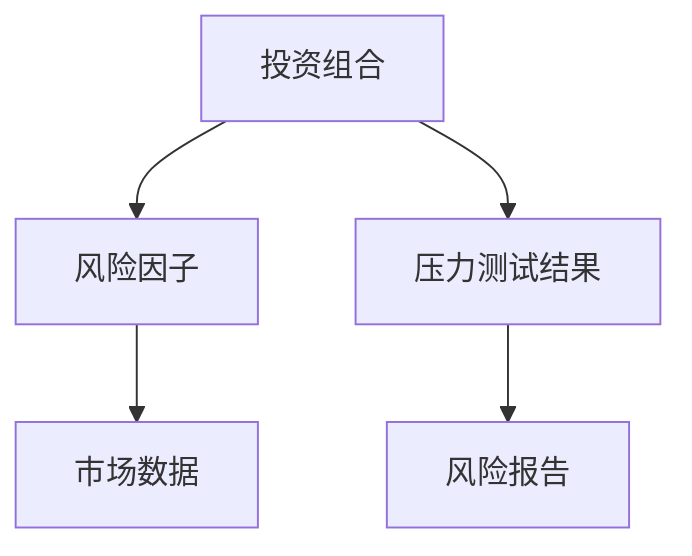
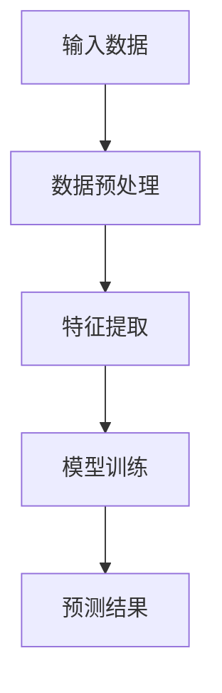
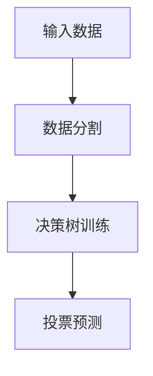
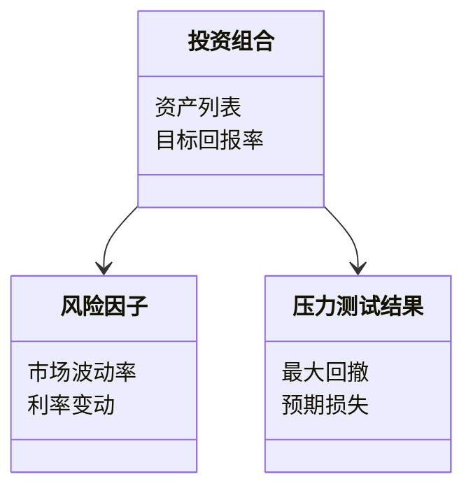
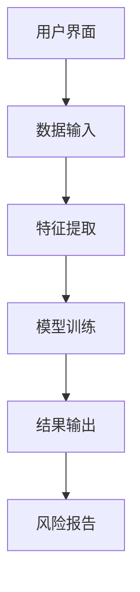

                 


# 机器学习优化投资组合压力测试

> 关键词：机器学习、投资组合压力测试、金融风险管理、深度学习、算法优化

> 摘要：本文系统地探讨了机器学习在投资组合压力测试中的应用。首先，文章介绍了投资组合压力测试的基本概念和传统方法的局限性。接着，详细分析了机器学习在金融领域的优势，特别是其在高维数据处理和非线性关系建模方面的潜力。然后，文章通过对比传统统计模型与机器学习模型，展示了机器学习在优化投资组合压力测试中的独特价值。最后，通过具体案例分析，详细阐述了如何利用机器学习算法优化压力测试过程，提升投资组合的风险管理能力。

---

# 第一部分: 机器学习与投资组合压力测试基础

## 第1章: 投资组合压力测试概述

### 1.1 投资组合压力测试的定义与作用

#### 1.1.1 投资组合压力测试的定义
投资组合压力测试是一种评估投资组合在极端市场条件下的表现和风险的方法。通过模拟不同压力场景，测试投资组合在这些情况下的收益、波动性和潜在损失，从而帮助投资者制定更稳健的投资策略。

#### 1.1.2 投资组合压力测试的作用与意义
压力测试的核心作用在于识别潜在风险，评估投资组合的稳健性，并为投资者提供在极端市场条件下的应对策略。通过压力测试，投资者可以更好地理解投资组合在不同情景下的表现，并据此调整投资策略。

#### 1.1.3 投资组合压力测试的常见应用场景
压力测试在金融领域有广泛应用，常见于风险管理、资产配置、投资组合优化以及合规监管等领域。例如，银行、资产管理公司和保险机构常使用压力测试来评估其投资组合在市场崩盘、经济衰退等极端情况下的表现。

---

### 1.2 机器学习在金融领域的应用

#### 1.2.1 机器学习在金融中的核心作用
机器学习在金融领域的核心作用体现在数据分析、预测和决策支持方面。通过处理海量金融数据，机器学习能够发现传统统计方法难以捕捉的非线性关系，提升预测精度和决策效率。

#### 1.2.2 机器学习在投资组合管理中的应用
在投资组合管理中，机器学习被广泛应用于资产配置、风险评估和交易策略优化等领域。例如，通过机器学习算法分析历史数据，预测资产回报率，并据此优化投资组合配置。

#### 1.2.3 机器学习与投资组合压力测试的结合
机器学习为投资组合压力测试带来了新的可能性。通过机器学习模型，可以更精准地预测极端市场条件下的资产表现，优化压力测试场景的设计，并提高测试结果的准确性。

---

## 第2章: 机器学习优化投资组合压力测试的背景

### 2.1 投资组合压力测试的传统方法

#### 2.1.1 历史模拟法
历史模拟法通过回顾历史市场数据，识别极端市场情况下的投资组合表现。这种方法简单易行，但其结果严重依赖于历史数据的完整性和准确性。

#### 2.1.2 方差-协方差法
方差-协方差法基于资产之间的协方差矩阵，计算投资组合在正常市场条件下的风险。然而，该方法假设资产回报率服从正态分布，无法捕捉“尾部风险”。

#### 2.1.3 蒙特卡洛模拟法
蒙特卡洛模拟法通过生成大量随机市场情景，评估投资组合在这些情景下的表现。这种方法灵活性高，但计算成本较高，且依赖于情景生成模型的准确性。

---

### 2.2 传统方法的局限性

#### 2.2.1 数据假设的局限性
传统方法往往依赖于特定的数据假设，例如历史数据的充分性或市场情景的可模拟性。这些假设在面对新兴市场或极端事件时可能失效。

#### 2.2.2 模型假设的局限性
传统方法通常基于线性假设或正态分布假设，难以捕捉市场中的非线性关系和复杂交互。这使得模型在极端市场条件下的表现不够准确。

#### 2.2.3 计算效率的局限性
传统压力测试方法的计算效率较低，尤其在处理高维数据和复杂场景时，可能难以满足实时性要求。

---

### 2.3 机器学习的优势与潜力

#### 2.3.1 数据驱动的优势
机器学习以数据驱动为核心，能够从海量历史数据中提取非线性特征，捕捉复杂市场关系。

#### 2.3.2 高维数据处理能力
机器学习擅长处理高维数据，在面对多资产、多市场的复杂投资组合时，能够提供更精准的预测。

#### 2.3.3 自适应学习能力
机器学习模型能够根据市场变化自适应调整，实时更新压力测试结果，提升风险管理的动态性。

---

# 第二部分: 核心概念与联系

## 第3章: 核心概念与联系

### 3.1 投资组合压力测试的核心概念

#### 3.1.1 投资组合风险
投资组合风险是投资组合在市场波动下的潜在损失。压力测试通过模拟极端市场条件，评估投资组合的风险承受能力。

#### 3.1.2 压力测试场景
压力测试场景是模拟极端市场条件下的各种可能情况，例如市场崩盘、利率上升、流动性危机等。

#### 3.1.3 风险因子
风险因子是影响投资组合表现的关键变量，如市场回报率、波动率、利率变动等。机器学习能够从历史数据中识别这些因子的非线性关系。

---

### 3.2 机器学习模型的核心原理

#### 3.2.1 监督学习
监督学习通过标签数据训练模型，预测目标变量。例如，可以使用支持向量回归（SVR）预测投资组合在极端市场条件下的收益。

#### 3.2.2 无监督学习
无监督学习用于发现数据中的隐含结构，如聚类分析。在压力测试中，可以用于识别市场中的风险集群。

#### 3.2.3 深度学习
深度学习通过多层神经网络捕捉数据的复杂特征。在处理高维金融数据时，深度学习模型能够发现传统方法难以捕捉的模式。

---

### 3.3 机器学习与压力测试的结合

#### 3.3.1 数据特征提取
机器学习能够从历史数据中提取关键特征，例如资产收益的波动性、相关性等，为压力测试提供更精准的输入。

#### 3.3.2 模型选择与优化
通过机器学习算法，可以选择最优模型和参数，提升压力测试的准确性和效率。例如，使用随机森林进行特征选择，优化模型性能。

#### 3.3.3 结果解释与反馈
机器学习模型能够解释压力测试结果，提供风险因子的权重和影响程度，帮助投资者更好地理解投资组合的风险来源。

---

## 第4章: 核心概念对比与ER实体关系图

### 4.1 核心概念对比表

| 对比维度 | 传统统计模型 | 机器学习模型 |
|----------|---------------|--------------|
| 数据假设 | 线性关系       | 非线性关系   |
| 计算效率 | 较低           | 较高          |
| 模型解释性 | 高             | 较低          |

### 4.2 ER实体关系图



---

# 第五章: 算法原理讲解

## 第5章: 算法原理讲解

### 5.1 支持向量回归（SVR）

#### 5.1.1 算法流程图



#### 5.1.2 数学模型

支持向量回归的目标是最小化预测误差，其优化问题可以表示为：

$$
\min_{w, b, \epsilon} \frac{1}{2}||w||^2 + C \sum_{i=1}^{n} \max(0, |y_i - w \cdot x_i - b| + \epsilon)
$$

其中，$w$ 是权重向量，$b$ 是偏置，$C$ 是惩罚系数，$\epsilon$ 是误差容忍度。

---

### 5.2 随机森林

#### 5.2.1 算法流程图



#### 5.2.2 数学模型

随机森林通过集成多个决策树的预测结果，降低模型过拟合风险。其预测结果为各决策树预测结果的平均值或多数投票结果。

---

## 第六章: 系统分析与架构设计

### 6.1 项目场景介绍

本项目旨在开发一个基于机器学习的投资组合压力测试系统，帮助投资者在极端市场条件下评估投资组合的风险和表现。

### 6.2 系统功能设计

#### 6.2.1 领域模型



---

### 6.3 系统架构设计



---

## 第七章: 项目实战

### 7.1 环境安装

#### 7.1.1 安装Python和相关库
```bash
pip install numpy pandas scikit-learn
```

### 7.2 系统核心实现源代码

#### 7.2.1 数据预处理

```python
import pandas as pd
import numpy as np

# 加载数据
data = pd.read_csv('portfolio_data.csv')

# 数据清洗
data = data.dropna()

# 特征提取
X = data[['return', 'volatility', 'market_cap']]
y = data['risk_score']
```

#### 7.2.2 模型训练

```python
from sklearn.svm import SVR
from sklearn.model_selection import train_test_split

# 数据分割
X_train, X_test, y_train, y_test = train_test_split(X, y, test_size=0.2)

# 模型训练
model = SVR(C=1.0, epsilon=0.1)
model.fit(X_train, y_train)

# 模型预测
y_pred = model.predict(X_test)
```

### 7.3 代码应用解读与分析

通过上述代码，我们可以训练一个支持向量回归模型，预测投资组合的风险评分。模型训练完成后，可以使用测试数据评估其性能，例如计算均方误差（MSE）和R²分数。

---

## 第八章: 总结与展望

### 8.1 最佳实践 tips

- 在实际应用中，建议结合多种机器学习算法，提高压力测试的准确性和鲁棒性。
- 定期更新模型参数和市场数据，确保压力测试结果的实时性和准确性。

### 8.2 小结

通过机器学习优化投资组合压力测试，可以更精准地识别和管理投资组合风险，提升金融风险管理的效率和效果。

### 8.3 注意事项

- 机器学习模型的性能依赖于数据质量和数量，需谨慎处理数据偏差问题。
- 模型解释性可能较低，需结合领域知识进行结果解读。

### 8.4 拓展阅读

- 研究最新的机器学习算法，探索其在金融风险管理中的应用。
- 关注金融市场的最新动态，了解极端市场条件下的投资策略。

---

# 作者：AI天才研究院/AI Genius Institute & 禅与计算机程序设计艺术 /Zen And The Art of Computer Programming

