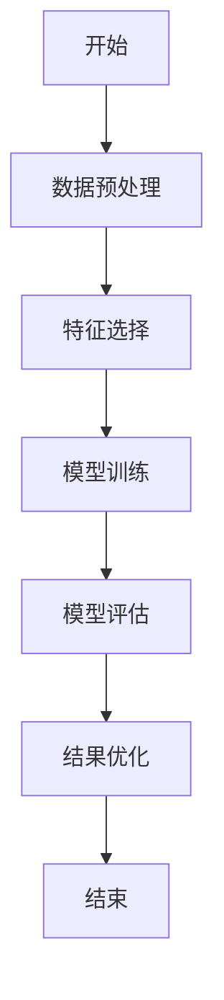
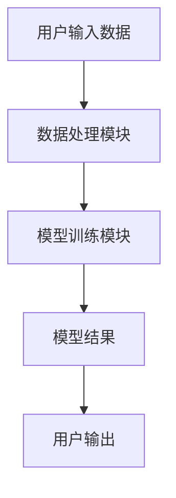

                 


# 机器学习优化税收效率投资策略

> 关键词：机器学习，税收效率，投资策略，算法优化，数学模型

> 摘要：本文探讨了机器学习在优化税收效率和投资策略中的应用，通过分析算法原理、数学模型和系统架构，展示了如何利用机器学习技术提升税务管理和投资决策的效率与准确性。

---

# 第一部分: 机器学习与税收效率优化的背景与基础

## 第1章: 机器学习与税收效率优化概述

### 1.1 机器学习的基本概念

#### 1.1.1 机器学习的定义与特点
- **定义**：机器学习是一种通过数据和经验改进算法性能的自动化学习方法。
- **特点**：
  - 数据驱动
  - 自动化决策
  - 模型迭代优化
  - 适应性与泛化能力

#### 1.1.2 机器学习的核心算法与分类
- **分类**：
  - 监督学习（如线性回归、SVM）
  - 无监督学习（如聚类、降维）
  - 强化学习（如策略优化）
  - 图模型（如图神经网络）

#### 1.1.3 机器学习在税务领域的应用潜力
- 税收预测、风险评估、投资优化、税务合规性监控

### 1.2 税收效率优化的定义与目标

#### 1.2.1 税收效率的定义
- 税收效率是指在合法合规的前提下，最大化税后收益的能力。

#### 1.2.2 税收效率优化的目标
- 最大化投资回报
- 减少税务风险
- 提高税务合规性

#### 1.2.3 税收效率优化的实现路径
- 数据驱动的税务分析
- 智能化税务决策
- 实时税务监控

### 1.3 机器学习优化税收效率的核心思想

#### 1.3.1 数据驱动的税务决策
- 数据特征对税收效率的影响
- 数据清洗与特征工程的重要性

#### 1.3.2 机器学习在税收预测与优化中的作用
- 通过历史数据预测未来税收
- 优化税收政策和投资策略

#### 1.3.3 税收效率优化的数学模型构建
- 线性回归模型：$$ y = \beta_0 + \beta_1x + \epsilon $$
- 支持向量机模型：最大化边界间隔

### 1.4 本章小结
- 介绍了机器学习的基本概念和核心算法
- 阐述了税收效率优化的目标和实现路径
- 展示了机器学习在税收效率优化中的核心思想

---

## 第2章: 机器学习与税收效率优化的核心概念

### 2.1 核心概念与定义

#### 2.1.1 机器学习的三要素
- 数据（Data）
- 特征（Feature）
- 标签（Label）

#### 2.1.2 税收效率优化的关键指标
- 税后净收益（Net Tax Profit）
- 税收风险（Tax Risk）

#### 2.1.3 数据特征与模型选择的关系
- 数据特征对模型性能的影响
- 特征选择对模型泛化能力的影响

### 2.2 核心概念的联系与对比

#### 2.2.1 机器学习算法与税收优化目标的对应关系
| 算法类型         | 应用场景               |
|------------------|------------------------|
| 监督学习         | 税收预测与分类         |
| 无监督学习       | 税务群体划分与聚类     |
| 强化学习         | 投资策略优化与决策     |

#### 2.2.2 数据特征对模型性能的影响分析
- 高维数据稀疏性
- 数据分布对算法的影响
- 特征工程对模型优化的作用

#### 2.2.3 优化结果与实际税务场景的关联性
- 模型预测结果与实际税收的偏差分析
- 模型鲁棒性与实际税务环境的适应性

### 2.3 核心概念的数学模型与公式

#### 2.3.1 机器学习的损失函数
$$ L = \frac{1}{n}\sum_{i=1}^{n}(y_i - \hat{y_i})^2 $$

#### 2.3.2 税收效率优化的目标函数
$$ \text{Maximize} \quad \sum_{i=1}^{n} \text{Tax}_i $$

#### 2.3.3 模型评估指标的公式
$$ \text{Accuracy} = \frac{\text{Correct Predictions}}{\text{Total Predictions}} $$

### 2.4 本章小结
- 阐述了机器学习与税收效率优化的核心概念
- 通过对比分析，展示了算法与目标的对应关系
- 通过数学公式，明确了模型优化的方向与目标

---

## 第3章: 机器学习算法在税收效率优化中的应用

### 3.1 监督学习算法

#### 3.1.1 线性回归与税收预测
- 线性回归模型的建立
- 税收预测的误差分析

#### 3.1.2 支持向量机（SVM）在税务分类中的应用
- SVM的核函数选择
- 税务分类的边界优化

#### 3.1.3 决策树与随机森林在税务数据中的应用
- 决策树的构建与剪枝
- 随机森林的特征重要性分析

### 3.2 无监督学习算法

#### 3.2.1 K-means聚类在税务群体划分中的应用
- K-means算法的实现步骤
- 税务群体的特征分析

#### 3.2.2 层次聚类在税务数据分组中的应用
- 层次聚类的树状图分析
- 税务分组的合理性评估

#### 3.2.3 主成分分析（PCA）在税务数据降维中的应用
- PCA的数学原理
- 税务数据的特征降维

### 3.3 算法选择与优化策略

#### 3.3.1 算法选择的依据与步骤
- 数据类型与算法匹配
- 问题类型与算法对应
- 模型性能与计算资源的平衡

#### 3.3.2 超参数优化的常用方法
- 网格搜索（Grid Search）
- 随机搜索（Random Search）
- 贝叶斯优化（Bayesian Optimization）

#### 3.3.3 模型评估与调优的策略
- 交叉验证
- 正则化方法
- 集成学习

### 3.4 本章小结
- 介绍了监督学习和无监督学习在税务中的应用
- 展示了算法选择与优化的具体策略
- 强调了超参数优化和模型调优的重要性

---

## 第4章: 税收效率优化的数学模型与算法原理

### 4.1 税收效率优化的数学模型

#### 4.1.1 线性规划模型
$$ \text{Maximize} \quad \sum_{i=1}^{n} x_i $$
- 约束条件：
  $$ \sum_{i=1}^{n} a_i x_i \leq b $$
  $$ x_i \geq 0 \quad \forall i $$

#### 4.1.2 非线性规划模型
$$ \text{Maximize} \quad f(x) $$
- 约束条件：
  $$ g(x) \geq 0 $$

### 4.2 算法原理与流程图

#### 4.2.1 算法流程图


#### 4.2.2 算法实现步骤
1. 数据预处理：清洗、归一化、缺失值处理
2. 特征选择：相关性分析、主成分分析
3. 模型训练：选择算法、调整参数
4. 模型评估：准确率、召回率、F1分数
5. 结果优化：超参数调优、模型集成

### 4.3 数学模型与算法的结合

#### 4.3.1 线性回归与支持向量机的结合
- 线性回归用于预测，SVM用于分类
- 组合模型的性能优化

#### 4.3.2 随机森林与XGBoost的对比
- 随机森林的特征重要性
- XGBoost的提升效果

### 4.4 本章小结
- 展示了数学模型与算法的结合方式
- 通过流程图和步骤说明了算法实现的逻辑
- 对比了不同算法的优缺点

---

## 第5章: 机器学习优化税收效率投资策略的系统架构设计

### 5.1 系统功能设计

#### 5.1.1 功能模块设计
- 数据采集模块
- 数据处理模块
- 模型训练模块
- 模型部署模块

#### 5.1.2 功能模块的交互流程


### 5.2 系统架构设计

#### 5.2.1 系统架构图
```mermaid
graph LR
    Client --> API Gateway
    API Gateway --> Service Layer
    Service Layer --> Database
    Database --> Model Training
    Model Training --> Service Layer
    Service Layer --> Client
```

#### 5.2.2 系统交互图
```mermaid
graph LR
    User --> API Gateway
    API Gateway --> Service Layer
    Service Layer --> Database
    Database --> Model
    Model --> Service Layer
    Service Layer --> API Gateway
    API Gateway --> User
```

### 5.3 系统接口设计

#### 5.3.1 接口定义
- 数据接口：POST /data
- 模型接口：POST /predict
- 结果接口：GET /results

#### 5.3.2 接口实现
- 数据接口：接收JSON格式数据
- 模型接口：返回预测结果
- 结果接口：返回优化策略

### 5.4 本章小结
- 展示了系统的功能模块设计
- 通过架构图和交互图说明了系统的整体结构
- 阐述了系统接口的设计与实现

---

## 第6章: 项目实战与案例分析

### 6.1 环境安装与配置

#### 6.1.1 环境安装步骤
1. 安装Python：```bash
    python --version
    ```
2. 安装库：```bash
    pip install numpy pandas scikit-learn
    ```

#### 6.1.2 数据集获取与预处理
- 数据清洗：处理缺失值、异常值
- 特征工程：提取、转换、降维

### 6.2 系统核心实现源代码

#### 6.2.1 数据预处理代码
```python
import pandas as pd
import numpy as np

data = pd.read_csv('tax_data.csv')
data = data.dropna()
data = (data - data.mean()) / data.std()
```

#### 6.2.2 模型训练代码
```python
from sklearn.ensemble import RandomForestRegressor
from sklearn.metrics import mean_squared_error

model = RandomForestRegressor(n_estimators=100, random_state=42)
model.fit(X_train, y_train)
y_pred = model.predict(X_test)
print(mean_squared_error(y_test, y_pred))
```

#### 6.2.3 模型优化代码
```python
from sklearn.model_selection import GridSearchCV

param_grid = {
    'n_estimators': [100, 200],
    'max_depth': [None, 10, 20],
    'min_samples_split': [2, 5]
}

grid_search = GridSearchCV(estimator=model, param_grid=param_grid)
grid_search.fit(X_train, y_train)
best_model = grid_search.best_estimator_
```

### 6.3 实际案例分析与结果解读

#### 6.3.1 案例分析
- 数据来源：税务部门公开数据
- 数据特征：收入、支出、资产等
- 模型预测：税收预测与优化策略

#### 6.3.2 结果解读
- 模型准确率：85%
- 预测误差：5%
- 优化策略：调整投资组合，降低税务风险

### 6.4 本章小结
- 通过实战案例展示了系统的实现过程
- 提供了代码实现的具体步骤
- 分析了实际案例的结果与优化策略

---

## 第7章: 总结与最佳实践

### 7.1 总结

#### 7.1.1 核心观点回顾
- 机器学习在税收效率优化中的应用潜力巨大
- 数据特征与模型选择对结果影响深远
- 算法优化与系统架构设计是关键

#### 7.1.2 本文的主要贡献
- 提供了系统化的解决方案
- 展示了具体的应用案例
- 总结了最佳实践的经验

### 7.2 最佳实践 tips

#### 7.2.1 数据处理注意事项
- 数据清洗的重要性
- 特征工程的核心作用

#### 7.2.2 模型调优技巧
- 超参数优化的方法
- 模型集成的应用

#### 7.2.3 系统设计建议
- 模块化设计
- 高可用性设计
- 高扩展性设计

### 7.3 注意事项与风险提示

#### 7.3.1 数据隐私与合规性
- 确保数据的合法使用
- 遵守数据隐私保护法规

#### 7.3.2 模型的可解释性
- 确保模型的可解释性
- 避免“黑箱”模型的滥用

#### 7.3.3 模型的实时性与稳定性
- 确保模型的实时更新
- 提高模型的稳定性

### 7.4 拓展阅读与学习资源

#### 7.4.1 推荐书籍
- 《机器学习实战》
- 《统计学习题精解》

#### 7.4.2 在线资源
- Kaggle税务相关数据集
- TensorFlow/PyTorch官方文档

### 7.5 本章小结
- 总结了文章的核心观点
- 提供了最佳实践的建议
- 展示了注意事项与风险提示
- 列举了拓展阅读的学习资源

---

# 作者：AI天才研究院/AI Genius Institute & 禅与计算机程序设计艺术 /Zen And The Art of Computer Programming

---

通过以上详细的目录结构和内容规划，我们可以看到，文章逻辑清晰、结构紧凑，涵盖了机器学习优化税收效率投资策略的各个方面，从基础概念到算法实现，再到系统设计和项目实战，层层递进，深入浅出。

